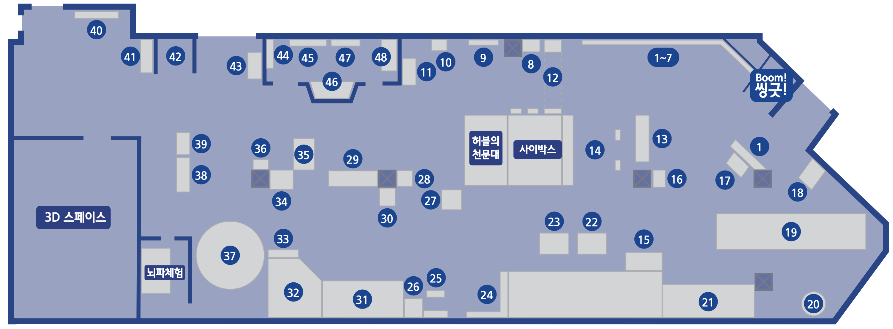

---
문서양식: 전시실 소개
전시실: B전시실
---

# 🏠 [홈](/)으로 가기
##
# B전시실(연결)

## 1. 전시실 소개
세상은 복잡하게 연결되어 있다. 교통 시스템, 뇌의 연결망, 정보 네트워크, 끊임없이 변하는 기술 등 복잡하고 광범위한 시스템 속의 과학적 원리와 사례를 종합적으로 이해한다.
## 2. 전시물
### 2.1 전시물 배치도

### 2.2 전시물 리스트

| 전시물 번호 | 전시물 명                                                                                         | 분류  | 비고  |     |
| ------ | --------------------------------------------------------------------------------------------- | --- | --- | --- |
| B01    | [세상은 어떻게 연결되어 있을까?](/docs/halls/blue/B01.md)                                              | 관람형 |     |     |
| B02    | [과학의 알파벳, 기본단위는? (1)길이(m)](/docs/halls/blue/B02.md)                                      |     |     |     |
| B03    | [과학의 알파벳, 기본단위는? (2)시간(s)](/docs/halls/blue/B03.md)                                 |     |     |     |
| B04    | [과학의 알파벳, 기본단위는? (3)질량(kg)](/docs/halls/blue/B04.md)                               |     |     |     |
| B05    | [과학의 알파벳, 기본단위는? (4) 전류(A)](/docs/halls/blue/B05.md)                                |     |     |     |
| B06    | [과학의 알파벳, 기본단위는? (5)온도(K)](/docs/halls/blue/B06.md)                                 |     |     |     |
| B07    | [과학의 알파벳, 기본단위는? (6) 몰(mol)](/docs/halls/blue/B07.md)                             |     |     |     |
| B08    | [과학의 알파벳, 기본단위는? (7)광도(cd)](/docs/halls/blue/B08.md)                              |     |     |     |
| B09    | [기본단위를 곱하거나 나누면 어떻게 될까? (1)Pixel](/docs/halls/blue/B09.md)                  |     |     |     |
| B10    | [기본단위를 곱하거나 나누면 어떻게 될까? (2)SV](/docs/halls/blue/B10.md)                       |     |     |     |
| B11    | [전류의 세기가 변하는 이유는?](/docs/halls/blue/B11.md)                                                 |     |     |     |
| B12    | [세상을 관찰하는 또 다른 방법 '적외선'](/docs/halls/blue/B12.md)                                      |     |     |     |
| B13    | [복잡한 교통시스템, 어떻게 연결되어 있을까? (1)지하철에 대한 모든 것](/docs/halls/blue/B13.md) |     |     |     |
| B14    | [복잡한 교통시스템, 어떻게 연결되어 있을까? (2)수학으로 빠른 길 찾기](/docs/halls/blue/B14.md)  |     |     |     |
| B15    | [복잡한 교통시스템, 어떻게 연결되어 있을까? (3)비행기의 이동경로](/docs/halls/blue/B15.md)        |     |     |     |
| B16    | [교통카드에는 어떻게 정보가 담기고 전달될까?](/docs/halls/blue/B16.md)                                 |     |     |     |
| B17    | [진자가 흔들릴 때 옆의 진자를 흔들리게 할 수 있을까?](/docs/halls/blue/B17.md)                     |     |     |     |
| B18    | [RUN OUT](/docs/halls/blue/B18.md)                     |     |     |     |
| B19    | [자동차의 속도는 어떻게 측정할까?](/docs/halls/blue/B19.md)                                             |     |     |     |
| B20    | [자전거는 왜 넘어지지 않을까?](/docs/halls/blue/B20.md)                                                 |     |     |     |
| B21    | [진자가 왜 뱀처럼 춤출까?](/docs/halls/blue/B21.md)                                                     |     |     |     |
| B22    | [지하철은 어떻게 움직일까?](/docs/halls/blue/B22.md)                                                     |     |     |     |
| B23    | [비행기는 어떻게 하늘을 날까?](/docs/halls/blue/B23.md)                                                 |     |     |     |
| B24    | [춤추는 데칼코마니](/docs/halls/blue/B24.md)                                                              |     |     |     |
| B25    | [자극에 대한 반응은 어떻게 일어날까?](/docs/halls/blue/B25.md)                                         |     |     |     |
| B26    | [빛으로 표정을 바꿀 수 있을까?](/docs/halls/blue/B26.md)                                               |     |     |     |
| B27    | [내 머리 속에서는 무슨 일이 일어나고 있을까?](/docs/halls/blue/B27.md)                               |     |     |     |
| B28    | [침팬지보다 빠를 수 있을까?](/docs/halls/blue/B28.md)                                                   |     |     |     |
| B29    | [뇌가 크면 더 똑똑할까?](/docs/halls/blue/B29.md)                                                       |     |     |     |
| B30    | [눈이 보는 것일까? 뇌가 보는 것일까?](/docs/halls/blue/B30.md)                                        |     |     |     |
| B31    | [멀미를 하는 이유는?](/docs/halls/blue/B31.md)                                                           |     |     |     |
| B32    | [내 의지와 관계없이 몸에서 일어나는 일들은?](/docs/halls/blue/B32.md)                                 |     |     |     |
| B33    | [조선시대에는 망원경 없이 어떻게 하늘을 관찰했을까?](/docs/halls/blue/B33.md)                         |     |     |     |
| B34    | [땅의 넓이를 어떻게 구하지?](/docs/halls/blue/B34.md)                                                   |     |     |     |
| B35    | [좌표평면에서 도형을 이동시키면?](/docs/halls/blue/B35.md)                                               |     |     |     |
| B36    | [액체자석은 왜 솟아날까?](/docs/halls/blue/B36.md)                                                       |     |     |     |
| B37    | [조선시대에는 하늘에서 일어나는 현상을 어떻게 관찰하였을까?](/docs/halls/blue/B37.md)                 |     |     |     |
| B38    | [에라토스테네스는 지구의 크기를 어떻게 쟀을까?](/docs/halls/blue/B38.md)                               |     |     |     |
| B39    | [타원에서 원반은 어떻게 움직일까?](/docs/halls/blue/B39.md)                                             |     |     |     |
| B40    | [쇠구슬은 어디로 떨어질까?](/docs/halls/blue/B40.md)                                                     |     |     |     |
| B41    | [빛을 쪼개고 합칠 수 있을까?](/docs/halls/blue/B41.md)                                                 |     |     |     |
| B42    | [우리가 보는 색을 믿을 수 있을까?](/docs/halls/blue/B42.md)                                           |     |     |     |
| B43    | [달에서도 바람이 불까?](/docs/halls/blue/B43.md)                                                         |     |     |     |
| B44    | [밤의 카페테라스](/docs/halls/blue/B44.md)                                                                |     |     |     |
| B45    | [라그랑자트 섬의 일요일 오후](/docs/halls/blue/B45.md)                                                  |     |     |     |
| B46    | [월하정인](/docs/halls/blue/B46.md)                                                                        |     |     |     |
| B47    | [열린 창가에서 편지를 읽는 여인](/docs/halls/blue/B47.md)                                              |     |     |     |
| B48    | [절규](/docs/halls/blue/B48.md)                                                                            |     |     |     |
## 3. 전시실내 공간

## 변경기록
| 변경일        | 작성자 | 내용 및 사유 |
| ---------- | --- | ------- |
| 2026.01.22 | 박은선 | 최초 작성   |
|            |     |         |

