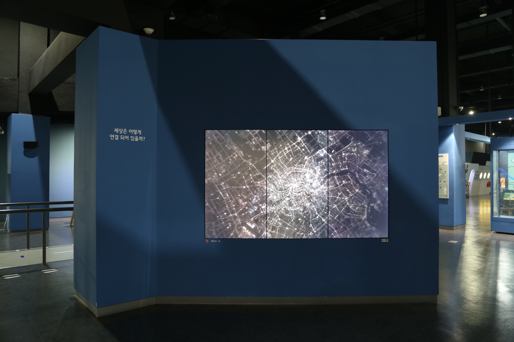

---
문서양식: 전시물
전시물 타입: 관람형, 패널
전시실: B전시실
---
#사이아트

  <button class="nav-btn" onclick="goHome()">🏠 홈</button>
  <button class="nav-btn" onclick="goHall('blue')">🔵 Blue 전시실 개요</button>
  <button class="nav-btn" onclick="goBack()">⬅ 이전 페이지</button>

# 세상은 어떻게 연결되어 있을까?

## 1. 전시물 기본 내용
### 1.1 전시물 이미지

#이미지_수정

### 1.2 기본정보  
- 연출매체 : 디지털 그래픽 영상, 빔프로젝터, 컴퓨터

- 작품 설명 
  <세상은 어떻게 연결되어 있을까?>는 B전시실의 주제인 '연결'을 상징적으로 보여주는 영상이다.
  한 점에서 시작된 원자는 서로 연결되면서 신경전달물질 분자를 이루며 나아간다. 뇌, 인간, 교통, 네트워크 우주로 점점 확장되어가는 이미지들을 통해 최종적으로 모든 우주의 별들이 한 점으로 모이며 처음의 원자로 되돌아가며 이는 반복된다. 이를 통해 세상의 모든 것이 유기적으로 연결되어 있다는 메시지를 전달한다.
  
- 영상 길이 : 1분 2초

## 2. 기본 과학 이론
(해당없음)
## 3. 연관 전시물
(해당없음)

## 4. 기존 해설에서의 쓰임 예시
*아래는 해당 전시물 부분만 기재되어있습니다. 해설 전문은 '업무메신저 잔디>드라이브'내의 해설서들을 참고하세요!*
>[!note]+ (주제해설) 우주
> 	위치
> 	잔디 드라이브 > 자료실 > 1.해설시나리오_모음zip > 주제해설 > 주제해설_김형준_+우주(날짜미정).hwp
> 	작성자 : 김형준
> > [!note]- 해설 내용
> > (전략)
> >  우리가 살고 있는 지구는 아주 복잡해요. 많은 것들이 연결되어있기 때문인데요. 지구를 품고 있는 우주는 훨씬 더 크고 복잡합니다. 이 우주에는 별들이 얼마나 있을까요? (관람객과 눈치 전) 네~, 약 100해 개의 별이 있습니다. 우주에 있는 별의 개수! 외우는 방법 알려드릴게요. 우주에는 1000억 개의 은하가 있고, 하나의 은하 속에는 1000억 개의 별이 있어요. 그래서 우주에는 1000억x1000억 개의 별이 있다! 라고 기억하면 좋을 것 같아요. 이렇게 우주에 대한 그림을 그려보면서 기억하면 좀 더 오랫동안 잘 기억할 수 있을 것 같네요.
> >  이 많은 별들 중에서 지구에서 잘 보이는 별로 사람들은 별자리라는 것을 만들었는데요. 다음 전시물로 이동해서 겨울철 밤하늘에서 볼 수 있는 오리온자리를 살펴보겠습니다.
> >  (후략)

## 5. 확장 자료
(해당없음)
## 변경기록
| 변경일        | 작성자 | 내용 및 사유 |
| ---------- | --- | ------- |
| 2026.02.08 | 박은선 | 최초 작성   |
|            |     |         |

  <button class="nav-btn" onclick="goHome()">🏠 홈</button>
  <button class="nav-btn" onclick="goHall('blue')">🔵 Blue 전시실 개요</button>
  <button class="nav-btn" onclick="goBack()">⬅ 이전 페이지</button>

