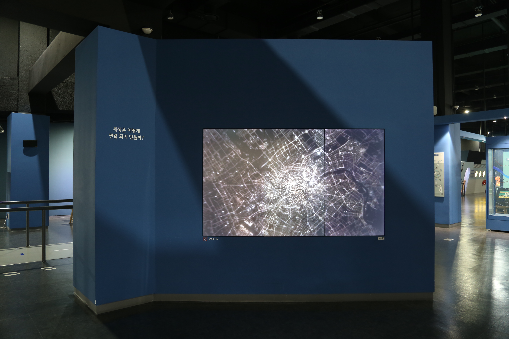

  <button class="nav-btn" onclick="goHome()">🏠 홈</button>
  <button class="nav-btn" onclick="goHall('blue')">🔵 Blue 전시실 개요</button>
  <button class="nav-btn" onclick="goBack()">⬅ 이전 페이지</button>

# B01 세상은 어떻게 연결되어 있을까?

## 1. 전시물 기본 내용
### 1.1 전시물 이미지

  
전시 유형 : 관람형

  

    B전시실 주제에 대한 사이아트 영상물로, 상호작용 요소 없음.
  

### 1.2 학교 교육과정  
(해당사항 없음)

### 1.3 기본정보  
- 연출매체 : 디지털 그래픽 영상, 빔프로젝터, 컴퓨터

- 작품 설명 
  <세상은 어떻게 연결되어 있을까?>는 B전시실의 주제인 '연결'을 상징적으로 보여주는 영상이다.
  한 점에서 시작된 원자는 서로 연결되면서 신경전달물질 분자를 이루며 나아간다. 뇌, 인간, 교통, 네트워크 우주로 점점 확장되어가는 이미지들을 통해 최종적으로 모든 우주의 별들이 한 점으로 모이며 처음의 원자로 되돌아가며 이는 반복된다. 이를 통해 세상의 모든 것이 유기적으로 연결되어 있다는 메시지를 전달한다.
  
- 영상 길이 : 1분 2초

## 2. 기본 과학 이론
(해당없음)
## 3. 연관 전시물
(해당없음)

## 4. 기존 해설에서의 쓰임 예시
(사용한 해설 없음)

## 5. 확장 자료
(해당없음)

## 변경기록
| 변경일        | 작성자 | 내용 및 사유 |
| ---------- | --- | ------- |
| 2026.05.27 | 박은선 | 최초 작성 & 검수   |
|            |     |         |

## 확인필요 항목
- 전시물 사진 변경 필요

  <button class="nav-btn" onclick="goHome()">🏠 홈</button>
  <button class="nav-btn" onclick="goHall('blue')">🔵 Blue 전시실 개요</button>
  <button class="nav-btn" onclick="goBack()">⬅ 이전 페이지</button>

