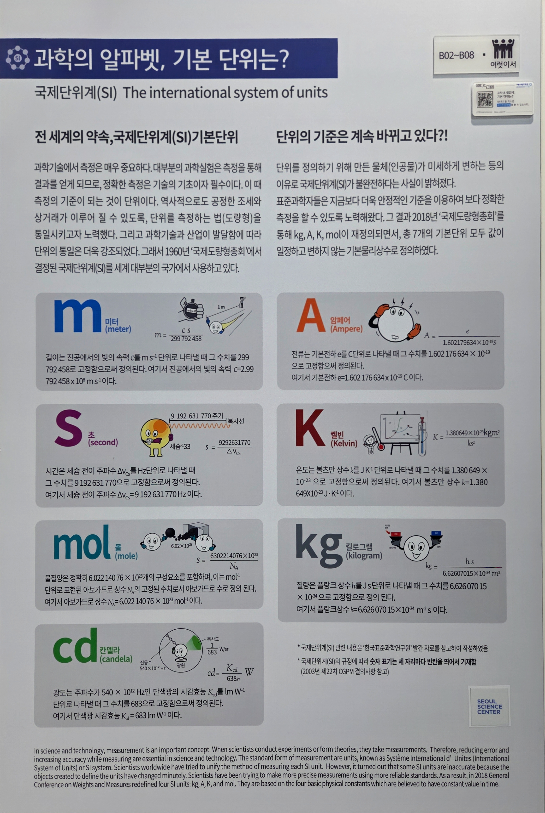

---
문서양식: 전시물
전시물 타입:
전시실: B전시실
---
#SI기본단위 

  <button class="nav-btn" onclick="goHome()">🏠 홈</button>
  <button class="nav-btn" onclick="goHall('blue')">🔵 Blue 전시실 개요</button>
  <button class="nav-btn" onclick="goBack()">⬅ 이전 페이지</button>

# 과학의 알파벳, 기본 단위는?-(1) 길이(m)

## 1. 전시물 기본 내용
### 1.1 전시물 이미지

  
전시 목적

  

    국제단위계(SI)의 기본 단위인 길이, 질량, 시간, 전류, 열역학적 온도, 물질량, 광도 등의 기준과 개념을 이해한다. 각 단위를 체험함으로써, 과학의 기초 언어를 습득하고, 과학적 사고를 함양한다.
  

### 1.2 학교 교육과정  
| 학년           | 단원                        | 해당 교과 챕터                                                                            | 비고                                                                         |
| ------------ | ------------------------- | ----------------------------------------------------------------------------------- | -------------------------------------------------------------------------- |
| 초등 1~2학년(수학) | [[공통교육과정_도형과 측정\|도형과 측정]] | (교과서 파일 없음)                                                                         | 표준단위 도입 전, 구체물을 직접 비교하거나 임의의 단위를 사용하는 것에 대해 학습함 실제 SI 길이 단위는 cm, m만 학습함 |
| 초등 3~4학년(수학) | [[공통교육과정_도형과 측정\|도형과 측정]] | [[지학사 3-1 수학.pdf#page=97\|3-1 수학 챕터 5 길이와 시간]]                                      | mm, km 학습, cm, mm, km사이의 단위 환산 학습                                       |
| 고등(통합과학)     | [[과학의 기초]]                | [[지학사 통합과학1.pdf#page=22\|2.2 기본량의 의미와 적용]] [[지학사 통합과학1.pdf#page=26\|2.3 측정과 어림]] | 과학의 기본량으로 시간 길이, 질량, 전류, 온도 등의 기본단위 및 부피, 속력, 농도 등의 유도단위 학습 측정표준에 대해 앎  |
| 고등(물리학)      | [[빛과 물질]]                 | (교과서 파일 없음)                                                                         | [[특수상대성 이론(미완)]]에 따른 빛의 속도 불변성과 그로 인한 길이 수축 현상                             |

### 1.3 체험
##### 체험1) 길이 단위 비교하기
1. 패널을 통해 여러 길이 단위를 비교해본다.
2. 나무 막대로 표현된 여러 길이와 미터를 비교해본다.
3. 미터를 기준으로 표현된 여러 가지 길이들을 확인한다.

### 1.4 패널내용

  

    과학의 알파벳, 기본단위는? 통합패널
  

  

    
  

  

    과학의 알파벳, 기본단위는? (1)미터
  

  

    
  

  

    (보조패널) 다양한 길이단위
  

  

    
  

  

    (보조패널) 키를 활용한 길이 체험
  

  

    
  

  

    (체험 아이템) 다양한 길이단위
  

  

    
  

## 2. 기본 과학 이론
### 2.1 핵심 과학이론
 - [[길이 단위의 역사|길이 단위의 역사와 미터협약]]
 - [[미터 정의의 변천사(미완)|미터 정의의 변천사(미완)]]
 - [[SI 기본 단위의 정의|SI 기본단위의 정의]]

### 2.2 연관 과학이론
 - [[국제단위계(SI)]]
 - [[단위 기호 표기 방법|단위 기호 표기 방법]]

## 3. 연관 전시물
- [[halls/B전시실_test-ver/B03 과학의 알파벳, 기본단위는_(2)시간(s)(미완)]]
- [[halls/B전시실_test-ver/B04 과학의 알파벳, 기본단위는_(3)질량(kg)(미완)]]
- [[halls/B전시실_test-ver/B05 과학의 알파벳, 기본단위는_(4)전류(A)(미완)]]
- [[halls/B전시실_test-ver/B06 과학의 알파벳, 기본단위는_(5)온도(K)(미완)]]
- [[halls/B전시실_test-ver/B07 과학의 알파벳, 기본단위는_(6) 몰(mol)(미완)]]
- [[halls/B전시실_test-ver/B08 과학의 알파벳, 기본단위는_(7) 광도(cd)(미완)]]

## 4. 기존 해설에서의 쓰임 예시
*아래는 해당 전시물 부분만 기재되어있습니다. 해설 전문은 '업무메신저 잔디>드라이브'내의 해설서들을 참고하세요!*
>[!note]+ B전시실 기본 해설 시나리오
> 	위치
> 	잔디 드라이브 > 자료실 > 1.해설시나리오_모음zip > 전시실 기본해설 > B전시실(담당자 미정)
> 	작성자 : 확인불가(2018년 3월 작성)
> > [!note]- 해설 내용
> > (전략)
> >  과학을 연구하기 위해 꼭 필요한 것이 무엇일까요? 그건 바로 단위입니다. 과학은 정교한 측정을 바탕으로 하고 있으며, 한 과학자가 했던 실험은 다른 과학자가 같은 방법으로 했을 때 똑같은 결과가 나와야 더 신뢰성이 있다고 평가가 됩니다. 정교한 측정, 그리고 과학자들 간의 정보 교류를 위해 필요한 것이 바로 단위입니다.
> >  그래서 유럽권에서는 과거부터 이렇게 미터, 야드, 피트 등의 단위를, 동양권에서는 간, 척 등의 단위를 길이단위로 사용해왔습니다. 하지만 이렇게 단위가 서로 제각각이어서야 서로 의사소통하기 쉽지 않았죠. 그래서 국제적으로 표준단위를 만들었는데, 그게 바로 SI 단위입니다.
> >  이 국제 표준 도량형(SI)이 얼마나 중요한 것이었는가를 보여주는 에피소드가 하나 있습니다. 1999년에 나사에서 쏘아올린 1억 달러가 넘는 화성궤도탐사선이 화성에 도착한 직후 폭발해버린 사건이 있었는데요, 이 사건은 두 가지 도량형의 혼선 때문이었습니다. 제작자는 야드를 기준으로 탐사선을 제작했지만 조종팀은 미터를 단위로 생각해 탐사선이 적절한 궤도보다 낮게 진입하게 되어 폭발한 것이었죠. 그래서 나사는 지금은 내부에서 사용하는 단위들을 국제 표준 규격으로 통일했다고 합니다. 이제 SI단위들을 좀 살펴볼까요?
> >  (후략)

## 5. 확장 자료

### 심화 이론

### 최신 연구

## 변경기록
| 변경일        | 작성자 | 내용 및 사유 |
| ---------- | --- | ------- |
| 2026.01.22 | 박은선 | 최초 작성   |
|            |     |         |

  <button class="nav-btn" onclick="goHome()">🏠 홈</button>
  <button class="nav-btn" onclick="goHall('blue')">🔵 Blue 전시실 개요</button>
  <button class="nav-btn" onclick="goBack()">⬅ 이전 페이지</button>

