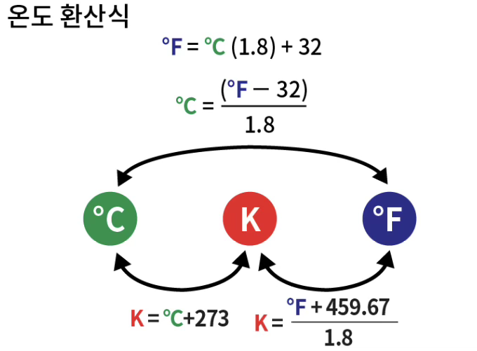

---
문서양식: 전시물
전시물 타입:
전시실: B전시실
---
#SI기본단위

  <button class="nav-btn" onclick="goHome()">🏠 홈</button>
  <button class="nav-btn" onclick="goHall('blue')">🔵 Blue 전시실 개요</button>
  <button class="nav-btn" onclick="goBack()">⬅ 이전 페이지</button>

# 과학의 알파벳, 기본단위는? (5)온도(K)

## 1. 전시물 기본 내용
### 1.1 전시물 이미지

  
전시 목적

  

    국제단위계(SI)의 기본 단위인 길이, 질량, 시간, 전류, 열역학적 온도, 물질량, 광도 등의 기준과 개념을 이해한다. 각 단위를 체험함으로써, 과학의 기초 언어를 습득하고, 과학적 사고를 함양한다.
  

### 1.2 학교 교육과정  
| 학년       | 단원  | 해당 교과 챕터 | 비고  |
| -------- | --- | -------- | --- |
| 초등 1~2학년 |     |          |     |
| 초등 3~4학년 |     |          |     |
| 초등 5~6학년 |     |          |     |
| 중학교      |     |          |     |
| 고등학교(공통) |     |          |     |
| 고등학교(선택) |     |          |     |

### 1.3 체험
##### 체험1) 물체 온도 측정하기
1. ℃/℉ 버튼을 이용해 측정하고 싶은 온도 단위를 선택한다.
2. 온도계를 측정할 물체로 향한다.
3. 온도계 손잡이의 레버를 당긴다.
4. 온도계 액정에 나타나는 온도를 확인한다.
5. ‘온도 환산식’을 보고 계산기를 이용해 ℃/℉에서 K로 전환해본다.
   

<ul>※온도계 레이저를 사람 얼굴을 향하지 않도록 주의한다.</ul>

### 1.4 패널내용

  

    과학의 알파벳, 기본단위는? 통합패널
  

  

    
  

  

    과학의 알파벳, 기본단위는? (5)온도
  

  

    
  

  

    체험방법 안내
  

  

    
  

## 2. 기본 과학 이론
### 2.1 핵심 과학이론
- 

### 2.2 연관 과학이론

## 3. 연관 전시물
- 

## 4. 기존 해설에서의 쓰임 예시
*아래는 해당 전시물 부분만 기재되어있습니다. 해설 전문은 '업무메신저 잔디>드라이브'내의 해설서들을 참고하세요!*
>[!note]+ 주제해설) 우주
> 	위치
> 	잔디 드라이브 > 자료실 > 1.해설시나리오_모음zip > 주제해설 > 주제해설_김형준_+우주(날짜미정).hwp
> 	작성자 : 김형준
> > [!note]- 해설 내용
> > (전략)
> >  얼마 전에 붉은 행성 하나가 지구에 가까이 다가왔었는데요. 이 천체는 바로~ 화성이죠. 화성은 지구처럼 계절을 가지고 있어요. 또, 화성의 북극과 남극에는 극관이라고 하는 물과 이산화탄소로 된 얼음이 있습니다. 사진으로 보여 드릴게요. 여기에 하얗게 보이는 부분이 극관인데요. 딱 봐도 얼음처럼 보이죠? 이 얼음을 자세히 관찰하면 화성이 여름을 보내고 있는지, 겨울을 보내고 있는지 알 수 있어요. 동영상을 보면서 다시 얘기해 볼게요. 여기에 나오는 화성은 컴퓨터 그래픽으로 만든 거예요 그래서 진짜 화성이랑은 조금은 다른 색으로 나와요. 화성의 북극에 보이는 하얀 부분은 얼음의 크기를 나타내고 있어요. 시간이 째깍째깍 가면서 얼음의 크기가 변하는 것을 확인할 수 있는데요. 이렇게 얼음이 작게 보일 때는 화성이 여름을 보내고 있는 거고요, 얼음이 크게 보일 때는 화성이 겨울을 보내고 있는 거예요. 이렇게 얼음의 크기로 온도변화를 예상할 수 있는데요.
> >  하지만 정확한 온도를 확인하려면 온도계를 쓰는 게 좋겠죠? 앞에 온도계가 있는데, 이 온도계를 사용해서 주변에 있는 물체의 온도를 측정해볼게요. 책상은 XX도 이고 제 손바닥은 XX도 우리 친구 손바닥은 XX도 라고 나오네요. 이 온도계로 물체의 온도를 측정할 수 있는 이유는요, 물체가 ‘적외선’이라고 하는 눈에 보이지 않는 빛을 뿜어내기 때문입니다. 그런데 좀 이상하죠? 눈에 보이지 않는 빛이라니... 세상에 그런 게 정말 있을까요? 네~ 있습니다. 제가 확인 시켜드릴게요.
> >  (안주머니에서 스륵...)이거는 평범한 리모컨인데요. 리모컨을 작동시키면 여기에서 사람 눈에는 보이지 않는 빛이 나옵니다. 지금 리모컨을 작동중인데요. 아무런 빛도 보이지 않죠? 이번에는 카메라로 리모컨을 볼게요. 자 이번에는 리모컨에서 빛이 나오는 게 보이죠? 이렇게 특별한 장치를 사용하면 우리 눈에 보이지 않던 빛을 볼 수 있습니다.
> >  계속해서 적외선에 대해서 얘기해 볼게요. 적외선은 투과율이 좋아요. 그래서 적외선이 지나가는 길에 어떤 물체가 놓여있어도 적외선은 그 물체를 뚫고 지나갈 수 있어요. 하지만, 우리의 맨 눈으로 볼 수 있는 가시광선 이라는 빛은 그렇지 못해요. 가시광선이 지나가는 길에 물체가 있으면 가시광선은 튕겨져 나가요.
> >  사진을 통해서 가시광선과 적외선의 차이를 한눈에 비교해 볼게요. 왼쪽에 있는 사진은 가시광선을 통해 본 모습이고요. 오른쪽에 있는 사진은 적외선을 통해 본 모습이에요. 가시광선에서는 검은 봉투 뒤에서 어떤 일이 일어나는지 절대! 알 수 없는데요, 적외선을 통해서 보면 검은 봉투 속에 감추어진 손을 볼 수 있어요. 간단히 말해서 적외선을 사용하면 투시가 가능하다는 건데요. 과학자들 중에서 어떤 사람들은 이 적외선을 통해 하늘에 있는 별을 관측하면 어떨까 라는 생각을 했습니다. 덕분에 적외선 천문학이 발달 할 수 있었는데요. 사실 눈에 보이지 않는 빛으로 천체를 관측하기 전부터, 그러니까 오래전부터, 사람들은 맨눈으로 볼 수 있는 가시광선을 통해 천체를 관측했어요. 우리 조상님들도 그랬는데요. 이제 마지막 전시물로 이동해서 우리 조상님들이 어떻게 천체를 관측했는지 얘기해 보고 또 관련된 전시물을 살펴보도록 하겠습니다.
> >  (후략)

## 5. 확장 자료

### 심화 이론

### 최신 연구

## 변경기록
| 변경일        | 작성자 | 내용 및 사유 |
| ---------- | --- | ------- |
| 2026.01.22 | 박은선 | 최초 작성   |
|            |     |         |

  <button class="nav-btn" onclick="goHome()">🏠 홈</button>
  <button class="nav-btn" onclick="goHall('blue')">🔵 Blue 전시실 개요</button>
  <button class="nav-btn" onclick="goBack()">⬅ 이전 페이지</button>

