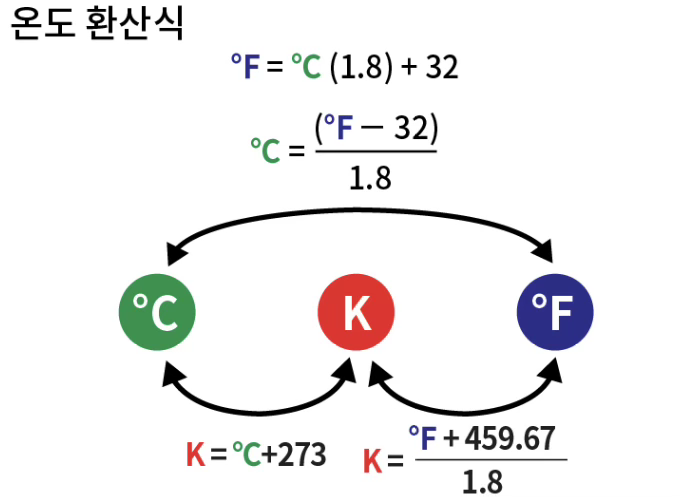

---
문서양식: 전시물
전시물 타입:
전시실: B전시실
---
#SI기본단위

  <button class="nav-btn" onclick="goHome()">🏠 홈</button>
  <button class="nav-btn" onclick="goHall('blue')">🔵 Blue 전시실 개요</button>
  <button class="nav-btn" onclick="goBack()">⬅ 이전 페이지</button>

# 과학의 알파벳, 기본단위는? (5)온도(K)

## 1. 전시물 기본 내용
### 1.1 전시물 이미지

  
전시 목적

  

    국제단위계(SI)의 기본 단위인 길이, 질량, 시간, 전류, 열역학적 온도, 물질량, 광도 등의 기준과 개념을 이해한다. 각 단위를 체험함으로써, 과학의 기초 언어를 습득하고, 과학적 사고를 함양한다.
  

<table>
  <caption><b>학교 교육과정</b></caption>
  <thead>
    <tr>
      <th>학년</th>
      <th>단원</th>
      <th>해당 교과 챕터</th>
      <th>비고</th>
    </tr>
  </thead>
  <tbody>
    <tr>
      <td>초등 1~2학년</td>
      <td></td>
      <td></td>
      <td></td>
    </tr>
    <tr>
      <td>초등 3~4학년</td>
      <td></td>
      <td></td>
      <td></td>
    </tr>
    <tr>
      <td>초등 5~6학년</td>
      <td></td>
      <td></td>
      <td></td>
    </tr>
    <tr>
      <td>중학교</td>
      <td></td>
      <td></td>
      <td></td>
    </tr>
    <tr>
      <td>고등학교(공통)</td>
      <td></td>
      <td></td>
      <td></td>
    </tr>
    <tr>
      <td>고등학교(선택)</td>
      <td></td>
      <td></td>
      <td></td>
    </tr>
  </tbody>
</table>

### 1.3 체험
##### 체험1) 물체 온도 측정하기
1. ℃/℉ 버튼을 이용해 측정하고 싶은 온도 단위를 선택한다.
2. 온도계를 측정할 물체로 향한다.
3. 온도계 손잡이의 레버를 당긴다.
4. 온도계 액정에 나타나는 온도를 확인한다.
5. ‘온도 환산식’을 보고 계산기를 이용해 ℃/℉에서 K로 전환해본다.
   

<ul>※온도계 레이저를 사람 얼굴을 향하지 않도록 주의한다.</ul>

### 1.4 패널내용

  

    과학의 알파벳, 기본단위는? 통합패널
  

  

    
  

  

    과학의 알파벳, 기본단위는? (5)온도
  

  

    
  

  

    체험방법 안내
  

  

    
  

## 2. 기본 과학 이론
### 2.1 핵심 과학이론
- 

### 2.2 연관 과학이론

## 3. 연관 전시물
- 

## 4. 기존 해설에서의 쓰임 예시

*아래는 해당 전시물 부분만 기재되어있습니다. 해설 전문은 '업무메신저 잔디>드라이브'내의 해설서들을 참고하세요!*

## 5. 확장 자료

### 심화 이론

### 최신 연구

## 변경기록
| 변경일        | 작성자 | 내용 및 사유 |
| ---------- | --- | ------- |
| 2026.01.22 | 박은선 | 최초 작성   |
|            |     |         |

  <button class="nav-btn" onclick="goHome()">🏠 홈</button>
  <button class="nav-btn" onclick="goHall('blue')">🔵 Blue 전시실 개요</button>
  <button class="nav-btn" onclick="goBack()">⬅ 이전 페이지</button>

