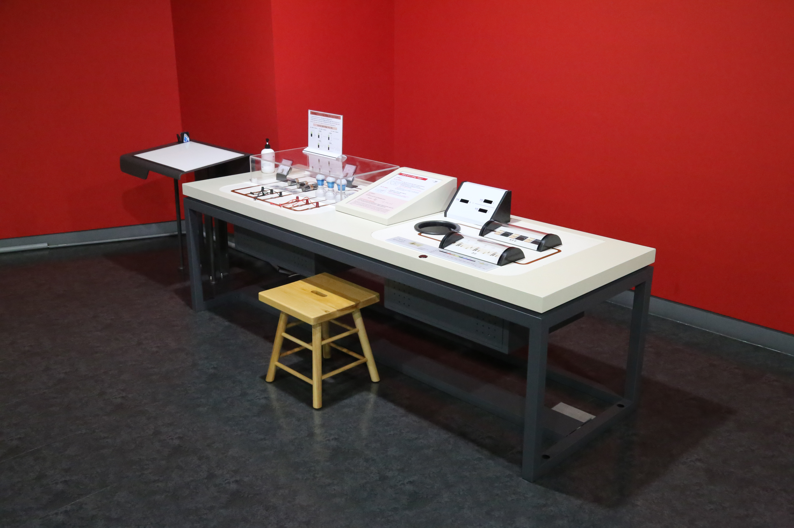

  <button class="nav-btn" onclick="goHome()">🏠 홈</button>
  <button class="nav-btn" onclick="goHall('blue')">🔵 Blue 전시실 개요</button>
  <button class="nav-btn" onclick="goBack()">⬅ 이전 페이지</button>

# B11 전류의 세기가 변하는 이유는?

## 1. 전시물 기본 내용
### 1.1 전시물 이미지

  
전시 목적

  

    전압과 저항을 변화시키며 전류를 측정하는 체험 장치를 실험 장치와 시뮬레이션 장치로 체험하며 옴의 법칙에 대해 탐구한다.
  

  
전시 유형 : 체험형/실험탐구

  

    실제 옴의 법칙을 실험해볼 수 있는 실험부분과 모의실험이 가능한 부분으로 구성된 전시물
  

### 1.2 학교 교육과정  
<!--
curriculum-table은 전시물과 연결된 학교 교육과정을 학년별로 비교하는 표이다.
내용체계 칸에는 정적 웹에 포함된 내부 교육과정 문서 링크를 넣는다.
챕터 및 단원명 칸에는 외부 교과서/교과 챕터 링크를 넣는다.
전시물과 연계성 칸에는 전시물에서 어떤 개념과 연결되는지 적는다.
비고 칸에는 학년별 수준 변화, 해설 시 유의점, 확인이 필요한 내용을 적는다.
-->

<table class="curriculum-table">
  <caption><b>학교 교육과정</b></caption>
  <thead>
    <tr>
      <th rowspan="2">교육과정 내용체계</th>
      <th colspan="2">해당 교과과정(교과서)</th>
      <th rowspan="2">전시물과 연계성</th>
      <th rowspan="2">비고</th>
    </tr>
    <tr>
      <th>학년 및 학기</th>
      <th>챕터 및 단원명</th>
    </tr>
  </thead>
  <tfoot>
    <tr>
      <td colspan="5">
        <ul>
          <li>교과챕터 및 단원명은 출판사의 교과서 pdf링크로 연결됩니다.</li>
          <li>고등2~3학년 과정은 선택교과입니다.</li>
        </ul>
      </td>
    </tr>
  </tfoot>
  <tbody>
    <tr>
          <td>
            <a class="curriculum-link-button" href="#/docs/school_curriculum/science/common/00_common_science_elementry5-6">
              초등학교 5~6학년 &gt; 전기의 이용
            </a>
          </td>
          <td>초등6-2</td>
          <td><a class="curriculum-link-button external" href="https://wbook.jihak.co.kr/SynapDocViewServer/viewer/doc.html?key=56226ad45da64f62ba50759242ba04b1&convType=img&convLocale=ko_KR&contextPath=/SynapDocViewServer" target="_blank" rel="noopener">
              3. 전기의 이용 (22개정 지학사 과학 6-2 pp 58-71)</a></td>
          <td>전압과 저항을 변화시키며 직렬 및 병렬연결에 따른 전류 활동 과정에서 전기와 자기 현상 및 이를 이용한 장치의 작동 원리를 이해함</td>
          <td></td>
        </tr>
    <tr>
          <td>
            <a class="curriculum-link-button" href="#/docs/school_curriculum/science/common/00_common_science_mid">
              중학교 1~3학년 &gt; 전기와 자기
            </a>
          </td>
          <td>중등2학년</td>
          <td><a class="curriculum-link-button external" href="https://ibook.vivasam.com/CBS_iBook/10777/contents/index.html?skin=basic01" target="_blank" rel="noopener">
              VII-2 전기회로와 에너지 (22개정 비상교과서 중등2 pp 235-250)</a></td>
          <td>전압과 저항, 직렬연결과 병렬연결에 대해 학습</td>
          <td></td>
        </tr>
    <tr>
          <td>
            <a class="curriculum-link-button" href="#/docs/school_curriculum/science/03_physics">
            물리학 &gt; 전기와 자기
            </a>
          </td>
          <td>고등2~3학년</td>
          <td><a class="curriculum-link-button external" href="https://ibook.vivasam.com/CBS_iBook/6655/contents/index.html?skin=basic01" target="_blank" rel="noopener">
                  II-1-02 저항의 연결과 소비전력 (22개정 비상교과서 물리학 pp 76-81)</a></td>
          <td>저항의 직렬, 병렬 연결시의 차이점에 대해 학습</td>
          <td></td>
        </tr>
<tr>
  <td>
    <a class="curriculum-link-button" href="#/docs/school_curriculum/science/08_electromagnetism_and_quantum">
    전자기와 양자 &gt; 전자기적 상호작용
    </a>
  </td>
  <td>고등2~3학년</td>
  <td><a class="curriculum-link-button external" href="https://ibook.vivasam.com/CBS_iBook/6671/contents/index.html?skin=basic01" target="_blank" rel="noopener">
      I-06 저항, 축전기, 인덕터 (22개정 비상교과서 전자기와 양자 pp 34-37)</a></td>
  <td>저항을 이용하여 전류의 세기를 조절하는 것을 학습</td>
  <td></td>
</tr>
  </tbody>
</table>

### 1.3 체험
##### 체험1) 전압과 저항을 변화시키며 직렬 및 병렬연결에 따른 전류 확인하기
1. 다양한 건전지와 저항을 연결하여 회로를 완성한다.
2. 회로를 완성한 후 전구가 점등되는지 확인한다.
3. 완성한 회로의 전류계와 전압계로 각각의 경우에 회로에 흐르는 전류와 전압을 확인한다.

### 1.4 패널내용

  

    전류의 세기가 변하는 이유는?
  

  

    
  

## 2. 기본 과학 이론
### 2.1 핵심 과학이론

- 

### 2.2 연관 과학이론

## 3. 연관 전시물
- 

## 4. 기존 해설에서의 쓰임 예시

## 5. 확장 자료

### 심화 이론

### 최신 연구

## 변경기록
| 변경일        | 작성자 | 내용 및 사유 |
| ---------- | --- | ------- |
| 2026.01.22 | 박은선 | 최초 작성   |
|            |     |         |

  <button class="nav-btn" onclick="goHome()">🏠 홈</button>
  <button class="nav-btn" onclick="goHall('blue')">🔵 Blue 전시실 개요</button>
  <button class="nav-btn" onclick="goBack()">⬅ 이전 페이지</button>

