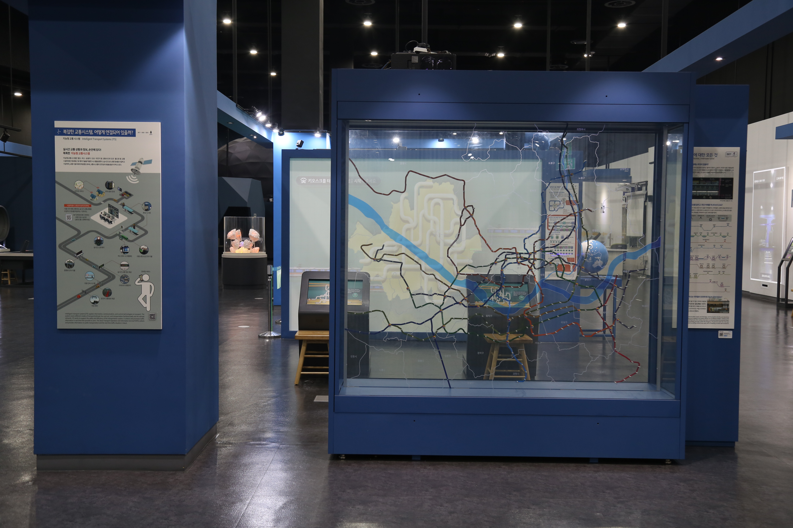

  <button class="nav-btn" onclick="goHome()">🏠 홈</button>
  <button class="nav-btn" onclick="goHall('blue')">🔵 Blue 전시실 개요</button>
  <button class="nav-btn" onclick="goBack()">⬅ 이전 페이지</button>

# B13 복잡한 교통시스템, 어떻게 연결되어 있을까? (1) 지하철에 대한 모든 것

## 1. 전시물 기본 내용
### 1.1 전시물 이미지

  
전시 목적

  

    학교를 가거나 친구와 시내로 놀러 나갈 때에 우리는 버스나 전철을 탄다. 해외에 여행을 갈 때는 비행기를 이용한다. 이와 같은 교통시스템에 대해 이해하기 위해 지하철에 대해 알아본다. 지하의 길 - 도시에서 정확하고 빠른 교통수단으로 이용되는 지하철의 특성을 알고, 서울시 지하철의 노선별 길이, 땅속 깊이, 한강 하저 터널 노선, 지상으로 이동하는 노선 등을 살펴본다.
  

  
전시 유형 : 관람형

  

    지도 위 지하철 노선도로 구성된 전시물
  

### 1.2 학교 교육과정  
<!--
curriculum-table은 전시물과 연결된 학교 교육과정을 학년별로 비교하는 표이다.
내용체계 칸에는 정적 웹에 포함된 내부 교육과정 문서 링크를 넣는다.
챕터 및 단원명 칸에는 외부 교과서/교과 챕터 링크를 넣는다.
전시물과 연계성 칸에는 전시물에서 어떤 개념과 연결되는지 적는다.
비고 칸에는 학년별 수준 변화, 해설 시 유의점, 확인이 필요한 내용을 적는다.
-->

<table class="curriculum-table">
  <caption><b>학교 교육과정</b></caption>
  <thead>
    <tr>
      <th rowspan="2">교육과정 내용체계</th>
      <th colspan="2">해당 교과과정(교과서)</th>
      <th rowspan="2">전시물과 연계성</th>
      <th rowspan="2">비고</th>
    </tr>
    <tr>
      <th>학년 및 학기</th>
      <th>챕터 및 단원명</th>
    </tr>
  </thead>
  <tfoot>
    <tr>
      <td colspan="5">
        <ul>
          <li>교과챕터 및 단원명은 출판사의 교과서 pdf링크로 연결됩니다.</li>
          <li>고등2~3학년 과정은 선택교과입니다.</li>
        </ul>
      </td>
    </tr>
  </tfoot>
  <tbody>
  </tbody>
</table>

### 1.3 체험
##### 체험1) 지하철 노선 입체모형 살펴보기
1. 철사와 막대로 되어있는 지하철 노선의 입체모형을 살펴본다.

### 1.4 패널내용

  

    복잡한 교통시스템, 어떻게 연결되어 있을까?(통합패널)
  

  

    
  

  

    복잡한 교통시스템 어떻게 연결되어 있을까? (1)지하철에 대한 모든 것
  

  

    
  

## 2. 기본 과학 이론
### 2.1 핵심 과학이론

- 

### 2.2 연관 과학이론

## 3. 연관 전시물
- 

## 4. 기존 해설에서의 쓰임 예시

## 5. 확장 자료

### 심화 이론

### 최신 연구

## 변경기록
| 변경일        | 작성자 | 내용 및 사유 |
| ---------- | --- | ------- |
| 2026.01.22 | 박은선 | 최초 작성   |
|            |     |         |

  <button class="nav-btn" onclick="goHome()">🏠 홈</button>
  <button class="nav-btn" onclick="goHall('blue')">🔵 Blue 전시실 개요</button>
  <button class="nav-btn" onclick="goBack()">⬅ 이전 페이지</button>

