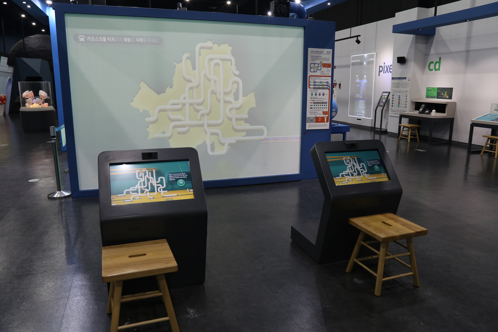

  <button class="nav-btn" onclick="goHome()">🏠 홈</button>
  <button class="nav-btn" onclick="goHall('blue')">🔵 Blue 전시실 개요</button>
  <button class="nav-btn" onclick="goBack()">⬅ 이전 페이지</button>

# B14 복잡한 교통시스템, 어떻게 연결되어 있을까? (2)수학으로 빠른 길 찾기

## 1. 전시물 기본 내용
### 1.1 전시물 이미지

  
전시 목적

  

    학교를 가거나 친구와 시내로 놀러 나갈 때에 우리는 버스나 전철을 탄다. 해외에 여행을 갈 때는 비행기를 이용한다. 이와 같은 교통시스템에 대해 이해하기 위해 지하철에 대해 알아본다. 지상의 길 - 서울시의 지능형 교통 시스템을 활용하여, 두 지점 간의 최적의 이동 경로를 찾아보는 영상 체험을 통해, 경우의 수, 문자와 식, 합리적인 의사 결정 등의 개념을 이해한다.
  

  
전시 유형 : 체험형/게임형

  

    터치모니터를 이용한 게임 진행이 가능한 전시물
  

### 1.2 학교 교육과정  
<!--
curriculum-table은 전시물과 연결된 학교 교육과정을 학년별로 비교하는 표이다.
내용체계 칸에는 정적 웹에 포함된 내부 교육과정 문서 링크를 넣는다.
챕터 및 단원명 칸에는 외부 교과서/교과 챕터 링크를 넣는다.
전시물과 연계성 칸에는 전시물에서 어떤 개념과 연결되는지 적는다.
비고 칸에는 학년별 수준 변화, 해설 시 유의점, 확인이 필요한 내용을 적는다.
-->

<table class="curriculum-table">
  <caption><b>학교 교육과정</b></caption>
  <thead>
    <tr>
      <th rowspan="2">교육과정 내용체계</th>
      <th colspan="2">해당 교과과정(교과서)</th>
      <th rowspan="2">전시물과 연계성</th>
      <th rowspan="2">비고</th>
    </tr>
    <tr>
      <th>학년 및 학기</th>
      <th>챕터 및 단원명</th>
    </tr>
  </thead>
  <tfoot>
    <tr>
      <td colspan="5">
        <ul>
          <li>교과챕터 및 단원명은 출판사의 교과서 pdf링크로 연결됩니다.</li>
          <li>고등2~3학년 과정은 선택교과입니다.</li>
        </ul>
      </td>
    </tr>
  </tfoot>
  <tbody>
    <tr>
          <td>
            <a class="curriculum-link-button" href="#/docs/school_curriculum/math/01_common_mathematics">
            공통수학1 &gt; 경우의 수와 행렬
            </a>
          </td>
          <td></td>
          <td></td>
          <td>길 찾기 교통 시스템 활동 과정에서 가능한 경우를 체계적으로 나누고 수학적으로 비교하는 방법을 이해함</td>
          <td></td>
        </tr>
    <tr>
          <td>
            <a class="curriculum-link-button" href="#/docs/school_curriculum/science/17_convergence_science_inquiry">
            융합과학 탐구 &gt; 융합과학 탐구의 이해
            </a>
          </td>
          <td></td>
          <td></td>
          <td>길 찾기 교통 시스템 활동 과정에서 관찰·측정·분류와 증거를 활용하는 과학 탐구 과정을 이해함</td>
          <td></td>
        </tr>
    <tr>
          <td>
            <a class="curriculum-link-button" href="#/docs/school_curriculum/science/17_convergence_science_inquiry">
            융합과학 탐구 &gt; 융합과학 탐구의 과정
            </a>
          </td>
          <td></td>
          <td></td>
          <td>길 찾기 교통 시스템 활동 과정에서 관찰·측정·분류와 증거를 활용하는 과학 탐구 과정을 이해함</td>
          <td></td>
        </tr>
  </tbody>
</table>

### 1.3 체험
##### 체험1) 길 찾기 교통 시스템 체험하기
1. 두 사람이 각각 키오스크 앞에 앉아 시작 버튼을 누른다. (혼자 체험한다면 시작 버튼을 누르고 10초간 기다린다.)
2. 남녀 캐릭터를 고른 후 사진을 찍어준다.
3. 처음 시작 버튼을 누른 체험자가 출발지와 목적지를 선택한다.
4. 대형 화면에 보이는 경로 중 가장 빠른 것 같은 경로를 골라 키오스크에서 번호를 선택한다.
5. 소요 시간을 클릭해 결과를 확인한다.
6. 최단 경로와 자신이 고른 경로의 시간 차이를 확인한다.

### 1.4 패널내용

  

    복잡한 교통시스템, 어떻게 연결되어 있을까?(통합패널)
  

  

    
  

  

    복잡한 교통시스템, 어떻게 연결되어 있을까?(2)수학으로 빠른 길찾기
  

  

    
  

## 2. 기본 과학 이론
### 2.1 핵심 과학이론

- 

### 2.2 연관 과학이론

## 3. 연관 전시물
- 

## 4. 기존 해설에서의 쓰임 예시

## 5. 확장 자료

### 심화 이론

### 최신 연구

## 변경기록
| 변경일        | 작성자 | 내용 및 사유 |
| ---------- | --- | ------- |
| 2026.01.22 | 박은선 | 최초 작성   |
|            |     |         |

  <button class="nav-btn" onclick="goHome()">🏠 홈</button>
  <button class="nav-btn" onclick="goHall('blue')">🔵 Blue 전시실 개요</button>
  <button class="nav-btn" onclick="goBack()">⬅ 이전 페이지</button>

