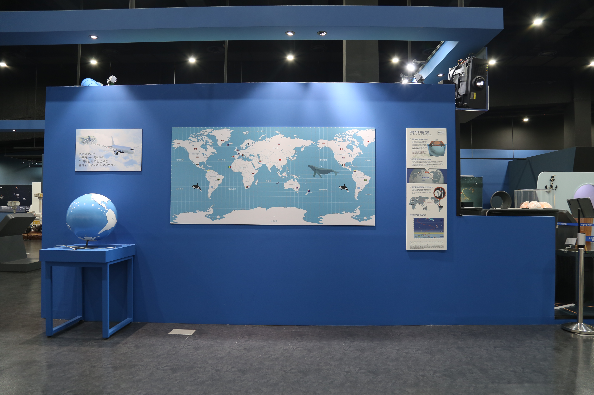

---
문서양식: 전시물
전시물 타입: 관람형, 패널
전시실: B전시실
---
#교통 #비행기 #메르카토르_도법 #세계지도

  <button class="nav-btn" onclick="goHome()">🏠 홈</button>
  <button class="nav-btn" onclick="goHall('blue')">🔵 Blue 전시실 개요</button>
  <button class="nav-btn" onclick="goBack()">⬅ 이전 페이지</button>

# 복잡한 교통시스템, 어떻게 연결되어 있을까? (3)비행기의 이동경로

## 1. 전시물 기본 내용
### 1.1 전시물 이미지

  
전시 목적

  

    학교를 가거나 친구와 시내로 놀러 나갈 때에 우리는 버스나 전철을 탄다. 해외에 여행을 갈 때는 비행기를 이용한다. 이와 같은 교통 시스템에 대해 이해하기 위해 지하철에 대해 알아본다.
    <ul>
    <li>하늘의 길 - 지구본과 평면 지도에서 두 지점 간의 최단 거리를 측정하면서, 비행기가 다니는 경로인 ‘대권 항로’의 개념을 이해한다.</li>
    </ul>
  

### 1.2 학교 교육과정  
| 학년       | 단원  | 해당 교과 챕터 | 비고  |
| -------- | --- | -------- | --- |
| 초등 1~2학년 |     |          |     |
| 초등 3~4학년 |     |          |     |
| 초등 5~6학년 |     |          |     |
| 중학교      |     |          |     |
| 고등학교(공통) |     |          |     |
| 고등학교(선택) |     |          |     |

### 1.3 체험
##### 체험1) 지구본과 평면지도 비교하여 최단 경로 측정하기
1. 체험물 오른쪽에 부착된 패널을 통해 대권 항로에 대해 알아본다.
2. 지구본에서 인천공항을 출발하여 다른 공항까지 최단 경로를 줄자로 측정한다.
3. 평면지도에서 인천공항을 출발하여 다른 공항까지 최단 경로를 줄자로 측정한다.
4. 지구본과 평면지도의 최단 거리의 길이를 비교한다.

### 1.4 패널내용

  

    복잡한 교통시스템, 어떻게 연결되어 있을까?(통합패널)
  

  

    
  

  

    복잡한 교통시스템, 어떻게 연결되어 있을까? (3)비행기의 이동경로
  

  

    
  

## 2. 기본 과학 이론
### 2.1 핵심 과학이론
- 

### 2.2 연관 과학이론

## 3. 연관 전시물
- 

## 4. 기존 해설에서의 쓰임 예시
*아래는 해당 전시물 부분만 기재되어있습니다. 해설 전문은 '업무메신저 잔디>드라이브'내의 해설서들을 참고하세요!*
>[!note]+ (주제해설) 기후위기&골든벨
> 	위치
> 	잔디 드라이브 > 자료실 > 1.해설시나리오_모음zip > 주제해설 > 주제해설_윤민애,김수민_후위기&골든벨.hwp
> 	작성자 : 윤민애, 김수민(2022년 7월 작성)
> > [!note]- 해설 내용
> > (전략)
> >   (이동 시 전기 절약 이야기) 전기를 만들 때에도 이산화탄소가 발생하는데요, 아까 얘기했던 선탄과 석유와 같은 화석연료가 사용되기 때문이에요. 헌데 우리는 지금 걸어도 이동 중이죠? 계단을 1개 오르면 25wh(와트시)의 전력을 절약할 수 있는데, 엘리베이터를 1회 이용시 30wh의 에너지가 소모됩니다. 이때 이산화탄소는 12.7g이 배출되며 1년이면 4.6kg을 배출하게 되는거죠. 이렇게 걸어서 올라가는 습관을 길러주면 이산화탄소를 줄이는 데 조금이나마 도움이 되겠죠?
> >   (도착) 우리가 이산화탄소를 줄이기 위해 할 수 있는 방법 중에 대중교통이용하기가 있었죠? 승용차 한 대당 1km 이동할 때마다 약 140g의 이산화탄소가 배출되며, 1일 평균 주행거리는 38km라고 합니다. 그렇다면 1대당 1년에 이산화탄소 배출량을 약 2톤 배출하게 되는 거죠. 그래서 가까운 거리는 걸어가거나 자전거를 이용하며, 승용차 대신 대중교통을 이용하면 지구온난화를 줄일 수 있는 거겠죠?
> >   지하철을 이용하면 승용차보다 이산화탄소 배출량이 1/100이나 감소하게 되며, 에너지 절감량은 시내버스 1대가 승용차 40대를 대체할 수 있는 정도입니다.
> >   헌데 이동수단 중에 가장 크게 이산화탄소를 배출하는 건 무엇일까요? 바로 비행기입니다. 유럽환경청에 따르면 비행기는 1km 이동할 때 88명 탑승기준 285g의 탄소를 배출한다고 합니다. 우리나라에서 지구 반대편 까지(2만km)는 약 5톤 이상(5700kg)의 6톤에 가까운 탄소가 발생하게 되는 거죠. 어마어마하죠. 이처럼 항공 산업은 연간 10억 톤의 이산화탄소를 배출하고 있습니다.
> >   특히 비행기가 지나간 자리에 생기는 꼬리구름(비행운)이 지구 가열에 더 치명적인 거 알고 있나요? 제트엔진에서 나오는 배기가스와 그을음 등에 의해 만들어지는 비행운은 온도와 습도에 따라 짧게는 수초, 길게는 수 시간까지 상공에 머물 수 있습니다. 상공에 형성된 비행운은 지구 복사열이 우주로 빠져나가지 못하게 하고 이산화탄소보다 2배 이상 지구를 뜨겁게하기 때문에 지구온난화에 더 안 좋죠. 
> >   이 때문에 세계는 지속가능한 항공연료로 대체하고 있습니다. 폐식용유나 사탕수수, 바이오매스 등의 바이오연료를 사용하는 것인데요, 이는 기존항공유 대비 탄소배출 80%까지 줄일 수 있습니다. 작년 12월 미국에서는 100% 지속가능한 항공연료 운항에 성공하기도 했죠. 
> >   자 그럼 또 다른 이산화탄소를 줄일 수 있는 방법을 체험하러 가볼까요?
> >  (후략)

>[!note]+ (주제해설) 비행기의 모든 것
> 	위치
> 	잔디 드라이브 > 자료실 > 1.해설시나리오_모음zip > 주제해설 > 주제해설_윤민애_비행기의 모든 것.hwp
> 	작성자 : 윤민애(2019년 5월 작성)
> > [!note]- 해설 내용
> > (전략)
> >  비행기가 다니는 길을 ‘항공로’라고 하고, 항공로가 표시된 지도를 ‘항공 지도’라고 합니다. 항공 지도는 각 나라에서 항공 교통을 책임지는 관청이 만들어 국제적으로 공개하게 되어 있습니다. 우리나라에서는 국토교통부가 만듭니다.
> >  항공지도만으로는 목적지를 정확히 찾아가기 힘듭니다. 그래서 현재 비행기가 날아가고 있는 위치를 파악할 수 있는 장치가 필요합니다. 그동안 널리 이용되어 온 것은 ‘전파 등대’입니다. 전파 등대와 비행기 간의 방위각을 계산하고, 또 다른 전파 등대와의 방위각을 추가로 계산하여 두 각도를 비교해서 비행기의 현재 위치를 파악합니다. 하지만 전파 등대는 정확성이 다소 떨어집니다.
> >  그래서 요즘에는 ‘인공위성이 보내는 전파’를 파악해 위치를 알아냅니다. 이 방법에도 단점이 있습니다. 인공위성이 워낙 멀리 떨어져 있어서 전파가 약하다 보니 불법 방해 장치의 영향을 받을 위험이 있다는 것입니다. 그래서 많은 비행기가 이 두 방법을 모두 활용하고 있습니다.
> >  
> >  이번에는 비행기의 최단거리 이동에 대해서 알아보겠습니다.
> >  항공기나 선박의 항로는 경제적인 이유로, 가능한 연료 소비와 운항시간을 최소로 하는 최단 거리의 항로로 운항하게 됩니다. 우리가 주변에서 쉽게 볼 수 있는 메르카토르 도법으로 그려진 사각 평면 지도에서 두지점간을 직선으로 그은 거리가 최단거리로 착각하기 쉽습니다.
> >  실제로는 지구가 공 모양의 구체에 가깝기 때문에 지구상의 두지점간을 최단 거리로 연결하기 위해서는 구체에서 두 점간을 잇는 호 중에서 가장 짧은 호를 이어야 합니다. 이 호는 항상 ‘대원’에 포함되어 있습니다.
> >  대원은 구체를 둘로 잘라 나누었을 경우, 반구의 자른 면이 가장 큰 원을 말합니다. 구의 반지름이 r이라면, 대원의 반지름도 r이 되는 것을 알 수 있습니다. 이 대원을 지리학에서는 ‘대권’이라고 합니다. 따라서 지구상의 두 지점 간을 최단거리의 항로로 운항하기 위해서는 ‘대권항로’를 선택하여 항로로 이용하게 됩니다.
> >  그래서 비행기가 다니는 항로를 평면 지도에 표시하게 되면 (아래 그림들 참고)직선이 아니라 곡선인 것을 확인할 수가 있습니다. 평면지도에서 가까워 보이는 직선 노선이 실제로는 돌아가는 길인 것입니다.
> >  ![[비행기의 모든 것 해설 참고 이미지 3.png]]
> >  ![[비행기의 모든 것 해설 참고 이미지4.png]]
> >  
> >  (패널) 일반 항공기의 경우 반드시 대권항로를 이용하는 것은 아닙니다. 지형, 바람, 해류, 항공관제, 연료보급 등의 문제로 대권항로를 이용할 수 없는 경우도 있습니다. 예를 들어, 인천국제공항과 LA를 비행할 경우, LA에서 인천국제공항으로, 즉 서쪽 방향으로 비행할 때에는 대권항로를 이용하지만, 동쪽 방향으로 비행할 때는 제트기류(편서풍)의 도움을 받는 하와이 제도 가까이의 항로는 택합니다. 시간과 연료의 절감효과가 있기 때문입니다.
> >  또 하나 정치적인 이유로 이용할 수 없는 경우도 있었습니다. 냉전시대였던 구소련의 상공에서였습니다. 우리나라 같은 경우에도 북한의 대포동 미사일 발사와 천안함 사고 이후 대북 강경대치 상황이 되어, 북한 비행관제구역 동해안 영공을 통과하던 미주와 러시아를 오가는 항공편은 기존의 항로 대신 일본영공 쪽으로 200km정도 우회하였습니다. 이 경우 비행시간이 늘어날 뿐만 아니라, 편서풍과 마주하고 운항하다보니 제트기류의 저항으로 연료비가 추가로 들게 됩니다.
> >  
> >  하루 빨리 세계 평화의 날이 와서 세계 어디에서도 이러한 일들이 벌어지지 않았으면 좋겠습니다.
> >  (후략)

>[!note]+ B전시실 기본 해설 시나리오
> 	위치
> 	잔디 드라이브 > 자료실 > 1.해설시나리오_모음zip > 전시실 기본해설 > B전시실(담당자 미정)
> 	작성자 : 확인불가(2018년 3월 작성)
> > [!note]- 해설 내용
> > (전략)
> >  이제 이러한 단위들로 우리가 하고 있는 일들 중 하나인 교통수단에 대해 알아보겠습니다. 다른 나라를 갈 때 어떻게 가나요? 아마 대부분 비행기를 타고 갈 겁니다. 혹시 비행기의 경로가 지도에 어떻게 표현되는지 아시나요? 보통 이러한 평면 지도에서 비행기의 경로는 곡선으로 그려집니다. 도대체 그 이유가 무엇일까요? 자로 일직선으로 그으면 가장 가까운 거리가 될 것 같은데 말이지요.
> >  그 이유는 이 지구본과 같이 지구는 원래 둥글기 때문입니다. 메르카토르 도법에서는 적도만이 실제 비율과 거의 흡사하고 극지로 올라갈수록 실제 크기보다 늘어나 보이게 됩니다. 그래서 평면 지도에서의 최단거리와 실제 최단거리는 조금 다르지요. 이 전시물의 줄자로 한국과 다른 국가의 대도시들의 거리를 서로 비교해보세요.
> >  실제 항공로를 결정할 때에는 이러한 실제 최단거리도 중요하지만 제트기류 또한 중요합니다. 비행기가 실제 만드는 에너지보다 비행기가 더 빠르게 날 수 있게 도와줄 수도 있기 때문입니다.
> >  이 패널에 그려져 있는 실제 비행기들의 이동 경로는 지구의 대기권 중에서도 대류권 바로 위, 성층권의 오존층 바로 아래에서 날게 되는데, 그건 바로 대류권의 불안정한 공기의 영향을 최소로 받기 위함이지요.
> >  (후략)
## 5. 확장 자료

### 심화 이론

### 최신 연구

## 변경기록
| 변경일        | 작성자 | 내용 및 사유 |
| ---------- | --- | ------- |
| 2026.01.22 | 박은선 | 최초 작성   |
|            |     |         |

  <button class="nav-btn" onclick="goHome()">🏠 홈</button>
  <button class="nav-btn" onclick="goHall('blue')">🔵 Blue 전시실 개요</button>
  <button class="nav-btn" onclick="goBack()">⬅ 이전 페이지</button>

