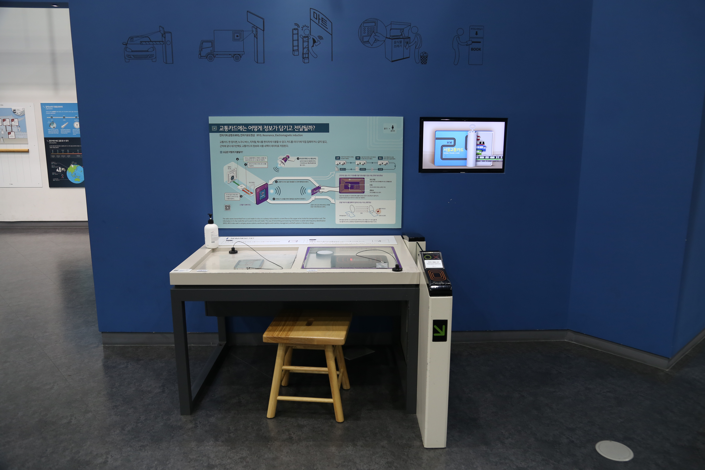

---
문서양식: 전시물
전시물 타입: 관람형, 패널
전시실: B전시실
---
#교통 #교통카드 #유도전류

  <button class="nav-btn" onclick="goHome()">🏠 홈</button>
  <button class="nav-btn" onclick="goHall('blue')">🔵 Blue 전시실 개요</button>
  <button class="nav-btn" onclick="goBack()">⬅ 이전 페이지</button>

# 교통카드에는 어떻게 정보가 담기고 전달될까?

## 1. 전시물 기본 내용
### 1.1 전시물 이미지

  
전시 목적

  

    RF의 주파수 원리와 전자기파의 공명, 유도코일을 통한 전자 유도 현상으로 IC 칩에 데이터가 전달되는 과정 및 원리를 투명 교통카드와 투명 교통카드 리더기 모형을 관찰하며 탐구한다. 또한, 체험자가 소지한 개인 교통카드의 사용 이력을 영상으로 확인한다.
    </ul>
  

### 1.2 학교 교육과정  
| 학년       | 단원  | 해당 교과 챕터 | 비고  |
| -------- | --- | -------- | --- |
| 초등 1~2학년 |     |          |     |
| 초등 3~4학년 |     |          |     |
| 초등 5~6학년 |     |          |     |
| 중학교      |     |          |     |
| 고등학교(공통) |     |          |     |
| 고등학교(선택) |     |          |     |

### 1.3 체험
##### 체험1) 투명 교통카드 내부 구조 관찰하기
1. 투명 교통카드의 모형을 관찰한다.
2. 투명 교통카드 단말기를 관찰한다.
3. 투명 교통카드를 투명 교통카드 단말기에 대어 본다.

##### 체험2) 개인 교통카드(T-money)의 사용 이력 확인하기
1. 본인의 개인 충전식 교통카드를 지하철 게이트 모형 위 ‘카드 대는 곳’에 접촉한다.
2. 정면 디지털 모니터에서 나오는 카드 사용 내역을 확인한다.
   <ul>※개인 카드가 없는 경우 테이블에 매달려있는 교통카드를 이용해 체험해보세요</ul>
   <ul>※일부 은행의 선불교통카드는 인식되지 않을 수 있습니다.</ul>

### 1.4 패널내용

  

    교통카드에는 어떻게 정보가 담기고 전달될까?
  

  

    
  

  

    체험방법 안내
  

  

    
  

## 2. 기본 과학 이론
### 2.1 핵심 과학이론
- 

### 2.2 연관 과학이론

## 3. 연관 전시물
- 

## 4. 기존 해설에서의 쓰임 예시
*아래는 해당 전시물 부분만 기재되어있습니다. 해설 전문은 '업무메신저 잔디>드라이브'내의 해설서들을 참고하세요!*

>[!note]+ 전관해설
> 	위치
> 	잔디 드라이브 > 자료실 > 1.해설시나리오_모음zip > 전시실 전관해설 > 전관해설_김다빈.hwp
> 	작성자 : 김다빈(2025년 12월 작성)
> > [!note]- 해설 내용
> > (전략)
> >  2000년대에 들어서며 서울의 모습은 크게 달라집니다. 물리적인 이동의 교통수단, 버스와 지하철 노선이 발달하게 된 것인데요. (지류 티켓 사진) 혹시 보호자 분들 중에 이게 뭔지 아시는 분들이 계신가요? 바로 토큰입니다. 옛날엔 지하철을 타려면 종이 티켓이나 이런 토큰이 필요했어요. 그러다 1996년, 서울 시내버스에서 처음 교통카드라는 것이 도입되고 이후 2000년대 들어서며 빠르게 확산되었죠.
> >  
> >  혹시 오늘 버스나 지하철 타고 오신 분 계신가요? 여기서 깜짝 퀴즈! 지금 서울시 지하철 요금이 얼마인지 아시나요? 정답은 바로 성인 1,550원, 청소년 900원, 어린이는 550원입니다. 우리는 이 요금을 한 번만 내면 버스와 지하철을 다양하게 갈아탈 수 있는 환승이라는 제도가 있어요. 그런데 여러분, 신기하지 않나요? 얇은 교통카드에는 배터리도, 건전지도 없거든요. 그런데 어떻게 우리가 어디서 탔는지, 돈이 얼마나 남았는지 다 기억하고 알려주는 걸까요?
> >  
> >  (교통카드 전자기 유도 전시물) 그 비밀 역시 과학에 숨어 있습니다. 교통카드의 안쪽은 이렇게 생겼습니다. 생각보다 단순하죠? 이 겉에 보이는 얇은 구리선이 보이지 않는 전기를 받아들이는 안테나 역할을 합니다. 우리가 카드를 단말기에 ‘띡!’ 하고 가까이 대는 순간, 단말기에서 뿜어져 나오는 눈에 보이지 않는 자기장이 이 구리선을 통과해요. 그러면 카드는 ‘어? 자석 힘이 들어오네?’ 하고 스스로 순식간에 전기를 만들어냅니다. 이걸 ‘전자기 유도’라고 불러요. 그리고 가운데 있는 조그마한 칩은 정보를 기억합니다. 전기가 번쩍! 들어오면, 어느 역에서 몇 시에 카드를 찍었는지 기록이 되는 것이죠.
> >  
> >  교통카드를 태그하는 곳에 닿으면 순간적으로 전기가 만들어집니다. 지금 교통카드 가지고 계신 분 계신가요? 앞에 한 번 찍어보시겠어요? (태그) 이렇게 어떤 경로를 거쳐 얼마의 요금을 사용했는지 알 수 있도록 하는 기술로 서울 시민의 생활 범위는 점점 넓어지게 되었습니다.
> >  (후략)

>[!note]+ 전관해설
> 	위치
> 	잔디 드라이브 > 자료실 > 1.해설시나리오_모음zip > 전시실 전관해설 > 전관해설_박윤실.hwp
> 	작성자 : 박윤실(2024년 3월 작성)
> > [!note]- 해설 내용
> > (전략)
> >  지하철, 버스, 비행기처럼 다양한 교통수단은 정보와 데이터의 연결성을 바탕으로 발전해 왔습니다. 실시간 교통정보, GPS, 환승 시스템 등은 무선 통신 발달과 전자기 유도 기술 덕분입니다.
> >  특히 교통카드는 전자기 유도를 활용해 배터리 없이도 작동합니다. 단말기에서 발생한 자기장을 카드의 코일이 감지해 전류를 발생시켜 ‘IC칩’을 작동시킵니다. 이 기술은 스마트폰 결제 등 다양한 분야에서 사용되고 있습니다.
> >  200년 전, 마이클 패러데이라는 사람이 발견한 과학 원리를 통해 발전해나가며 지금의 시스템을 이룰 수 있었습니다. 과학기술은 우리 우리 생활양식과 함께 발전해나갑니다. 이번에는 과거로 가보도록 하겠습니다. 과거의 모습이 현재와 어떻게 연결되어 있을까요?
> >  (후략)

>[!note]+ 전관해설) 과학관 맛보기 해설
> 	위치
> 	잔디 드라이브 > 자료실 > 1.해설시나리오_모음zip > 전시실 전관해설 > 과학관 맛보기 해설(심화형).hwp
> 	작성자 : 김지혜(2023년 9월 작성)
> > [!note]- 해설 내용
> > (전략)
> >  이번에 만나볼 전시실은 Blue를 뜻하는 B전시실입니다. 파랑색하면 떠오르는 것은 바로 우리가 살고 있는 행성인 지구도 있을 수 있고, 블루투스도 있을 수 있는데요. 우리가 살고 있는 이 지구는 사실 모든 것이 연결되어있습니다. B전시실에서는 어디든 갈 수 있도록 연결해주는 교통, 나라와 나라의 소통을 연결해주는 단위, 또 더 나아가 먼 우주까지, 그러면 이제 B전시실 안으로 이동해보도록 하겠습니다. 우리가 보통 장소를 이동할 때 대중교통을 많이 이용합니다. 아마 오늘 과학관을 오면서도 대중교통을 이용하셨을 텐데요. 버스나 지하철을 탈 때 꼭 필요한 것이 바로 교통카드입니다. 물론 현금도 가능할 수 있지만 최근에는 교통카드로만 사용해야하는 버스들도 늘고 있죠? 이만큼 이 교통카드는 굉장히 중요한 역할을 하는데요. 교통카드는 과연 어떻게 작동하는 것일까요? 건전지가 있어서 건전지를 갈아 끼우는 것일까요? 
> >  생각해보면 우리는 사용하면서 건전지를 사용해본 적이 없습니다. 왜냐하면 교통카드는 이 안에 있는 유도 코일과 IC칩을 이용하여 작동하는데요. 코일의 자기장을 변화시켜 전류를 유도하는 현상인 전자기 유도현상으로 인해 작동하게 됩니다. 단말기에서 발생한 자기장에 의해 카드 속 유도코일에 전류가 흐르게 되고 그것으로 인해 정보가 전달되어 IC칩에 기록되는 것입니다. 자 혹시 우리 친구들 중에 티머니 교통카드를 지금 가지고 있는 분 있을까요? 그렇다면 우리친구 교통카드를 이곳에 찍어보도록 하겠습니다. 이렇게 교통카드를 찍게 되면 이 안에 있는 IC칩에 내가 어디에서 출발하여 어디에서 환승하고 어디에서 내렸는지를 다 확인할 수 있게 됩니다.
> >  (후략)

>[!note]+ 전관해설
> 	위치
> 	잔디 드라이브 > 자료실 > 1.해설시나리오_모음zip > 단체프로그램 해설 시나리오 > 상반기_(초등)단체프로그램 전시 해설.hwp
> 	작성자 : 권오혁, 유보람, 최선주(2023년 1월 작성)
> > [!note]- 해설 내용
> > (전략)
> > 과학기술은 지금도 계속 발전하고 있으며 과거에는 상상도 못 했던 세상으로 연결해주고 있습니다. 특히 도시를 구석구석을 연결해주는 신경망 중 하나로 대중교통을 꼽을 수 있는데요. 
> > 
> > 자, 이 얇고 납작한 교통카드 안에는 건전지가 들어있을까요, 없을까요? 정답은 ‘없다.’입니다.
> > 
> > 어? 그런데 건전지도 없는 이 카드가 어떻게 5년이 지나고 10년이 지나도 내 정보를 다 기억하고 금액을 계산할 수 있게 해주는 걸까요? 교통카드를 해부해보겠습니다. 바로 이것인데요. 여기 이렇게 코일이 감겨 있네요? 그리고 컴퓨터 역할을 해주는 작은 IC칩이 있고, 순간적으로 전류를 저장해주는 작은 전구 같은 콘덴서가 있습니다. 이 교통카드를 이해하기 위해서 우선 전기에 대해서 알아야 해요. 
> > 
> > 우리의 문명은 전기 문명이라고 볼 수 있을 정도로 전기는 기술 발전에 있어서 매우 중요합니다. 전기란 무엇일까요? 우리 주위에는 어디에나 전기가 있어요. 그리고 전기 현상을 이루는 가장 작은 단위를 ‘전하’라고 생각해봅시다. (원자 판을 보여주며) -를 잃으면 양(+)전하, -를 얻으면 음(-)전하, 너무 어려운 말이지만 지금 보여드릴게요. (수건으로 감싼 플라스틱 빗으로 머리카락과의 마찰로 전하를 띠게 한 다음 흐르는 물에 갖다 대어 물이 끌려오는 대전 현상 확인) 정전기도 마찬가지. 끌어당기는 힘이 생긴 것입니다. 즉 전하가 있어서 서로 끌어당기고 이런 일이 일어나는 것인데 전하가 움직이면 ‘전류’가 됩니다. 눈에 보이지는 않지만, 전선을 통해 전류는 흐르고 있습니다. 
> > 
> > 그런데 또 놀라운 사실은 전류가 흐르면 자석의 성질을 띤다는 것입니다. 자석의 성질이 띤다는 말은 자기장(자기력)이 발생한다는 뜻이 되는데요, (사진을 보여주며) 자기장은 쉽게 말해 자석에 철가루를 뿌렸을 때 보이는 무늬를 말합니다. 단말기에 감아둔 코일에 전류를 계속 흐르게 하여 자석의 성질을 띠게 만듭니다. 그러면 자기장이 형성되겠죠? 그리고 카드에는 또 다른 코일을 감아두어 단말기에 갖다 대는 순간 이 자기장이 다시 카드에 전류를 흐르게 합니다. 이걸 우리는 ‘전자기유도 현상’이라 부릅니다. 매우 짧은 시간 동안 발생한 전기 에너지로 카드 속 메모리에 정보를 저장하여 사용하게 되죠. 그래서 교통카드는 건전지나 배터리도 없이 내가 몇 시에 어디에서 타고 환승하고 내렸는지에 대한 정보를 가지고 있습니다. 작은 블랙박스라고도 할 수 있겠죠?
> > 
> > 교통카드를 가지고 있는 친구가 있다면 한 번 체험해볼까요? 자 이렇게 우리는 ‘전자석’, ‘전자기유도’에 대해 알아보았습니다. 전자기유도는 조금 어렵지만, (자석을 들어 보여주며) 자석은 친숙한 과학 도구라고 할 수 있지요. 자석은 양쪽이 N극과 S극으로 나뉘어 있는데 이 중간을 자르면 어떻게 될까요? 네, 또다시 양쪽에 N극과 S극으로 나뉘게 됩니다. 매우 대칭적이라고 할 수 있지요. 
> > 
> > 그럼 이번엔 거울 반사를 이용한 대칭의 최종 보스! 데칼코마니 전시물로 함께 이동해 보겠습니다.
> >  (후략)

>[!note]+ (주제해설) 뛰뛰빵빵 교통수단
> 	위치 
> 	잔디 드라이브 > 자료실 > 1.해설시나리오_모음zip > 주제해설 > 주제해설_박윤실_ 뛰뛰빵빵 교통수단.hwp
> 	작성자 : 박윤실(2019년 3월 작성)
> > [!note]- 해설 내용
> > (전략)
> >  대중교통을 이용할 때, 우리는 그에 합당한 일정 요금을 냅니다. 여러분들은 요금을 어떻게 내시나요? 요즘은 카드를 많이 이용하죠? 혹시 이런 물건 본 적 있으세요? (회수권과 토큰 보여주기) 교통카드 전, 우리가 돈 대신 회수권과 토큰을 내며 버스를 이용했습니다. 한꺼번에 많이 사두면 더 저렴하기 때문이에요. 그런데 지하철에서 이용한건 달라요. 짠, 자기테이프가 붙은 마그네틱 승차권을 이용했어요. 그런데 요즘, 교통카드는 선불충전 뿐만 아니라 먼저 사용하고 후불, 나중에 요금 정산 하는 시스템도 갖추고 있습니다. 어떻게 가능한 것일까요?
> >  자 이들의 공통점은 바로 선불, 즉 돈을 먼저 내야 토큰이던 회수권이던 지하철 승차권을 구입할 수 있습니다. 선불식과 후불식 교통카드 정보저장 방식이 다르다? 다르지 않다?
> >  먼저, 교통카드의 작동을 간단히 말씀드릴게요. 지금 단말기에선 변하는 자기장이 발생하고 있습니다. 카드 안은 노란 구리선과 정보가 저장되는 IC칩이 내장되어있어요. 이 노란 구리선을 바로 단말기에 갖다 대면 이 구리선으로 전류가 유도되어 칩을 작동시킬 수 있습니다.
> >  여기서 끝나지 않습니다. 카드를 사용할 때 생긴 전기는 여기 보이는 전기를 저장하는 축전기와 IC칩으로 정보를 저장합니다. 그 다음 단말기 쪽으로 전파를 보내 카드 속 정보를 전달합니다. 이때 선불 교통카드의 경우, 미리 충전해 둔 요금 정보에서 회로에 유도되는 전류에 의해 지불해야 하는 요금만큼 차감을 합니다. 반면 후불제 교통카드는 지금까지 사용해 온 요금을 기록하고, 자기장에 의해 운임 요금과 결제 후 사용한 요금 데이터를 받게 됩니다. 이 정보를 버스회사가 정산을 할 때 해당 은행으로 데이터가 넘어갑니다.
> >  처음 이 후불식 교통카드는 국민은행에서 만들어졌어요. 다른 카드회사가 후불식 교통카드를 만들려면 국민은행에게 거액의 특허권료를 지불해야 했지요. 결국 카드회사들끼리 연합해 특허무효소송을 걸어 이기게 되면서 지금 많은 카드회사들이 후불 카드를 사용하고 있습니다.
> >  (후략)

>[!note]+ B전시실 기본 해설 시나리오
> 	위치
> 	잔디 드라이브 > 자료실 > 1.해설시나리오_모음zip > 전시실 기본해설 > B전시실(담당자 미정)
> 	작성자 : 확인불가(2018년 3월 작성)
> > [!note]- 해설 내용
> > (전략)
> >  빠른 길을 찾다가 보면 다른 교통수단으로 꼭 갈아타야할 일이 생깁니다. 우리나라 대중교통은 환승시스템이 잘 되어있습니다. 같은 교통카드를 사용해 탑승하면 무료로 환승이 이루어지지요. 자, 그러면 교통카드는 과연 전선도 배터리도 없이 어떻게 정보를 저장할 수 있을까요?
> >  그건 바로 전자기 유도현상과 공명현상 때문입니다. 교통카드를 가까이 가져다 대면 리더기에서 나온 무선신호가 교통카드에 닿게 됩니다. 이때 교통카드 내부의 유도코일에서 전기를 만들어내어 교통카드 내부의 정보를 다시 전파의 형태로 리더기에 전달하지요. 리더기의 안테나는 그 정보를 받아 시스템으로 전달합니다.
> >  이 과정에서 GPS의 도움으로 환승을 한 것인지에 대한 정보와 이동한 위치를 확인해 그에 맞는 교통요금을 낼 수 있게 되어있습니다. 이 카드 리더기에 카드를 가져가면 여러분이 사용한 교통카드 내역을 볼 수 있습니다.
> >  만약 지금 가지고 계신 카드가 없더라도 여기 비치된 카드로 해보실 수 있습니다.
> >  (후략)

>[!note]+ (주제해설) 시간여행자
> 	위치 
> 	잔디 드라이브 > 자료실 > 1.해설시나리오_모음zip > 주제해설 > 주제해설_김형준_시간여행자(날자미정.hwp
> 	작성자 : 김형준
> > [!note]- 해설 내용
> > (전략)
> >  다시 제 일기장을 보면요. 1831년도에 전기와 자기 사이에서 또다시 새로운 발견이 있었다고 나오는데요. 영국의 물리학자 페러데이가 발견한 내용입니다(패러데이 사진 보여줄 것). 앙페르와 페러데이는 비슷한 일을 했어요. 앙페르가 손등에서 손바닥을 뒤집는 방법을 알아냈다면, 페러데이는 손바닥을 손등으로 뒤집는 방법을 발견했습니다. 과학적으로 말하면, 앙페르는 전기를 사용해서 자기를 페러데이는 자기를 사용해서 전기를 만들 수 있다는 것을 발견한 거예요.
> >  거의 200년 전에 살았던 페러데이 덕분에 지금도 발전소에서 전기가 만들어지고 있는데요. 제가 미니 발전기를 가지고 왔어요. 이거로 전구를 켜 보겠습니다. 이 발전기는 코일 그리고 자석(자석 붙여다 떼다하는 모습 어필)으로 구성되어있습니다. 이 자석이 가운데에 있는 도선을 지날 때 마다 전기가 만들어지는데요. 이렇게 만들어진 전기로 전구를 켜 볼게요. 이번에는 여러분이 직접 전기를 만들어 볼까요? 이렇게 우리는 필요할 때 마다 전기를 만들어서 사용할 수 있는데요.  아까 얘기했던 교통 카드 안에도 코일이 들어 있습니다. 그래서 배터리 없어도 사용할 수 있는 거고요. 
> >  교통카드로 대중교통을 이용하면 걷는 것 보다 빠르게 이동 할 수 있는데요. 엄청 나게 먼 거리를 훨씬 더 빠르게 이동해야할 때는 어떤 교통수단을 사용해야할까요?
> >  (후략)

## 5. 확장 자료

### 심화 이론

### 최신 연구

## 변경기록
| 변경일        | 작성자 | 내용 및 사유 |
| ---------- | --- | ------- |
| 2026.01.22 | 박은선 | 최초 작성   |
|            |     |         |

  <button class="nav-btn" onclick="goHome()">🏠 홈</button>
  <button class="nav-btn" onclick="goHall('blue')">🔵 Blue 전시실 개요</button>
  <button class="nav-btn" onclick="goBack()">⬅ 이전 페이지</button>

