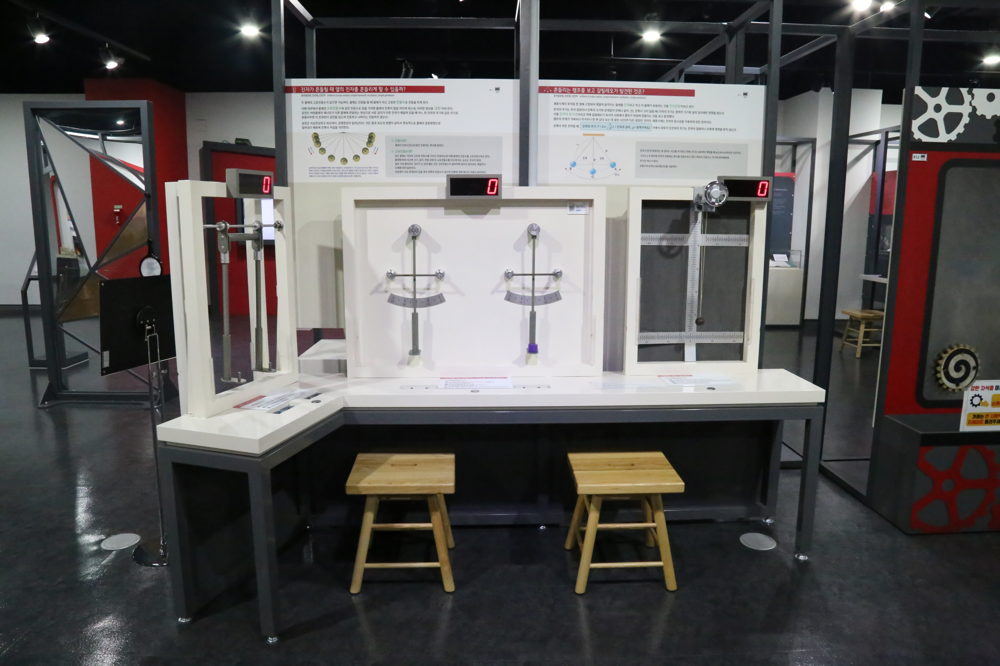

  <button class="nav-btn" onclick="goHome()">🏠 홈</button>
  <button class="nav-btn" onclick="goHall('blue')">🔵 Blue 전시실 개요</button>
  <button class="nav-btn" onclick="goBack()">⬅ 이전 페이지</button>

# B17 진자가 흔들릴 때 옆의 진자를 흔들리게 할 수 있을까?

## 1. 전시물 기본 내용
### 1.1 전시물 이미지

  
전시 목적

  

    진자 운동을 관찰하여 진자의 움직임이 전달되는 공진현상을 체험하고 이해한다. 또한 반복되는 진자의 운동을 관찰해보고 진자의 운동에 영향을 미치는 것이 무엇인지 알아본다.
    </ul>
  

  
전시 유형 : 체험형/실험탐구

  

    진자의 주기에 영향을 미치는 요소를 탐구해볼 수 있는 진자 모형과 진자의 공진현상을 확인할 수 있는 전시물
  

### 1.2 학교 교육과정  
<!--
curriculum-table은 전시물과 연결된 학교 교육과정을 학년별로 비교하는 표이다.
내용체계 칸에는 정적 웹에 포함된 내부 교육과정 문서 링크를 넣는다.
챕터 및 단원명 칸에는 외부 교과서/교과 챕터 링크를 넣는다.
전시물과 연계성 칸에는 전시물에서 어떤 개념과 연결되는지 적는다.
비고 칸에는 학년별 수준 변화, 해설 시 유의점, 확인이 필요한 내용을 적는다.
-->

<table class="curriculum-table">
  <caption><b>학교 교육과정</b></caption>
  <thead>
    <tr>
      <td>
        <a class="curriculum-link-button" href="#/docs/school_curriculum/science/07_mechanics_and_energy">
          역학과 에너지 &gt; 탄성파와 소리
        </a>
      </td>
      <td></td>
      <td></td>
      <td>길이가 같은 진자로 다른 진자에 공진 일으키기 활동 과정에서 진동과 파동이 발생하고 전달되는 특성을 관찰하고 이해함</td>
      <td></td>
    </tr>
    <tr>
      <td>
        <a class="curriculum-link-button" href="#/docs/school_curriculum/science/common/00_common_science_mid">
        중학교 1~3학년 &gt; 운동과 에너지
        </a>
      </td>
      <td>중3</td>
      <td>(교과서 링크 없음)</td>
      <td>물체의 운동에서 역학적 에너지의 전환과 보존을 학습</td>
      <td></td>
    </tr>
    <tr>
      <td>
        <a class="curriculum-link-button" href="#/docs/school_curriculum/math/03_algebra">
        대수 &gt; 삼각함수
        </a>
      </td>
      <td></td>
      <td></td>
      <td>길이가 같은 진자로 다른 진자에 공진 일으키기 활동 과정에서 수량 사이의 관계와 공간적 규칙을 찾아 수학적으로 표현하고 해석함</td>
      <td></td>
    </tr>
  </tbody>
</table>

### 1.3 체험
##### 체험1) 길이가 같은 진자로 다른 진자에 공진 일으키기
1. 연결되어 있는 두 진자 중 한쪽 진자만 1회 밀었다 놓는다.
2. 정지하고 있던 다른 진자를 관찰한다.

##### 체험2) 길이가 같은 두 진자의 질량을 다르게 하여 주기 비교하기
1. 두 진자를 동일한 각도까지 올린 후 동시에 놓아 두 진자의 움직임을 관찰한다.
2. 진자를 정지시킨 후 한쪽 진자에만 추를 얹어 질량을 늘린다.
3. 질량이 다른 두 진자를 동일한 각도까지 올린 후 동시에 놓아 두 진자의 움직임을 관찰한다.

##### 체험3) 쇠공에 연결된 줄 길이를 조절하여 주기의 변화 관찰하기
1. 쇠공으로 된 진자를 살짝 움직여 진자가 좌우로 흔들리게 한다.
2. 손잡이를 천천히 돌려 쇠공에 연결된 줄 길이를 조절한다.
3. 줄을 짧게 했을 때, 길게 했을 때 쇠공의 움직임을 관찰하고 패널에서 줄 길이에 따른 진자 운동에 대한 이론 설명을 확인한다.

### 1.4 패널내용

  

    진자가 흔들릴 때 옆의 진자를 흔들리게 할 수 있을까?
  

  

    
  

  

    흔들리는 램프를 보고 갈릴레오가 발견한 것은?
  

  

    
  

## 2. 기본 과학 이론
### 2.1 핵심 과학이론
- 

### 2.2 연관 과학이론

## 3. 연관 전시물
- 

## 4. 기존 해설에서의 쓰임 예시

## 5. 확장 자료

### 심화 이론

### 최신 연구

## 변경기록
| 변경일        | 작성자 | 내용 및 사유 |
| ---------- | --- | ------- |
| 2026.01.22 | 박은선 | 최초 작성   |
|            |     |         |

  <button class="nav-btn" onclick="goHome()">🏠 홈</button>
  <button class="nav-btn" onclick="goHall('blue')">🔵 Blue 전시실 개요</button>
  <button class="nav-btn" onclick="goBack()">⬅ 이전 페이지</button>

