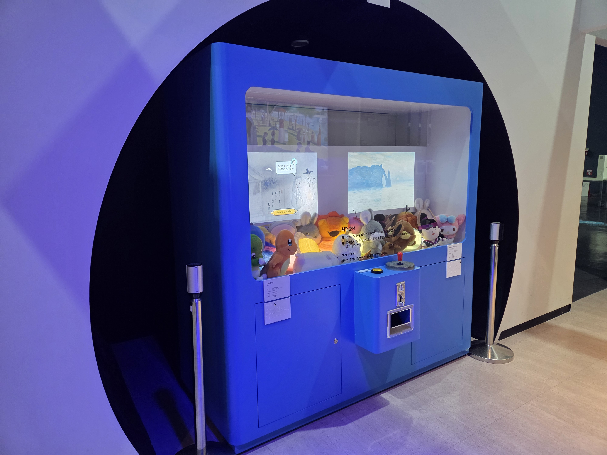

---
문서양식: 전시물
전시물 타입: 관람형, 패널
전시실: B전시실
---
#속도

  <button class="nav-btn" onclick="goHome()">🏠 홈</button>
  <button class="nav-btn" onclick="goHall('blue')">🔵 Blue 전시실 개요</button>
  <button class="nav-btn" onclick="goBack()">⬅ 이전 페이지</button>

# B18 RUN OUT

## 1. 전시물 기본 내용
### 1.1 전시물 이미지

  
전시 목적

  

    거리, 속도, 시간의 상관관계를 인터렉션 VR ‘달리기 게임’을 통하여 이해한다.
  

  
전시 유형 : 체험형/게임형

  

    발판위에서 달리며 게임을 통해 시간에 따른 이동 거리를 나타내는 속도의 개념을 이해하는 전시물
  

### 1.2 학교 교육과정  
<!--
curriculum-table은 전시물과 연결된 학교 교육과정을 학년별로 비교하는 표이다.
내용체계 칸에는 정적 웹에 포함된 내부 교육과정 문서 링크를 넣는다.
챕터 및 단원명 칸에는 외부 교과서/교과 챕터 링크를 넣는다.
전시물과 연계성 칸에는 전시물에서 어떤 개념과 연결되는지 적는다.
비고 칸에는 학년별 수준 변화, 해설 시 유의점, 확인이 필요한 내용을 적는다.
-->

<table class="curriculum-table">
  <caption><b>학교 교육과정</b></caption>
  <thead>
    <tr>
      <th colspan="2">교육과정 내용체계</th>
      <th colspan="2">해당 교과과정(교과서)</th>
      <th rowspan="2">전시물과 연계성</th>
      <th rowspan="2">비고</th>
    </tr>
    <tr>
      <th>학년(학군)</th>
      <th>내용체계</th>
      <th>학년 및 학기</th>
      <th>챕터 및 단원명</th>
    </tr>
  </thead>
  <tfoot>
    <tr>
      <td colspan="6">교과 챕터는 외부 사이트 링크를 통해 해당 단원을 확인한다.</td>
    </tr>
  </tfoot>
  <tbody>
    <tr>
      <th>초등1~2학년</th>
      <td>
      </td>
      <td>1학년 1학기</td>
      <td>
        <a class="curriculum-link-button external" href="https://example.com" target="_blank" rel="noopener">
          교과 챕터 링크예시
        </a>
      </td>
      <td>연계성</td>
      <td>비고</td>
    </tr>
    <tr>
      <th>초등5~6학년</th>
      <td></td>
      <td></td>
      <td></td>
      <td></td>
      <td></td>
    </tr>
    <tr>
      <th>중학교</th>
      <td></td>
      <td></td>
      <td></td>
      <td></td>
      <td></td>
    </tr>
    <tr>
      <th>고등학교(공통)</th>
      <td></td>
      <td></td>
      <td></td>
      <td></td>
      <td></td>
    </tr>
    <tr>
      <th>고등학교(선택)</th>
      <td></td>
      <td></td>
      <td></td>
      <td></td>
      <td></td>
    </tr>
  </tbody>
</table>

### 1.3 체험
##### 체험1) 달리기 게임을 통해 나의 속력 계산해보기
1. 발판 위에 올라가 오른쪽 기둥의 버튼을 눌러 게임을 시작한다.
2. 패널의 그림처럼 한발로 발판을 밟아 ‘YES’를 고르고 버튼을 누른다.
3. 튜토리얼을 통해 게임 방법을 습득한 후 게임을 즐긴다.
4. 화면 상단에 표시되는 이동 거리 및 걸린 시간을 이용해 나의 속력을 계산해본다.

### 1.4 패널내용

  

    RUN OUT
  

  

    
  

## 2. 기본 과학 이론
### 2.1 핵심 과학이론

- 

### 2.2 연관 과학이론

## 3. 연관 전시물
- 

## 4. 기존 해설에서의 쓰임 예시

## 5. 확장 자료

### 심화 이론

### 최신 연구

## 변경기록
| 변경일        | 작성자 | 내용 및 사유 |
| ---------- | --- | ------- |
| 2026.01.22 | 박은선 | 최초 작성   |
|            |     |         |

  <button class="nav-btn" onclick="goHome()">🏠 홈</button>
  <button class="nav-btn" onclick="goHall('blue')">🔵 Blue 전시실 개요</button>
  <button class="nav-btn" onclick="goBack()">⬅ 이전 페이지</button>

