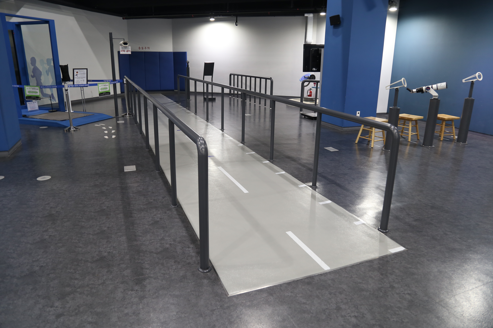

---
문서양식: 전시물
전시물 타입: 관람형, 패널
전시실: B전시실
---
#속도

  <button class="nav-btn" onclick="goHome()">🏠 홈</button>
  <button class="nav-btn" onclick="goHall('blue')">🔵 Blue 전시실 개요</button>
  <button class="nav-btn" onclick="goBack()">⬅ 이전 페이지</button>

# 자동차의 속도는 어떻게 측정할까?

## 1. 전시물 기본 내용
### 1.1 전시물 이미지

  
전시 목적

  

    도로 위에 설치된 속도 측정 장치의 종류(고정형, 이동형)를 알아보고, 속도 측정 원리를 이해한다. 이동형 카메라에서 속도를 측정하는 스피드 건으로 사용하여 다른 체험자의 속도를 직접 측정해본다.
    </ul>
  

### 1.2 학교 교육과정  
| 학년       | 단원  | 해당 교과 챕터 | 비고  |
| -------- | --- | -------- | --- |
| 초등 1~2학년 |     |          |     |
| 초등 3~4학년 |     |          |     |
| 초등 5~6학년 |     |          |     |
| 중학교      |     |          |     |
| 고등학교(공통) |     |          |     |
| 고등학교(선택) |     |          |     |

### 1.3 체험
##### 체험1) 스피드 건(속도측정기)을 사용하여 이동 속도 측정하기
1. 스피드 건의 시작 버튼을 누른다.
2. 한 사람은 속도 측정을 하고, 다른 한 사람은 시작 지점에서부터 뛰어온다
3. 측정하는 사람은 특정 지점(달려오는 사람 방향)을 향해 스피드 건을 고정한다.
4. 뛰어오는 사람이 특정 지점에 뛰어올 때까지 속도 측정 레버를 계속 누르고 기다린다.
5. 화면에 속도가 나타나는 것을 확인한다.

### 1.4 패널내용

  

    자동차의 속도는 어떻게 측정할까?
  

  

    
  

## 2. 기본 과학 이론
### 2.1 핵심 과학이론
- 

### 2.2 연관 과학이론

## 3. 연관 전시물
- 

## 4. 기존 해설에서의 쓰임 예시
*아래는 해당 전시물 부분만 기재되어있습니다. 해설 전문은 '업무메신저 잔디>드라이브'내의 해설서들을 참고하세요!*
>[!note]+ (2019년 뇌비게이션 행사) 내 인생도 변하고 뇌도 변하고
> 	위치
> 	잔디 드라이브 > 자료실 > 1.해설시나리오_모음zip > 주제해설 > 주제해설 > 주제해설_김지혜_내 인생도 변하고 뇌도 변하고.hwp
> 	작성자 : 김지혜(2019년 6월 작성)
> > [!note]- 해설 내용
> > (전략)
> >  사실 우리는 일상생활에서 많은 스트레스를 받고 있습니다. 물론 나쁜 스트레스도 있지만 자연적인 스트레스도 있습니다.
> >  나쁜 스트레스는 불안, 혼란, 무기력증, 기억력 저하 등을 일으킬 수도 있는 무서운 놈이죠. 그러나 이것들은 아주 작은 일부이고, 스트레스 호르몬이라고 하는 ‘코티솔’의 수치가 계속해서 증가하면 사람의 신체, 감정, 정신적 건강에도 아주 치명적인 영향을 미치게 됩니다.
> >  최근 연구결과에 따르면 만성적 스트레스는 뇌의 크기를 줄일 수가 있다고 하는데요, 앞에서 중요하다고 계속 이야기 한 전두엽을 작게 만든다고 합니다.
> >  또한 스트레스를 받으면 해마의 신경세포를 파괴해버리는데요. 해마는 바로 단기기억을 장기기억으로 바꿔주는 중요한 역할을 합니다. 그런데 해마의 신경세포를 받으면 기억력이 저하되게 됩니다.
> >  이처럼 스트레스를 받으면 우리 뇌에 좋지 않은 영향을 끼치게 되는데요. 스트레스를 극복하는 방법! 여러분들은 스트레스를 어떻게 푸시나요?!(관람객에게 질문해도 좋을 듯)
> >  이처럼 취미생활로 스트레스를 풀기도하고, 휴식을 취하기도하고, 노래방을 가서 소리를 지르기도 하죠.
> >  자, 그러면 제가 지금부터 뇌의 스트레스를 푸는 방법 하나를 알려드리도록 하겠습니다. 아까 스트레스 받으셨다는 분~ 앞으로 나와 주시구요. 저기 멀리까지 가장 빠른 속도로 달려보도록 하겠습니다. 준비되셨나요?! 네 준비하시고 출발! (뜀)
> >  네 고생하셨습니다. 제가 이렇게 한 번 뛰어보시라고 한 이유는 뇌의 스트레스를 풀어주는 가장 쉬운 방법 중 하나가 바로 운동입니다. 운동을 하게 되면 근육에서 단백질이 생성되고, 이를 통해 뇌신경 영양인자가 촉진되는데요. 이것이 해마, 측두엽, 전두엽에 작용하여 새로운 뇌세포를 만드는 역할을 하게 됩니다.
> >  또한 운동으로 ‘세로토닌’, ‘도파민’이라는 호르몬이 분비되고 우리가 잘 아는 엔도르핀 수치가 올라가게 되는데요. 이를 통해 면역력과 회복력이 강화되게 됩니다. 우울증도 줄어들게 되는 거죠! 
> >  이렇게 우리가 청년기까지의 뇌의 특성을 알아보고, 뇌를 약간 풀어주는 운동도 함께 해봤는데요. 마지막으로 우리 생애주기의 마지막 단계라고 할 수 있는 노년기의 뇌에 대한 이야기를 풀어보도록 하겠습니다.
> >  (후략)

## 5. 확장 자료

### 심화 이론

### 최신 연구

## 변경기록
| 변경일        | 작성자 | 내용 및 사유 |
| ---------- | --- | ------- |
| 2026.01.22 | 박은선 | 최초 작성   |
|            |     |         |

  <button class="nav-btn" onclick="goHome()">🏠 홈</button>
  <button class="nav-btn" onclick="goHall('blue')">🔵 Blue 전시실 개요</button>
  <button class="nav-btn" onclick="goBack()">⬅ 이전 페이지</button>

