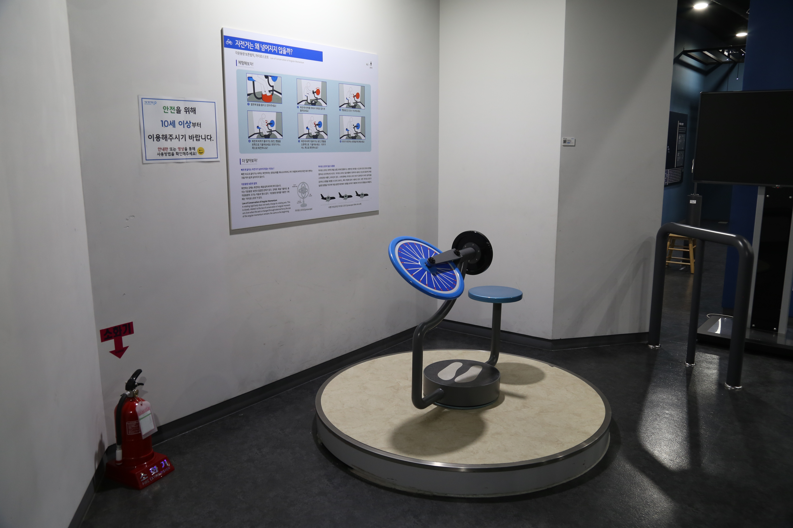

---
문서양식: 전시물
전시물 타입: 관람형, 패널
전시실: B전시실
---
#자이로스코프

  <button class="nav-btn" onclick="goHome()">🏠 홈</button>
  <button class="nav-btn" onclick="goHall('blue')">🔵 Blue 전시실 개요</button>
  <button class="nav-btn" onclick="goBack()">⬅ 이전 페이지</button>

# 자전거는 왜 넘어지지 않을까?

## 1. 전시물 기본 내용
### 1.1 전시물 이미지

  
전시 목적

  

    도로 위에 설치된 속도 측정 장치의 종류(고정형, 이동형)를 알아보고, 속도 측정 원리를 이해한다. 이동형 카메라에서 속도를 측정하는 스피드 건으로 사용하여 다른 체험자의 속도를 직접 측정해본다.
    </ul>
  

### 1.2 학교 교육과정  
| 학년       | 단원  | 해당 교과 챕터 | 비고  |
| -------- | --- | -------- | --- |
| 초등 1~2학년 |     |          |     |
| 초등 3~4학년 |     |          |     |
| 초등 5~6학년 |     |          |     |
| 중학교      |     |          |     |
| 고등학교(공통) |     |          |     |
| 고등학교(선택) |     |          |     |

### 1.3 체험
##### 체험1) 회전하는 바퀴 기울이기
1. 의자에 앉아 발판에 발을 올린다.
2. 바퀴를 힘차게 당겨 회전시킨다.
3. 잠시 후 핸들을 왼쪽 또는 오른쪽으로 기울여본다
4. 핸들이 기우는 방향에 따라 의자가 회전하는 방향이 달라지는 것을 확인한다.
5. 바퀴를 반대 방향으로 회전시켜서도 체험해본다.

### 1.4 패널내용

  

    자전거는 왜 넘어지지 않을까?
  

  

    
  

## 2. 기본 과학 이론
### 2.1 핵심 과학이론
- 

### 2.2 연관 과학이론

## 3. 연관 전시물
- 

## 4. 기존 해설에서의 쓰임 예시
*아래는 해당 전시물 부분만 기재되어있습니다. 해설 전문은 '업무메신저 잔디>드라이브'내의 해설서들을 참고하세요!*

>[!note]+ 전관해설) 과학관 맛보기 해설
> 	위치
> 	잔디 드라이브 > 자료실 > 1.해설시나리오_모음zip > 전시실 전관해설 > 과학관 맛보기 해설(체험형).hwp
> 	작성자 : 김지혜(2023년 9월 작성)
> > [!note]- 해설 내용
> > (전략)
> >  비행기가 하늘을 날 때 비행기만 다니는 길이 있다는 거 아시나요? 비행기가 다니는 길을 항공로라고 합니다. 그런데 항공로는 일직선이 아닙니다. 비행기도 자동차처럼 길을 따라 방향을 바꾸기도 하는데요, 자동차가 방향을 바꿀 때에는 핸들을 돌립니다. 핸들을 돌리면 자동차의 앞바퀴가 원하는 방향으로 돌아가면서 방향을 바꿔주게 되는데요, 비행기는 어떨까요? 사실 하늘에서 바퀴는 필요하지 않습니다.
> >  여러분이 직접 여기 간이 비행기 조종석에 앉아서 방향을 바꿔보는 체험을 해보도록 해 볼 텐데요. 발판에 발을 얹고, 바퀴가 이렇게 세로로 똑바로 서게 한 후 세게 돌려줍니다. 그리고 친구는 핸들을 옆으로 살짝만 꺾어볼까요? 지금 보면 의자가 옆으로 돌아가는데요. 반대편으로 핸들을 살짝 꺾어보면 어떻게 될까요? 반대로 돌아갑니다.
> >  모든 물체는 자신의 상태를 유지하고 싶어 하는데, 그것을 관성이라고 합니다. 핸들을 돌려 바퀴가 움직이는 상태에 변화를 주니까 그걸 만회하기 위해 의자가 반대로 돌아가는 것입니다. 이렇게 회전하는 물체가 관성을 유지하는 것을 각운동량 보존법칙이라고 이야기 합니다. 이렇게 비행기는 자동차와는 조금 달리 자이로스코프를 이용해서 방향을 바꾸고 있습니다.
> >  (후략)

>[!note]+ 전관해설
> 	위치
> 	잔디 드라이브 > 자료실 > 1.해설시나리오_모음zip > 단체프로그램 해설 시나리오 > 하반기_(중고등)단체프로그램 전시 해설.hwp
> 	작성자 : 김수민, 엄정용, 홍진주(2023년 8월 작성)
> > [!note]- 해설 내용
> > (전략)
> >  마지막으로 우리는 우주 망원경이나 인공위성에 확인할 수 있는 원리를 알아보겠습니다. 우선 지구에서 망원경으로 관측을 하면 대기와 먼지 등으로 선명하게 볼 수 없습니다. 그럼 어디서 봐야 할까요? 네, 우주에서 관측하면 보다 선명하게 볼 수 있겠죠? 그래서 천문학자들은 우주망원경을 보내서 우주에서 관측하곤 하는데요. 망원경을 우리가 원하는 정확한 위치에 있어야 관측을 잘 할 수 있는데, 정확히 안착하기 위해서 꼭 필요한 원리가 있습니다. 한 번 알아볼까요?
> >  
> >  직접 우주로 날아가서 그 원리를 알아보면 좋겠지만, 그럴 수 없기 때문에 우리는 자전거로 대신 알아보겠습니다. 혹시 선생님이나 반장이 체험해볼까요?
> >  
> >  의자에 앉아서 제가 바퀴를 돌려보겠습니다. 이렇게 회전운동을 하는 물체에는 각운동량이 발생하는데요. 이 각운동량도 보존이 됩니다. 한번 확인해 볼까요? 선생님은 핸들을 돌려주세요. 핸들을 돌리면 앉아 있던 의자도 돌아갑니다.
> >  
> >  돌아가는 바퀴에 각운동량이 발생했는데, 핸들을 돌려 각운동량의 방향에 변화가 생겼습니다. 각운동량은 보존되기 때문에 운동량이 변한만큼 앉아 있는 의자 자체가 돌아가면서 각운동량을 보존시키는 것입니다. 
> >  
> >  이런 각운동량 보존을 우주선에 적용시켰습니다. (영상)우주선이 정확한 위치에 안착하기 위해서 조그마한 원판을 설치합니다. 이 원판을 돌려 각운동량을 만들어 선체 자체가 돌아가게끔 만든 것입니다.
> >  
> >  그런데 우주선이 얼마나 기울었는지, 얼마나 움직였는지 알아야 원판을 회전시켜 정확한 위치를 잡을 수 있겠죠? 이렇게 기준이 되는 장치를 자이로스코프라고 부릅니다. (보여주며) 이렇게 팽이처럼 생긴 것이 바로 자이로스코프인데, 안쪽 회전판이 돌아가면 그 축이 변하지 않으려고 합니다. 이 장치가 센서 형태로 들어가 있어 우주선이나 비행기가 얼마나 기울었는지 확인할 수 있습니다.
> >  
> >  이런 각운동량을 확인할 수 있는 사례는 뭐가 있을까요? (사진)드라마나 영화를 보면 헬리콥터 프로펠러가 몇 개 있던가요? 2개 있습니다. 프로펠러가 하나만 있으면 회전운동을 할 때, 각운동량을 보존하기 위해서 본체가 프로펠러 반대로 회전하게 됩니다. 이 본체의 회전을 막기 위해서 꼬리날개나 보조날개를 회전시켜 반대 방향으로 돌 수 있는 각운동을 만들어 안전하게 운행하는 것입니다. (영상)혹시 전쟁영화에서 헬리콥터 꼬리날개가 격추당했을 때 어떻게 떨어지는지 기억나나요? 맞습니다. 빙글빙글 돌면서 떨어지죠. 이 각운동량 보존 때문입니다. 우리가 쉽게 타고 다니는 자전거의 원리가 우주선에도 적용이 되고 있었네요!
> >  (후략)

>[!note]+ 전관해설
> 	위치
> 	잔디 드라이브 > 자료실 > 1.해설시나리오_모음zip > 단체프로그램 해설 시나리오 > 상반기_(중고등)단체프로그램 전시 해설.hwp
> 	작성자 : 김수민, 엄정용, 홍진주(2023년 1월 작성)
> > [!note]- 해설 내용
> > (전략)
> > 우리는 망원경을 살펴봤습니다. 그런데 망원경을 지구에서 보면 대기가 있기 때문에 선명하게 보는 것을 방해합니다. 그래서 천문학자들은 우주망원경을 보내서 우주에서 관측하곤 하는데요. 망원경을 우리가 원하는 정확한 위치에 있어야 관측을 잘 할 수 있는데, 정확히 안착하기 위해서 꼭 필요한 원리가 있습니다. 한 번 알아볼까요?
> > 
> > 직접 우주로 날아가서 그 원리를 알아보면 좋겠지만, 그럴 수 없기 때문에 우리는 자전거로 대신 알아보겠습니다. 혹시 선생님이나 반장이 체험해볼까요?
> > 
> > 돌아가는 바퀴에 각운동량이 발생했는데, 핸들을 돌려 각운동량의 방향에 변화가 생겼습니다. 각운동량은 보존되어야 하기 때문에 운동량이 변한만큼 앉아 있는 의자 자체가 돌아가면서 각운동량을 보존시키는 것입니다. 
> > 
> > 이런 각운동량 보존을 우주선에 적용시켰습니다. (영상)우주선이 정확한 위치에 안착하기 위해서 조그마한 원판을 설치합니다. 이 원판을 돌려 각운동량을 만들어 선체 자체가 돌아가게끔 만든 것입니다.
> > 
> > 그런데 우주선이 얼마나 기울었는지, 얼마나 움직였는지 알아야 원판을 회전시켜 정확한 위치를 잡을 수 있겠죠? 혹시 두발자전거를 엄청나게 잘 타는 친구 있을까요? 그렇다면 왜 바퀴가 앞, 뒤로 두 개밖에 없는데 넘어지지 않을까요? 물론 균형을 잘 잡는 것도 있겠지만, 여기에도 각운동량 보존 법칙이 적용됩니다.
> > 
> > 회전하는 바퀴에 각운동량이 생겼고, 각운동량 보존 법칙에 의해 회전축 방향이 바뀌지 않고 유지하려는 현상에 의해 자전거가 옆으로 넘어지지 않고 달릴 수 있는 것입니다.
> > 
> > 이런 각운동량 보존 법칙을 이용한 장치가 있는데요. 바로 자이로스코프입니다. (보여주며) 이렇게 팽이처럼 생긴 것이 바로 자이로스코프인데, 안쪽 회전판이 돌아가면 그 축이 변하지 않으려고 합니다. 이 장치가 기준이 되어 우주선이나 비행기가 얼마나 기울었는지 확인할 수 있습니다. 
> > 
> > 이런 각운동량을 확인할 수 있는 사례는 뭐가 있을까요? (사진)드라마나 영화를 보면 헬리콥터 프로펠러가 몇 개 있던가요? 2개 있습니다. 프로펠러가 하나만 있으면 회전운동을 할 때, 각운동량을 보존하기 위해서 본체가 프로펠러 반대로 회전하게 됩니다. 이 본체의 회전을 막기 위해서 꼬리날개나 보조날개를 회전시켜 반대 방향으로 돌 수 있는 각운동을 만들어 안전하게 운행하는 것입니다. (영상)혹시 전쟁영화에서 헬리콥터 꼬리날개가 격추당했을 때 어떻게 떨어지는지 기억나나요? 맞습니다. 빙글빙글 돌면서 떨어지죠. 이 각운동량 보존 때문입니다. 
> > 
> > 조금 전까지 설명했던 것은 회전하는 물체 회전축의 변화에 따른 보존이었다면, 회전속도에 대한 각운동량 보존 법칙도 있습니다. 혹시 피겨스케이팅 하면 누가 떠오르나요? (영상)김연아 선수가 빙판 위에서 양팔을 벌리고 빙글빙글 돌다가 팔을 오므리면 회전속도가 어떻게 되나요? 더 빨라지죠! 중심으로부터 길이가 길어지면 속도는 줄어들고, 길이가 짧아지면 회전 속도가 빨라집니다. 이 또한 각운동량 보존입니다.
> >  (후략)

>[!note]+ (한여름밤의 과학관 특별해설) 여름 피서편(시립이의 그림일기)
> 	위치 
> 	잔디 드라이브 > 자료실 > 1.해설시나리오_모음zip > 주제해설 > 주제해설_박은선_여름 피서편.hwp
> 	작성자 : 박은선(2022년 6월 작성)
> > [!note]- 해설 내용
> > (전략)
> >  먼저, 이 전시물로 시립이가 탄 비행기가 어떻게 호주에 도착했는지 알아볼 텐데요, 비행기가 하늘을 날 때 비행기만 다니는 길이 있다는 거 아시나요? 비행기가 다니는 길을 항공로라고 합니다. 그런데 항공로는 일직선이 아닙니다. 비행기도 자동차처럼 길을 따라 방향을 바꾸기도 합니다.
> >  
> >  자, 여기서 전시물을 체험할 기회를 얻을 수 있는 퀴즈! 자동차는 방향을 어떻게 바꿀까요?
> >  맞아요. 핸들을 돌립니다. 핸들을 돌리면 자동차의 앞바퀴가 원하는 방향으로 돌아가면서 방향을 바꿔줘요.
> >  그럼 비행기는 어떨까요? 사실 하늘에서 바퀴는 별 쓸모없죠.
> >  이제 정답을 맞힌 친구가 여기 간이 비행기 조종석에 앉아서 방향을 바꿔볼 거예요. (관람객을 전시물에 앉힌다.)
> >  발판에 발을 얹고, 바퀴가 이렇게 세로로 똑바로 서게 한 후 세게 돌려줍니다. 그리고 친구는 핸들을 옆으로 살짝만 꺾어볼까요?
> >  지금 보면 의자가 옆으로 돌아가죠? 반대편으로 핸들을 살짝 꺾어보면 어떻게 될까요? 반대로 돌아갑니다.
> >  신기하죠? 모든 물체는 자신의 상태를 유지하고 싶어 하는데 그걸 바로 관성이라고 합니다. 핸들을 돌려 바퀴가 움직이는 상태에 변화를 주니까 그걸 만회하기 위해 의자가 반대로 돌아가는 것입니다. 이렇게 회전하는 물체가 관성을 유지하는 것을 각운동량 보존법칙이라는 아주 어려운 말로 표현합니다.
> >  비행기는 자동차와는 조금 달리 자이로스코프를 이용해서 방향을 바꾸고 있어요.
> >  
> >  자, 이렇게 기장님이 각운동량 보존법칙을 이용해 조종한 비행기를 타고 도착한 호주에서 시립이는 뭘 했을까요?
> >  이렇게 커다란 배를 탔다고 합니다. 그런데 멀미로 아주 고생을 했다고 하네요. 우리도 배를 타러 가볼까요?
> >  
> >  (이동하며) (30초)
> >  혹시 멀미하는 분이 계시나요? 멀미가 나면 어떻게 하나요?
> >  맞아요, 멀미약도 먹고, 시립이 아빠의 말처럼 멀리 보기도 하고, 그냥 자기도 하고.
> >  여러 가지 방법들이 있긴 하죠.
> >  (후략)

>[!note]+ (주제해설) 물리하고 놀자
> 	위치 
> 	잔디 드라이브 > 자료실 > 1.해설시나리오_모음zip > 주제해설 > 주제해설_김형준_물리하고 놀자.hwp
> 	작성자 : 김형준(2019년 4월 작성)
> > [!note]- 해설 내용
> > (전략)
> >  여러분이 계신 이곳 B전시실은 연결을 주제로 하고 있는 전시실인데요. 생각해보면 보면 우리가 살고 있는 이 세상에는 무언가와 무언가가 연결된 경우가 꽤 많습니다. 아주 작은 원자 하나가 다른 원자와 연결되어 더 큰 물질, 더 큰 물체를 만들기도 하고요. 세포가 연결되어 사람과 동물의 몸이 되기도 하죠. 뉴턴이 말한 작용과 반작용마저도, 원인과 결과라는 사실로 연결되어 있습니다.
> >  세상을 구성하는 물질 그리고 그 물질을 지배하는 물리 법칙 모두 연결되어있다는 얘기를 드렸는데요. 지금부터 물체의 움직임에서 나타나는 원인과 결과를 살펴보겠습니다. 앞에 보이는 전시물에는 아무 관련 없어 보이는 3개의 회전축이 있습니다. 그런데요. 이 바퀴를 회전시킨 다음에는 아주 신기한 일이 일어납니다. 자동차 운전할 때 핸들을 오른쪽으로 꺾으면 오른쪽으로 돌지요? 여기에서도 그런 일이 일어납니다. 왼쪽으로도 꺾어볼까요?
> >  신기한 현상으로 보이는데요. 뉴턴이 말한 작용-반작용 법칙으로 설명할 수 있습니다. 손바닥 한번 이렇게 해주시겠어요? 제가 선생님 손을 이렇게 밀면, 선생님의 손도 제 손을 밀게 되는데요. 이게 바로 제 힘으로 일으킨 작용 그리고 그 힘에 반대방향으로 선생님이 일으킨 반작용입니다. 작용과 반작용은 원인과 결과로 동시에 일어나고 짝꿍처럼 쌍으로 나타납니다. 곧게 서서 회전하고 있는 바퀴를 의자에 앉은 사람이 힘을 줘서 이렇게 기울어지게 만들면, 이 힘에 대한 반작용이 의자를 회전시키게 됩니다. 이런 장치는 우주에 떠 있는 인공위성이나 우주선의 자세를 제어할 때도 사용됩니다. 이 기계를 사용한다면 아무것도 없는 우주 공간에서 위-아래, 오른쪽-왼쪽, 시계-시계반대 방향으로 우주선을 회전시킬 수 있습니다.
> >  이 신기한 장치를 자이로-스코프라고 부르는데요. 비슷한 이름을 가지고 있는 장치로는 마이크로-스코프, 텔레-스코프가 있습니다. 한국 말로하면 망원경, 현미경인데요. 망원경과 현미경은 멀리 있는 것과 가까이에 있는 무언가를 더 크게 관찰하기 위해서 사용하는 장치이잖아요?
> >  그러면 자이로-스코프는 어떤 것을 관찰할 때 사용할까요? 그건 바로 물체의 회전입니다. 사용하는 방법을 조금만 바꾸면 손끝에서 내가 앉아있는 의자가 얼마나 빠르게 회전하는지 느낄 수 있습니다(원심력 때문에 등 쪽으로 쏠리는 힘을 말하는 게 아니에요). 아까처럼 회전하는 바퀴를 다시 한 번 기울여 보면 의자가 회전하게 되는데요. 이 상태에서 의자 바깥에 있는 사람이 의자를 좀 더 빠르게 돌려주면, 의자에 앉아 있는 사람은 바퀴가 기울어 있는 상태를 유지하기 위해서 더 강력하게 손잡이를 비트는 힘을 주어야 합니다. 이렇게 손에 걸리는 힘을 파악한다면, 바깥 풍경이 안 보이는 상황에서도 의자가 얼마나 빠르게 회전하는지 알 수 있습니다. 제 말이 잘 이해가지 않는다고요? 직접 나와서 체험해보세요!
> >  회전하는 이 의자에 앉아있으면 뭔가 묘한 기분이 드는데요. 뭔가 익숙하지 않은 움직임을 느끼고 있어서 그런 것 같아요. 우리 몸은 알게 모르게 외부 환경을 감지하고 있어요. 눈을 감고 있어도 내가 제대로 서있는지 기울어있는지 알 수 있는데요. 사람의 이런 뛰어난 감각 때문에 가끔은 불편하기도 합니다. 버스를 탈 때, 배를 탈 때, 비행기를 탈 때 사람들이 힘들어하기도 하는데요. 어떤 게 사람들을 힘들게 할까요? 네 맞아요, 멀미죠. 어떤 환경에서 우리 몸이 어지러움을 느낄지 확인해 보러 갈게요. 따라와 주세요.
> >  (후략)

>[!note]+ (주제해설) 뛰뛰빵빵 교통수단
> 	위치 
> 	잔디 드라이브 > 자료실 > 1.해설시나리오_모음zip > 주제해설 > 주제해설_박윤실_ 뛰뛰빵빵 교통수단.hwp
> 	작성자 : 박윤실(2019년 3월 작성)
> > [!note]- 해설 내용
> > (전략)
> >  지구상에서 에너지효율이 좋은 교통수단은 무엇일까요? 자전거입니다. 여러분, 자전거 잘 타나요? 처음 자전거를 배울 땐 어려우셨을 거예요. 나는 왜 안 되는거야! 눈물도 찔끔 흐르고요.
> >  넘어지지 않고 잘 타는 방법! 있다! 없다? 이 전시물로 한 번 확인해볼게요.
> >  물체가 자신의 운동 상태를 유지하려는 운동 관성을 운동량이라고 부릅니다. 지금 바퀴가 뱅글뱅글 돌아가고 있죠? 회전운동에서는 여기 보이는 회전축을 유지하려는 모습을 보이게 됩니다. 뱅글뱅글 회전하는 이 운동 상태를 유지하려는 상태. 각 운동량입니다. 운동량의 가장 큰 특징은 바로! 운동량이 크면 클수록 변화하는 것을 싫어합니다.
> >  회전체가 많이많이 빠르게 돌면 이 상태를 계속 유지하려는 모습을 보여요. 자전거 페달을 밟으면 바퀴가 점점 빨라지죠? 그러면서 바퀴의 각 운동량이 커지게 됩니다. 즉 바퀴의 회전축 변화가 어렵다는 것을 의미합니다. 회전축의 변화가 어려워진 각운동량은 자전거가 옆으로 넘어지지 않도록 도와줍니다. 사람들이 균형을 잡게 해주는 것입니다.
> >  그렇기 때문에 여러분들이 두 발 자전거를 탈 때 페달을 힘차게 돌려주는 일을 먼저 해야 해요.
> >  내가 넘어지려고 한다? 넘어지는 방향의 반대 방향으로 핸들을 꺾으면 쉽게 넘어져버려요. 쓰러지는 방향으로 핸들을 꺾으면 원심력에 의해 자전거 본체는 반대로 기울어져 균형을 잡을 수 있습니다.
> >  (후략)

## 5. 확장 자료

### 심화 이론

### 최신 연구

## 변경기록
| 변경일        | 작성자 | 내용 및 사유 |
| ---------- | --- | ------- |
| 2026.01.22 | 박은선 | 최초 작성   |
|            |     |         |

  <button class="nav-btn" onclick="goHome()">🏠 홈</button>
  <button class="nav-btn" onclick="goHall('blue')">🔵 Blue 전시실 개요</button>
  <button class="nav-btn" onclick="goBack()">⬅ 이전 페이지</button>

