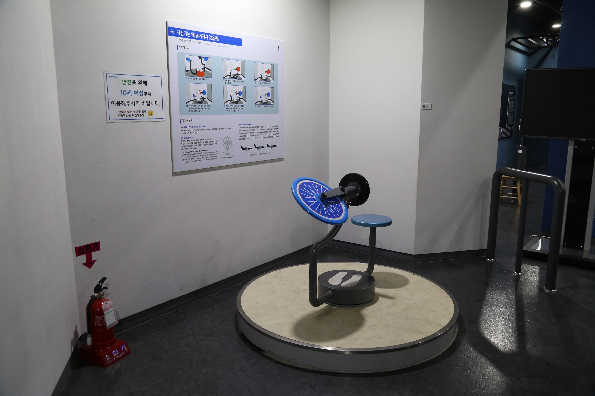

---
문서양식: 전시물
전시물 타입: 관람형, 패널
전시실: B전시실
---
#자이로스코프

  <button class="nav-btn" onclick="goHome()">🏠 홈</button>
  <button class="nav-btn" onclick="goHall('blue')">🔵 Blue 전시실 개요</button>
  <button class="nav-btn" onclick="goBack()">⬅ 이전 페이지</button>

# 자전거는 왜 넘어지지 않을까?

## 1. 전시물 기본 내용
### 1.1 전시물 이미지

  
전시 목적

  

    도로 위에 설치된 속도 측정 장치의 종류(고정형, 이동형)를 알아보고, 속도 측정 원리를 이해한다. 이동형 카메라에서 속도를 측정하는 스피드 건으로 사용하여 다른 체험자의 속도를 직접 측정해본다.
    </ul>
  

<table>
  <caption><b>학교 교육과정</b></caption>
  <thead>
    <tr>
      <th>학년</th>
      <th>단원</th>
      <th>해당 교과 챕터</th>
      <th>비고</th>
    </tr>
  </thead>
  <tbody>
    <tr>
      <td>초등 1~2학년</td>
      <td></td>
      <td></td>
      <td></td>
    </tr>
    <tr>
      <td>초등 3~4학년</td>
      <td></td>
      <td></td>
      <td></td>
    </tr>
    <tr>
      <td>초등 5~6학년</td>
      <td></td>
      <td></td>
      <td></td>
    </tr>
    <tr>
      <td>중학교</td>
      <td></td>
      <td></td>
      <td></td>
    </tr>
    <tr>
      <td>고등학교(공통)</td>
      <td></td>
      <td></td>
      <td></td>
    </tr>
    <tr>
      <td>고등학교(선택)</td>
      <td></td>
      <td></td>
      <td></td>
    </tr>
  </tbody>
</table>

### 1.3 체험
##### 체험1) 회전하는 바퀴 기울이기
1. 의자에 앉아 발판에 발을 올린다.
2. 바퀴를 힘차게 당겨 회전시킨다.
3. 잠시 후 핸들을 왼쪽 또는 오른쪽으로 기울여본다
4. 핸들이 기우는 방향에 따라 의자가 회전하는 방향이 달라지는 것을 확인한다.
5. 바퀴를 반대 방향으로 회전시켜서도 체험해본다.

### 1.4 패널내용

  

    자전거는 왜 넘어지지 않을까?
  

  

    
  

## 2. 기본 과학 이론
### 2.1 핵심 과학이론
- 

### 2.2 연관 과학이론

## 3. 연관 전시물
- 

## 4. 기존 해설에서의 쓰임 예시

*아래는 해당 전시물 부분만 기재되어있습니다. 해설 전문은 '업무메신저 잔디>드라이브'내의 해설서들을 참고하세요!*

## 5. 확장 자료

### 심화 이론

### 최신 연구

## 변경기록
| 변경일        | 작성자 | 내용 및 사유 |
| ---------- | --- | ------- |
| 2026.01.22 | 박은선 | 최초 작성   |
|            |     |         |

  <button class="nav-btn" onclick="goHome()">🏠 홈</button>
  <button class="nav-btn" onclick="goHall('blue')">🔵 Blue 전시실 개요</button>
  <button class="nav-btn" onclick="goBack()">⬅ 이전 페이지</button>

