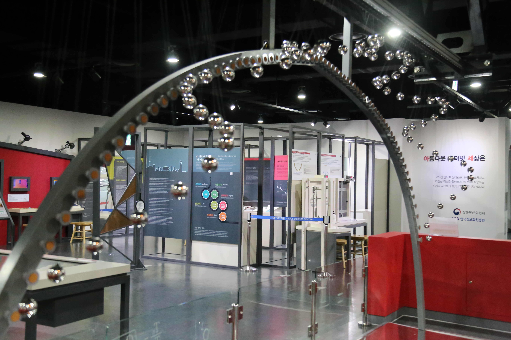

  <button class="nav-btn" onclick="goHome()">🏠 홈</button>
  <button class="nav-btn" onclick="goHall('blue')">🔵 Blue 전시실 개요</button>
  <button class="nav-btn" onclick="goBack()">⬅ 이전 페이지</button>

# B21 진자가 왜 뱀처럼 춤출까?

## 1. 전시물 기본 내용
### 1.1 전시물 이미지

  
전시 목적

  

    길이가 다른 진자의 운동으로 연출되는 뱀이 기어가는 듯한 모습을 확인해보고 진자의 길이에 따라 주기가 달라짐을 탐구한다.
  

  
전시 유형 : 관람형

  

    서로 다른 길이의 진자를 동시에 작동시켜 길이에 따른 단진자 주기 차이를 비교해보는 전시물
  

### 1.2 학교 교육과정  
<!--
curriculum-table은 전시물과 연결된 학교 교육과정을 학년별로 비교하는 표이다.
내용체계 칸에는 정적 웹에 포함된 내부 교육과정 문서 링크를 넣는다.
챕터 및 단원명 칸에는 외부 교과서/교과 챕터 링크를 넣는다.
전시물과 연계성 칸에는 전시물에서 어떤 개념과 연결되는지 적는다.
비고 칸에는 학년별 수준 변화, 해설 시 유의점, 확인이 필요한 내용을 적는다.
-->

<table class="curriculum-table">
  <caption><b>학교 교육과정</b></caption>
  <thead>
    <tr>
      <td>
        <a class="curriculum-link-button" href="#/docs/school_curriculum/science/common/00_common_science_mid">
        중학교 1~3학년 &gt; 운동과 에너지
        </a>
      </td>
      <td>중3</td>
      <td>(교과서 링크 없음)</td>
      <td>물체의 운동에서 역학적 에너지의 전환과 보존을 학습</td>
      <td></td>
    </tr>
    <tr>
      <td>
        <a class="curriculum-link-button" href="#/docs/school_curriculum/science/07_mechanics_and_energy">
        역학과 에너지 &gt; 시공간과 운동
        </a>
      </td>
      <td></td>
      <td></td>
      <td>길이 차이가 만드는 움직이는 뱀 활동 과정에서 힘과 운동의 관계 및 에너지의 전달과 전환을 실제 현상에 적용해 이해함</td>
      <td></td>
    </tr>
    <tr>
      <td>
        <a class="curriculum-link-button" href="#/docs/school_curriculum/science/07_mechanics_and_energy">
        역학과 에너지 &gt; 탄성파와 소리
        </a>
      </td>
      <td></td>
      <td></td>
      <td>길이 차이가 만드는 움직이는 뱀 활동 과정에서 진동과 파동이 발생하고 전달되는 특성을 관찰하고 이해함</td>
      <td></td>
    </tr>
    <tr>
      <td>
        <a class="curriculum-link-button" href="#/docs/school_curriculum/math/03_algebra">
        대수 &gt; 삼각함수
        </a>
      </td>
      <td></td>
      <td></td>
      <td>길이 차이가 만드는 움직이는 뱀 활동 과정에서 수량 사이의 관계와 공간적 규칙을 찾아 수학적으로 표현하고 해석함</td>
      <td></td>
    </tr>
    <tr>
      <td>
        <a class="curriculum-link-button" href="#/docs/school_curriculum/science/03_physics">
        물리학 &gt; 힘과 에너지
        </a>
      </td>
      <td>고등2~3학년</td>
      <td><a class="curriculum-link-button external" href="https://ibook.vivasam.com/CBS_iBook/6655/contents/index.html?skin=basic01" target="_blank" rel="noopener">
              I-2-01 역학적 에너지 보존 (22개정 비상교과서 물리학 pp 46-50)</a></td>
      <td>역학적 에너지(위치에너지와 운동에너지의 총 합)가 보존됨을 학습</td>
      <td></td>
    </tr>
  </tbody>
</table>

### 1.3 체험
##### 체험1) 길이 차이가 만드는 움직이는 뱀
1. 램프의 빨간불이 켜져 있거나, 깜빡이면 잠시 기다린다.
2. 손잡이를 아래로 내려 진자를 시작 위치에 정렬시킨다.
3. 손잡이를 위로 움직여 진자를 작동시킨다.
4. 진자의 움직임을 관찰한다.

### 1.4 패널내용

  

    진자가 왜 뱀처럼 춤출까?
  

  

    
  

## 2. 기본 과학 이론
### 2.1 핵심 과학이론

- 

### 2.2 연관 과학이론

## 3. 연관 전시물
- 

## 4. 기존 해설에서의 쓰임 예시

## 5. 확장 자료

### 심화 이론

### 최신 연구

## 변경기록
| 변경일        | 작성자 | 내용 및 사유 |
| ---------- | --- | ------- |
| 2026.01.22 | 박은선 | 최초 작성   |
|            |     |         |

  <button class="nav-btn" onclick="goHome()">🏠 홈</button>
  <button class="nav-btn" onclick="goHall('blue')">🔵 Blue 전시실 개요</button>
  <button class="nav-btn" onclick="goBack()">⬅ 이전 페이지</button>

