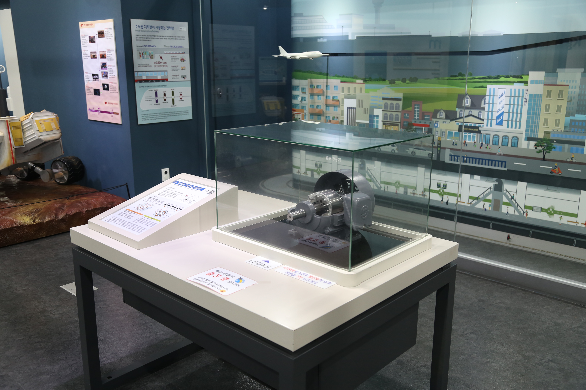

---
문서양식: 전시물
전시물 타입: 관람형, 패널
전시실: B전시실
---
#교통 #지하철 #전동기

  <button class="nav-btn" onclick="goHome()">🏠 홈</button>
  <button class="nav-btn" onclick="goHall('blue')">🔵 Blue 전시실 개요</button>
  <button class="nav-btn" onclick="goBack()">⬅ 이전 페이지</button>

# 지하철은 어떻게 움직일까?

## 1. 전시물 기본 내용
### 1.1 전시물 이미지

  
전시 목적

  

    많은 서울 사람들이 이용하는 운송수단인 지하철의 동력 전달 과정을 유도 전동기 작동으로 알아본다. 전류가 흐르면 자기장이 발생하여 전동기를 회전시키고, 이 힘이 차륜에 전달되어 지하철이 추진력을 얻는 원리를 이해한다.
    </ul>
  

### 1.2 학교 교육과정  
| 학년       | 단원  | 해당 교과 챕터 | 비고  |
| -------- | --- | -------- | --- |
| 초등 1~2학년 |     |          |     |
| 초등 3~4학년 |     |          |     |
| 초등 5~6학년 |     |          |     |
| 중학교      |     |          |     |
| 고등학교(공통) |     |          |     |
| 고등학교(선택) |     |          |     |

### 1.3 체험
##### 체험1) 전동기의 동력 전달과정 이해하기
1. 지하철을 움직이는 유도전동기의 구조를 살펴본다.
2. 시작 버튼을 누른다
3. 유도전동기 앞의 LED의 깜빡임에 맞춰 시작 버튼을 5회 누른다.
4. 유도전동기의 회전자가 회전할 때 도시 배경 그래픽 아래에 위치한 지하철 모형이 어떻게 되는지 확인한다.

### 1.4 패널내용

  

    지하철은 어떻게 움직일까?
  

  

    
  

  

    수도권 지하철이 사용하는 전력량
  

  

    
  

## 2. 기본 과학 이론
### 2.1 핵심 과학이론
- 

### 2.2 연관 과학이론

## 3. 연관 전시물
- 

## 4. 기존 해설에서의 쓰임 예시
*아래는 해당 전시물 부분만 기재되어있습니다. 해설 전문은 '업무메신저 잔디>드라이브'내의 해설서들을 참고하세요!*
>[!note]+ (주제해설) 뛰뛰빵빵 교통수단
> 	위치 
> 	잔디 드라이브 > 자료실 > 1.해설시나리오_모음zip > 주제해설 > 주제해설_박윤실_ 뛰뛰빵빵 교통수단.hwp
> 	작성자 : 박윤실(2019년 3월 작성)
> > [!note]- 해설 내용
> > (전략)
> >  자 이번엔 지하철은 ‘전동기’ 라고 불리는데요. 말 그대로 전기를 이용해서 달리는 열차입니다. 가끔 오랫동안 지하철을 타다보면 전등이 꺼지고, 냉난방기가 꺼지는 일이 발생합니다.
> >  이 때, 전동기에 공급되는 전기가 있다? 없다!?
> >  정답은 전기가 공급되지 않는 상태입니다. 지하철 위를 보면 전기를 공급하는 전선이 설치되어 있습니다. ‘판타그라프’라고 하는데 그곳을 통해 전기를 공급받고 있습니다.
> >  이 때 사용 되는 전기는 두 가지입니다. 직류와 교류입니다. 직류는 전기가 한 방향으로 흐르는 전기에요. 건전지를 생각하면 좋습니다. 여러분들의 이해를 돕기 위해 전동기 하나를 보여줄게요. (호모폴라 전동기 보여주기) 반면 교류는 전기가 시간에 따라 일정한 주기를 가지고 크기와 방향을 바꾸며 흐릅니다. 지금 보고 계신 전동기가 바로 교류전동기에요.
> >  노원역이 속해있는 4호선 타보셨나요? 당고개부터 남태령까진 쭉 직류전기를 먹고 달리지만 선바위부터 교류전기로 바뀌게 됩니다.
> >  때문에 이 구간에서는 전기가 흐르지 않고 차 내 객실등과 냉난방기가 꺼집니다. 열차는 그동안 달리던 관성으로 달리게 됩니다.
> >  이 구간을 전기가 죽었다. 해서 사구간, 데드섹션이라고 불렀지만 ‘죽음’이라는 언어가 들어가는 것이 좋지 않아 지금은 절연구간이라고 부르고 있습니다.  
> >  (후략)

>[!note]+ (주제해설) 운 나쁜 과학자
> 	위치
> 	잔디 드라이브 > 자료실 > 1.해설시나리오_모음zip > 주제해설 > 주제해설_유보람_운 나쁜 과학자.hwp
> 	작성자 : 유보람(2019년 3월 작성)
> > [!note]- 해설 내용
> > (전략)
> >   자 이번엔 Blue 전시실로 이동하면서 두 번째 운 나쁜 과학자에 대해 이야기 해보겠습니다. 오늘 과학관에 오면서 뭐 타고 오셨나요? 네 자가용이 많군요~ 평소 대중교통은 많이 이용하시나요? 네 아주 편리한 이동 수단이죠!　특히나 지하철은 버스보다 훨씬 빠르고 많은 사람이 탑승할 수 있는 교통수단이죠. 이 ‘지하철’은 어떤 에너지로 움직이고 있을까요? 네 전기입니다. 지하철을 바깥에서 보면 천장 위에 전선이 연결되어있는 것을 확인할 수 있는데요. 우리나라 지하철은 직류와 교류 모두 사용하고 있습니다. 직류는 높은 전위에서 낮은 전위로 전류가 연속적으로 흐르는 것을 말하고 교류는 시간에 따라 주기와 방향이 끊임없이 바뀌는 전류를 말하는데요. 여기 전시물에는 지하철의 동력 전달 과정을 유도 전동기 작동으로 알아볼 수 있습니다. 전류가 흐르면 자기장이 발생하여 전동기를 회전시키고, 이 힘이 바퀴에 전달되어 지하철이 추진력을 얻는 원리이죠.
> >   이 직류와 교류에 관련된 과학자에 대한 이야기를 함께 해볼 텐데요. ‘전기’하면 떠오르는 과학자. 누가 있을까요? 네 에디슨을 많이 이야기하실 텐데요. 오늘 우리가 함께 이야기할 과학자는 바로 에디슨의 영원한 라이벌 ‘니콜라 테슬라’입니다. 
> >   테슬라는 다섯 살 때부터 발명을 시작하고 8개 국어를 구사할 만큼 타고난 천재였습니다. 그 당시에 전기회사를 세워 전 세계적으로 명성을 떨치던 천재 발명가 ‘토머스 에디슨’이 있었는데요, 1882년 에디슨 회사의 조그만 자회사인 전화회사 파리지사에 테슬라가 입사합니다. 그런데 테슬라가 워낙에 뛰어난 천재이다 보니 두각을 나타냈고 에디슨이 본사로 불러 자신의 조수로 일하게 합니다. 그런데 이제 여기서 에디슨과 테슬라 사이의 큰 문제가 생기게 됩니다. 약간 이건 주관적인 판단이긴 하지만 에디슨이 테슬라의 재능을 약간은 질투하지 않았나 생각되는데요 왜냐하면 테슬라가 그 당시에 에디슨 조수로 있으면서 굉장히 많은 연구를 합니다. 그 중 단연 뛰어난 업적을 이야기하자면 바로 교류 송배전(AC) 시스템을 개척한 부분인데요. 에디슨은 직류 송배전(DC) 시스템을 개척한 과학자였죠. 
> >   바로 여기서 <전류전쟁>이라 불린 두 천재 과학자의 싸움이 시작됩니다. 에디슨은 거대 기업을 세워 이미 직류시스템에 막대한 투자를 한 상태였는데 테슬라가 만들어낸 교류시스템이 안정성과 효율성 모두 좋았고, 그리고 경제적이기까지 해서 미국 전기시장을 장악하기 시작했습니다. 하지만 테슬라의 교류시스템에도 결정적인 문제가 있었는데 교류에 맞는 전동기가 없었던 것이죠. 그 상황에서 테슬라는 정말 획기적으로 고압의 교류 전력 전환 장치를 고안해 냅니다. 이렇게 테슬라의 등장으로 직류에 막대한 자산을 쏟아부었던 에디슨 제국이 흔들리기 시작하죠. 이 때 테슬라는 에디슨에게 “직류보다는 교류가 더 안전하고 적합한 송전방식입니다”라고 말했지만, 에디슨은 질투심에 사로잡혀 테슬라의 손을 뿌리치게 됩니다. 그러면서 온갖 치졸한 방법으로 테슬라를 괴롭히는데 테슬라는 또 그런 것을 다 해냅니다. 테슬라에게 절대 못 할 거라 생각 하면서 “새로운 직류발전기를 개발하면 5만 달러를 성과급으로 지급하겠다”라고 했었는데 테슬라가 막상 또 개발해오니 “미국식 조크였다!”라면서 프로젝트의 대가로 약속한 5만 달러 대신 달랑 월급 10달러를 인상해줬습니다. 이제 속이 많이 상한 테슬라가 에디슨 회사를 퇴사 하고 교류 회사를 세우게 됩니다. 이제부터 본격적인 AC테슬라 vs DC에디슨 세기의 전쟁이 시작됩니다. 
> >   에디슨은 교류 말살 정책을 펼칩니다. 교류로 코끼리를 감전사 시키는 실험 같은 교류 전기의 위험성을 과장한 실험을 하고 고압 교류 전선에 감전된 사람들의 명단까지 제작하여 교류의 위험성을 경고하는 악성 가짜 뉴스를 터뜨리는 등 온갖 치졸한 방법을 동원해 테슬라를 공격했습니다. 급기야 시카고 전기 클럽은 직류냐 교류냐 토론회를 열게 되는데 에디슨은 전문가를 모두 매수하여 과학자들은 에디슨의 직류 세스템의 손을 들어주게 됩니다. 그런데 여기서 예기치 못한 반전이 일어나죠. 프랑스 기업이 구리시장을 장악하면서 구리 값이 3배나 폭등하게 됩니다. 굵은 구리선을 사용하는 직류 시스템이 직격탄을 맞게 된거죠. 가는 구리선을 사용하는 교류 시스템은 유리한 상황이 됩니다. 이 때 테슬라는 ‘전기의 아버지’라 불리며 승기를 거머쥐게 됐죠(일명 떡상..ㅎ). 궁지에 몰린 에디슨이 결정적인 한 방을 노리는데 교류 전기를 이용한 새로운 사형집행 기구를 제작하여 사형수를 교류 전기의자에서 죽이는 것을 보여줍니다. 사람 죽이는 전류라는 오명을 뒤집어 쓸 위기에 놓인 테슬라의 교류였지만 사형이 집행되는 날 교류 전기의자로는 연기만 솟아오를 뿐 사형수는 죽지 않았죠. 무려 72초 동안 1,000V 전류를 흘려보냈지만 사형수는 죽지 않았던 것입니다. 그래서 결국 에디슨의 노력에도 불구하고 사형집행은 실패로 끝나게 되면서 테슬라는 전기시장에서 유리한 위치를 차지하게 됩니다. 그런데 여기서 잠깐. 물론 여러 전해져오는 이야기는 양쪽 모두 편파적인 이야기가 많고 걸러 들어야 하는 부분도 있습니다. 하지만 에디슨은 일평생 천재 발명가이자 냉철한 사업가로 부와 명성을 누리다가 생을 마감하지만, 테슬라는 발명밖에 모르는 바보로 살면서 짝을 이루지도 못하고 연구만 하다가 인류의 더 나은 삶을 위해 교류시스템 특허권마저 포기해버리고 평생을 가난한 괴짜 과학자로 쓸쓸히 생을 마감한 이야기만 놓고 보면 불운했다 이야기 할 수 있지 않을까요? 물론 에디슨과 테슬라 모두 훌륭한 발명가이자 과학자였던 것임에는 틀림 없지만 말이죠!
> >  (후략)

>[!note]+ (주제해설) 시간여행자
> 	위치 
> 	잔디 드라이브 > 자료실 > 1.해설시나리오_모음zip > 주제해설 > 주제해설_김형준_시간여행자(날자미정.hwp
> 	작성자 : 김형준
> > [!note]- 해설 내용
> > (전략)
> >  전동기 안쪽에는 코일이라고 하는 누런 금속선이 있는데요. 원래 이 코일은 여러 개의 뭉치로 되어있어요. 하지만, 앞에 전시되어있는 전동기는 내부가 잘 보이라고 코일의 절반을 잘라놓은 상태에요. 대신에 패널에 있는 그림을 보면 원래는 코일이 6개 뭉치로 되어 있었다는 것을 확인할 수 있습니다. 전동기에 전기가 공급되면 각각의 코일에는 일정한 규칙으로 전류가 흘러서 자석이 회전하는 듯 한 효과가 생기는데요.  그 결과 안쪽에 있는 쇳덩이가 회전하게 되는 거예요 이번에는 전동기가 움직이는 모습 보여 드릴게요.
> >  네, 뒤쪽에 전철도 같이 움직이고 있는데요. 서울시민의 발 전철에도 전동기가 사용되고 있습니다. 서울에서 전철을 이용하기 위해서는 보통 이런 플라스틱 카드를 사용해야 하는데요(지하철 전용, 티머니 카드 사진 보여주기). 이 카드에는 배터리가 있는 것도 아닌데 어떻게 작동하는 걸까요? 잠시 후에 힌트 드릴게요.
> >  (후략)
## 5. 확장 자료

### 심화 이론

### 최신 연구

## 변경기록
| 변경일        | 작성자 | 내용 및 사유 |
| ---------- | --- | ------- |
| 2026.01.22 | 박은선 | 최초 작성   |
|            |     |         |

  <button class="nav-btn" onclick="goHome()">🏠 홈</button>
  <button class="nav-btn" onclick="goHall('blue')">🔵 Blue 전시실 개요</button>
  <button class="nav-btn" onclick="goBack()">⬅ 이전 페이지</button>

