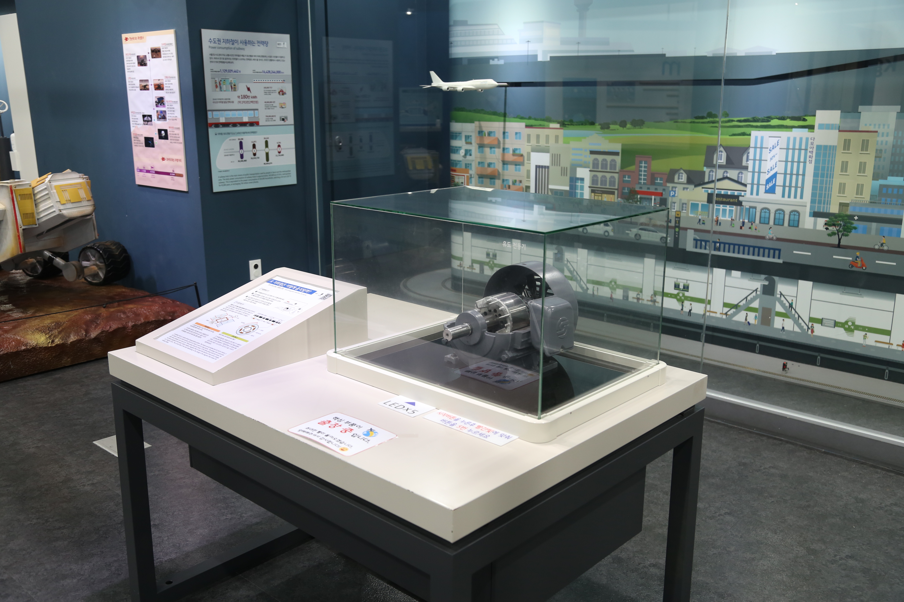

  <button class="nav-btn" onclick="goHome()">🏠 홈</button>
  <button class="nav-btn" onclick="goHall('blue')">🔵 Blue 전시실 개요</button>
  <button class="nav-btn" onclick="goBack()">⬅ 이전 페이지</button>

# B22 지하철은 어떻게 움직일까?

## 1. 전시물 기본 내용
### 1.1 전시물 이미지

  
전시 목적

  

    많은 서울 사람들이 이용하는 운송수단인 지하철의 동력 전달 과정을 유도 전동기 작동으로 알아본다. 전류가 흐르면 자기장이 발생하여 전동기를 회전시키고, 이 힘이 차륜에 전달되어 지하철이 추진력을 얻는 원리를 이해한다.
  

  
전시 유형 : 체험형

  

    전동기 모형과 그것을 작동시키는 버튼으로 구성된 전시물
  

### 1.2 학교 교육과정  
<!--
curriculum-table은 전시물과 연결된 학교 교육과정을 학년별로 비교하는 표이다.
내용체계 칸에는 정적 웹에 포함된 내부 교육과정 문서 링크를 넣는다.
챕터 및 단원명 칸에는 외부 교과서/교과 챕터 링크를 넣는다.
전시물과 연계성 칸에는 전시물에서 어떤 개념과 연결되는지 적는다.
비고 칸에는 학년별 수준 변화, 해설 시 유의점, 확인이 필요한 내용을 적는다.
-->

<table class="curriculum-table">
  <caption><b>학교 교육과정</b></caption>
  <thead>
    <tr>
      <th rowspan="2">교육과정 내용체계</th>
      <th colspan="2">해당 교과과정(교과서)</th>
      <th rowspan="2">전시물과 연계성</th>
      <th rowspan="2">비고</th>
    </tr>
    <tr>
      <th>학년 및 학기</th>
      <th>챕터 및 단원명</th>
    </tr>
  </thead>
  <tfoot>
    <tr>
      <td colspan="5">
        <ul>
          <li>교과챕터 및 단원명은 출판사의 교과서 pdf링크로 연결됩니다.</li>
          <li>고등2~3학년 과정은 선택교과입니다.</li>
        </ul>
      </td>
    </tr>
  </tfoot>
  <tbody>
    <tr>
          <td>
            <a class="curriculum-link-button" href="#/docs/school_curriculum/science/common/00_common_science_mid">
              중학교 1~3학년 &gt; 전기와 자기
            </a>
          </td>
          <td>중등2학년</td>
          <td><a class="curriculum-link-button external" href="https://ibook.vivasam.com/CBS_iBook/10777/contents/index.html?skin=basic01" target="_blank" rel="noopener">
              VII-3 전류의 자기작용 (22개정 비상교과서 중등2 pp 251-260)</a></td>
          <td>전류와 자기장, 힘 사이의 관계에 대해 학습</td>
          <td></td>
        </tr>
    <tr>
          <td>
            <a class="curriculum-link-button" href="#/docs/school_curriculum/science/03_physics">
            물리학 &gt; 전기와 자기
            </a>
          </td>
          <td>고등2~3학년</td>
          <td><a class="curriculum-link-button external" href="https://ibook.vivasam.com/CBS_iBook/6655/contents/index.html?skin=basic01" target="_blank" rel="noopener">
                  II-2-02 전류의 자기작용 (22개정 비상교과서 물리학 pp 98-103)</a></td>
          <td>전자기유도에 대해 학습</td>
          <td></td>
        </tr>
<tr>
  <td>
    <a class="curriculum-link-button" href="#/docs/school_curriculum/science/08_electromagnetism_and_quantum">
    전자기와 양자 &gt; 전자기적 상호작용
    </a>
  </td>
  <td>고등2~3학년</td>
  <td><a class="curriculum-link-button external" href="https://ibook.vivasam.com/CBS_iBook/6671/contents/index.html?skin=basic01" target="_blank" rel="noopener">
      I-03 전류에 의한 자기장 (22개정 비상교과서 전자기와 양자 pp 20-23)</a></td>
  <td>직선 및 원형 전선에서 형성되는 자기장에 대해 학습</td>
  <td></td>
</tr>
<tr>
  <td>
    <a class="curriculum-link-button" href="#/docs/school_curriculum/science/15_history_and_culture_of_science">
    과학의 역사와 문화
    </a>
  </td>
  <td>고등2~3학년</td>
  <td><a class="curriculum-link-button external" href="https://ibook.vivasam.com/CBS_iBook/6657/contents/index.html?skin=basic01" target="_blank" rel="noopener">
      II-01 현대과학과 사회문화 (22개정 비상교과서 과학의 역사와 문화 pp 72-)</a></td>
  <td>페러데이의 전자기유도에 대한 내용이 있음</td>
  <td></td>
</tr>
<tr>
  <td>
    <a class="curriculum-link-button" href="#/docs/school_curriculum/science/15_history_and_culture_of_science">
    과학의 역사와 문화
    </a>
  </td>
  <td>고등2~3학년</td>
  <td><a class="curriculum-link-button external" href="https://ibook.vivasam.com/CBS_iBook/6657/contents/index.html?skin=basic01" target="_blank" rel="noopener">
      II-05 교통수단의 발달과 사회 (22개정 비상교과서 과학의 역사와 문화 pp 122-133)</a></td>
  <td>자전거, 자동차, 지하철, 비행기 등 교통수단의 발전에 대한 내용이 있음</td>
  <td></td>
</tr>
  </tbody>
</table>

### 1.3 체험
##### 체험1) 전동기 동력 전달과정 이해하기
1. 지하철을 움직이는 유도전동기의 구조를 살펴본다.
2. 시작 버튼을 누른다
3. 유도전동기 앞의 LED의 깜빡임에 맞춰 시작 버튼을 5회 누른다.
4. 유도전동기의 회전자가 회전할 때 도시 배경 그래픽 아래에 위치한 지하철 모형이 어떻게 되는지 확인한다.
5. 전동기의 동력 전달과정 이해하기

### 1.4 패널내용

  

    지하철은 어떻게 움직일까?
  

  

    
  

  

    수도권 지하철이 사용하는 전력량
  

  

    
  

## 2. 기본 과학 이론
### 2.1 핵심 과학이론

- 

### 2.2 연관 과학이론

## 3. 연관 전시물
- 

## 4. 기존 해설에서의 쓰임 예시

## 5. 확장 자료

### 심화 이론

### 최신 연구

## 변경기록
| 변경일        | 작성자 | 내용 및 사유 |
| ---------- | --- | ------- |
| 2026.01.22 | 박은선 | 최초 작성   |
|            |     |         |

  <button class="nav-btn" onclick="goHome()">🏠 홈</button>
  <button class="nav-btn" onclick="goHall('blue')">🔵 Blue 전시실 개요</button>
  <button class="nav-btn" onclick="goBack()">⬅ 이전 페이지</button>

