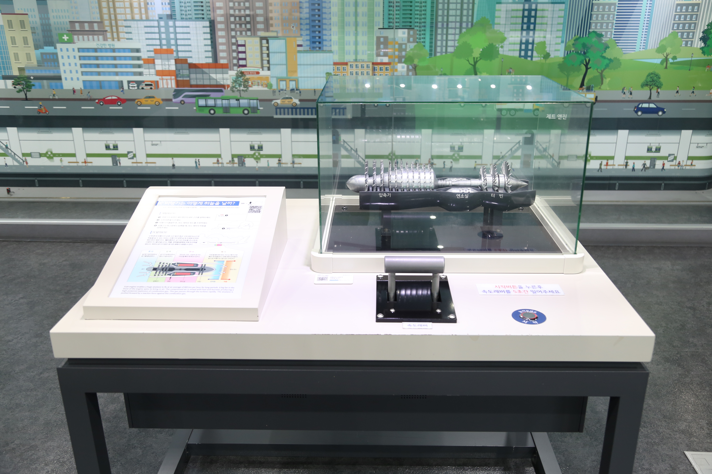

---
문서양식: 전시물
전시물 타입: 관람형, 패널
전시실: B전시실
---
#교통 #비행기 #제트엔진
# 비행기는 어떻게 하늘을 날까?

  <button class="nav-btn" onclick="goHome()">🏠 홈</button>
  <button class="nav-btn" onclick="goHall('blue')">🔵 Blue 전시실 개요</button>
  <button class="nav-btn" onclick="goBack()">⬅ 이전 페이지</button>

## 1. 전시물 기본 내용
### 1.1 전시물 이미지

  
전시 목적

  

    전 세계를 잇는 비행기를 날게 하는 동력 장치인 제트엔진의 구동 원리를 체험을 통해 알아본다. 흡입된 공기가 압축되어 분사되는 과정을 통해 작용반작용의 원리를 이해한다. 또한, 비행기가 날 때 작용하는 힘을 살펴본다.
    </ul>
  

### 1.2 학교 교육과정  
| 학년       | 단원  | 해당 교과 챕터 | 비고  |
| -------- | --- | -------- | --- |
| 초등 1~2학년 |     |          |     |
| 초등 3~4학년 |     |          |     |
| 초등 5~6학년 |     |          |     |
| 중학교      |     |          |     |
| 고등학교(공통) |     |          |     |
| 고등학교(선택) |     |          |     |

### 1.3 체험
##### 체험1) 제트엔진 전달과정 이해하고 제트엔진 작동하기
1. 비행기의 동력인 제트엔진의 내부 구조를 살펴본다.
2. 시작 버튼을 누른다.
3. 비행기가 출발한 후, 속도 레버로 속도를 조정한다.
4. 비행기가 최고점에 도달했을 때, 속도 레버의 작동을 멈춘다.

### 1.4 패널내용

  

    비행기는 어떻게 하늘을 날까?
  

  

    
  

  

    비행기에 작용하는 힘
  

  

    
  

## 2. 기본 과학 이론
### 2.1 핵심 과학이론
- 

### 2.2 연관 과학이론

## 3. 연관 전시물
- 

## 4. 기존 해설에서의 쓰임 예시
*아래는 해당 전시물 부분만 기재되어있습니다. 해설 전문은 '업무메신저 잔디>드라이브'내의 해설서들을 참고하세요!*

>[!note]+ (주제해설) 비행기의 모든 것
> 	위치
> 	잔디 드라이브 > 자료실 > 1.해설시나리오_모음zip > 주제해설 > 주제해설_윤민애_비행기의 모든 것.hwp
> 	작성자 : 윤민애(2019년 5월 작성)
> > [!note]- 해설 내용
> > (전략)
> >  먼저 비행기의 걸리는 힘, 네 가지를 알아보도록 하겠습니다. 첫 번째, 비행기 바로 아래를 향해 작용하는 힘, 무엇일까요? 네 바로 ‘중력’이 있습니다. 두 번째, 비행 방향에 대해 수직 방향으로 작용하여 비행기를 들어올리는 ‘양력’이 있고요, 세 번째, 비행기를 전진시키는 ‘추력’, 그리고 거기에 맞서 전진을 방해하는 ‘항력’이 있습니다. 이 힘들이 균형을 유지함으로써 비행이 제어됩니다. 그리고 ‘양력’은 날개에 의해 발생하며, ‘추력’은 엔진에 의해 발생합니다.
> >  먼저, 비행기 ‘날개’에 의해 발생하는 ‘양력’에 대하여 조금 더 알아보도록 하겠습니다. 비행기는 아무리 작은 것이라고 해도 새보다 훨씬 무겁습니다. 이렇게 무거운 비행기가 어떻게 하늘을 자유롭게 날 수 있을까요? 그 힘의 비밀은 바로 공기에 있습니다.
> >  땅에 서 있던 비행기가 빠른 속도로 앞으로 나아가게 되면 비행기 앞에 있던 공기들이 비행기의 아래쪽으로 밀려나게 됩니다. 이때 비행기 날개의 윗면과 아랫면에는 서로 다른 압력이 작용하게 됩니다.
> >  ![[비행기의 모든 것 해설 참고 이미지1.png]]
> >  이 그림을 보시면 비행기의 날개가 어떻게 생겼는지 알 수 있는데요. 비행기 날개는 윗면에서는 공기의 흐름이 빠르고, 아랫면에서는 공기의 흐름이 느리도록 만들어져 있습니다. 날개의 윗면에서는 공기가 빠르게 흐르게 되면 공기의 압력이 낮아지게 됩니다. 이 압력을 ‘부압’이라고 합니다. 반대로, 날개 아랫면에서는 공기가 느리게 흐르기 때문에 공기의 압력보다 높은 압력이 작용하게 됩니다. 이 압력을 ‘정압’이라고 합니다. 이 압력의 차이로 인해 정압에서 부압으로 공기가 이동하면서 비행기를 위로 떠미는 힘이 생겨나고, 이 힘을 ‘양력’이라고 합니다.
> >  그래서 양력은 비행기 날개의 모양에 따라 차이가 납니다. 오늘날 비행기에 달린 날개를 살펴보면 대부분 윗면은 약간 볼록하게 솟아 있고 아랫면은 거의 평평합니다. 비행기 날개가 이와 같은 모양일 때 양력이 더욱 커져서 비행기가 위로 뜨기 더 쉽기 때문입니다.
> >  ![[비행기의 모든 것 해설 참고 이미지2.png]]
> >  그리고 비행기의 날개의 면적이 넓을수록 양력이 커집니다. 이륙할 때 활주로의 길이나 안전상의 이유 등으로 비행기의 속도에는 한계가 있습니다. 그래서 주날개의 면적을 가능한 넓게 할 필요가 있습니다. 이때 주날개의 뒷부분에 있는 ‘플랩’을 활용합니다. 플랩을 내려 주날개의 면적을 넓게 함으로써 양력을 크게 만듭니다. 플랩에서 날개의 뒤쪽 끝을 아래로 구부려 공기의 흐름을 아래쪽으로 바꿈으로써 양력을 증가시키는 작용도 합니다.
> >  하지만 이 힘만으로는 비행기가 떠오를 수 없습니다. 상승하기 위해서는 비행기의 머리를 들어 올려야 하는데요, 그래서 등장하는 것이 ‘승강키’입니다. 승강키는 수평 꼬리 날개의 뒷부분에 붙어있는 움직이는 날개입니다. 이것을 아래위로 움직임으로써 양력의 크기를 변화시킬 수 있습니다. 이륙할 때에는 승강키를 올림으로써 수평 꼬리 날개에 발생하는 아래 방향의 양력을 크게 합니다. 그러면 비행기 뒷부분이 아래로 눌려서 비행기의 앞부분이 올라가게 됩니다. 그러면 주 날개에 각도가 생겨 발생하는 양력이 커지게 되어 비행기가 떠오르게 됩니다.
> >  그리고 이 비행기의 모형을 보시면 날개 끝 부분이 살짝 꺾여있는 것을 보실 수 있는데요, 이는 날개 위아래에 발생하는 기압차 때문에 날개 끝에 날개 끝 와류가 발생하는데, 이것을 억제함으로써 항력 발생을 막는 역할을 합니다.
> >  비행기의 속도 또한, 양력에 큰 영향을 미칩니다. 비행기가 빠른 속도로 움직여야 양력이 충분히 생길 수 있기 때문입니다. 만약 하늘을 날던 비행기가 정해진 기준 이하로 속도를 줄이면 날개에 작용하던 양력이 사라져서 추락하고 말 것입니다.
> >  
> >  그럼 지금부터 비행기 속도에 영향을 주며, 비행기의 ‘추력’을 만들어주는 ‘엔진’에 대하여 알아보겠습니다. 비행기에서 사람의 심장과도 같은 장치가 바로 엔진입니다. 엔진은 비행기가 정상적으로 작동할 수 있는 힘을 만들어냅니다.
> >  엔진은 비행기가 공기가 희박한 곳을 날 때도 승객들이 숨을 쉴 수 있도록 공기를 공급합니다. 또한  비행기가 너무 덥거나 너무 추운 곳을 날 때도 실내가 적당한 온도가 되도록 합니다.
> >  엔진은 비행기에 전기도 공급해줍니다. 그 덕분에 비행기 조종실의 컴퓨터, 공항의 관제탑과 연락을 주고받는 무전기, 승객들에게 영화를 보여 주는 모니터가 작동합니다. 만약 이 전기가 없다면 기내식을 따뜻하게 데우지도 못해서 차가운 상태로 먹어야 할 것입니다.
> >  또한 비행기의 방향을 바꿀 때도, 비행기가 이륙하거나 착륙하기 위해 날개의 플랩을 펴고 접을 때도, 착륙한 비행기가 멈추기 위해 브레이크를 걸 때도 엔진이 내는 힘이 필요합니다. 
> >  특히, 엔진이 하는 가장 중요한 일은 비행기가 앞으로 가게 하는 힘, 즉 추력을 만들어 내는 것입니다. 엔진이 추력을 만드는 원리는 엔진의 종류에 따라 조금씩 다릅니다. 오늘날 여객기와 전투기에 가장 일반적으로 사용되고 있는 엔진인 ‘제트 엔진’에 대해 알아보겠습니다.
> >  제트 엔진의 맨 앞에는 팬이라는 장치가 있습니다. 언뜻 선풍기같이 보이기도 하는 이 팬은 한꺼번에 많은 공기를 엔진 속으로 빨아들이는 역할을 합니다.
> >  팬에 의해 제트 엔진 속으로 들어간 공기는 두 갈래로 나뉩니다. 안쪽으로 보내진 공기는 압축기로 들어갑니다. 압축기는 공기를 압축해 뜨겁게 만들고, 연소기로 보냅니다. 연소기에서는 뜨거워진 공기가 연속적으로 분사되는 안개처럼 된 연료와 섞여 더더욱 뜨겁게 연소됩니다. 연소 결과 생긴 고온, 고압의 공기는, 앞쪽의 압축기와 팬을 돌리기 위한 터빈을 돌리고, 제트 분류로 빠져나갑니다.
> >  바깥쪽으로 보내진 공기는 제트 엔진을 감싸듯이 흘러 뒤쪽으로 빠져나갑니다. 이 흐름을 ‘바이패스류’라고 부릅니다. 바이패스류가 많은 터보팬 엔진에서는 팬이 끌어들인 공기의 90% 가까이가 바이패스류이며, 이 공기의 흐름이 큰 추진력을 만듭니다. 그리고 바이패스류는 제트 분류를 덮어씌움으로써 제트 분류의 속도를 알맞게 만듭니다. 그 결과 제트 분류의 에너지를 남김없이 추진력으로 변환할 수 있습니다. 동시에 바이패스류는 제트 분류에 의한 소음을 막습니다. 그래서 터보팬 엔진은 연비가 좋을 뿐 아니라 소음이 적은 특징을 가집니다.
> >    
> >  지금까지 비행기 날개의 ‘양력’과 추진력을 만들어주는 ‘제트엔진’에 대하여 알아보았습니다. 비행기가 어떻게 하늘을 나는지 알아보았으니, 이제는 비행기가 다니는 길에 대하여 알아보도록 하겠습니다.
> >  (후략)

>[!note]+ (주제해설) 뛰뛰빵빵 교통수단
> 	위치 
> 	잔디 드라이브 > 자료실 > 1.해설시나리오_모음zip > 주제해설 > 주제해설_박윤실_ 뛰뛰빵빵 교통수단.hwp
> 	작성자 : 박윤실(2019년 3월 작성)
> > [!note]- 해설 내용
> > (전략)
> >  대중교통이란 정해진 노선과 시간계획에 따라 운행되며 정해진 요금을 지불하는 일반인이 이용하는 서비스입니다. 그렇기에 앞에 있는 이 비행기도 대중교통에 포함됩니다.
> >  비행기를 타면 인기가 많은 자리가 바로 창가 쪽 자리죠? 우리 창문을 보면서 들었던 궁금한 점 한 번 생각해 볼까요?
> >  1. 비행기 창문은 각이 졌다? 아니다?
> >  비행기의 차체의 모양을 잘 보면 각이 지지 않고 둥글둥글한 모습하고 있는 게 보일 거예요. 비행기는 앞으로 가는 힘인 추진력을 방해하는 항력을 줄여주기 위해 앞에 곡선이 진 유선형을 띄고 있답니다. 창문 모양도 마찬가지입니다. 사각형 모양이 아닌, 둥글둥글한 모양으로 되어 있습니다. 예쁘게 보이려고 둥글둥글한 것이 아닙니다. 기상 악화나 내ㆍ외부 기압 차가 커지면서 생기는 충격을 최소화하기 위한 장치입니다. 사각형 창은 구조상 압력이 형태의 끝부분인 꼭짓점에 몰리게 돼 있어 구조 자체가 불안정한 상태이기 때문에 그만큼 깨지기 쉬워요. 하지만 둥근 창은 모서리가 없어 압력이 분산돼 상대적으로 깨질 가능성이 작아지게 된답니다.
> >  2. 비행기 창문엔 구멍이 있다! 없다?
> >  비행기에 구멍? 상상도 못 하실 텐데요. 사실 작은 구멍이 아래에 뚫려있어요. 비행기의 창문은 유리가 아닌 강화아크릴 세 겹으로 되어 있습니다. 일단 유리보다 가볍고 유연성을 가지고 있어 온도나 기압 차를 잘 버티고 새들이 부딪히는 변수에도 잘 버틸 수 있어요. 이 구멍은 브리더 홀이라고 합니다. 최악의 사고 발생 시 바깥 창 하나만 깨질 수 있도록 해주고요, 온도 차에 의해 생기는 성에나 얼음 결정이 생기는 것을 막아주는 아주 중요한 구멍입니다.
> >  3. 비행기 창문 열수 있다! 없다?
> >  비행기의 창문은 열 수 없어요. 왜냐하면 상대적으로 기압이 높은 객실과 기압이 낮은 바깥 하늘의 기압 차 때문에 객실에 있는 물건들 그리고 사람들이 바깥으로 빨려 나갈 수 있기 때문입니다.
> >  4. 비행기는 우주까지 갈 수 있다! 없다?
> >  마지막 질문입니다. 비행기, 우주까지 갈 수 없어요. 왜냐하면 대기가 없기 때문입니다. 비행기의 날개에 대기가 부딪히고 양 갈래로 갈라집니다.
> >  날개의 볼록한 윗면과 편편한 아랫면에 흐르는 공기의 기압차로 인해 비행기는 중력을 이기고 위로 뜨는 양력이 발생합니다. 하지만 대기, 즉 공기가 없으면 힘들겠죠? 앞에 보이는 제트엔진도 공기를 빨아들여 연소와 동시에 다량의 가스를 분출하기 때문에 앞으로 가는 힘을 얻을 수 있어요. 비행기에게 공기란? 없으면 그냥 무거운 고철덩어리 일뿐이죠?
> >  
> >  (후략)

>[!note]+ (주제해설) 시간여행자
> 	위치 
> 	잔디 드라이브 > 자료실 > 1.해설시나리오_모음zip > 주제해설 > 주제해설_김형준_시간여행자(날자미정.hwp
> 	작성자 : 김형준
> > [!note]- 해설 내용
> > (전략)
> >  이제 이야기는 19세기 말로 접어듭니다. 막바지로 향하고 있네요. 아주 옛날, 신화 속 이카루스의 날개 이야기, 상상으로만 가능했던 비행은, 많은 이들의 연구와 노력 끝에 실현되기 시작했습니다.
> >  열기구를 만들어 최초로 하늘을 비행한 몽골피에 형제에게 자극을 받은 조지케일리, 1800년 대 초, 비행체에 작용하는 4가지 힘에 대한 이론을 발표합니다. 조지케일리 경의 공기역학 이론 덕분에 1800년대 말에는 항공기 실험이 활기를 띠게 됩니다.
> >  오토 릴리엔탈은 조지 케일리의 업적을 좇아 직접 글라이더를 타고 비행하는 데 성공하였습니다. 그럼, 릴리엔탈을 더 알아볼게요. 1896년 8월 9일 글라이더 비행 실험을 하던 도중 타고 있던 기체가 강풍을 만나 15m 상공에서 추락....... 목뼈가 부러져...............다음 날 생을.......... 정말 충격적인 사건이네요.......
> >  그런데 저만 이렇게 놀란 건 아닙니다. 라디오를 통해 이 소식을 들은 기계완구와 자전거점을 사장 형제 또한 놀라움과 충격을 받고 말았습니다. 그 유명한 라이트형제입니다.
> >  라이트 형제는 글라이더를 가지고 많은 시행착오 끝에 가솔린을 이용한 최초의 동력비행기, 플라이어 1호를 만들어 1903년 20세기 초반에 하늘을 오릅니다. 사람이 조종하는 동력비행기의 새 시대가 열린 것입니다.
> >  그 후, 세계적으로 많은 사람들은 비행기 개발에 박차를 가합니다. 
> >  _(프로펠러 비행기  VS 제트엔진 비행기 비교사진)_
> >  대기 중의 공기를 빨아들여 빠른 속도로 공기를 배출해 그 반작용으로 앞으로 가는 힘을 얻었던 추진 장치 프로펠러에서 좁은 구멍에서 고속으로 분출되는 상태를 뜻하는 ‘제트’ 단어를 합쳐 ‘제트엔진’을 만들어 우리는 더 빠르게 하늘을 날게 됩니다.
> >  항공기 발달에 비약적인 발전을 가져온 제트엔진, 등장한 지 80년이 되어가는 현재에도 제트엔진 정도의 혁신적인 발전을 가져올 새로운 고안은 아직 나타나지 않고 있습니다.
> >  (후략)
## 5. 확장 자료

### 심화 이론

### 최신 연구

## 변경기록
| 변경일        | 작성자 | 내용 및 사유 |
| ---------- | --- | ------- |
| 2026.01.22 | 박은선 | 최초 작성   |
|            |     |         |

  <button class="nav-btn" onclick="goHome()">🏠 홈</button>
  <button class="nav-btn" onclick="goHall('blue')">🔵 Blue 전시실 개요</button>
  <button class="nav-btn" onclick="goBack()">⬅ 이전 페이지</button>

