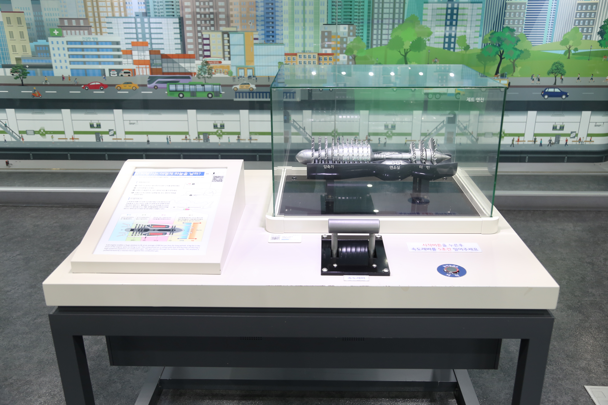

  <button class="nav-btn" onclick="goHome()">🏠 홈</button>
  <button class="nav-btn" onclick="goHall('blue')">🔵 Blue 전시실 개요</button>
  <button class="nav-btn" onclick="goBack()">⬅ 이전 페이지</button>

# B23 비행기는 어떻게 하늘을 날까?

## 1. 전시물 기본 내용
### 1.1 전시물 이미지

  
전시 목적

  

    전 세계를 잇는 비행기를 날게 하는 동력 장치인 제트엔진의 구동 원리를 체험을 통해 알아본다. 흡입된 공기가 압축되어 분사되는 과정을 통해 작용반작용의 원리를 이해한다. 또한, 비행기가 날 때 작용하는 힘을 살펴본다.
  

  
전시 유형 : 체험형

  

    비행기 제트엔진 모형과 그것을 작동신키는 레버로 구성된 전시물
  

### 1.2 학교 교육과정  
<!--
curriculum-table은 전시물과 연결된 학교 교육과정을 학년별로 비교하는 표이다.
내용체계 칸에는 정적 웹에 포함된 내부 교육과정 문서 링크를 넣는다.
챕터 및 단원명 칸에는 외부 교과서/교과 챕터 링크를 넣는다.
전시물과 연계성 칸에는 전시물에서 어떤 개념과 연결되는지 적는다.
비고 칸에는 학년별 수준 변화, 해설 시 유의점, 확인이 필요한 내용을 적는다.
-->

<table class="curriculum-table">
  <caption><b>학교 교육과정</b></caption>
  <thead>
    <tr>
      <th rowspan="2">교육과정 내용체계</th>
      <th colspan="2">해당 교과과정(교과서)</th>
      <th rowspan="2">전시물과 연계성</th>
      <th rowspan="2">비고</th>
    </tr>
    <tr>
      <th>학년 및 학기</th>
      <th>챕터 및 단원명</th>
    </tr>
  </thead>
  <tfoot>
    <tr>
      <td colspan="5">교과 챕터는 외부 사이트 링크를 통해 해당 단원을 확인한다.</td>
    </tr>
  </tfoot>
  <tbody>
    <tr>
      <td>
      </td>
      <td>1학년 1학기</td>
      <td>
        <a class="curriculum-link-button external" href="https://example.com" target="_blank" rel="noopener">
          교과 챕터 링크예시
        </a>
      </td>
      <td>연계성</td>
      <td>비고</td>
    </tr>
    <tr>
      <td>
        <a class="curriculum-link-button" href="#/docs/school_curriculum/science/common/00_common_science_elementry3-4">
          초등학교 3~4학년 &gt; 힘과 우리 생활
        </a>
      </td>
      <td></td>
      <td></td>
      <td></td>
      <td></td>
    </tr>
    <tr>
      <td>
        <a class="curriculum-link-button" href="#/docs/school_curriculum/science/common/00_common_science_elementry5-6">
          초등학교 5~6학년 &gt; 물체의 운동
        </a>
      </td>
      <td></td>
      <td></td>
      <td></td>
      <td></td>
    </tr>
    <tr>
      <td>
        <a class="curriculum-link-button" href="#/docs/school_curriculum/science/common/00_common_science_mid">
        중학교 1~3학년 &gt; 힘의 작용
        </a>
      </td>
      <td></td>
      <td></td>
      <td></td>
      <td></td>
    </tr>
    <tr>
      <td>
        <a class="curriculum-link-button" href="#/docs/school_curriculum/science/common/00_common_science_mid">
        중학교 1~3학년 &gt; 운동과 에너지
        </a>
      </td>
      <td></td>
      <td></td>
      <td></td>
      <td></td>
    </tr>
    <tr>
      <td>
        <a class="curriculum-link-button" href="#/docs/school_curriculum/science/01_integrated_science">
        통합과학1 &gt; 시스템과 상호작용
        </a>
      </td>
      <td></td>
      <td></td>
      <td></td>
      <td></td>
    </tr>
    <tr>
      <td>
        <a class="curriculum-link-button" href="#/docs/school_curriculum/science/02_science_inquiry_experiment">
        과학탐구실험2 &gt; 생활 속의 과학 탐구
        </a>
      </td>
      <td></td>
      <td></td>
      <td></td>
      <td></td>
    </tr>
    <tr>
      <td>
        <a class="curriculum-link-button" href="#/docs/school_curriculum/science/03_physics">
        물리학 &gt; 힘과 에너지
        </a>
      </td>
      <td></td>
      <td></td>
      <td></td>
      <td></td>
    </tr>
    <tr>
      <td>
        <a class="curriculum-link-button" href="#/docs/school_curriculum/science/07_mechanics_and_energy">
        역학과 에너지 &gt; 시공간과 운동
        </a>
      </td>
      <td></td>
      <td></td>
      <td></td>
      <td></td>
    </tr>
  </tbody>
</table>

### 1.3 체험
##### 체험1) 제트엔진 전달과정 이해하고 제트엔진 작동하기
1. 비행기의 동력인 제트엔진의 내부 구조를 살펴본다.
2. 시작 버튼을 누른다.
3. 비행기가 출발한 후, 속도 레버로 속도를 조정한다.
4. 비행기가 최고점에 도달했을 때, 속도 레버의 작동을 멈춘다.

### 1.4 패널내용

  

    비행기는 어떻게 하늘을 날까?
  

  

    
  

  

    비행기에 작용하는 힘
  

  

    
  

## 2. 기본 과학 이론
### 2.1 핵심 과학이론

- 

### 2.2 연관 과학이론

## 3. 연관 전시물
- 

## 4. 기존 해설에서의 쓰임 예시

## 5. 확장 자료

### 심화 이론

### 최신 연구

## 변경기록
| 변경일        | 작성자 | 내용 및 사유 |
| ---------- | --- | ------- |
| 2026.01.22 | 박은선 | 최초 작성   |
|            |     |         |

  <button class="nav-btn" onclick="goHome()">🏠 홈</button>
  <button class="nav-btn" onclick="goHall('blue')">🔵 Blue 전시실 개요</button>
  <button class="nav-btn" onclick="goBack()">⬅ 이전 페이지</button>

