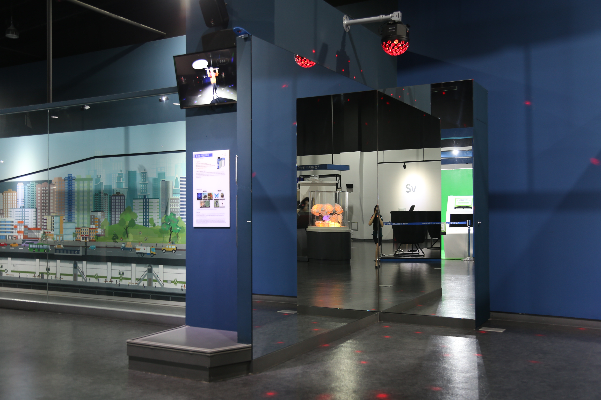

---
문서양식: 전시물
전시물 타입: 관람형, 패널
전시실: B전시실
---
#거울 #데칼코마니

  <button class="nav-btn" onclick="goHome()">🏠 홈</button>
  <button class="nav-btn" onclick="goHall('blue')">🔵 Blue 전시실 개요</button>
  <button class="nav-btn" onclick="goBack()">⬅ 이전 페이지</button>

# 춤추는 데칼코마니

## 1. 전시물 기본 내용
### 1.1 전시물 이미지

  
전시 목적

  

    몸의 절반이 대칭되어 보이는 거울을 통해 다양한 모습을 연출해보면서 반사의 원리에 대해 알아본다.
    </ul>
  

### 1.2 학교 교육과정  
| 학년       | 단원  | 해당 교과 챕터 | 비고  |
| -------- | --- | -------- | --- |
| 초등 1~2학년 |     |          |     |
| 초등 3~4학년 |     |          |     |
| 초등 5~6학년 |     |          |     |
| 중학교      |     |          |     |
| 고등학교(공통) |     |          |     |
| 고등학교(선택) |     |          |     |

### 1.3 체험
##### 체험1) 내 몸으로 데칼코마니 만들기
1. 영상을 보며, 내 동작을 생각한다.
2. 벽면 모서리가 코앞으로 오도록 체험대에 올라가 선다.
3. 손잡이를 잡고 반대쪽 손과 발을 움직이며 자신의 모습을 관찰한다.
   ※ 거울을 만지거나 발로 차서 파손하지 않게 주의한다.

### 1.4 패널내용

  

    춤추는 데칼코마니
  

  

    
  

## 2. 기본 과학 이론
### 2.1 핵심 과학이론
- 

### 2.2 연관 과학이론

## 3. 연관 전시물
- 

## 4. 기존 해설에서의 쓰임 예시
*아래는 해당 전시물 부분만 기재되어있습니다. 해설 전문은 '업무메신저 잔디>드라이브'내의 해설서들을 참고하세요!*
>[!note]+ 전관해설
> 	위치
> 	잔디 드라이브 > 자료실 > 1.해설시나리오_모음zip > 단체프로그램 해설 시나리오 > 상반기_(초등)단체프로그램 전시 해설.hwp
> 	작성자 : 권오혁, 유보람, 최선주(2023년 1월 작성)
> > [!note]- 해설 내용
> > (전략)
> > 바로, <춤추는 데칼코마니>라고 하는 대형 거울 전시물인데요. 아 참고로 거울은 춤추지 않아요. 춤은 우리가 추는 거예요. 
> > 
> > 거울은 입사각과 같은 크기의 반사각으로 빛을 반사하는 성질을 가지고 있습니다. 그래서 거울 앞에 정면으로 서면 나와 똑같이 생겼지만, 오른쪽과 왼쪽이 뒤바뀐 모습을 볼 수 있습니다. (패드 등, 활용 몇몇 친구들에게 거울에 비췄을 때 바로 보이게 본인의 이름을 적어달라고 한 뒤 확인해본다.)
> > 
> > 119구급차 앞의 표시는 앞차의 백미러(평면거울)로 보았을 때 똑바로 보여야 하므로 좌우가 바뀌어 쓰여 있는 것을 확인할 수 있습니다. 평면거울을 여러 개 두면 착시를 일으키기도 한답니다. 이를 이용한 놀이공원이나 전시회 같은 곳에 거울 미로를 만들어 둔 곳도 있답니다. 
> > 
> > 자, 이렇게 우리는 과학관의 전시물 탐구를 해 보았는데 어땠나요? 학교에서 배웠던, 또는 배울 교과과정에 맞춘 내용들이었다는 거 알아채셨나요? 이처럼 우리 일상 속 다양한 곳에 과학이 존재하고 그 모든 과학은 우리의 교과과정에서 시작한답니다. (다음 순서에 맞춰 마무리)

## 5. 확장 자료

### 심화 이론

### 최신 연구

## 변경기록
| 변경일        | 작성자 | 내용 및 사유 |
| ---------- | --- | ------- |
| 2026.01.22 | 박은선 | 최초 작성   |
|            |     |         |

  <button class="nav-btn" onclick="goHome()">🏠 홈</button>
  <button class="nav-btn" onclick="goHall('blue')">🔵 Blue 전시실 개요</button>
  <button class="nav-btn" onclick="goBack()">⬅ 이전 페이지</button>

