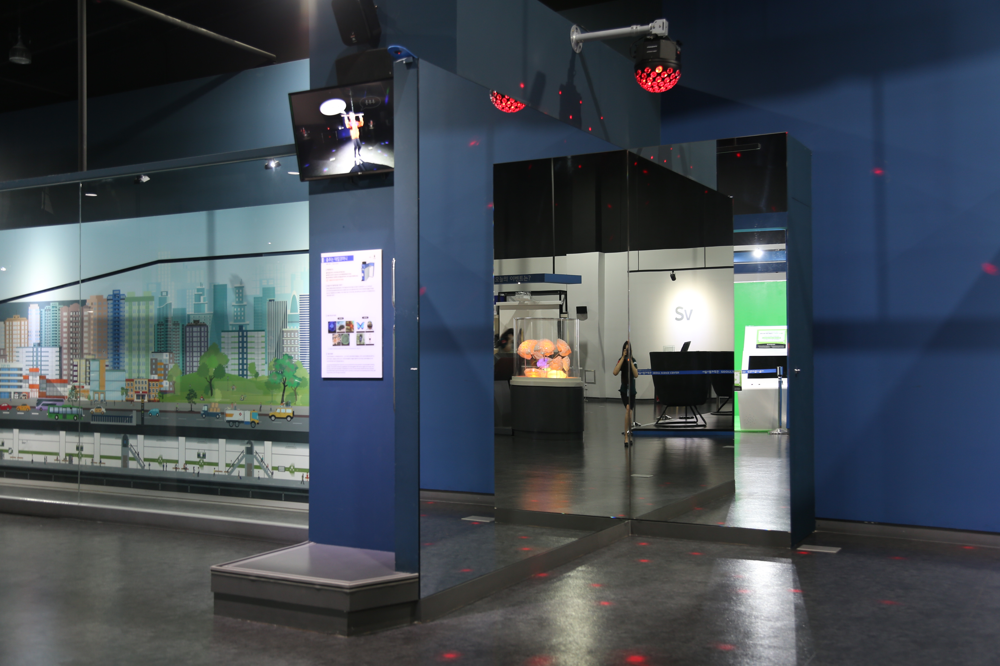

  <button class="nav-btn" onclick="goHome()">🏠 홈</button>
  <button class="nav-btn" onclick="goHall('blue')">🔵 Blue 전시실 개요</button>
  <button class="nav-btn" onclick="goBack()">⬅ 이전 페이지</button>

# B24 춤추는 데칼코마니

## 1. 전시물 기본 내용
### 1.1 전시물 이미지

  
전시 목적

  

    몸의 절반이 대칭되어 보이는 거울을 통해 다양한 모습을 연출해보면서 반사의 원리에 대해 알아본다.
  

  
전시 유형 : 체험형/실험탐구

  

    ㄱ자 거울로 구성되어 거울의 반사에 대해 실험해볼 수 있는 전시물
  

### 1.2 학교 교육과정  
<!--
curriculum-table은 전시물과 연결된 학교 교육과정을 학년별로 비교하는 표이다.
내용체계 칸에는 정적 웹에 포함된 내부 교육과정 문서 링크를 넣는다.
챕터 및 단원명 칸에는 외부 교과서/교과 챕터 링크를 넣는다.
전시물과 연계성 칸에는 전시물에서 어떤 개념과 연결되는지 적는다.
비고 칸에는 학년별 수준 변화, 해설 시 유의점, 확인이 필요한 내용을 적는다.
-->

<table class="curriculum-table">
  <caption><b>학교 교육과정</b></caption>
  <thead>
    <tr>
      <th rowspan="2">교육과정 내용체계</th>
      <th colspan="2">해당 교과과정(교과서)</th>
      <th rowspan="2">전시물과 연계성</th>
      <th rowspan="2">비고</th>
    </tr>
    <tr>
      <th>학년 및 학기</th>
      <th>챕터 및 단원명</th>
    </tr>
  </thead>
  <tfoot>
    <tr>
      <td colspan="5">
        <ul>
          <li>교과챕터 및 단원명은 출판사의 교과서 pdf링크로 연결됩니다.</li>
          <li>고등2~3학년 과정은 선택교과입니다.</li>
        </ul>
      </td>
    </tr>
  </tfoot>
  <tbody>
    <tr>
          <td>
            <a class="curriculum-link-button" href="#/docs/school_curriculum/science/common/00_common_science_elementry5-6">
              초등학교 5~6학년 &gt; 빛의 성질
            </a>
          </td>
          <td>초등5-1</td>
          <td><a class="curriculum-link-button external" href="https://wbook.jihak.co.kr/SynapDocViewServer/viewer/doc.html?key=9fddc34069f6464c88e119b0154ab910&convType=img&convLocale=ko_KR&contextPath=/SynapDocViewServer" target="_blank" rel="noopener">
              2. 빛의 성질 (22개정 지학사 과학 5-1 pp 44-55)</a></td>
          <td>거울로 빛의 반사를 체험</td>
          <td></td>
        </tr>
    <tr>
          <td>
            <a class="curriculum-link-button" href="#/docs/school_curriculum/science/common/00_common_science_mid">
            중학교 1~3학년 &gt; 빛과 파동
            </a>
          </td>
          <td>중등2학년</td>
          <td><a class="curriculum-link-button external" href="https://ibook.vivasam.com/CBS_iBook/10777/contents/index.html?skin=basic01" target="_blank" rel="noopener">
              III-1-01 물체를 보는 과정 (22개정 비상교과서 중등2 pp 92-95)</a></td>
          <td>빛의 반사와 굴절에 대해 다룸</td>
          <td></td>
        </tr>
    <tr>
          <td>
            <a class="curriculum-link-button" href="#/docs/school_curriculum/science/common/00_common_science_mid">
            중학교 1~3학년 &gt; 빛과 파동
            </a>
          </td>
          <td>중등2학년</td>
          <td><a class="curriculum-link-button external" href="https://ibook.vivasam.com/CBS_iBook/10777/contents/index.html?skin=basic01" target="_blank" rel="noopener">
              III-1-02 평면거울에서 상이 생기는 원리 (22개정 비상교과서 중등2 pp 96-97)</a></td>
          <td>전시물의 체험내용에 평면겨울이 있음</td>
          <td></td>
        </tr>
  </tbody>
</table>

### 1.3 체험
##### 체험1) 내 몸으로 데칼코마니 만들기
1. 영상을 보며, 내 동작을 생각한다.
2. 벽면 모서리가 코앞으로 오도록 체험대에 올라가 선다.
3. 손잡이를 잡고 반대쪽 손과 발을 움직이며 자신의 모습을 관찰한다.
4. ※거울을 만지거나 발로 차서 파손하지 않게 주의한다.

### 1.4 패널내용

  

    춤추는 데칼코마니
  

  

    
  

## 2. 기본 과학 이론
### 2.1 핵심 과학이론

- 

### 2.2 연관 과학이론

## 3. 연관 전시물
- 

## 4. 기존 해설에서의 쓰임 예시

## 5. 확장 자료

### 심화 이론

### 최신 연구

## 변경기록
| 변경일        | 작성자 | 내용 및 사유 |
| ---------- | --- | ------- |
| 2026.01.22 | 박은선 | 최초 작성   |
|            |     |         |

  <button class="nav-btn" onclick="goHome()">🏠 홈</button>
  <button class="nav-btn" onclick="goHall('blue')">🔵 Blue 전시실 개요</button>
  <button class="nav-btn" onclick="goBack()">⬅ 이전 페이지</button>

