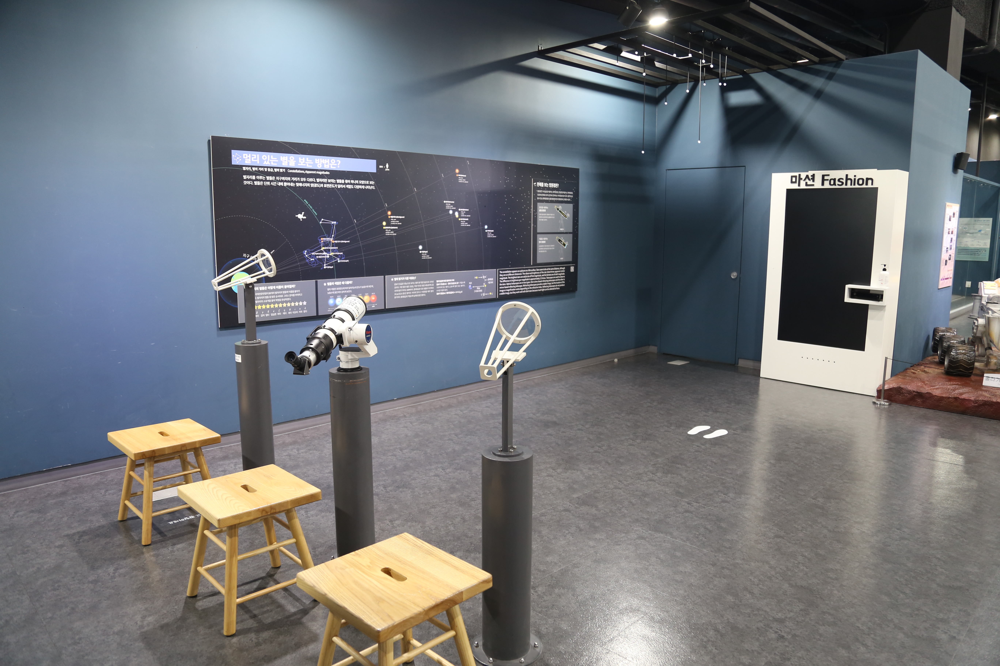

  <button class="nav-btn" onclick="goHome()">🏠 홈</button>
  <button class="nav-btn" onclick="goHall('blue')">🔵 Blue 전시실 개요</button>
  <button class="nav-btn" onclick="goBack()">⬅ 이전 페이지</button>

# B25 자극에 대한 반응은 어떻게 일어날까?

## 1. 전시물 기본 내용
### 1.1 전시물 이미지

  
전시 목적

  

    우리 몸에서 감각 기관이 인지한 자극이 말초신경계를 통해 중추신경계로 전해지고, 중추신경계는 자극을 판단하여 적절한 명령을 내리며, 다시 말초신경계를 통해 각 기관에 전달되어 반응이 나타나는 일련의 과정을 영상과 LED 램프의 흐름으로 확인한다. 이러한 명령체계가 뉴런과 시냅스의 작용으로 일어남을 살펴본다.
  

  
전시 유형 : 체험형

  

    세 가지 감각 버튼과 영상장치로 구성된 전시물
  

### 1.2 학교 교육과정  
<!--
curriculum-table은 전시물과 연결된 학교 교육과정을 학년별로 비교하는 표이다.
내용체계 칸에는 정적 웹에 포함된 내부 교육과정 문서 링크를 넣는다.
챕터 및 단원명 칸에는 외부 교과서/교과 챕터 링크를 넣는다.
전시물과 연계성 칸에는 전시물에서 어떤 개념과 연결되는지 적는다.
비고 칸에는 학년별 수준 변화, 해설 시 유의점, 확인이 필요한 내용을 적는다.
-->

<table class="curriculum-table">
  <caption><b>학교 교육과정</b></caption>
  <thead>
    <tr>
      <th rowspan="2">교육과정 내용체계</th>
      <th colspan="2">해당 교과과정(교과서)</th>
      <th rowspan="2">전시물과 연계성</th>
      <th rowspan="2">비고</th>
    </tr>
    <tr>
      <th>학년 및 학기</th>
      <th>챕터 및 단원명</th>
    </tr>
  </thead>
  <tfoot>
    <tr>
      <td colspan="5">
        <ul>
          <li>교과챕터 및 단원명은 출판사의 교과서 pdf링크로 연결됩니다.</li>
          <li>고등2~3학년 과정은 선택교과입니다.</li>
        </ul>
      </td>
    </tr>
  </tfoot>
  <tbody>
    <tr>
          <td>
            <a class="curriculum-link-button" href="#/docs/school_curriculum/science/common/00_common_science_mid">
              중학교 1~3학년 &gt; 자극과 반응
            </a>
          </td>
          <td>중3</td>
          <td>(교과서 링크 없음)</td>
          <td>감각기관의 구조와 기능, 그리고 뉴런과 신경계의 구조와 기능을 학습하고, 자극의 전달과정을 학습</td>
          <td></td>
        </tr>
    <tr>
          <td>
            <a class="curriculum-link-button" href="#/docs/school_curriculum/science/05_life_science">
            생명과학 &gt; 항상성과 몸의 조절
            </a>
          </td>
          <td>고등2~3학년</td>
          <td><a class="curriculum-link-button external" href="https://ibook.vivasam.com/CBS_iBook/6652/contents/index.html?skin=basic01" target="_blank" rel="noopener">
                  II-1-01 신경자극의 전도와 시냅스전달 (22개정 비상교과서 생명과학 pp 79-86)</a></td>
          <td>뉴런, 시냅스, 그리고 자극의 전달 과정에 대해 학습</td>
          <td></td>
        </tr>
    <tr>
          <td>
            <a class="curriculum-link-button" href="#/docs/school_curriculum/science/05_life_science">
            생명과학 &gt; 항상성과 몸의 조절
            </a>
          </td>
          <td>고등2~3학년</td>
          <td><a class="curriculum-link-button external" href="https://ibook.vivasam.com/CBS_iBook/6652/contents/index.html?skin=basic01" target="_blank" rel="noopener">
                  II-1-02 신경계의 구조와 기능 (22개정 비상교과서 생명과학 pp 79-86)</a></td>
          <td>말초신경계와 중추신경계등 신경계에 대해 학습</td>
          <td></td>
        </tr>
  </tbody>
</table>

### 1.3 체험
##### 체험1) 신경계를 이해하고 시냅스와 신호전달과정 알아보기
1. 테이블에 설치된 3개의 상황 중 원하는 것의 시작 버튼을 누르고, 앞에 있는 인체 그래픽에서 일어나는 LED 램프의 흐름을 살펴본다.
2. 테이블에 부착된 패널을 통해 자극을 인지하고 반응하는 과정을 확인한다.
3. 이러한 자극과 반응이 어떻게 전달되는지 앞의 오른쪽에 있는 영상을 통해 확인한다.
4. 신경계를 이해하고 시냅스와 신호 전달과정 알아보기

### 1.4 패널내용

  

    자극에 대한 반응은 어떻게 일어날까?
  

  

    
  

  

    체험 안내
  

  

    
  

## 2. 기본 과학 이론
### 2.1 핵심 과학이론

- 

### 2.2 연관 과학이론

## 3. 연관 전시물
- 

## 4. 기존 해설에서의 쓰임 예시

## 5. 확장 자료

### 심화 이론

### 최신 연구

## 변경기록
| 변경일        | 작성자 | 내용 및 사유 |
| ---------- | --- | ------- |
| 2026.01.22 | 박은선 | 최초 작성   |
|            |     |         |

  <button class="nav-btn" onclick="goHome()">🏠 홈</button>
  <button class="nav-btn" onclick="goHall('blue')">🔵 Blue 전시실 개요</button>
  <button class="nav-btn" onclick="goBack()">⬅ 이전 페이지</button>

