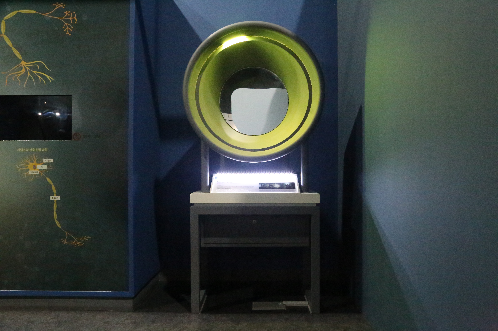

---
문서양식: 전시물
전시물 타입: 관람형, 패널
전시실: B전시실
---
#착시 

  <button class="nav-btn" onclick="goHome()">🏠 홈</button>
  <button class="nav-btn" onclick="goHall('blue')">🔵 Blue 전시실 개요</button>
  <button class="nav-btn" onclick="goBack()">⬅ 이전 페이지</button>

# 빛으로 표정을 바꿀 수 있을까?

## 1. 전시물 기본 내용
### 1.1 전시물 이미지

  
전시 목적

  

    순차적으로 점멸하는 조명 속에서 얼굴을 거울에 비춰보면 표정과 분위기가 역동적으로 변하는 현상을 통해 인지적 착시현상을 탐구한다.
    </ul>
  

### 1.2 학교 교육과정  
| 학년       | 단원  | 해당 교과 챕터 | 비고  |
| -------- | --- | -------- | --- |
| 초등 1~2학년 |     |          |     |
| 초등 3~4학년 |     |          |     |
| 초등 5~6학년 |     |          |     |
| 중학교      |     |          |     |
| 고등학교(공통) |     |          |     |
| 고등학교(선택) |     |          |     |

### 1.3 체험
##### 체험1) 빛의 방향에 따른 얼굴 표정 및 분위기의 변화 살펴보기
1. 원통 입구에 얼굴을 넣고 거울을 바라본다.
2. 빛이 비치는 방향에 따라 표정이 어떻게 달라 보이는지 관찰한다.
3. 내 얼굴의 표정을 다양하게 바꿔가며 다시 한번 관찰해본다.

### 1.4 패널내용

  

    빛으로 표정을 바꿀 수 있을까?
  

  

    
  

## 2. 기본 과학 이론
### 2.1 핵심 과학이론
- 

### 2.2 연관 과학이론

## 3. 연관 전시물
- 

## 4. 기존 해설에서의 쓰임 예시
*아래는 해당 전시물 부분만 기재되어있습니다. 해설 전문은 '업무메신저 잔디>드라이브'내의 해설서들을 참고하세요!*

>[!note]+ 전관해설) 과학관 맛보기 해설
> 	위치
> 	잔디 드라이브 > 자료실 > 1.해설시나리오_모음zip > 전시실 전관해설 > 과학관 맛보기 해설(심화형).hwp
> 	작성자 : 김지혜(2023년 9월 작성)
> > [!note]- 해설 내용
> > (전략)
> >  이렇게 우리가 사물을 볼 수 있고 착각을 느낄 수 있는 이유는 바로 이 빛을 보기 때문인데요. 이 빛이 비추는 방향에 따라 우리의 표정이 바뀌어 보일 수 있다는 사실, 알고계신가요? 이쪽에 얼굴을 대고 한 번 빛에 따라 어떤 표정으로 보이는지 확인해보겠습니다. 어떤가요? 조금 달라 보이죠? 물체는 그대로 있지만 주변의 조명을 조정해 생기는 그림자를 다양하게 연출하는 예술을 쉐도우 아트라고 합니다. 그것처럼 이 전시물을 체험해보면 우리 표정은 변화가 없지만 얼굴 주변의 빛과 그로 인해 생기는 그림자로 거울 안의 우리는 표정 변화가 느껴지는 것처럼 보입니다. 
> >  우리가 보는 세상은 눈이 있는 그대로의 이미지를 받아들여 결과를 내는 것이 아닌 상황에 따라 뇌가 자동으로 보정한 결과로 세상을 봅니다. 왜냐하면 뇌는 우리의 눈, 망막의 구조적 단점을 보완하고 정보를 효율적으로 사용하기 위해서입니다.
> >  (후략)

## 5. 확장 자료

### 심화 이론

### 최신 연구

## 변경기록
| 변경일        | 작성자 | 내용 및 사유 |
| ---------- | --- | ------- |
| 2026.01.22 | 박은선 | 최초 작성   |
|            |     |         |

  <button class="nav-btn" onclick="goHome()">🏠 홈</button>
  <button class="nav-btn" onclick="goHall('blue')">🔵 Blue 전시실 개요</button>
  <button class="nav-btn" onclick="goBack()">⬅ 이전 페이지</button>

