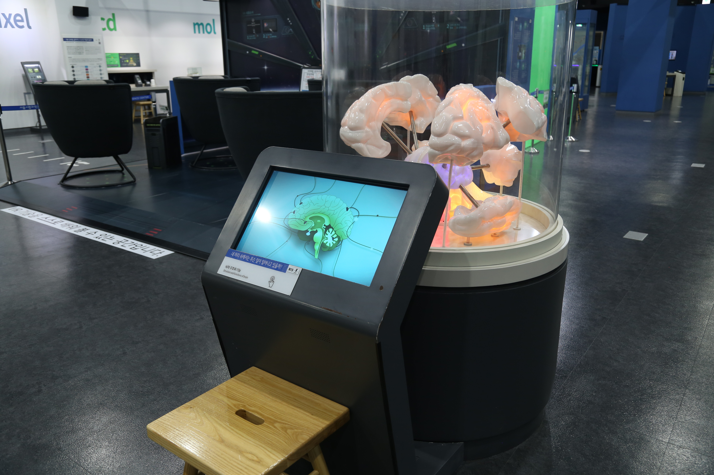

  <button class="nav-btn" onclick="goHome()">🏠 홈</button>
  <button class="nav-btn" onclick="goHall('blue')">🔵 Blue 전시실 개요</button>
  <button class="nav-btn" onclick="goBack()">⬅ 이전 페이지</button>

# B27 내 머리 속에서는 무슨 일이 일어나고 있을까?

## 1. 전시물 기본 내용
### 1.1 전시물 이미지

  
전시 목적

  

    신경계의 중추기관인 뇌의 구조를 모형으로 살펴본다. 의사 결정, 운동, 소화 등을 할 때 뇌의 어느 부분이 활성화되고, 각각 어떤 기능을 하는지 영상으로 문제를 풀며 알아본다.
  

  
전시 유형 : 체험형

  

    터치 모니터를 통한 퀴즈형 전시물
  

### 1.2 학교 교육과정  
<!--
curriculum-table은 전시물과 연결된 학교 교육과정을 학년별로 비교하는 표이다.
내용체계 칸에는 정적 웹에 포함된 내부 교육과정 문서 링크를 넣는다.
챕터 및 단원명 칸에는 외부 교과서/교과 챕터 링크를 넣는다.
전시물과 연계성 칸에는 전시물에서 어떤 개념과 연결되는지 적는다.
비고 칸에는 학년별 수준 변화, 해설 시 유의점, 확인이 필요한 내용을 적는다.
-->

<table class="curriculum-table">
  <caption><b>학교 교육과정</b></caption>
  <thead>
    <tr>
      <th rowspan="2">교육과정 내용체계</th>
      <th colspan="2">해당 교과과정(교과서)</th>
      <th rowspan="2">전시물과 연계성</th>
      <th rowspan="2">비고</th>
    </tr>
    <tr>
      <th>학년 및 학기</th>
      <th>챕터 및 단원명</th>
    </tr>
  </thead>
  <tfoot>
    <tr>
      <td colspan="5">
        <ul>
          <li>교과챕터 및 단원명은 출판사의 교과서 pdf링크로 연결됩니다.</li>
          <li>고등2~3학년 과정은 선택교과입니다.</li>
        </ul>
      </td>
    </tr>
  </tfoot>
  <tbody>
    <tr>
      <td>
      </td>
      <td>1학년 1학기</td>
      <td>
        <a class="curriculum-link-button external" href="https://example.com" target="_blank" rel="noopener">
          교과 챕터 링크예시
        </a>
      </td>
      <td></td>
      <td>비고</td>
    </tr>
    <tr>
      <td>
        <a class="curriculum-link-button" href="#/docs/school_curriculum/science/05_life_science">
          생명과학 &gt; 항상성과 몸의 조절
        </a>
      </td>
      <td></td>
      <td></td>
      <td>뇌 모형과 영상을 통해 뇌의 구조 및 기능 이해하기 활동 과정에서 생명체의 구조와 기능 및 생명 현상이 유지되는 원리를 이해함</td>
      <td></td>
    </tr>
  </tbody>
</table>

### 1.3 체험
##### 체험1) 뇌 모형과 영상을 통해 뇌의 구조 및 기능 이해하기
1. 뇌 모형을 통해 각 부분의 구조와 형태를 살펴본다.
2. 모니터 화면에 나오는 영상과 제시되는 상황을 보고, 이와 관련된 뇌의 영역을 선택한다.
3. 정답일 경우 해당 뇌 모형의 위치에서 LED전구가 켜지는 것을 확인하고 뇌의 명칭과 기능을 알아본다. 오답일 경우 다시 도전한다.

### 1.4 패널내용
(패널 없는 전시물)

## 2. 기본 과학 이론
### 2.1 핵심 과학이론

- 

### 2.2 연관 과학이론

## 3. 연관 전시물
- 

## 4. 기존 해설에서의 쓰임 예시

## 5. 확장 자료

### 심화 이론

### 최신 연구

## 변경기록
| 변경일        | 작성자 | 내용 및 사유 |
| ---------- | --- | ------- |
| 2026.01.22 | 박은선 | 최초 작성   |
|            |     |         |

  <button class="nav-btn" onclick="goHome()">🏠 홈</button>
  <button class="nav-btn" onclick="goHall('blue')">🔵 Blue 전시실 개요</button>
  <button class="nav-btn" onclick="goBack()">⬅ 이전 페이지</button>

