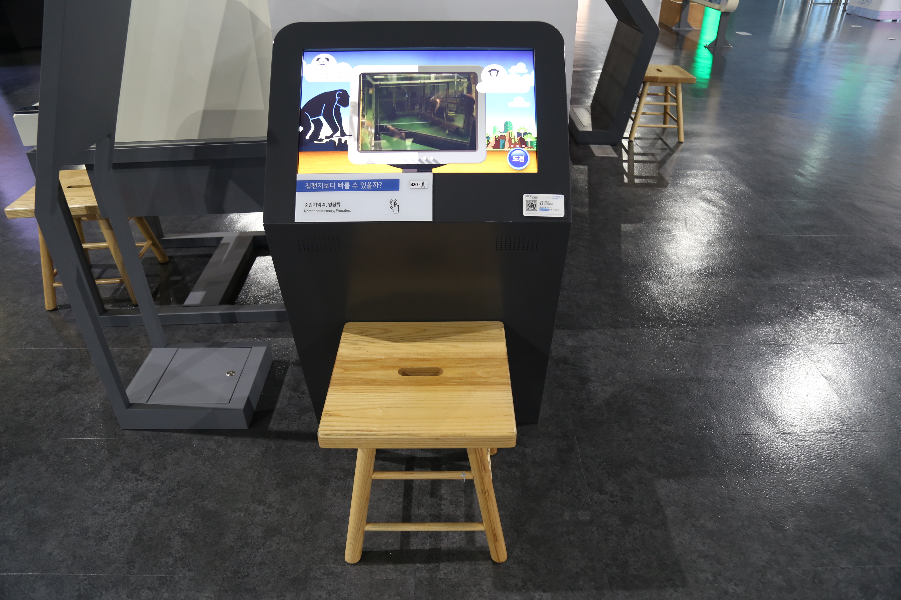

  <button class="nav-btn" onclick="goHome()">🏠 홈</button>
  <button class="nav-btn" onclick="goHall('blue')">🔵 Blue 전시실 개요</button>
  <button class="nav-btn" onclick="goBack()">⬅ 이전 페이지</button>

# B28 침팬지보다 빠를 수 있을까?

## 1. 전시물 기본 내용
### 1.1 전시물 이미지

  
전시 목적

  

    3가지 난이도의 순간 기억력 테스트를 해보면서, 침팬지 아유무의 순간 기억력과 비교해본다.
  

  
전시 유형 : 체험형/게임형

  

    터치 모니터를 이용해 아유무와 대결해보는 전시물
  

### 1.2 학교 교육과정  
<!--
curriculum-table은 전시물과 연결된 학교 교육과정을 학년별로 비교하는 표이다.
내용체계 칸에는 정적 웹에 포함된 내부 교육과정 문서 링크를 넣는다.
챕터 및 단원명 칸에는 외부 교과서/교과 챕터 링크를 넣는다.
전시물과 연계성 칸에는 전시물에서 어떤 개념과 연결되는지 적는다.
비고 칸에는 학년별 수준 변화, 해설 시 유의점, 확인이 필요한 내용을 적는다.
-->

<table class="curriculum-table">
  <caption><b>학교 교육과정</b></caption>
  <thead>
    <tr>
      <th rowspan="2">교육과정 내용체계</th>
      <th colspan="2">해당 교과과정(교과서)</th>
      <th rowspan="2">전시물과 연계성</th>
      <th rowspan="2">비고</th>
    </tr>
    <tr>
      <th>학년 및 학기</th>
      <th>챕터 및 단원명</th>
    </tr>
  </thead>
  <tfoot>
    <tr>
      <td colspan="5">
        <ul>
          <li>교과챕터 및 단원명은 출판사의 교과서 pdf링크로 연결됩니다.</li>
          <li>고등2~3학년 과정은 선택교과입니다.</li>
        </ul>
      </td>
    </tr>
  </tfoot>
  <tbody>
    <tr>
      <td>
      </td>
      <td>1학년 1학기</td>
      <td>
        <a class="curriculum-link-button external" href="https://example.com" target="_blank" rel="noopener">
          교과 챕터 링크예시
        </a>
      </td>
      <td></td>
      <td>비고</td>
    </tr>
    <tr>
      <td>
        <a class="curriculum-link-button" href="#/docs/school_curriculum/math/common/00_common_math_elementary1-2">
        초등학교 1~2학년 &gt; 자료와 가능성 &gt; 자료의 분류와 표
        </a>
      </td>
      <td></td>
      <td></td>
      <td>순간 기억력 테스트 도전하기 활동 과정에서 자료를 수량화하고 가능성을 비교하거나 표와 그래프로 해석하는 방법을 이해함</td>
      <td></td>
    </tr>
    <tr>
      <td>
        <a class="curriculum-link-button" href="#/docs/school_curriculum/math/common/00_common_math_elementary3-4">
        초등학교 3~4학년 &gt; 자료와 가능성 &gt; 그래프
        </a>
      </td>
      <td></td>
      <td></td>
      <td>순간 기억력 테스트 도전하기 활동 과정에서 자료와 변화를 수량화하고 표나 그래프로 해석하는 방법을 이해함</td>
      <td></td>
    </tr>
    <tr>
      <td></td>
      <td></td>
      <td></td>
      <td></td>
      <td></td>
    </tr>
    <tr>
      <td>
        <a class="curriculum-link-button" href="#/docs/school_curriculum/math/common/00_common_math_elementary5-6">
        초등학교 5~6학년 &gt; 자료와 가능성 &gt; 평균
        </a>
      </td>
      <td></td>
      <td></td>
      <td>순간 기억력 테스트 도전하기 활동 과정에서 자료를 수량화하고 가능성을 비교하거나 표와 그래프로 해석하는 방법을 이해함</td>
      <td></td>
    </tr>
    <tr>
      <td></td>
      <td></td>
      <td></td>
      <td></td>
      <td></td>
    </tr>
    <tr>
      <td>
        <a class="curriculum-link-button" href="#/docs/school_curriculum/math/common/00_common_math_mid">
        중학교 1~3학년 &gt; 자료와 가능성
        </a>
      </td>
      <td></td>
      <td></td>
      <td>순간 기억력 테스트 도전하기 활동 과정에서 자료를 수량화하고 가능성을 비교하거나 표와 그래프로 해석하는 방법을 이해함</td>
      <td></td>
    </tr>
    <tr>
      <td></td>
      <td></td>
      <td></td>
      <td></td>
      <td></td>
    </tr>
    <tr>
      <td></td>
      <td></td>
      <td></td>
      <td></td>
      <td></td>
    </tr>
    <tr>
      <td>
        <a class="curriculum-link-button" href="#/docs/school_curriculum/math/12_practical_statistics">
        실용 통계 &gt; 자료의 표현과 요약
        </a>
      </td>
      <td></td>
      <td></td>
      <td>순간 기억력 테스트 도전하기 활동 과정에서 자료를 수량화하고 가능성을 비교하거나 표와 그래프로 해석하는 방법을 이해함</td>
      <td></td>
    </tr>
  </tbody>
</table>

### 1.3 체험
##### 체험1) 순간 기억력 테스트 도전하기
1. 침팬지 ‘아유무’의 순간 기억력에 도전하고 싶다면 도전 버튼을 누른다.
2. 1~3단계까지의 순간 기억력 테스트를 체험해본다.
3. 테스트가 끝나면 체험자의 정답률과 평균 시간을 확인하고 아유무의 기록과 비교해본다.

### 1.4 패널내용

  

    침팬지보다 빠를 수 있을까?
  

  

    
  

## 2. 기본 과학 이론
### 2.1 핵심 과학이론

- 

### 2.2 연관 과학이론

## 3. 연관 전시물
- 

## 4. 기존 해설에서의 쓰임 예시

## 5. 확장 자료

### 심화 이론

### 최신 연구

## 변경기록
| 변경일        | 작성자 | 내용 및 사유 |
| ---------- | --- | ------- |
| 2026.01.22 | 박은선 | 최초 작성   |
|            |     |         |

  <button class="nav-btn" onclick="goHome()">🏠 홈</button>
  <button class="nav-btn" onclick="goHall('blue')">🔵 Blue 전시실 개요</button>
  <button class="nav-btn" onclick="goBack()">⬅ 이전 페이지</button>

