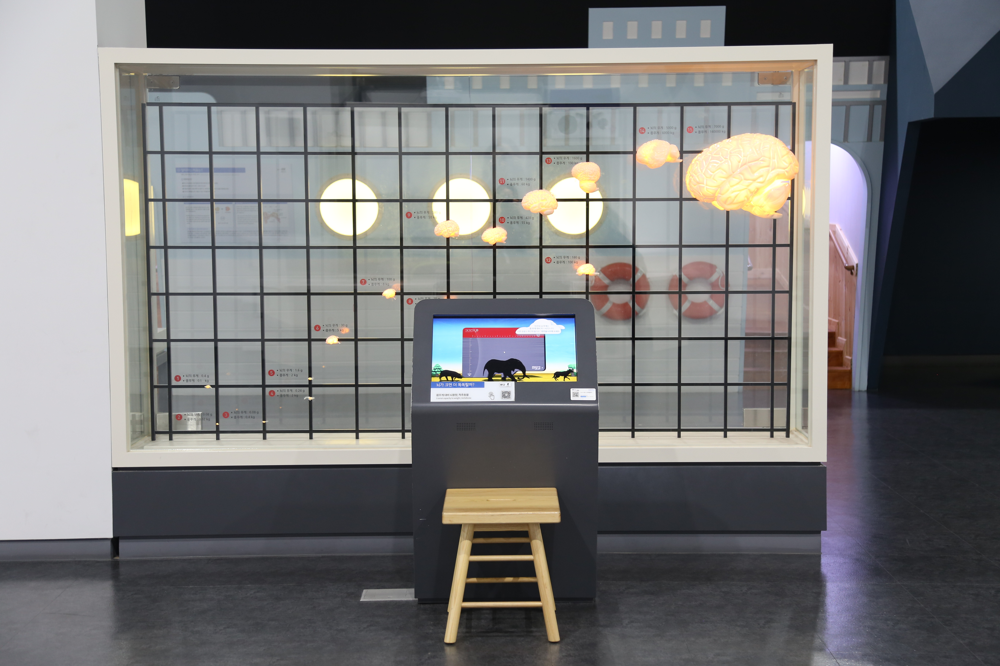

---
문서양식: 전시물
전시물 타입: 관람형, 패널
전시실: B전시실
---
#뇌 #대뇌화지수 #동물의_뇌

  <button class="nav-btn" onclick="goHome()">🏠 홈</button>
  <button class="nav-btn" onclick="goHall('blue')">🔵 Blue 전시실 개요</button>
  <button class="nav-btn" onclick="goBack()">⬅ 이전 페이지</button>

# 뇌가 크면 더 똑똑할까?

## 1. 전시물 기본 내용
### 1.1 전시물 이미지

  
전시 목적

  

    여러 동물의 뇌의 형태와 크기를 모형과 영상으로 확인한다. 전체 몸무게에서 뇌의 무게가 차지하는 비율을 나타내는 ‘대뇌화 지수’를 살펴보면서, 각 동물의 지능 및 인지 능력을 비교해본다.
    </ul>
  

<table>
  <caption><b>학교 교육과정</b></caption>
  <thead>
    <tr>
      <th>학년</th>
      <th>단원</th>
      <th>해당 교과 챕터</th>
      <th>비고</th>
    </tr>
  </thead>
  <tbody>
    <tr>
      <td>초등 1~2학년</td>
      <td></td>
      <td></td>
      <td></td>
    </tr>
    <tr>
      <td>초등 3~4학년</td>
      <td></td>
      <td></td>
      <td></td>
    </tr>
    <tr>
      <td>초등 5~6학년</td>
      <td></td>
      <td></td>
      <td></td>
    </tr>
    <tr>
      <td>중학교</td>
      <td></td>
      <td></td>
      <td></td>
    </tr>
    <tr>
      <td>고등학교(공통)</td>
      <td></td>
      <td></td>
      <td></td>
    </tr>
    <tr>
      <td>고등학교(선택)</td>
      <td></td>
      <td></td>
      <td></td>
    </tr>
  </tbody>
</table>

### 1.3 체험
##### 체험1) 척추동물 뇌 모형을 관찰하고 몸무게 대비 뇌 용량 살펴보기
1. 척추동물의 실제 뇌의 크기와 모양에 맞춰 만들어진 뇌 모형들을 살펴본다.
2. 디지털 패널에서 동물의 그림자를 선택한다.
3. 동물에 맞는 뇌 크기를 맞춘다.
4. 확인하기를 눌러 동물의 몸무게 대비 뇌 용량과 대뇌화 지수를 비교한다.

### 1.4 패널내용
(패널 없는 전시물)

## 2. 기본 과학 이론
### 2.1 핵심 과학이론
- 

### 2.2 연관 과학이론

## 3. 연관 전시물
- 

## 4. 기존 해설에서의 쓰임 예시

*아래는 해당 전시물 부분만 기재되어있습니다. 해설 전문은 '업무메신저 잔디>드라이브'내의 해설서들을 참고하세요!*

## 5. 확장 자료

### 심화 이론

### 최신 연구

## 변경기록
| 변경일        | 작성자 | 내용 및 사유 |
| ---------- | --- | ------- |
| 2026.01.22 | 박은선 | 최초 작성   |
|            |     |         |

  <button class="nav-btn" onclick="goHome()">🏠 홈</button>
  <button class="nav-btn" onclick="goHall('blue')">🔵 Blue 전시실 개요</button>
  <button class="nav-btn" onclick="goBack()">⬅ 이전 페이지</button>

