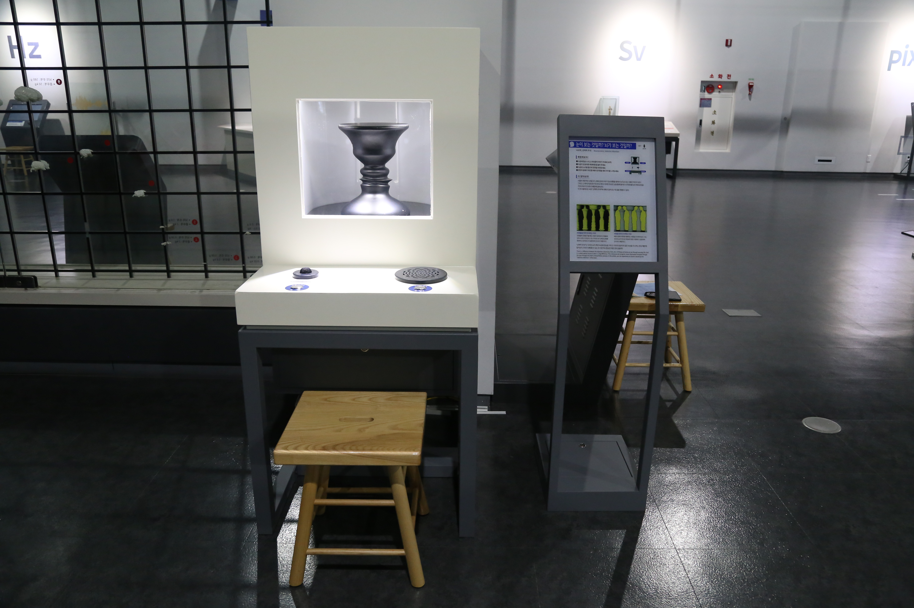

  <button class="nav-btn" onclick="goHome()">🏠 홈</button>
  <button class="nav-btn" onclick="goHall('blue')">🔵 Blue 전시실 개요</button>
  <button class="nav-btn" onclick="goBack()">⬅ 이전 페이지</button>

# B30 눈이 보는 것일까, 뇌가 보는 것일까?

## 1. 전시물 기본 내용

  
전시 목적

  

    회전체 뒷면을 밝게 연출하여 회전체 양쪽에 마주 보고 대화하는 사람의 착시를 느끼도록 연출하고, 녹음/재생 기능을 통해 대화를 만들어보도록 한다.
  

  
전시 유형 : 체험형

  

    녹음을 통해 착시를 체험해볼 수 있는 전시물
  

### 1.2 학교 교육과정  
<!--
curriculum-table은 전시물과 연결된 학교 교육과정을 학년별로 비교하는 표이다.
내용체계 칸에는 정적 웹에 포함된 내부 교육과정 문서 링크를 넣는다.
챕터 및 단원명 칸에는 외부 교과서/교과 챕터 링크를 넣는다.
전시물과 연계성 칸에는 전시물에서 어떤 개념과 연결되는지 적는다.
비고 칸에는 학년별 수준 변화, 해설 시 유의점, 확인이 필요한 내용을 적는다.
-->

<table class="curriculum-table">
  <caption><b>학교 교육과정</b></caption>
  <thead>
    <tr>
      <th colspan="2">교육과정 내용체계</th>
      <th colspan="2">해당 교과과정(교과서)</th>
      <th rowspan="2">전시물과 연계성</th>
      <th rowspan="2">비고</th>
    </tr>
    <tr>
      <th>학년(학군)</th>
      <th>내용체계</th>
      <th>학년 및 학기</th>
      <th>챕터 및 단원명</th>
    </tr>
  </thead>
  <tfoot>
    <tr>
      <td colspan="6">교과 챕터는 외부 사이트 링크를 통해 해당 단원을 확인한다.</td>
    </tr>
  </tfoot>
  <tbody>
    <tr>
      <th>초등1~2학년</th>
      <td>
      </td>
      <td>1학년 1학기</td>
      <td>
        <a class="curriculum-link-button external" href="https://example.com" target="_blank" rel="noopener">
          교과 챕터 링크예시
        </a>
      </td>
      <td>연계성</td>
      <td>비고</td>
    </tr>
    <tr>
      <th>초등5~6학년</th>
      <td></td>
      <td></td>
      <td></td>
      <td></td>
      <td></td>
    </tr>
    <tr>
      <th>중학교</th>
      <td></td>
      <td></td>
      <td></td>
      <td></td>
      <td></td>
    </tr>
    <tr>
      <th>고등학교(공통)</th>
      <td></td>
      <td></td>
      <td></td>
      <td></td>
      <td></td>
    </tr>
    <tr>
      <th>고등학교(선택)</th>
      <td>
        <a class="curriculum-link-button" href="#/docs/school_curriculum/science/03_physics">
          물리학 &gt; 빛과 물질
        </a>
        <a class="curriculum-link-button" href="#/docs/school_curriculum/science/08_electromagnetism_and_quantum">
          전자기와 양자 &gt; 빛과 정보 통신
        </a>
        <a class="curriculum-link-button" href="#/docs/school_curriculum/science/15_history_and_culture_of_science">
          과학의 역사와 문화 &gt; 과학과 문명의 탄생과 통합
        </a>
      </td>
      <td></td>
      <td></td>
      <td></td>
      <td></td>
    </tr>
  </tbody>
</table>

### 1.3 체험
##### 체험1) 같은 물체가 다르게 보임을 살펴보고 생각해보기
1. 녹음 버튼을 누르고, 10초 동안 자유롭게 이야기해본다.
2. 녹음이 완료되면 재생 버튼을 누른다.
3. 녹음된 소리를 들으며 정면을 바라본다.
4. 중앙의 물체가 회전할 때와 정지했을 때의 차이를 느껴본다.

### 1.4 패널내용

  

    눈이 보는 것일까, 뇌가 보는 것일까?
  

  

    
  

## 2. 기본 과학 이론
### 2.1 핵심 과학이론

- 

### 2.2 연관 과학이론

## 3. 연관 전시물
- 

## 4. 기존 해설에서의 쓰임 예시

## 5. 확장 자료

### 심화 이론

### 최신 연구

## 변경기록
| 변경일        | 작성자 | 내용 및 사유 |
| ---------- | --- | ------- |
| 2026.01.22 | 박은선 | 최초 작성   |
|            |     |         |

  <button class="nav-btn" onclick="goHome()">🏠 홈</button>
  <button class="nav-btn" onclick="goHall('blue')">🔵 Blue 전시실 개요</button>
  <button class="nav-btn" onclick="goBack()">⬅ 이전 페이지</button>

