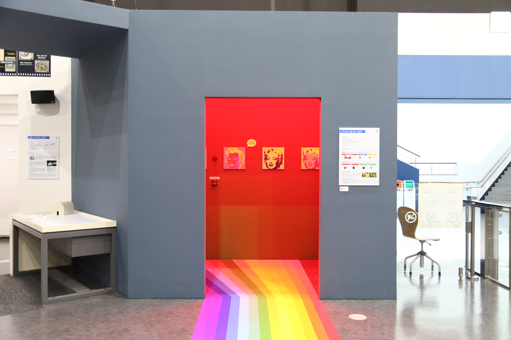

  <button class="nav-btn" onclick="goHome()">🏠 홈</button>
  <button class="nav-btn" onclick="goHall('blue')">🔵 Blue 전시실 개요</button>
  <button class="nav-btn" onclick="goBack()">⬅ 이전 페이지</button>

# B31 멀미를 하는 이유는?

## 1. 전시물 기본 내용
### 1.1 전시물 이미지

  
전시 목적

  

    시각 정보와 전정기관(평형기관)의 정보 불일치로 인해 발생하는 멀미의 원리를 체험을 통해 알아본다.
  

  
전시 유형 : 체험형

  

    기울어진 배 안으로 들어가 전정기관과 시각정보가 불일치하는 체험을 해볼 수 있는 공간 조성 전시물
  

### 1.2 학교 교육과정  
<!--
curriculum-table은 전시물과 연결된 학교 교육과정을 학년별로 비교하는 표이다.
내용체계 칸에는 정적 웹에 포함된 내부 교육과정 문서 링크를 넣는다.
챕터 및 단원명 칸에는 외부 교과서/교과 챕터 링크를 넣는다.
전시물과 연계성 칸에는 전시물에서 어떤 개념과 연결되는지 적는다.
비고 칸에는 학년별 수준 변화, 해설 시 유의점, 확인이 필요한 내용을 적는다.
-->

<table class="curriculum-table">
  <caption><b>학교 교육과정</b></caption>
  <thead>
    <tr>
      <th colspan="2">교육과정 내용체계</th>
      <th colspan="2">해당 교과과정(교과서)</th>
      <th rowspan="2">전시물과 연계성</th>
      <th rowspan="2">비고</th>
    </tr>
    <tr>
      <th>학년(학군)</th>
      <th>내용체계</th>
      <th>학년 및 학기</th>
      <th>챕터 및 단원명</th>
    </tr>
  </thead>
  <tfoot>
    <tr>
      <td colspan="6">교과 챕터는 외부 사이트 링크를 통해 해당 단원을 확인한다.</td>
    </tr>
  </tfoot>
  <tbody>
    <tr>
      <th>초등1~2학년</th>
      <td>
      </td>
      <td>1학년 1학기</td>
      <td>
        <a class="curriculum-link-button external" href="https://example.com" target="_blank" rel="noopener">
          교과 챕터 링크예시
        </a>
      </td>
      <td>연계성</td>
      <td>비고</td>
    </tr>
    <tr>
      <th>초등5~6학년</th>
      <td></td>
      <td></td>
      <td></td>
      <td></td>
      <td></td>
    </tr>
    <tr>
      <th>중학교</th>
      <td></td>
      <td></td>
      <td></td>
      <td></td>
      <td></td>
    </tr>
    <tr>
      <th>고등학교(공통)</th>
      <td></td>
      <td></td>
      <td></td>
      <td></td>
      <td></td>
    </tr>
    <tr>
      <th>고등학교(선택)</th>
      <td>
        <a class="curriculum-link-button" href="#/docs/school_curriculum/science/05_life_science">
          생명과학 &gt; 항상성과 몸의 조절
        </a>
      </td>
      <td></td>
      <td></td>
      <td></td>
      <td></td>
    </tr>
  </tbody>
</table>

### 1.3 체험
##### 체험1) 뱃멀미 체험하기
1. 복도에 설치된 손잡이를 잡으면서 배 안으로 들어가 본다.
2. 배 안을 둘러보며 어떤 느낌이 드는지 확인한다.
3. 배 안에 설치된 레일에 놓인 공을 왼쪽으로 옮기고 바닥에 수직으로 서서 공을 관찰한다.
4. 경사진 레일을 공이 오를 수 있는 이유가 무엇일지 생각해본다.

### 1.4 패널내용

  

    멀미를 하는 이유는?
  

  

    
  

  

    (외부 보조패널)멀미가 일어날때 신체에 생기는 변화
  

  

    
  

  

    (내부 보조패널)공이 거꾸로 굴러올라가는 이유는?
  

  

    
  

## 2. 기본 과학 이론
### 2.1 핵심 과학이론

- 

### 2.2 연관 과학이론

## 3. 연관 전시물
- 

## 4. 기존 해설에서의 쓰임 예시

## 5. 확장 자료

### 심화 이론

### 최신 연구

## 변경기록
| 변경일        | 작성자 | 내용 및 사유 |
| ---------- | --- | ------- |
| 2026.01.22 | 박은선 | 최초 작성   |
|            |     |         |

  <button class="nav-btn" onclick="goHome()">🏠 홈</button>
  <button class="nav-btn" onclick="goHall('blue')">🔵 Blue 전시실 개요</button>
  <button class="nav-btn" onclick="goBack()">⬅ 이전 페이지</button>

