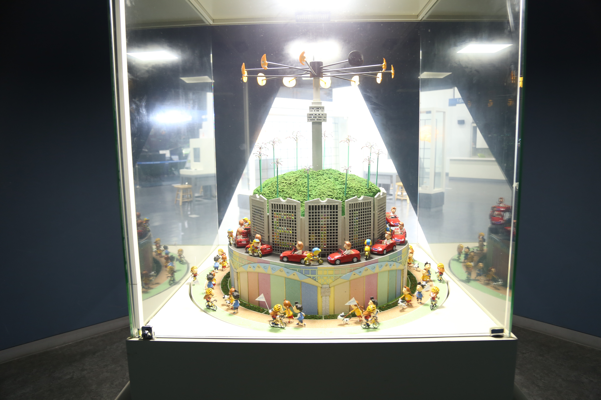

---
문서양식: 전시물
전시물 타입: 관람형, 패널
전시실: B전시실
---
#착시 #잔상효과 #조이트로프

  <button class="nav-btn" onclick="goHome()">🏠 홈</button>
  <button class="nav-btn" onclick="goHall('blue')">🔵 Blue 전시실 개요</button>
  <button class="nav-btn" onclick="goBack()">⬅ 이전 페이지</button>

# 내 의지와 관계없이 몸에서 일어나는 일들은?

## 1. 전시물 기본 내용
### 1.1 전시물 이미지

  
전시 목적

  

    서울의 밤에 일어나는 도심의 모습, 사람들의 일상을 조이트로프 모형을 통해 관람한다. 도심의 야경을 보면서, 자율신경계의 교감신경과 부교감신경의 작용 및 변화를 알아본다. 또한, 뇌에서 일어나는 잔상 효과로 인해 조이트로프의 모형이 동영상처럼 보이는 원리를 이해한다.
    </ul>
  

### 1.2 학교 교육과정  
| 학년       | 단원  | 해당 교과 챕터 | 비고  |
| -------- | --- | -------- | --- |
| 초등 1~2학년 |     |          |     |
| 초등 3~4학년 |     |          |     |
| 초등 5~6학년 |     |          |     |
| 중학교      |     |          |     |
| 고등학교(공통) |     |          |     |
| 고등학교(선택) |     |          |     |

### 1.3 체험
##### 체험1) 서울의 밤 모습을 보면서 자율신경계 변화 느끼기
1. 패널을 읽어보고 구조물 안으로 들어간다.
2. 조이트로프의 시작 버튼을 누른다.
3. 서울의 밤을 표현한 전시물을 보면서 마음이 평온해지는지 느껴본다.

##### 체험2) 조이트로프의 원리 이해하기
1. 조이트로프의 시작 버튼을 누른다.
2. 회전하는 전시물이 빛에 의해 어떻게 보이는지 살펴본다.

##### 체험3) 또 다른 착시 체험하기
1. 거울을 통해 보면 착시를 일으키는 세가지 착시 체험물들을 체험해본다.
  - 아무리 돌려도 한 방향으로만 보이는 화살표
  - 눈으로 볼 때는 동그라미이지만, 거울로 보면 네모로 보이는 구조물
  - 경사를 거슬러 올라가는 것처럼 보이는 구슬들

### 1.4 패널내용

  

    내 의지와 관계없이 몸에서 일어나는 일들은?
  

  

    
  

## 2. 기본 과학 이론
### 2.1 핵심 과학이론
- 

### 2.2 연관 과학이론

## 3. 연관 전시물
- 

## 4. 기존 해설에서의 쓰임 예시
*아래는 해당 전시물 부분만 기재되어있습니다. 해설 전문은 '업무메신저 잔디>드라이브'내의 해설서들을 참고하세요!*

>[!note]+ QR 옴니버스 영화 VS 과학
> 	위치
> 	잔디 드라이브>자료실>1.해설시나리오_모음zip>QR북_영화vs과학.hwp
> 	작성자 : 윤민애(2021년 9월 작성)
> > [!note]- 해설 내용
> > (전략)
> >  물방울이 둥실둥실 떠 있는 것처럼 보이는 이 마법 같은 영상은 영화 ‘나우유씨미’의 한 장면입니다. 이 장면이 과연 진실일지 확인해보기 위해 현장에 나가보도록 하겠습니다.
> >  보셨나요? 빙글빙글 돌고 있는 모형 속 인형들이 마치 움직이는 것처럼 보입니다. 이 조형물을 조이트로프라고 하는데요, 애니메이션에 영감을 주었던 옛날 장난감이죠.
> >  
> >  우리 눈은 실제로도 본 장면을 마치 사진 한 장 한 장처럼 뇌에게 알려주고, 뇌가 그 장면들을 이어 붙여 하나의 영상으로 만들어냅니다. 그런데 그 과정에서 빠르게 움직이는 물체의 경우 실제 움직임과 다르게 보일수가 있습니다.
> >  특히 선풍기의 날개나 프로펠러 비행기의 프로펠러, 자동차 바퀴와 같이 같은 움직임을 반복하는 경우 실제 움직임과 반대방향으로 움직이는 것 같아 보이는 스트로보효과가 나타나죠.
> >  
> >  영화 ‘나우유씨미’의 빗방울 마술은 바로 이 스트로보효과를 이용했습니다. 조명이 깜빡이는 속도를 조절해 눈이 볼 수 있는 장면을 제한하게 되면 빗방울이 마치 거꾸로 거슬러 올라가는 것 같이 보이게 되는 것이죠. 이 조이트로프의 조명이 빠르게 깜빡여 착시효과를 만들어내는 것처럼 말입니다.
> >  르테리에 감독은 스트로보효과를 적극 활용해 영화 속에서 환상적인 마술쇼를 구현해냈습니다. 마치 CG와 같던 이 장면은 진실로 확인되었습니다.
> >  
> >  다음은 귀여운 외모에 그렇지 못한 백만 볼트 공격을 퍼붓는 ‘명탐정 피카츄’를 만나러 가보겠습니다. 다음 전시물로 이동해 QR을 찍어주세요.
> >  (후략)

>[!note]+ (주제해설) 내 안의 우주, 뇌
> 	위치 
> 	잔디 드라이브 > 자료실 > 1.해설시나리오_모음zip > 주제해설 > 주제해설_김주희_내 안의 우주-뇌.hwp
> 	작성자 : 김주희(2019년 5월 작성)
> > [!note]- 해설 내용
> > (전략)
> >  서울의 야경을 나타내고 있는 전시물인데, 내 의지와는 관계없이 일어나는 착시 현상입니다. 이렇게 연속적인 조형물을 빠르게 회전시키고 깜빡이는 빛을 비추면 모형들이 살아 움직이는 것처럼 보이게 됩니다. 1초에 24장의 이미지를 연속적으로 보게 되면 사진이 마치 움직이는 것처럼 착각하게 되는 착시 현상입니다. 
> >  눈을 통해 본 사물의 모습이 짧은 시간 동안 뇌에 남는 잔상효과 때문에 일어나는 것이죠. 실제로는 움직이는 것이 아니지만 이러한 효과들로 인해 뇌가 조형물들이 살아 움직이는 것처럼 인식하는 뇌의 착각입니다.
> >  (후략)

>[!note]+ (주제해설) 물리하고 놀자
> 	위치 
> 	잔디 드라이브 > 자료실 > 1.해설시나리오_모음zip > 주제해설 > 주제해설_김형준_물리하고 놀자.hwp
> 	작성자 : 김형준(2019년 4월 작성)
> > [!note]- 해설 내용
> > (전략)
> >  우리 몸이 이렇게 주변에 민감하게 반응하는 것처럼 보이기도 하지만 때로는 둔하기도 해요. 둔해서 좋은 점도 있고요. 이번에는 우리의 눈과 뇌에 관련된 현상 얘기해 볼게요.
> >  우리 인간들은 빛을 통해서 세상을 바라보고 있습니다. 그래서 빛이 없으면 아무것도 볼 수... 없겠죠! 빛을 잘 이용하기만 하면 딱딱하게 굳어있는 이 인형들이 살아 움직이는 것처럼 보이는데요. 여기 이 버튼을 눌러볼게요.
> >  인형들이 회전하기 시작하고, 빛이 깜빡이기 시작합니다. 빛이 깜빡일 때 마다 우리 머릿속에는 다른 모습들의 사진들이 한 장 한 장 들어오는데요. 우리 뇌는 이 사진들을 연속된 움직임으로 느끼게 만듭니다. 마치 인형이 살아 움직이는 것처럼 보인다는 얘기인데요. 이런 것을 잔상효과라고 합니다. 잔상효과가 나타나게 만드는 깜빡이 빛은 이 전시물에만 있는 게 아닙니다. 여러분들이 사용하고 있는 핸드폰 화면도 깜빡이 빛을 사용하고 있습니다. 다만 1초에 30/60/120번으로 매우 빠르게 깜빡여서 우리가 눈치 채지 못하는 거죠.
> >  이런 것 말고도 빛을 적당히 이용하면, 눈앞에 보이는 물체가 전혀 다른 모습으로 보이기도 하는데요. 어떤 동물들은 주변 환경과 비슷한 색으로 자신의 몸 색을 바꾸어 위장을 하고는 합니다. 어떤 동물들이 그럴까요? 카멜레온, 문어 같은 친구들이죠? 이 친구들은 몸 색을 바꾸는 방법으로 위장을 해서 포식자로부터 위험을 피하거나 사냥을 합니다.
> >  그런데 우리 인간들도 위장을 합니다. 바로, 군인이죠. 우리나라 군인들은 침엽수와 화강암이 많은 환경에서 작전을 수행합니다. 그래서 이런 환경에서 눈에 띄지 않을 수 있는 색으로 된 전투복을 입고요. 사막이나 눈밭에서 작전을 수행하는 군인들은 모래색이나 흰색으로 된 전투복을 입고 작전을 수행합니다.
> >  자 그런데 여기서 우리가 주목해야 할 점은, 물체의 색은 물체가 반사하는 빛으로 결정된다는 겁니다. 예를 들어서, 어떤 물체에 빨간 빛을 쬐었는데 그 물체가 빨간 빛을 반사한다면 우리는 그 물체를 빨간색으로 느끼는 것이고, 빨간 빛을 반사하지 못한다면 어둡게-검게 느끼게 되는 거 에요. 정말로 그렇게 보이는지 장소를 옮겨서 확인해 볼게요.
> >  (후략)

>[!note]+ B전시실 기본 해설 시나리오
> 	위치
> 	잔디 드라이브 > 자료실 > 1.해설시나리오_모음zip > 전시실 기본해설 > B전시실(담당자 미정)
> 	작성자 : 확인불가(2018년 3월 작성)
> > [!note]- 해설 내용
> > (전략)
> >  우리는 마지막으로 뇌의 연결을 살펴보겠습니다. 뇌는 사람의 신체에서 가장 많은 에너지를 소비하고, 또한 가장 철저하게 보호가 되지요. 그런데 과연 우리 뇌의 판단이 항상 옳을까요?
> >  이 전시물을 보시면 뇌의 판단이 항상 옳지만은 않다는 것을 아실 수 있으실 것입니다. 이 전시물은 조이트로프라고 부르는 전시물입니다. 영화와 애니메이션의 시작이 된 기법인데요, 저희는 불의 깜빡임을 통해 하나하나의 이미지를 눈에서 인지하게 하고, 뇌에서는 연속된 이미지를 하나의 움직임으로 착각하게 되는 것이지요.
> >  이런 걸 착시라고 합니다. 뇌에서 최소한의 에너지를 사용하려하거나 항상 정보를 처리해왔던 방식대로 습관적으로 정보를 처리하거나 인근 뇌 구역에서의 정보와 혼선이 빚어져 일어나는 현상이지요. 착시뿐만 아니라 착정이라는 현상도 일어나는데, 그 역시 이유는 동일합니다.
> >  이 어두운 공간 또한 우리 몸의 변화를 일으킬 수 있는데요, 우리 몸은 긴장상태, 휴식상태, 크게 두 상태로 나누어 몸 전체를 통제하려 합니다. 그때 작용하는 신경이 교감, 부교감 신경이지요. 교감신경은 위급한 상황일 때 작용을 해서 빠른 반응을 도와주지요. 만화에서 놀란 케릭터의 눈이 커지는 것처럼, 우리의 동공이 커지고, 근육에서 많은 에너지를 사용할 수 있도록 소화기관의 운동과 소화액 분비는 잠시 억제됩니다. 대신 근육에서 빠르게 에너지를 쓸 수 있게 심장은 빨리 뛰고 간에서는 에너지로 쓸 포도당을 만들기 위해 글리코겐을 분해하지요.
> >  반면 부교감신경은 긴장이 완화되어 편안한 상태일 때 작용합니다. 따라서 교감신경이 활성화되었을 때와 반대로 동공은 축소되고, 근육이 아닌, 소화기에 좀 더 에너지를 할애해 침이나 소화액이 분비되며 소화기관의 움직임이 활발해지지요. 간에서는 소화를 돕기 위해 쓸개즙을 많이 만들어내게 됩니다.
> >  이 부교감신경이 활성화된 상태에는 사람은 여유를 가지게 되고 감성적인 사고가 가능해지지요. 그래서 저희는 이 공간 안을 어둡게 해서 조이트로프의 아름다움을 보다 잘 느끼실 수 있게 하고 있습니다.
> >  (후략)

## 5. 확장 자료

### 심화 이론

### 최신 연구

## 변경기록
| 변경일        | 작성자 | 내용 및 사유 |
| ---------- | --- | ------- |
| 2026.01.22 | 박은선 | 최초 작성   |
|            |     |         |

  <button class="nav-btn" onclick="goHome()">🏠 홈</button>
  <button class="nav-btn" onclick="goHall('blue')">🔵 Blue 전시실 개요</button>
  <button class="nav-btn" onclick="goBack()">⬅ 이전 페이지</button>

