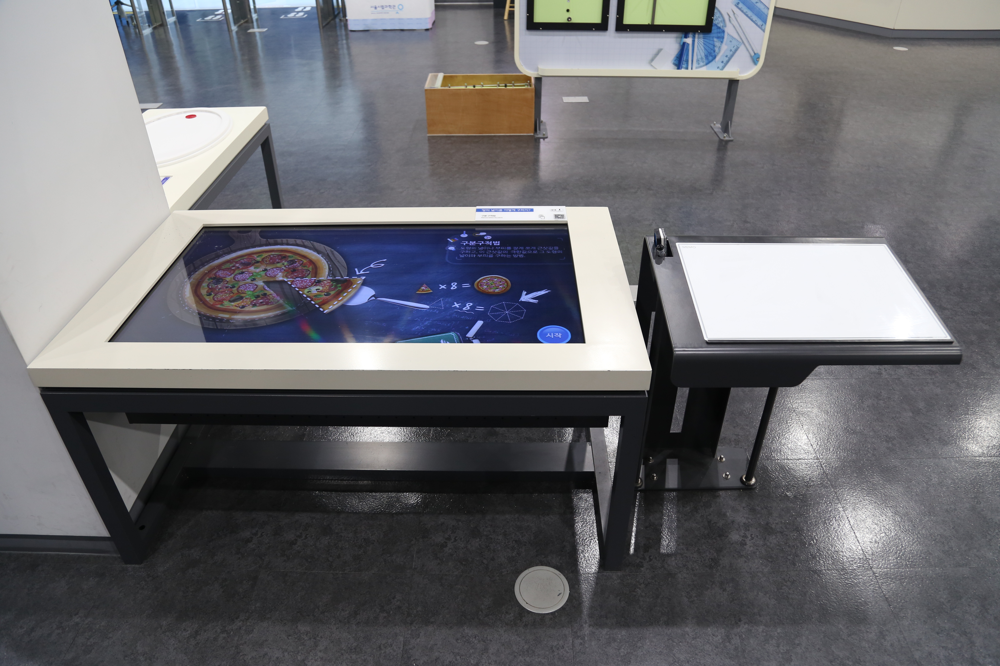

---
문서양식: 전시물
전시물 타입: 관람형, 패널
전시실: B전시실
---
#구분구적법

  <button class="nav-btn" onclick="goHome()">🏠 홈</button>
  <button class="nav-btn" onclick="goHall('blue')">🔵 Blue 전시실 개요</button>
  <button class="nav-btn" onclick="goBack()">⬅ 이전 페이지</button>

# 땅의 넓이를 어떻게 구하지?

## 1. 전시물 기본 내용
### 1.1 전시물 이미지

  
전시 목적

  

    서울시 면적을 구하기 위한 적합한 도형의 크기를 선택하고, 도형의 크기에 따라 전체 면적이 어떻게 변화하는지를 알아본다. 실제 면적과의 차이를 영상 체험으로 살펴본다.
    </ul>
  

### 1.2 학교 교육과정  
| 학년       | 단원  | 해당 교과 챕터 | 비고  |
| -------- | --- | -------- | --- |
| 초등 1~2학년 |     |          |     |
| 초등 3~4학년 |     |          |     |
| 초등 5~6학년 |     |          |     |
| 중학교      |     |          |     |
| 고등학교(공통) |     |          |     |
| 고등학교(선택) |     |          |     |

### 1.3 체험
##### 체험1) 구분구적법을 통해 서울시 실제 면적과 체험자 측정 면적 비교하기
1. 영상 화면에서 시작을 누른다.
2. 화면에 표시된 사각형의 면적을 조절하고 면적 구하기를 누른다.
3. 서울시 실제 면적과 선택된 사각형을 채워 얻은 면적 사이의 차이(오차)를 확인한다.
4. 다른 면적을 갖는 사각형으로 오차를 확인해보고 앞서 얻은 오차와 비교해본다.

### 1.4 패널내용
(패널 없는 전시물)

## 2. 기본 과학 이론
### 2.1 핵심 과학이론
- 

### 2.2 연관 과학이론

## 3. 연관 전시물
- 

## 4. 기존 해설에서의 쓰임 예시
*아래는 해당 전시물 부분만 기재되어있습니다. 해설 전문은 '업무메신저 잔디>드라이브'내의 해설서들을 참고하세요!*
(해설 예시 없음)

## 5. 확장 자료

### 심화 이론

### 최신 연구

## 변경기록
| 변경일        | 작성자 | 내용 및 사유 |
| ---------- | --- | ------- |
| 2026.01.22 | 박은선 | 최초 작성   |
|            |     |         |

  <button class="nav-btn" onclick="goHome()">🏠 홈</button>
  <button class="nav-btn" onclick="goHall('blue')">🔵 Blue 전시실 개요</button>
  <button class="nav-btn" onclick="goBack()">⬅ 이전 페이지</button>

