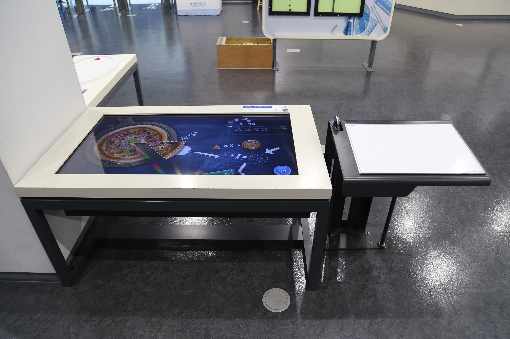

  <button class="nav-btn" onclick="goHome()">🏠 홈</button>
  <button class="nav-btn" onclick="goHall('blue')">🔵 Blue 전시실 개요</button>
  <button class="nav-btn" onclick="goBack()">⬅ 이전 페이지</button>

# B34 땅의 넓이를 어떻게 구하지?

## 1. 전시물 기본 내용
### 1.1 전시물 이미지

  
전시 목적

  

    서울시 면적을 구하기 위한 적합한 도형의 크기를 선택하고, 도형의 크기에 따라 전체 면적이 어떻게 변화하는지를 알아본다. 실제 면적과의 차이를 영상 체험으로 살펴본다.
  

  
전시 유형 : 체험형

  

    터치 모니터로 구성된 전시물
  

### 1.2 학교 교육과정  
<!--
curriculum-table은 전시물과 연결된 학교 교육과정을 학년별로 비교하는 표이다.
내용체계 칸에는 정적 웹에 포함된 내부 교육과정 문서 링크를 넣는다.
챕터 및 단원명 칸에는 외부 교과서/교과 챕터 링크를 넣는다.
전시물과 연계성 칸에는 전시물에서 어떤 개념과 연결되는지 적는다.
비고 칸에는 학년별 수준 변화, 해설 시 유의점, 확인이 필요한 내용을 적는다.
-->

<table class="curriculum-table">
  <caption><b>학교 교육과정</b></caption>
  <thead>
    <tr>
      <th rowspan="2">교육과정 내용체계</th>
      <th colspan="2">해당 교과과정(교과서)</th>
      <th rowspan="2">전시물과 연계성</th>
      <th rowspan="2">비고</th>
    </tr>
    <tr>
      <th>학년 및 학기</th>
      <th>챕터 및 단원명</th>
    </tr>
  </thead>
  <tfoot>
    <tr>
      <td colspan="5">
        <ul>
          <li>교과챕터 및 단원명은 출판사의 교과서 pdf링크로 연결됩니다.</li>
          <li>고등2~3학년 과정은 선택교과입니다.</li>
        </ul>
      </td>
    </tr>
  </tfoot>
  <tbody>
    <tr>
      <td>
      </td>
      <td>1학년 1학기</td>
      <td>
        <a class="curriculum-link-button external" href="https://example.com" target="_blank" rel="noopener">
          교과 챕터 링크예시
        </a>
      </td>
      <td></td>
      <td>비고</td>
    </tr>
    <tr>
      <td>
        <a class="curriculum-link-button" href="#/docs/school_curriculum/math/common/00_common_math_elementary3-4">
        초등학교 3~4학년 &gt; 도형과 측정 &gt; 도형과 넓이
        </a>
      </td>
      <td></td>
      <td></td>
      <td>구분구적법을 통해 서울시 실제 면적과 체험자 측정 면적 활동 과정에서 대상의 크기와 변화를 비교·측정하고 수량으로 표현하는 방법을 이해함</td>
      <td></td>
    </tr>
    <tr>
      <td></td>
      <td></td>
      <td></td>
      <td></td>
      <td></td>
    </tr>
    <tr>
      <td>
        <a class="curriculum-link-button" href="#/docs/school_curriculum/math/common/00_common_math_elementary5-6">
        초등학교 5~6학년 &gt; 도형과 측정 &gt; 다각형의 둘레와 넓이
        </a>
      </td>
      <td></td>
      <td></td>
      <td>구분구적법을 통해 서울시 실제 면적과 체험자 측정 면적 활동 과정에서 대상의 크기와 변화를 비교·측정하고 수량으로 표현하는 방법을 이해함</td>
      <td></td>
    </tr>
    <tr>
      <td></td>
      <td></td>
      <td></td>
      <td></td>
      <td></td>
    </tr>
    <tr>
      <td>
        <a class="curriculum-link-button" href="#/docs/school_curriculum/math/common/00_common_math_mid">
        중학교 1~3학년 &gt; 도형과 측정 &gt; 길이와 넓이
        </a>
      </td>
      <td></td>
      <td></td>
      <td>구분구적법을 통해 서울시 실제 면적과 체험자 측정 면적 활동 과정에서 대상의 크기와 변화를 비교·측정하고 수량으로 표현하는 방법을 이해함</td>
      <td></td>
    </tr>
    <tr>
      <td></td>
      <td></td>
      <td></td>
      <td></td>
      <td></td>
    </tr>
    <tr>
      <td></td>
      <td></td>
      <td></td>
      <td></td>
      <td></td>
    </tr>
  </tbody>
</table>

### 1.3 체험
##### 체험1) 구분구적법을 통해 서울시 실제 면적과 체험자 측정 면적 비교하기
1. 영상 화면에서 시작을 누른다.
2. 화면에 표시된 사각형의 면적을 조절하고 면적 구하기를 누른다.
3. 서울시 실제 면적과 선택된 사각형을 채워 얻은 면적 사이의 차이(오차)를 확인한다.
4. 다른 면적을 갖는 사각형으로 오차를 확인해보고 앞서 얻은 오차와 비교해본다.

### 1.4 패널내용
(패널 없는 전시물)

## 2. 기본 과학 이론
### 2.1 핵심 과학이론

- 

### 2.2 연관 과학이론

## 3. 연관 전시물
- 

## 4. 기존 해설에서의 쓰임 예시

## 5. 확장 자료

### 심화 이론

### 최신 연구

## 변경기록
| 변경일        | 작성자 | 내용 및 사유 |
| ---------- | --- | ------- |
| 2026.01.22 | 박은선 | 최초 작성   |
|            |     |         |

  <button class="nav-btn" onclick="goHome()">🏠 홈</button>
  <button class="nav-btn" onclick="goHall('blue')">🔵 Blue 전시실 개요</button>
  <button class="nav-btn" onclick="goBack()">⬅ 이전 페이지</button>

