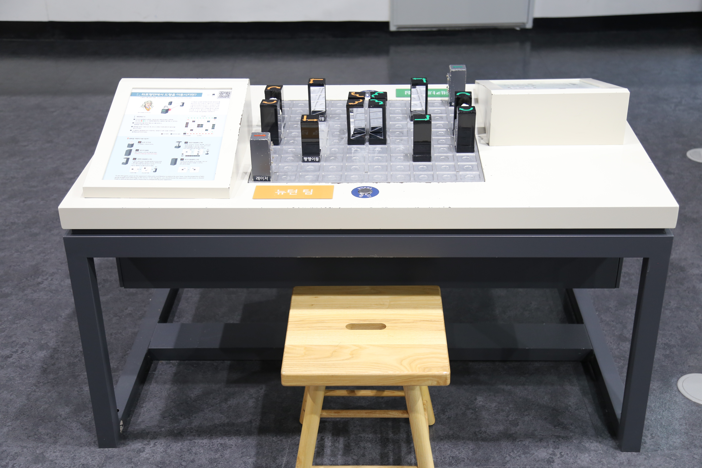

  <button class="nav-btn" onclick="goHome()">🏠 홈</button>
  <button class="nav-btn" onclick="goHall('blue')">🔵 Blue 전시실 개요</button>
  <button class="nav-btn" onclick="goBack()">⬅ 이전 페이지</button>

# B35 좌표평면에서 도형을 이동시키면?

## 1. 전시물 기본 내용
### 1.1 전시물 이미지

  
전시 목적

  

    좌표 평면 보드판에서 블록을 평행이동, 대칭이동, 회전이동을 하는 미션형 게임을 통해, 공간을 설명하는 좌표 평면과 도형의 이동을 알아본다. 또한, 레이저의 성질과 거울 반사의 원리를 이해한다.
  

  
전시 유형 : 체험형/게임형

  

    거울체스를 진행할 수 있는 전시물
  

### 1.2 학교 교육과정  
<!--
curriculum-table은 전시물과 연결된 학교 교육과정을 학년별로 비교하는 표이다.
내용체계 칸에는 정적 웹에 포함된 내부 교육과정 문서 링크를 넣는다.
챕터 및 단원명 칸에는 외부 교과서/교과 챕터 링크를 넣는다.
전시물과 연계성 칸에는 전시물에서 어떤 개념과 연결되는지 적는다.
비고 칸에는 학년별 수준 변화, 해설 시 유의점, 확인이 필요한 내용을 적는다.
-->

<table class="curriculum-table">
  <caption><b>학교 교육과정</b></caption>
  <thead>
    <tr>
      <th rowspan="2">교육과정 내용체계</th>
      <th colspan="2">해당 교과과정(교과서)</th>
      <th rowspan="2">전시물과 연계성</th>
      <th rowspan="2">비고</th>
    </tr>
    <tr>
      <th>학년 및 학기</th>
      <th>챕터 및 단원명</th>
    </tr>
  </thead>
  <tfoot>
    <tr>
      <td colspan="5">
        <ul>
          <li>교과챕터 및 단원명은 출판사의 교과서 pdf링크로 연결됩니다.</li>
          <li>고등2~3학년 과정은 선택교과입니다.</li>
        </ul>
      </td>
    </tr>
  </tfoot>
  <tbody>
    <tr>
      <td>
      </td>
      <td>1학년 1학기</td>
      <td>
        <a class="curriculum-link-button external" href="https://example.com" target="_blank" rel="noopener">
          교과 챕터 링크예시
        </a>
      </td>
      <td></td>
      <td>비고</td>
    </tr>
    <tr>
      <td>
        <a class="curriculum-link-button" href="#/docs/school_curriculum/math/common/00_common_math_elementary3-4">
        초등학교 3~4학년 &gt; 도형과 측정 &gt; 평면도형의 이동
        </a>
      </td>
      <td></td>
      <td></td>
      <td>레이저 체스하기 활동 과정에서 대상의 크기와 변화를 비교·측정하고 수량으로 표현하는 방법을 이해함</td>
      <td></td>
    </tr>
    <tr>
      <td>
        <a class="curriculum-link-button" href="#/docs/school_curriculum/science/common/00_common_science_elementry5-6">
          초등학교 5~6학년 &gt; 빛의 성질
        </a>
      </td>
      <td>초등5-1</td>
      <td><a class="curriculum-link-button external" href="https://wbook.jihak.co.kr/SynapDocViewServer/viewer/doc.html?key=9fddc34069f6464c88e119b0154ab910&convType=img&convLocale=ko_KR&contextPath=/SynapDocViewServer" target="_blank" rel="noopener">
          2. 빛의 성질 (22개정 지학사 과학 5-1 pp 44-55)</a></td>
      <td>레이저 체스를 통해 빛의 직진과 반사에 대해 이해함</td>
      <td></td>
    </tr>
    <tr>
      <td>
        <a class="curriculum-link-button" href="#/docs/school_curriculum/science/common/00_common_science_mid">
          중학교 1~3학년 &gt; 빛과 파동
        </a>
      </td>
      <td></td>
      <td></td>
      <td>레이저 체스하기 활동 과정에서 빛의 진행과 반사·굴절, 색과 영상이 나타나는 원리를 관찰하고 이해함</td>
      <td></td>
    </tr>
    <tr>
      <td>
        <a class="curriculum-link-button" href="#/docs/school_curriculum/math/common/00_common_math_mid">
        중학교 1~3학년 &gt; 변화와 관계 &gt; 좌표평면과 그래프
        </a>
      </td>
      <td></td>
      <td></td>
      <td>레이저 체스하기 활동 과정에서 대상의 크기와 변화를 비교·측정하고 수량으로 표현하는 방법을 이해함</td>
      <td></td>
    </tr>
    <tr>
      <td></td>
      <td></td>
      <td></td>
      <td></td>
      <td></td>
    </tr>
    <tr>
      <td>
        <a class="curriculum-link-button" href="#/docs/school_curriculum/math/01_common_mathematics">
        공통수학2 &gt; 평면좌표와 도형의 이동
        </a>
      </td>
      <td></td>
      <td></td>
      <td>레이저 체스하기 활동 과정에서 대상의 크기와 변화를 비교·측정하고 수량으로 표현하는 방법을 이해함</td>
      <td></td>
    </tr>
    <tr>
      <td>
        <a class="curriculum-link-button" href="#/docs/school_curriculum/science/15_history_and_culture_of_science">
        과학의 역사와 문화 &gt; 과학과 문명의 탄생과 통합
        </a>
      </td>
      <td></td>
      <td></td>
      <td>레이저 체스하기 활동 과정에서 과학 지식과 탐구가 기술·사회·생활 및 진로에 미치는 영향을 이해함</td>
      <td></td>
    </tr>
    <tr>
      <td>
        <a class="curriculum-link-button" href="#/docs/school_curriculum/science/15_history_and_culture_of_science">
        과학의 역사와 문화 &gt; 변화하는 과학과 세계
        </a>
      </td>
      <td></td>
      <td></td>
      <td>레이저 체스하기 활동 과정에서 과학 지식과 탐구가 기술·사회·생활 및 진로에 미치는 영향을 이해함</td>
      <td></td>
    </tr>
  </tbody>
</table>

### 1.3 체험
##### 체험1) 레이저 체스하기
1. 블록은 확인 버튼을 눌렀을 때 레이저가 나오는 블록입니다. 다음 두 가지 상황에서 레이저가 어떻게 이동하게 되는지 그려보세요.
2. 빛은 항상 직진합니다. 하지만 거울과 같은 물건을 만나면 꺾이기도 하지요.
3. 레이저 체스의 체스 블록들 중 평행이동 블록과 대칭이동 블록에는 왼쪽 그림과 같이 거울이 달려있습니다. 이 두 블록의 거울이 달린 각도는 모두 45˚이기 때문에 레이저 체스에서는 입사각과 반사각이 모두 45˚입니다.

### 1.4 패널내용

  

    좌표평면에서 도형을 이동시키면?-뉴턴팀
  

  

    
  

  

    좌표평면에서 도형을 이동시키면?-데카르트팀
  

  

    
  

## 2. 기본 과학 이론
### 2.1 핵심 과학이론

- 

### 2.2 연관 과학이론

## 3. 연관 전시물
- 

## 4. 기존 해설에서의 쓰임 예시

## 5. 확장 자료

### 심화 이론

### 최신 연구

## 변경기록
| 변경일        | 작성자 | 내용 및 사유 |
| ---------- | --- | ------- |
| 2026.01.22 | 박은선 | 최초 작성   |
|            |     |         |

  <button class="nav-btn" onclick="goHome()">🏠 홈</button>
  <button class="nav-btn" onclick="goHall('blue')">🔵 Blue 전시실 개요</button>
  <button class="nav-btn" onclick="goBack()">⬅ 이전 페이지</button>

