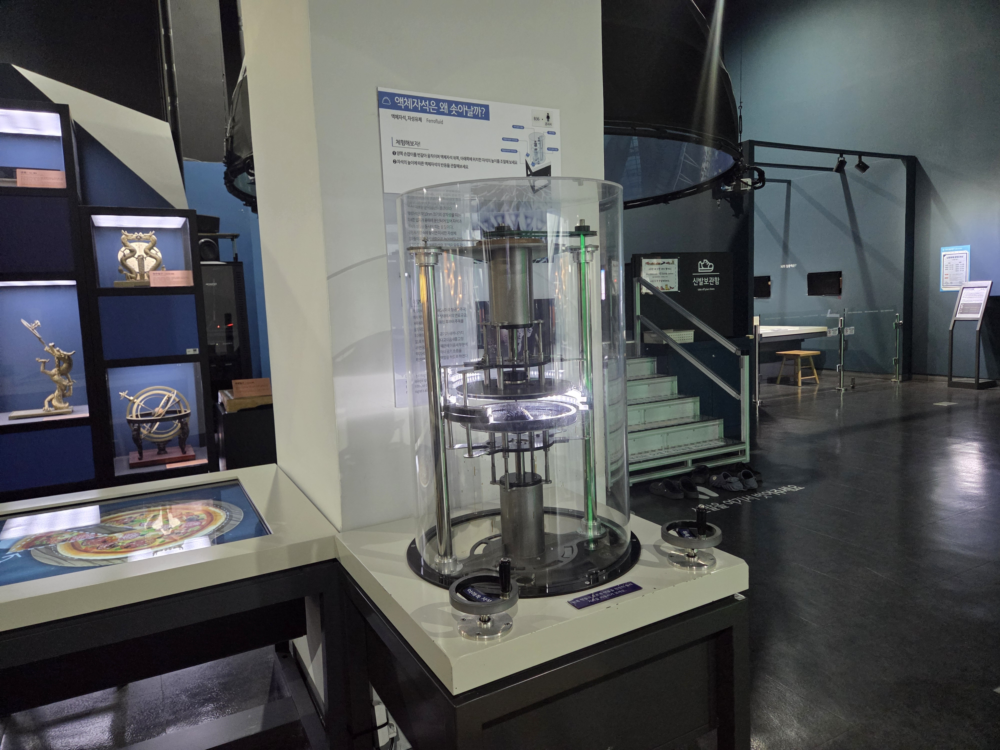

  <button class="nav-btn" onclick="goHome()">🏠 홈</button>
  <button class="nav-btn" onclick="goHall('blue')">🔵 Blue 전시실 개요</button>
  <button class="nav-btn" onclick="goBack()">⬅ 이전 페이지</button>

# B36 액체자석은 왜 솟아날까?

## 1. 전시물 기본 내용
### 1.1 전시물 이미지

  
전시 목적

  

    액체자석의 반응을 관찰해보고, 액체자석과 일반 자석 사이의 상호작용을 통해 자성체 사이의 인력과 척력에 대해 생각해본다.
    </ul>
  

  
전시 유형 : 체험형/실험탐구

  

    자석의 위치에 따른 액체자석의 변화를 관찰할 수 있는 전시물
  

### 1.2 학교 교육과정  
<!--
curriculum-table은 전시물과 연결된 학교 교육과정을 학년별로 비교하는 표이다.
내용체계 칸에는 정적 웹에 포함된 내부 교육과정 문서 링크를 넣는다.
챕터 및 단원명 칸에는 외부 교과서/교과 챕터 링크를 넣는다.
전시물과 연계성 칸에는 전시물에서 어떤 개념과 연결되는지 적는다.
비고 칸에는 학년별 수준 변화, 해설 시 유의점, 확인이 필요한 내용을 적는다.
-->

<table class="curriculum-table">
  <caption><b>학교 교육과정</b></caption>
  <thead>
    <tr>
      <th rowspan="2">교육과정 내용체계</th>
      <th colspan="2">해당 교과과정(교과서)</th>
      <th rowspan="2">전시물과 연계성</th>
      <th rowspan="2">비고</th>
    </tr>
    <tr>
      <th>학년 및 학기</th>
      <th>챕터 및 단원명</th>
    </tr>
  </thead>
  <tfoot>
    <tr>
      <td colspan="5">
        <ul>
          <li>교과챕터 및 단원명은 출판사의 교과서 pdf링크로 연결됩니다.</li>
          <li>고등2~3학년 과정은 선택교과입니다.</li>
        </ul>
      </td>
    </tr>
  </tfoot>
  <tbody>
    <tr>
          <td>
            <a class="curriculum-link-button" href="#/docs/school_curriculum/science/03_physics">
            물리학 &gt; 전기와 자기
            </a>
          </td>
          <td>고등2~3학년</td>
          <td><a class="curriculum-link-button external" href="https://ibook.vivasam.com/CBS_iBook/6655/contents/index.html?skin=basic01" target="_blank" rel="noopener">
                  II-2-01 물질의 자성 (22개정 비상교과서 물리학 pp 92-97)</a></td>
          <td>자성을 가진 물체와 그 종류에 대해 학습</td>
          <td></td>
        </tr>
<tr>
  <td>
    <a class="curriculum-link-button" href="#/docs/school_curriculum/science/common/00_common_science_elementry3-4">
    초등학교 3~4학년 > 자석의 이용
    </a>
  </td>
  <td>초등4-1</td>
  <td><a class="curriculum-link-button external" href="https://ibook.vivasam.com/CBS_iBook/1516/contents/index.html" target="_blank" rel="noopener">
      I 자석의 이용 (22개정 비상교과서 과학4-1 pp12-35)</a></td>
  <td>자석과 자성체(이 용어는 쓰지 않음) 사이의 인력, 그리고 자석끼리의 인력과 척력에 대해 학습함</td>
  <td>현상관찰위주이며 자성체, 인력, 척력이라는 용어는 쓰지 않음 주의.</td>
</tr>
  </tbody>
</table>

### 1.3 체험
##### 체험1) 일반 자석과 액체자석의 상호작용 관찰하기
1. 손잡이를 돌려 액체자석의 위아래 자석을 움직여본다.
2. 일반 자석이 가까워질 때 액체자석의 변화하는 모습을 관찰한다.

### 1.4 패널내용

  

    액체자석은 왜 솟아날까?
  

  

    
  

## 2. 기본 과학 이론
### 2.1 핵심 과학이론
- 

### 2.2 연관 과학이론

## 3. 연관 전시물
- 

## 4. 기존 해설에서의 쓰임 예시

## 5. 확장 자료

### 심화 이론

### 최신 연구

## 변경기록
| 변경일        | 작성자 | 내용 및 사유 |
| ---------- | --- | ------- |
| 2026.01.22 | 박은선 | 최초 작성   |
|            |     |         |

  <button class="nav-btn" onclick="goHome()">🏠 홈</button>
  <button class="nav-btn" onclick="goHall('blue')">🔵 Blue 전시실 개요</button>
  <button class="nav-btn" onclick="goBack()">⬅ 이전 페이지</button>

