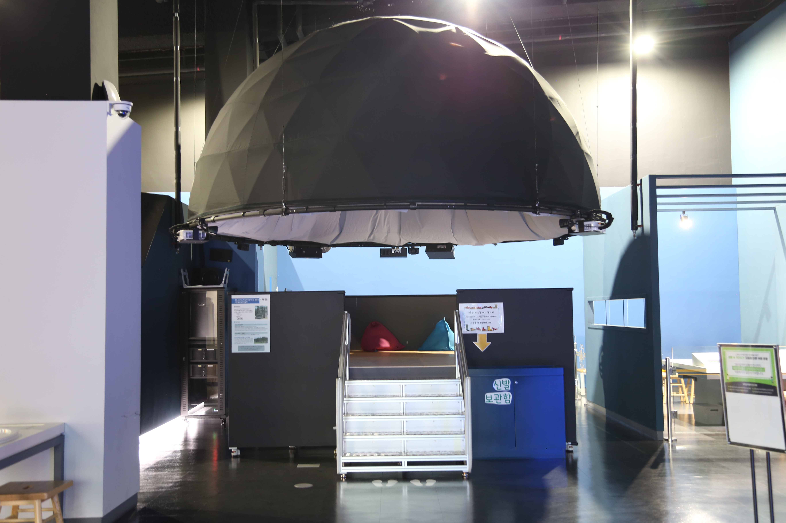

---
문서양식: 전시물
전시물 타입: 관람형, 패널
전시실: B전시실
---
#관천대 #돔_영상관

  <button class="nav-btn" onclick="goHome()">🏠 홈</button>
  <button class="nav-btn" onclick="goHall('blue')">🔵 Blue 전시실 개요</button>
  <button class="nav-btn" onclick="goBack()">⬅ 이전 페이지</button>

# 조선시대에는 하늘에서 일어나는 현상을 어떻게 관찰하였을까?

## 1. 전시물 기본 내용
### 1.1 전시물 이미지

  
전시 목적

  

    조선시대 천문 관측기구인 관천대를 모티브로 제작된 투영관에서 하늘을 보는 다양한 방식에 대해 생각해보고, 영상물을 시청한다.
    </ul>
  

### 1.2 학교 교육과정  
| 학년       | 단원  | 해당 교과 챕터 | 비고  |
| -------- | --- | -------- | --- |
| 초등 1~2학년 |     |          |     |
| 초등 3~4학년 |     |          |     |
| 초등 5~6학년 |     |          |     |
| 중학교      |     |          |     |
| 고등학교(공통) |     |          |     |
| 고등학교(선택) |     |          |     |

### 1.3 체험
##### 체험1) 돔 영상 시청하기
1. 신발을 벗고 계단을 통해 관천대에 올라간다.
2. 관천대에 올라 편한 자세로 돔 스크린을 바라본다.
3. 돔 스크린을 통해 상영되는 천체 영상을 관람해본다.

### 1.4 패널내용

  

    조선시대에는 하늘에서 일어나는 현상을 어떻게 관찰하였을까?
  

  

    
  

## 2. 기본 과학 이론
### 2.1 핵심 과학이론
- 

### 2.2 연관 과학이론

## 3. 연관 전시물
- 

## 4. 기존 해설에서의 쓰임 예시
*아래는 해당 전시물 부분만 기재되어있습니다. 해설 전문은 '업무메신저 잔디>드라이브'내의 해설서들을 참고하세요!*

>[!note]+ (반짝해설) 우주
> 	위치
> 	잔디 드라이브 > 자료실 > 1.해설시나리오_모음zip > 반짝해설 > 반짝해설_홍진주_우주.hwp
> 	작성자 : 홍진주(2024년 7월 작성)
> > [!note]- 해설 내용
> > (전략)
> >  이런 도구들을 사람을 이롭게 해주는 그릇 이라는 의미로 천문의기라고 불렀습니다. 이런 도구들을 두었던 장소가 바로 여기, 관천대입니다. 지금의 천문대와 같은 관측장소라고 생각하시면 되는데, 이 곳에 관측 기구를 두고 사용했다고 합니다. 실제 지금 창경궁에서도 관천대가 아직 남아있는데요, 그 관천대를 모티브로 만든 전시물이 이쪽에 있습니다. 제 해설이 끝난 뒤 가져서 계단을 밟고 올라가 누워서 하늘을 바라보는 시간을 가져보셔도 좋을 것 같습니다.
> >  (후략)

>[!note]+ (QR 옴니버스) 과학관에서 별을 담다
> 	위치 
> 	잔디 드라이브 > 자료실 > 1.해설시나리오_모음zip > QR북 > QR북_과학관에서 별을 담다.hwp
> 	작성자 : 엄정용(2020년 11월 작성)
> > [!note]- 해설 내용
> > (전략)
> >  혹시 여러분이 알고 있는 하늘을 관측하고, 별을 관찰하는 천문관측소는 무엇이 있나요? 요즘에는 천문대라고 해서 거대한 망원경을 놓고 더 크고, 더 선명하게 별을 관찰합니다. 시간을 과거로 돌려서 신라시대로 가면, 유명한 천문관측시설, 바로 첨성대도 있죠. 첨성대는 신라 성덕여왕이 만든 것으로 아마 일반 시민들이 가장 잘 알고 있는 유물일 겁니다.
> >  이런 천문관측시설은 서울에도 남아있습니다. 바로 네 번째 전시물 하늘을 보는 곳이라는 뜻의 ‘관천대’입니다. 관천대를 만든, 업적이 아주 많은 왕은 바로 세종대왕입니다. 우리나라에서 만들어진 첫 관천대는 세종 15년에 만들어졌습니다. 하지만 세종 때 만들었던 관천대는 일제강점기 때 파괴되었고, 우리 과학관 전시물은 1688년 숙종 14년에 축조된 관천대를 모티브로 하여 만들었습니다. 이 관천대는 창경궁에 가면 만날 수 있습니다.
> >  이제 우리는 세종대왕, 혹은 조선시대 천문학자가 되어서 관천대로 올라가 하늘의 별을 관측해보겠습니다.
> >  관천대 위에 당시 천체관측기구인 간의를 설치하고 별들들 관측했기 때문에 간의대라고도 불렸는데요. 망원경처럼 별빛을 모아 더 밝고 크게 볼 수 있는 기능을 가지고 있진 않았지만 1년 내내 한 자리를 지키고 있는 별, 북극성을 기준으로 다른 별들의 위치를 계산할 수 있었습니다. 그래서 행성이나 유성, 혜성과 같이 움직이는 천체들을 기록해두었습니다.
> >  조선시대의 밤하늘을 살펴봤습니다. 조선시대 하늘도 역시 황홀한 것 같습니다. 우리는 이렇게 4개의 전시물을 살펴봤습니다. 4개의 전시물에서는 별을 보기만 했는데요. 마지막 전시물은 우주의 소리를 들어보도록 하겠습니다. 그런데 우주는 아무것도 없는 진공이라고 알고 있는데, 과연 소리가 날까요? 궁금하시다면 다음 전시물을 찾아 QR코드를 찍어주세요!
> >  (후략)

>[!note]+ (주제해설) 별들에게 물어봐 (본 해설은 전시물을 이용해 별도 이미지를 보여주었습니다)
> 	위치 
> 	잔디 드라이브 > 자료실 > 1.해설시나리오_모음zip > 주제해설 > 주제해설_홍진주_별들에게 물어봐.hwp
> 	작성자 : 홍진주(2019년 3월 작성)
> > [!note]- 해설 내용
> > (전략)
> >  이제부터 우리는 서울시립과학관의 관천대에 올라가서 과거 우리 조상들이 보았던 밤하늘을 만나보고 별들의 이야기를 들어봅시다.
> >  편한 자리에 앉거나 누워주세요. 공간이 협소하기 때문에 서로 배려해주시면 감사하겠습니다.
> >  밤하늘을 아름답게 수놓는 별들, 그 별들을 이어놓은 모습을 우리는 별자리라고 합니다. 현재의 별자리는 총 88개로 1920년 국제천문연맹에서 결정되었습니다. 어떤 별자리들이 보이나요?
> >  현재 별자리들의 이름은 대부분 그리스 로마 신화에서 만날 수 있습니다. 독수리자리와 백조자리의 경우 신들의 왕인 제우스가 변신한 동물이고 날개달린 말인 페가수스자리는 머리카락이 뱀인 메두사의 피에서 태아난 신비의 동물이죠.
> >  그 메두사를 죽인 영웅 페르세우스자리도 보이네요. 한손에는 메두사의 머리를 가지고 있는 모습을 하고 있습니다. 또 겨울철 하늘에서 가장 멋진 모습을 하고 있는 포세이돈의 아들인 거인이자 사냥꾼인 오리온자리도 보입니다.
> >  이 많은 별자리들 중에 아주 특별한 12개의 별자리를 만나보려고 하는데요.
> >  지금 하늘에 가장 밝은 천체는 무엇일까요? 네 바로 태양입니다. 태양이 떠있는 낮에도 하늘에는 별들이 사라지지 않고 그대로 자리하고 있습니다. 그리고 지구가 태양 주위를 공전하면서 우리 지구에서 봤을 때 1년 동안 꾸준히 태양이 하늘 위를 움직이는 것처럼 보이죠.
> >  태양이 지나는 길을 황도라고 합니다. 황도에 있는 12개의 별자리를 우리는 황도 12궁이라고 합니다. 황도 12궁의 별자리들을 보면 굉장히 낯이 익을 텐데요. 바로 시작할 때 별자리 운세 볼 때 이야기했던 생일별자리 기억하시나요? 내가 태어난 날 태양이 떠있는 위치에 있는 별자리를 생일별자리라고합니다.
> >  혹시 보시면서 이상한 점 발견하셨나요? 분명 황도에는 12개의 별자리가 있다고 했는데 13개라고 느끼신 분이 계실 거예요. 그래서 몇 년 전 이제 황도 12궁이 아니라 13궁이 된다는 말도 있었어요.
> >  과거 황도 12궁을 결정할 당시와 현재의 하늘에는 변화가 있었습니다. 바로 지구의 자전축 방향이 바뀌는 세차운동인데요. 때문에 생일별자리를 의미하는 날짜와 실제 현재 태양의 위치랑은 약간 다르답니다.
> >  하지만 정해놓은 황도 12궁이 변하진 않았으니 생일별자리는 여러분이 알고 있는 대로 사용하면 되요!
> >  또 특별한 별자리 하나 더 만나보도록 할게요. 바로 북쪽하늘에 떠있는 별자리입니다.
> >  북쪽하늘에서 지구 자전축 끝에 있는 별 북극성이 있어요. 그리고 하늘의 모든 별들은 이 북극성을 기준으로 똑같이 돌고있습니다. 북극성은 작은곰자리의 꼬리 끝에 있는 별이고 엄마 곰인 큰곰자리가 그 주위를 돌고 있어요.
> >  옛날 우리 조상들은 북쪽하늘의 별자리들을 매우 중요시했습니다. 항상 그 자리를 지키고 움직이니 않는 별 북극성 때문인데요.
> >  당시에는 북극성을 왕을 의미하는 별로 생각했기 때문에 모든 별자리들이 북극성을 중심으로 이루어졌습니다.
> >  북쪽하늘에서 1년 365일 항상 제자리를 지키는 별, 북극성 주변에 모여 있는 하늘나라 왕의 궁궐 자미원, 하늘나라의 임금과 대신들이 모여서 나랏일을 의논하는 정부종합청사 태미원, 그리고 하늘나라의 백성들이 살고 있는 마을 천시원. 자미원, 태미원, 천시원 이렇게 3개를 3원이라고 불러요. 당시 사람들은 이렇게 우리 사회의 모습을 하늘의 별자리로 투영되었습니다.
> >  먼저 1년 365일 항상 같은 자리를 지키고 있는 북극성 주변으로 담벼락으로 둘러싸인 것 같은 모습의 하늘의 궁궐, 자미원이 있습니다. 자미원에는 임금과 왕비, 그리고 태자와 후궁 등 그 가족이 사는 곳이며, 하늘을 다스리기 위한 신하와 장군들이 포진하고 있는 곳이에요. 중심 부분의 5개의 별로 이루어진 북극오성이 왕의 가족들을 나타내는 별입니다. 주변에는 왕족을 보필했던 궁녀와 신하들을 의미하는 별자리 뿐 아니라 왕의 침대, 왕의 음식을 준비했던 주방 심지어 햇볕을 가리고 비를 막아주는 양산을 의미하는 별자리로 이루어져 있습니다.
> >  이쪽을 보시면 좀 더 작은 울타리가 보입니다. 이곳은 하늘나라 임금을 모시는 신하들이 모여 있는 곳, 태미원입니다. 여러 부서의 관리를 의미하는 별자리들과 호위하는 군대를 나타내는 별자리도 있어요. 그 밖에 왕이 총애했던 신하를 위한 별자리 ‘행신’과 우리가 하늘의 별들을 관측하고 연구했던 것처럼 태미원에는 천문을 관측하는 곳을 의미하는 ‘영대’가 있습니다.
> >  마지막으로 하늘나라 사람들이 사는 마을 천시원이 있어요. 시장을 관리하는 곳을 의미하는 별자리부터 시장에서 볼 수 있는 푸줏간, 보석가게, 쌀가게 등 살아가는데 필요한 것을 사고, 파는 시장의 모습이 별자리로 표현되어 있습니다. 그리고 천시원 담벼락 밖에는 나쁜 짓을 했을 때 벌을 받을 수 있는 감옥을 의미하는 별자리도 있어요.
> >  우리 조상들을 이렇게 우리가 살고 있는 세계를 투영했고 밤하늘에서 볼 수 있는 천문현상을 보고 점을 쳤습니다. 만약 임금을 나타내는 별이 깨끗하고 밝게 빛난다면 좋은 일이 생기고 혜성이 지나가거나 갑자기 밝은 별이 나타난다면 외부의 침입으로 인해 전쟁이나 역병이 발생할 것이라고 생각했어요.
> >  이렇게 당시 사람들은 어느 별이 어두워졌는지 또는 밝아졌는지, 혜성이 나타났다면 어느 별자리에서 나타나고 어느 별자리에서 사라지는지 매일매일 하늘을 관측했습니다. 하늘에서 나타나는 다양한 현상을 보고 우리 미래의 길흉화복을 점쳤습니다.
> >  (후략)

>[!note]+ 주제해설) 우주
> 	위치
> 	잔디 드라이브 > 자료실 > 1.해설시나리오_모음zip > 주제해설 > 주제해설_김형준_+우주(날짜미정).hwp
> 	작성자 : 김형준
> > [!note]- 해설 내용
> > (전략)
> >  조선시대 때 우리 조상님들은 ‘관천대’라고 하는 천문대에서 천체를 관측했는데요. 우리 과학관에서는 그 관천대를 새롭게 재현해서 실내에서 천체를 볼 수 있는 전시물을 준비했습니다. 앞에 있는 전시물이 바로 그거인데요. 위쪽에는 과거 사람들이 생각했던 둥근 하늘을 아래쪽에는 우리 조상님들의 관천대를 재현했습니다. 이 전시물은 2가지 장점이 있어요. 첫째는 날씨에 상관없이 우주를 관측하는 기분을 느낄 수 있다는 거고요. 두 번째는, 누워서 볼 수 있다는 것입니다. 우리 조상님들은 힘들게 하늘을 바라봤겠지만, 서울시립과학관에 오신 분들은 편하게 즐기다 가시면 될 것 같습니다.
> >  (후략)

## 5. 확장 자료

### 심화 이론

### 최신 연구

## 변경기록
| 변경일        | 작성자 | 내용 및 사유 |
| ---------- | --- | ------- |
| 2026.01.22 | 박은선 | 최초 작성   |
|            |     |         |

  <button class="nav-btn" onclick="goHome()">🏠 홈</button>
  <button class="nav-btn" onclick="goHall('blue')">🔵 Blue 전시실 개요</button>
  <button class="nav-btn" onclick="goBack()">⬅ 이전 페이지</button>

