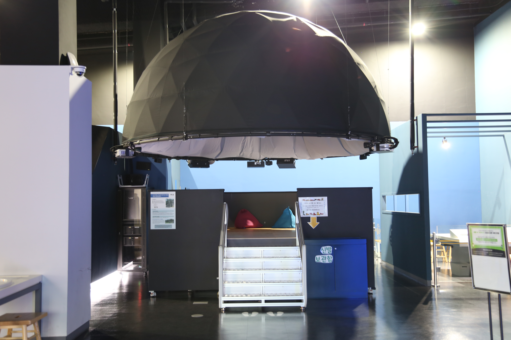

  <button class="nav-btn" onclick="goHome()">🏠 홈</button>
  <button class="nav-btn" onclick="goHall('blue')">🔵 Blue 전시실 개요</button>
  <button class="nav-btn" onclick="goBack()">⬅ 이전 페이지</button>

# B37 조선시대에는 하늘에서 일어나는 현상을 어떻게 관찰하였을까?

## 1. 전시물 기본 내용
### 1.1 전시물 이미지

  
전시 목적

  

    조선시대 천문 관측기구인 관천대를 모티브로 제작된 투영관에서 하늘을 보는 다양한 방식에 대해 생각해보고, 영상물을 시청한다.
  

  
전시 유형 : 관람형

  

    돔 영상관
  

### 1.2 학교 교육과정  
<!--
curriculum-table은 전시물과 연결된 학교 교육과정을 학년별로 비교하는 표이다.
내용체계 칸에는 정적 웹에 포함된 내부 교육과정 문서 링크를 넣는다.
챕터 및 단원명 칸에는 외부 교과서/교과 챕터 링크를 넣는다.
전시물과 연계성 칸에는 전시물에서 어떤 개념과 연결되는지 적는다.
비고 칸에는 학년별 수준 변화, 해설 시 유의점, 확인이 필요한 내용을 적는다.
-->

<table class="curriculum-table">
  <caption><b>학교 교육과정</b></caption>
  <thead>
    <tr>
      <th rowspan="2">교육과정 내용체계</th>
      <th colspan="2">해당 교과과정(교과서)</th>
      <th rowspan="2">전시물과 연계성</th>
      <th rowspan="2">비고</th>
    </tr>
    <tr>
      <th>학년 및 학기</th>
      <th>챕터 및 단원명</th>
    </tr>
  </thead>
  <tfoot>
    <tr>
      <td colspan="5">
        <ul>
          <li>교과챕터 및 단원명은 출판사의 교과서 pdf링크로 연결됩니다.</li>
          <li>고등2~3학년 과정은 선택교과입니다.</li>
        </ul>
      </td>
    </tr>
  </tfoot>
  <tbody>
    <tr>
      <td>
      </td>
      <td>1학년 1학기</td>
      <td>
        <a class="curriculum-link-button external" href="https://example.com" target="_blank" rel="noopener">
          교과 챕터 링크예시
        </a>
      </td>
      <td></td>
      <td>비고</td>
    </tr>
    <tr>
      <td>
        <a class="curriculum-link-button" href="#/docs/school_curriculum/science/common/00_common_science_elementry3-4">
          초등학교 3~4학년 &gt; 밤하늘 관찰
        </a>
      </td>
      <td></td>
      <td></td>
      <td>돔 영상 시청하기 활동 과정에서 천체의 운동과 우주에서 나타나는 현상을 관찰하고 이해함</td>
      <td></td>
    </tr>
    <tr>
      <td>
        <a class="curriculum-link-button" href="#/docs/school_curriculum/science/common/00_common_science_elementry5-6">
        초등학교 5~6학년 &gt; 지구의 운동
        </a>
      </td>
      <td></td>
      <td></td>
      <td>돔 영상 시청하기 활동 과정에서 지권의 구성과 변화 및 지구 환경 요소의 상호작용을 이해함</td>
      <td></td>
    </tr>
    <tr>
      <td>
        <a class="curriculum-link-button" href="#/docs/school_curriculum/science/common/00_common_science_elementry5-6">
        초등학교 5~6학년 &gt; 계절의 변화
        </a>
      </td>
      <td></td>
      <td></td>
      <td>돔 영상 시청하기 활동 과정에서 천체의 운동과 우주에서 나타나는 현상을 관찰하고 이해함</td>
      <td></td>
    </tr>
    <tr>
      <td>
        <a class="curriculum-link-button" href="#/docs/school_curriculum/science/common/00_common_science_mid">
        중학교 1~3학년 &gt; 태양계
        </a>
      </td>
      <td></td>
      <td></td>
      <td>돔 영상 시청하기 활동 과정에서 천체의 운동과 우주에서 나타나는 현상을 관찰하고 이해함</td>
      <td></td>
    </tr>
    <tr>
      <td>
        <a class="curriculum-link-button" href="#/docs/school_curriculum/science/common/00_common_science_mid">
        중학교 1~3학년 &gt; 별과 우주
        </a>
      </td>
      <td></td>
      <td></td>
      <td>돔 영상 시청하기 활동 과정에서 천체의 운동과 우주에서 나타나는 현상을 관찰하고 이해함</td>
      <td></td>
    </tr>
    <tr>
      <td></td>
      <td></td>
      <td></td>
      <td></td>
      <td></td>
    </tr>
    <tr>
      <td>
        <a class="curriculum-link-button" href="#/docs/school_curriculum/science/06_earth_science">
        지구과학 &gt; 태양계 천체와 별과 우주의 진화
        </a>
      </td>
      <td></td>
      <td></td>
      <td>돔 영상 시청하기 활동 과정에서 천체의 운동과 우주에서 나타나는 현상을 관찰하고 이해함</td>
      <td></td>
    </tr>
    <tr>
      <td>
        <a class="curriculum-link-button" href="#/docs/school_curriculum/science/14_planetary_space_science">
        행성우주과학 &gt; 우주탐사와 행성계
        </a>
      </td>
      <td></td>
      <td></td>
      <td>돔 영상 시청하기 활동 과정에서 천체의 운동과 우주에서 나타나는 현상을 관찰하고 이해함</td>
      <td></td>
    </tr>
    <tr>
      <td>
        <a class="curriculum-link-button" href="#/docs/school_curriculum/science/14_planetary_space_science">
        행성우주과학 &gt; 태양과 별의 관측
        </a>
      </td>
      <td></td>
      <td></td>
      <td>돔 영상 시청하기 활동 과정에서 천체의 운동과 우주에서 나타나는 현상을 관찰하고 이해함</td>
      <td></td>
    </tr>
    <tr>
      <td>
        <a class="curriculum-link-button" href="#/docs/school_curriculum/science/14_planetary_space_science">
        행성우주과학 &gt; 은하와 우주
        </a>
      </td>
      <td></td>
      <td></td>
      <td>돔 영상 시청하기 활동 과정에서 천체의 운동과 우주에서 나타나는 현상을 관찰하고 이해함</td>
      <td></td>
    </tr>
    <tr>
      <td>
        <a class="curriculum-link-button" href="#/docs/school_curriculum/science/15_history_and_culture_of_science">
        과학의 역사와 문화 &gt; 과학과 문명의 탄생과 통합
        </a>
      </td>
      <td></td>
      <td></td>
      <td>돔 영상 시청하기 활동 과정에서 과학 지식과 탐구가 기술·사회·생활 및 진로에 미치는 영향을 이해함</td>
      <td></td>
    </tr>
  </tbody>
</table>

### 1.3 체험
##### 체험1) 돔 영상 시청하기
1. 관천대
2. 조선시대의 천문 관측대로 , 또는 라고 부르기도 했다.
3. 조선시대 천문대의 양식을 나타내는 대표적인 유물이며, 17세기의 천문 관측대로서 완전한 모습을 갖추고 있다.
4. 간의
5. 의 위치를 파악하고, 땅의 지형 중 와 를 측량하며 을 정확하게 측정할 수 있는 조선시대 대표적인 천문 관측 기기이다.
6. 신발을 벗고 계단을 통해 관천대에 올라간다.
7. 관천대에 올라 편한 자세로 돔 스크린을 바라본다.
8. 돔 스크린을 통해 상영되는 천체 영상을 관람해본다.

### 1.4 패널내용

  

    조선시대에는 하늘에서 일어나는 현상을 어떻게 관찰하였을까?
  

  

    
  

## 2. 기본 과학 이론
### 2.1 핵심 과학이론

- 

### 2.2 연관 과학이론

## 3. 연관 전시물
- 

## 4. 기존 해설에서의 쓰임 예시

## 5. 확장 자료

### 심화 이론

### 최신 연구

## 변경기록
| 변경일        | 작성자 | 내용 및 사유 |
| ---------- | --- | ------- |
| 2026.01.22 | 박은선 | 최초 작성   |
|            |     |         |

  <button class="nav-btn" onclick="goHome()">🏠 홈</button>
  <button class="nav-btn" onclick="goHall('blue')">🔵 Blue 전시실 개요</button>
  <button class="nav-btn" onclick="goBack()">⬅ 이전 페이지</button>

