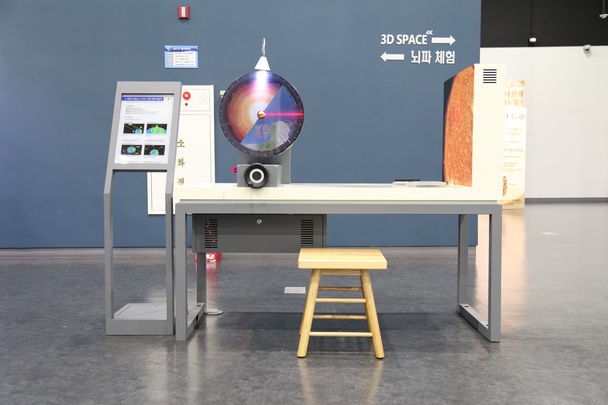

---
문서양식: 전시물
전시물 타입: 관람형, 패널
전시실: B전시실
---
#원 #호 #각과_호의_비례관계 #에라토스테네스

  <button class="nav-btn" onclick="goHome()">🏠 홈</button>
  <button class="nav-btn" onclick="goHall('blue')">🔵 Blue 전시실 개요</button>
  <button class="nav-btn" onclick="goBack()">⬅ 이전 페이지</button>

# 에라토스테네스는 지구의 크기를 어떻게 쟀을까? 

## 1. 전시물 기본 내용
### 1.1 전시물 이미지

  
전시 목적

  

    고대 그리스의 에라토스테네스가 사용한 우물의 그림자로 지구의 크기를 측정한 방법과 원리를 확인한다.
    </ul>
  

### 1.2 학교 교육과정  
| 학년       | 단원  | 해당 교과 챕터 | 비고  |
| -------- | --- | -------- | --- |
| 초등 1~2학년 |     |          |     |
| 초등 3~4학년 |     |          |     |
| 초등 5~6학년 |     |          |     |
| 중학교      |     |          |     |
| 고등학교(공통) |     |          |     |
| 고등학교(선택) |     |          |     |

### 1.3 체험
##### 체험1) 지구 모형을 통해 지구 크기 측정하기
1. 핸들을 돌려 레이저빔을 투사시킨다.
2. 레이저가 지나는 지표면의 위치를 확인한다.
3. 핸들을 돌려 지구를 회전시킨 후 회전 각도와 지표면의 거리 차이를 확인한다.
4. 레이저가 지났던 두 지점의 측정값을 이용하여 지구의 크기를 계산한다.

### 1.4 패널내용

  

    (테이블 위)에라토스테네스는 지구의 크기를 어떻게 쟀을까?
  

  

    
  

  

    (스텐딩)에라토스테네스는 지구의 크기를 어떻게 쟀을까?
  

  

    
  

  

      지구 단면 디자인
  

  

    
  

## 2. 기본 과학 이론
### 2.1 핵심 과학이론
- 

### 2.2 연관 과학이론

## 3. 연관 전시물
- 

## 4. 기존 해설에서의 쓰임 예시
*아래는 해당 전시물 부분만 기재되어있습니다. 해설 전문은 '업무메신저 잔디>드라이브'내의 해설서들을 참고하세요!*
(해설 예시 없음)

## 5. 확장 자료

### 심화 이론

### 최신 연구

## 변경기록
| 변경일        | 작성자 | 내용 및 사유 |
| ---------- | --- | ------- |
| 2026.01.22 | 박은선 | 최초 작성   |
|            |     |         |

  <button class="nav-btn" onclick="goHome()">🏠 홈</button>
  <button class="nav-btn" onclick="goHall('blue')">🔵 Blue 전시실 개요</button>
  <button class="nav-btn" onclick="goBack()">⬅ 이전 페이지</button>

