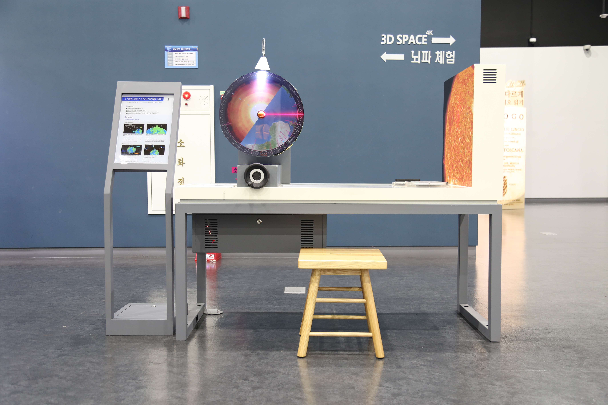

  <button class="nav-btn" onclick="goHome()">🏠 홈</button>
  <button class="nav-btn" onclick="goHall('blue')">🔵 Blue 전시실 개요</button>
  <button class="nav-btn" onclick="goBack()">⬅ 이전 페이지</button>

# B38 에라토스테네스는 지구의 크기를 어떻게 쟀을까?

## 1. 전시물 기본 내용
### 1.1 전시물 이미지

  
전시 목적

  

    고대 그리스의 에라토스테네스가 사용한 우물의 그림자로 지구의 크기를 측정한 방법과 원리를 확인한다.
    </ul>
  

  
전시 유형 : 체험형/실험탐구

  

    지구 축소모형과 레이저를 통해 원의 중심각과 호의 길이가 정비례하는 원리를 통해 지구 둘레를 측정해보는 전시물
  

### 1.2 학교 교육과정  
<!--
curriculum-table은 전시물과 연결된 학교 교육과정을 학년별로 비교하는 표이다.
내용체계 칸에는 정적 웹에 포함된 내부 교육과정 문서 링크를 넣는다.
챕터 및 단원명 칸에는 외부 교과서/교과 챕터 링크를 넣는다.
전시물과 연계성 칸에는 전시물에서 어떤 개념과 연결되는지 적는다.
비고 칸에는 학년별 수준 변화, 해설 시 유의점, 확인이 필요한 내용을 적는다.
-->

<table class="curriculum-table">
  <caption><b>학교 교육과정</b></caption>
  <thead>
    <tr>
      <th colspan="2">교육과정 내용체계</th>
      <th colspan="2">해당 교과과정(교과서)</th>
      <th rowspan="2">전시물과 연계성</th>
      <th rowspan="2">비고</th>
    </tr>
    <tr>
      <th>학년(학군)</th>
      <th>내용체계</th>
      <th>학년 및 학기</th>
      <th>챕터 및 단원명</th>
    </tr>
  </thead>
  <tfoot>
    <tr>
      <td colspan="6">교과 챕터는 외부 사이트 링크를 통해 해당 단원을 확인한다.</td>
    </tr>
  </tfoot>
  <tbody>
    <tr>
      <th>초등1~2학년</th>
      <td>
      </td>
      <td>1학년 1학기</td>
      <td>
        <a class="curriculum-link-button external" href="https://example.com" target="_blank" rel="noopener">
          교과 챕터 링크예시
        </a>
      </td>
      <td>연계성</td>
      <td>비고</td>
    </tr>
    <tr>
      <th>초등5~6학년</th>
      <td>
        <a class="curriculum-link-button" href="#/docs/school_curriculum/science/common/00_common_science_elementry5-6">
          초등학교 5~6학년 &gt; 지구의 운동
        </a>
        <a class="curriculum-link-button" href="#/docs/school_curriculum/science/common/00_common_science_elementry5-6">
          초등학교 5~6학년 &gt; 계절의 변화
        </a>
      </td>
      <td></td>
      <td></td>
      <td></td>
      <td></td>
    </tr>
    <tr>
      <th>중학교</th>
      <td>
        <a class="curriculum-link-button" href="#/docs/school_curriculum/science/common/00_common_science_mid">
          중학교 1~3학년 &gt; 태양계
        </a>
        <a class="curriculum-link-button" href="#/docs/school_curriculum/science/common/00_common_science_mid">
          중학교 1~3학년 &gt; 별과 우주
        </a>
      </td>
      <td></td>
      <td></td>
      <td></td>
      <td></td>
    </tr>
    <tr>
      <th>고등학교(공통)</th>
      <td>
        <a class="curriculum-link-button" href="#/docs/school_curriculum/science/02_science_inquiry_experiment">
          과학탐구실험1 &gt; 과학의 본성과 역사 속의 과학 탐구
        </a>
      </td>
      <td></td>
      <td></td>
      <td></td>
      <td></td>
    </tr>
    <tr>
      <th>고등학교(선택)</th>
      <td>
        <a class="curriculum-link-button" href="#/docs/school_curriculum/science/06_earth_science">
          지구과학 &gt; 태양계 천체와 별과 우주의 진화
        </a>
        <a class="curriculum-link-button" href="#/docs/school_curriculum/science/14_planetary_space_science">
          행성우주과학 &gt; 우주탐사와 행성계
        </a>
        <a class="curriculum-link-button" href="#/docs/school_curriculum/science/14_planetary_space_science">
          행성우주과학 &gt; 태양과 별의 관측
        </a>
        <a class="curriculum-link-button" href="#/docs/school_curriculum/science/15_history_and_culture_of_science">
          과학의 역사와 문화 &gt; 과학과 문명의 탄생과 통합
        </a>
      </td>
      <td></td>
      <td></td>
      <td></td>
      <td></td>
    </tr>
  </tbody>
</table>

### 1.3 체험
##### 체험1) 지구 모형을 통해 지구 크기 측정하기
1. 핸들을 돌려 레이저빔을 투사시킨다.
2. 레이저가 지나는 지표면의 위치를 확인한다.
3. 핸들을 돌려 지구를 회전시킨 후 회전 각도와 지표면의 거리 차이를 확인한다.
4. 레이저가 지났던 두 지점의 측정값을 이용하여 지구의 크기를 계산한다.

### 1.4 패널내용

  

    (테이블 위)에라토스테네스는 지구의 크기를 어떻게 쟀을까?
  

  

    
  

  

    (스텐딩)에라토스테네스는 지구의 크기를 어떻게 쟀을까?
  

  

    
  

  

      지구 단면 디자인
  

  

    
  

## 2. 기본 과학 이론
### 2.1 핵심 과학이론
- 

### 2.2 연관 과학이론

## 3. 연관 전시물
- 

## 4. 기존 해설에서의 쓰임 예시

## 5. 확장 자료

### 심화 이론

### 최신 연구

## 변경기록
| 변경일        | 작성자 | 내용 및 사유 |
| ---------- | --- | ------- |
| 2026.01.22 | 박은선 | 최초 작성   |
|            |     |         |

  <button class="nav-btn" onclick="goHome()">🏠 홈</button>
  <button class="nav-btn" onclick="goHall('blue')">🔵 Blue 전시실 개요</button>
  <button class="nav-btn" onclick="goBack()">⬅ 이전 페이지</button>

