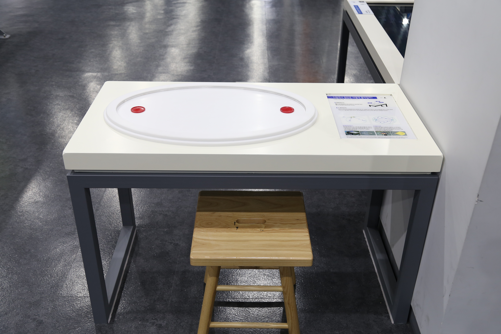

  <button class="nav-btn" onclick="goHome()">🏠 홈</button>
  <button class="nav-btn" onclick="goHall('blue')">🔵 Blue 전시실 개요</button>
  <button class="nav-btn" onclick="goBack()">⬅ 이전 페이지</button>

# B39 타원에서 원반은 어떻게 움직일까?

## 1. 전시물 기본 내용
### 1.1 전시물 이미지

  
전시 목적

  

    원뿔곡선을 작도할 수 있는 전시물을 통해 고전적 곡선의 일종인 원뿔곡선의 수학적 원리에 대해 알아본다.
  

  
전시 유형 : 체험형/실험탐구

  

    타원 내에서 두 초점 사이의 관계에 대해 실험해볼 수 있는 전시물
  

### 1.2 학교 교육과정  
<!--
curriculum-table은 전시물과 연결된 학교 교육과정을 학년별로 비교하는 표이다.
내용체계 칸에는 정적 웹에 포함된 내부 교육과정 문서 링크를 넣는다.
챕터 및 단원명 칸에는 외부 교과서/교과 챕터 링크를 넣는다.
전시물과 연계성 칸에는 전시물에서 어떤 개념과 연결되는지 적는다.
비고 칸에는 학년별 수준 변화, 해설 시 유의점, 확인이 필요한 내용을 적는다.
-->

<table class="curriculum-table">
  <caption><b>학교 교육과정</b></caption>
  <thead>
    <tr>
      <th rowspan="2">교육과정 내용체계</th>
      <th colspan="2">해당 교과과정(교과서)</th>
      <th rowspan="2">전시물과 연계성</th>
      <th rowspan="2">비고</th>
    </tr>
    <tr>
      <th>학년 및 학기</th>
      <th>챕터 및 단원명</th>
    </tr>
  </thead>
  <tfoot>
    <tr>
      <td colspan="5">
        <ul>
          <li>교과챕터 및 단원명은 출판사의 교과서 pdf링크로 연결됩니다.</li>
          <li>고등2~3학년 과정은 선택교과입니다.</li>
        </ul>
      </td>
    </tr>
  </tfoot>
  <tbody>
    <tr>
      <td>
      </td>
      <td>1학년 1학기</td>
      <td>
        <a class="curriculum-link-button external" href="https://example.com" target="_blank" rel="noopener">
          교과 챕터 링크예시
        </a>
      </td>
      <td></td>
      <td>비고</td>
    </tr>
    <tr>
      <td>
        <a class="curriculum-link-button" href="#/docs/school_curriculum/science/07_mechanics_and_energy">
          역학과 에너지 &gt; 시공간과 운동
        </a>
      </td>
      <td></td>
      <td></td>
      <td>타원 그려보기 활동 과정에서 힘과 운동의 관계 및 에너지의 전달과 전환을 실제 현상에 적용해 이해함</td>
      <td></td>
    </tr>
    <tr>
      <td>
        <a class="curriculum-link-button" href="#/docs/school_curriculum/math/07_geometry">
        기하 &gt; 이차곡선
        </a>
      </td>
      <td></td>
      <td></td>
      <td>타원 그려보기 활동 과정에서 수량 사이의 관계와 공간적 규칙을 찾아 수학적으로 표현하고 해석함</td>
      <td></td>
    </tr>
  </tbody>
</table>

### 1.3 체험
##### 체험1) 타원 그려보기
1. 타원 작도기의 끈을 팽팽하게 유지한다.
2. 자외선 펜의 버튼을 누른 채 한 바퀴 돌려 그려준다.

##### 체험2) 포물선 그려보기
1. 포물선 작도기의 레일을 한쪽 끝으로 이동한다.
2. 레일에 달린 줄을 팽팽하게 유지한다.
3. 자외선 펜의 버튼을 누른 채 한 바퀴 돌려 그려준다.

### 1.4 패널내용

  

    타원에서 원반은 어떻게 움직일까?
  

  

    
  

## 2. 기본 과학 이론
### 2.1 핵심 과학이론

- 

### 2.2 연관 과학이론

## 3. 연관 전시물
- 

## 4. 기존 해설에서의 쓰임 예시

## 5. 확장 자료

### 심화 이론

### 최신 연구

## 변경기록
| 변경일        | 작성자 | 내용 및 사유 |
| ---------- | --- | ------- |
| 2026.01.22 | 박은선 | 최초 작성   |
|            |     |         |

  <button class="nav-btn" onclick="goHome()">🏠 홈</button>
  <button class="nav-btn" onclick="goHall('blue')">🔵 Blue 전시실 개요</button>
  <button class="nav-btn" onclick="goBack()">⬅ 이전 페이지</button>

