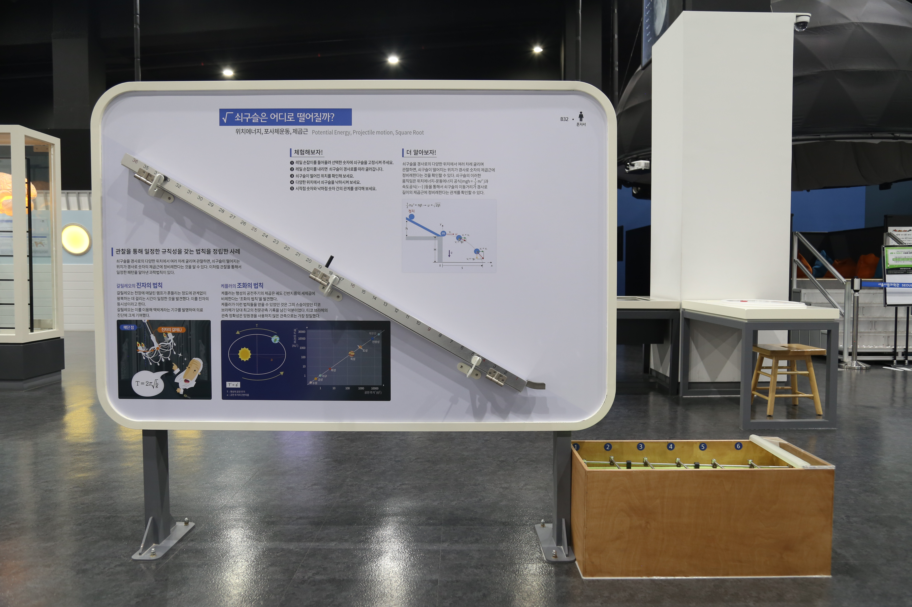

---
문서양식: 전시물
전시물 타입: 관람형, 패널
전시실: B전시실
---
#제곱수 

  <button class="nav-btn" onclick="goHome()">🏠 홈</button>
  <button class="nav-btn" onclick="goHall('blue')">🔵 Blue 전시실 개요</button>
  <button class="nav-btn" onclick="goBack()">⬅ 이전 페이지</button>

# 쇠구슬은 어디로 떨어질까?

## 1. 전시물 기본 내용
### 1.1 전시물 이미지

  
전시 목적

  

    정수의 제곱수 위치에서 굴러내려간 쇠구슬이 정수의 위치에 정확히 도착하는 현상을 통해 위치에너지와 운동속도, 도달거리의 관계를 탐구한다.
    </ul>
  

### 1.2 학교 교육과정  
| 학년       | 단원  | 해당 교과 챕터 | 비고  |
| -------- | --- | -------- | --- |
| 초등 1~2학년 |     |          |     |
| 초등 3~4학년 |     |          |     |
| 초등 5~6학년 |     |          |     |
| 중학교      |     |          |     |
| 고등학교(공통) |     |          |     |
| 고등학교(선택) |     |          |     |

### 1.3 체험
##### 체험1) 쇠구슬이 출발한 곳과 떨어진 곳의 숫자 비교하기
1. 레일 손잡이를 들어 올려 선택한 숫자에 쇠구슬을 고정시킨다.
2. 레일 손잡이를 내려 쇠구슬이 경사로를 따라 굴러 내려가게 한다.
3. 쇠구슬이 떨어진 위치를 확인한다.
4. 다양한 위치에서 쇠구슬을 낙하시켜본다.
5. 쇠구슬이 출발했던 곳의 숫자와 낙하한 곳의 숫자가 어떤 관계인지 생각해본다.

### 1.4 패널내용

  

    쇠구슬은 어디로 떨어질까?
  

  

    
  

## 2. 기본 과학 이론
### 2.1 핵심 과학이론
- 

### 2.2 연관 과학이론

## 3. 연관 전시물
- 

## 4. 기존 해설에서의 쓰임 예시
*아래는 해당 전시물 부분만 기재되어있습니다. 해설 전문은 '업무메신저 잔디>드라이브'내의 해설서들을 참고하세요!*
(해설 예시 없음)

## 5. 확장 자료

### 심화 이론

### 최신 연구

## 변경기록
| 변경일        | 작성자 | 내용 및 사유 |
| ---------- | --- | ------- |
| 2026.01.22 | 박은선 | 최초 작성   |
|            |     |         |

  <button class="nav-btn" onclick="goHome()">🏠 홈</button>
  <button class="nav-btn" onclick="goHall('blue')">🔵 Blue 전시실 개요</button>
  <button class="nav-btn" onclick="goBack()">⬅ 이전 페이지</button>

