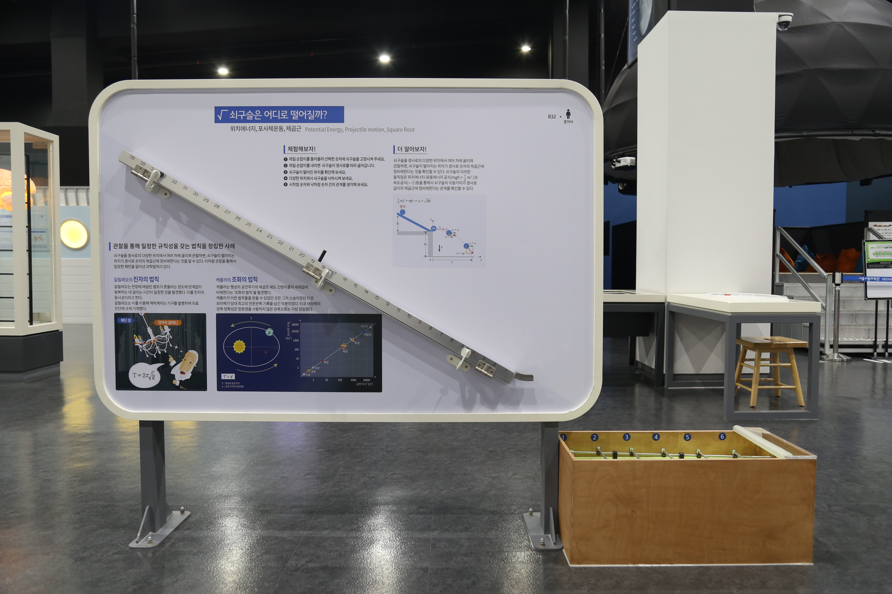

  <button class="nav-btn" onclick="goHome()">🏠 홈</button>
  <button class="nav-btn" onclick="goHall('blue')">🔵 Blue 전시실 개요</button>
  <button class="nav-btn" onclick="goBack()">⬅ 이전 페이지</button>

# B40 쇠구슬은 어디로 떨어질까?

## 1. 전시물 기본 내용
### 1.1 전시물 이미지

  
전시 목적

  

    정수의 제곱수 위치에서 굴러내려간 쇠구슬이 정수의 위치에 정확히 도착하는 현상을 통해 위치에너지와 운동속도, 도달거리의 관계를 탐구한다.
    </ul>
  

  
전시 유형 : 체험형/실험탐구

  

    높이의 제곱에 비례하는 위치에너지가 운동에너지로 전환될 때 그 이동거리에 대한 관계를 실험해볼 수 있는 전시물
  

### 1.2 학교 교육과정  
<!--
curriculum-table은 전시물과 연결된 학교 교육과정을 학년별로 비교하는 표이다.
내용체계 칸에는 정적 웹에 포함된 내부 교육과정 문서 링크를 넣는다.
챕터 및 단원명 칸에는 외부 교과서/교과 챕터 링크를 넣는다.
전시물과 연계성 칸에는 전시물에서 어떤 개념과 연결되는지 적는다.
비고 칸에는 학년별 수준 변화, 해설 시 유의점, 확인이 필요한 내용을 적는다.
-->

<table class="curriculum-table">
  <caption><b>학교 교육과정</b></caption>
  <thead>
    <tr>
      <th colspan="2">교육과정 내용체계</th>
      <th colspan="2">해당 교과과정(교과서)</th>
      <th rowspan="2">전시물과 연계성</th>
      <th rowspan="2">비고</th>
    </tr>
    <tr>
      <th>학년(학군)</th>
      <th>내용체계</th>
      <th>학년 및 학기</th>
      <th>챕터 및 단원명</th>
    </tr>
  </thead>
  <tfoot>
    <tr>
      <td colspan="6">교과 챕터는 외부 사이트 링크를 통해 해당 단원을 확인한다.</td>
    </tr>
  </tfoot>
  <tbody>
    <tr>
      <th>초등1~2학년</th>
      <td>
      </td>
      <td>1학년 1학기</td>
      <td>
        <a class="curriculum-link-button external" href="https://example.com" target="_blank" rel="noopener">
          교과 챕터 링크예시
        </a>
      </td>
      <td>연계성</td>
      <td>비고</td>
    </tr>
    <tr>
      <th>초등5~6학년</th>
      <td></td>
      <td></td>
      <td></td>
      <td></td>
      <td></td>
    </tr>
    <tr>
      <th>중학교</th>
      <td></td>
      <td></td>
      <td></td>
      <td></td>
      <td></td>
    </tr>
    <tr>
      <th>고등학교(공통)</th>
      <td>
        <a class="curriculum-link-button" href="#/docs/school_curriculum/science/01_integrated_science">
          통합과학1 &gt; 시스템과 상호작용
        </a>
        <a class="curriculum-link-button" href="#/docs/school_curriculum/science/02_science_inquiry_experiment">
          과학탐구실험1 &gt; 과학의 본성과 역사 속의 과학 탐구
        </a>
      </td>
      <td></td>
      <td></td>
      <td></td>
      <td></td>
    </tr>
    <tr>
      <th>고등학교(선택)</th>
      <td>
        <a class="curriculum-link-button" href="#/docs/school_curriculum/science/03_physics">
          물리학 &gt; 힘과 에너지
        </a>
        <a class="curriculum-link-button" href="#/docs/school_curriculum/science/07_mechanics_and_energy">
          역학과 에너지 &gt; 시공간과 운동
        </a>
      </td>
      <td></td>
      <td></td>
      <td></td>
      <td></td>
    </tr>
  </tbody>
</table>

### 1.3 체험
##### 체험1) 쇠구슬이 출발한 곳과 떨어진 곳의 숫자 비교하기
1. 레일 손잡이를 들어 올려 선택한 숫자에 쇠구슬을 고정시킨다.
2. 레일 손잡이를 내려 쇠구슬이 경사로를 따라 굴러 내려가게 한다.
3. 쇠구슬이 떨어진 위치를 확인한다.
4. 다양한 위치에서 쇠구슬을 낙하시켜본다.
5. 쇠구슬이 출발했던 곳의 숫자와 낙하한 곳의 숫자가 어떤 관계인지 생각해본다.

### 1.4 패널내용

  

    쇠구슬은 어디로 떨어질까?
  

  

    
  

## 2. 기본 과학 이론
### 2.1 핵심 과학이론
- 

### 2.2 연관 과학이론

## 3. 연관 전시물
- 

## 4. 기존 해설에서의 쓰임 예시

## 5. 확장 자료

### 심화 이론

### 최신 연구

## 변경기록
| 변경일        | 작성자 | 내용 및 사유 |
| ---------- | --- | ------- |
| 2026.01.22 | 박은선 | 최초 작성   |
|            |     |         |

  <button class="nav-btn" onclick="goHome()">🏠 홈</button>
  <button class="nav-btn" onclick="goHall('blue')">🔵 Blue 전시실 개요</button>
  <button class="nav-btn" onclick="goBack()">⬅ 이전 페이지</button>

