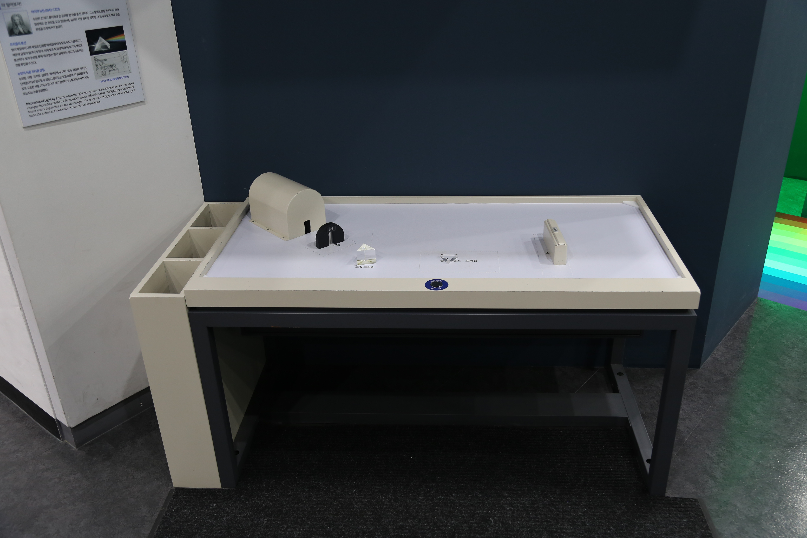

---
문서양식: 전시물
전시물 타입: 관람형, 패널
전시실: B전시실
---
#빛 #프리즘 #뉴턴의_광학실험 #무지개 #파장 #굴절

  <button class="nav-btn" onclick="goHome()">🏠 홈</button>
  <button class="nav-btn" onclick="goHall('blue')">🔵 Blue 전시실 개요</button>
  <button class="nav-btn" onclick="goBack()">⬅ 이전 페이지</button>

# 빛을 쪼개고 합칠 수 있을까?

## 1. 전시물 기본 내용
### 1.1 전시물 이미지

  
전시 목적

  

    다양한 광학 도구를 통해 빛을 굴절 및 분산시켜 백색광에 대해 탐구하고 파동으로서의 빛의 성질에 대해 알아본다.
    </ul>
  

### 1.2 학교 교육과정  
| 학년       | 단원  | 해당 교과 챕터 | 비고  |
| -------- | --- | -------- | --- |
| 초등 1~2학년 |     |          |     |
| 초등 3~4학년 |     |          |     |
| 초등 5~6학년 |     |          |     |
| 중학교      |     |          |     |
| 고등학교(공통) |     |          |     |
| 고등학교(선택) |     |          |     |

### 1.3 체험
##### 체험1) 빛의 특징을 확인하는 광학실험 해보기
1. 스위치를 누르고, 광원에서 빛이 나오는 것을 확인한다.
2. 빛의 경로에 광학 도구(프리즘, 렌즈, 거울, 슬릿)를 설치하고 광학 도구를 통과한 빛이 도착한 곳에 스크린을 설치한다.
3. 다른 방법으로 광학 도구를 설치해보고 스크린을 관찰한다.

### 1.4 패널내용

  

    빛을 쪼개고 합칠 수 있을까?
  

  

    
  

## 2. 기본 과학 이론
### 2.1 핵심 과학이론
- 

### 2.2 연관 과학이론

## 3. 연관 전시물
- 

## 4. 기존 해설에서의 쓰임 예시
*아래는 해당 전시물 부분만 기재되어있습니다. 해설 전문은 '업무메신저 잔디>드라이브'내의 해설서들을 참고하세요!*

>[!note]+ (반짝해설) 명화 속 과학
> 	위치 
> 	잔디 드라이브 > 자료실 > 1.해설시나리오_모음zip > 반짝해설 > 반짝해설_박윤실_명화 속 과학(모네에서 지드래곤까지).hwp
> 	작성자 : 박윤실(2026년 1월 작성)
> > [!note]- 해설 내용
> > (전략)
> > 첫 번째로 만나볼 화가는 인상주의의 아버지, 클로드 모네입니다.
> > 클로드 모네의 가장 유명한 작품 <인상, 해돋이>입니다. 해가 떠오르는 풍경을 밝은 색채와 얇은 붓질로 빛의 찰나를 빠르게 담아낸 그림입니다. 모네가 이 그림을 그릴 당시 화가들은 ‘아뜰리에’라고 불리는 자신들의 작업실에서 세밀한 스케치와 꼼꼼하고 두껍게 물감을 덧바르는, 시간이 많이 드는 작업 방식을 택했는데요, 당시에는 있는 그대로의 사실을 정교하게 재현해내는 기술이 실력으로 인정받던 시대였습니다. 그렇기 때문에 빛의 변화를 빠르게 채색하는 모네의 방식은 인정받기 힘들었습니다. ‘미완성된 그림 같다’, ‘인상, 느낌만 그려냈다’라는 많은 혹평이 있었습니다.
> > 
> > 하지만 다게레오 카메라의 상용화로 인해 대상을 똑같이 복제하는 기록의 의미가 사라지고 있음을 모네와 그와 함께하던 화가들은 직감하고 있었고 그들은 붓과 캔버스를 들고 아뜰리에 밖으로 나갑니다.
> > 
> > 당시 산업혁명으로 인해 물감 안료등이 다양해지고, 특히 금속 튜브 물감이 만들어지면서 화가들은 야외에서 빛의 물리적 변화를 관찰하는 풍경화, 일상화를 그려냅니다. 또 이런 배경엔 뉴턴의 빛 이론도 큰 영향을 미쳤습니다. 전시물을 통해 살펴볼까요?
> > 
> > **체험하기** : 프리즘을 통해 빛이 7개의 색으로 나뉘는 것을 눈으로 보여준다.**
> > 
> > 뉴턴은 삼각기둥의 프리즘이라는 도구로 빛에 대한 실험을 진행합니다. 어두운 방 안에서 밝은 태양빛, 즉 백색광을 이곳에 투과시켰는데요, 백색광이 프리즘을 통과하면서 지금 보이는 것과 같이 여러 색으로 나뉘게 되었고 또 이 빛들이 합쳐지며 다시 백색광이 된다는 사실을 증명하였습니다. 옆으로 이동해볼까요?
> >  (후략)

>[!note]+ (반짝해설) 빛으로 보는 바다
> 	위치 
> 	잔디 드라이브 > 자료실 > 1.해설시나리오_모음zip > 반짝해설 > 반짝해설_김다빈_연결(빛으로 보는 바다).hwp
> 	작성자 : 김다빈(2025년 11월 작성)
> > [!note]- 해설 내용
> > (전략)
> >  전시관으로 들어오는 길에 우리 지구와 가장 가까운 별에서 온 빛을 보셨습니다. 어떤 별일까요? 맞습니다. 태양빛을 보셨죠. 태양빛은 무슨 색이죠? 맞아요. 창문으로 들어오는 햇빛은 희게 보였습니다.
> >  
> >  이 흰빛이 지구에 닿아 바다를 비추면 어째서 파란색으로 보이는지 알아보겠습니다.
> >  
> >  먼저 질문 한 가지 드려보겠습니다. 바다는 무슨 색인가요? 대부분 파란색이라고 답변해주셨는데요.
> >  하지만 손으로 바닷물을 떠서 보면 어떤가요? 파란색인가요? 아니죠. 투명합니다.
> >  그럼 투명한 물이 왜 멀리서 보면 파랗게 보일까요? 그 비밀은 바로 ‘빛’에 있습니다.
> >  
> >  (전자기 파장 스펙트럼 사진)
> >  우리가 무언가를 볼 수 있는 것은 모두 빛이 눈에 들어오기 때문입니다. 빛은 여러 종류의 파장, 그러니까 다양한 속도를 갖고 있습니다. 그 중에서도 우리 눈에 보이는 영역을 눈에 보이는 빛이라는 의미에서 ‘가시광선’이라고 불러요.
> >  이 가시광선 역시 속도, 즉 파장에 따라 다른 색깔이 보이기 때문에 이것을 나눠줄 수 있습니다.
> >  
> >  (프리즘, 슬릿 전시물)
> >  이쪽에 있는 전시물을 같이 볼까요? 투명한 삼각기둥은 프리즘이라는 도구입니다. 프리즘은 빛을 속도별로 나눠주는데요. 눈에 보이는 빛, 가시광선은 어떻게 나눠지는지 알아보겠습니다.
> >  
> >  햇빛이나 전등의 불빛은 하얗게 보이지만, 사실 여러 색의 빛이 섞여 있습니다. 이 하얀 빛 속에 우리가 무지개색으로 표현하는 빨강, 주황, 노랑, 초록, 파랑, 남색, 보라색이 모두 들어 있죠. 이 빛들은 색깔마다 속도가 조금씩 다른데요. 하얀 빛을 프리즘에 통과시켜볼까요? 
> >  
> >  (작동) 쨘! 이렇게 무지개처럼 여러 색으로 갈라졌습니다. 이렇게 빛이 가진 여러 파장의 색이 연속되어 나타난 것을 ‘스펙트럼’이라고 부릅니다. 그중에서도 연속스펙트럼이라고 부릅니다.
> >  (슬릿) 여기 빨간빛이 에너지가 가장 작고, 파란빛 쪽으로 갈수록 에너지가 커집니다.
> >  
> >  (수심별 빛 파장 도달 사진) 이렇게 다양한 색의 빛은 바다 속에 들어가면 서로 다른 운명을 맞는데요. 이 사진을 함께 볼까요? 이 파란 빛의 에너지 크기에 바다가 파란색으로 보이는 이유가 숨어있습니다. 바닷속에서는 에너지가 작은 빨간빛은 모두 흡수되고, 에너지가 큰 파란빛만이 물 속 깊은 곳까지 도달할 수 있습니다. 이렇게 바다 깊은 곳에서 반사된 파란빛이 우리 눈에 도달하기 때문에 우리는 바다를 파란색으로 보게 되죠.
> >  
> >  바다 속 생물들은 영리하게도 이 파란색을 이용해 살아남기도 합니다. 옆쪽으로 가볼까요?
> >  (후략)

>[!note]+ 전관해설
> 	위치
> 	잔디 드라이브 > 자료실 > 1.해설시나리오_모음zip > 단체프로그램 해설 시나리오 > 하반기_(초등)단체프로그램 전시 해설.hwp
> 	작성자 : 권오혁, 유보람, 최선주(2023년 8월 작성)
> > [!note]- 해설 내용
> > (전략)
> >  두 번째 무지개를 만날 시간! 자 여기에 삼각형 모양의 도형이 있는데요, 이것은 ‘프리즘’이라고 부릅니다. 이 프리즘을 이용하면 무지개를 만날 수 있습니다! 이 프리즘에 빛을 쏴주면? 무지개가 보이나요? 빛은 무조건 어떻게 나아간다고 했죠? 네 직진합니다. 직진하는 빛이 프리즘을 만나 두 번 방향이 바뀌게 되는건데요, (위치를 가리키며)이 두 경계면에서 빛은 두 번 굴절하게 됩니다. 그런데 우리가 꼭 알고 가야 하는 사실! 빛은 직진하지만, 일직선은 아니라는 것! 바로 이렇게(팔을 웨이브 하며) 파도처럼 나아갑니다. 이 빛의 파도를 ‘파장’이라고도 부르는데 빛의 색깔에 따라 파장의 길이가 달라져요. 그래서 직진하는 빛이 색깔에 따라 굴절되는 각도도 달라지게 되어 우리는 이런 형태의 빨주노초파남보~ 무지개를 볼 수 있는 거랍니다. 비 온 뒤 무지개를 만날 수 있는 이유는 물방울이 프리즘의 역할을 해주기 때문이죠! 그리고 또 하나! 자연의 무지개는 편광의 원리도 숨어 있어요. (편광 파동 이미지) 태양 빛은 모든 방향에서 파도치며 직진해요. 그런데 물방울을 만나 굴절되면서 아치 방향의 파도만 살아남아서 보이는 것이기 때문에(무지개-편광 동영상) 그 방향의 수직인 편광필름으로 보면 무지개가 사라지는 모습을 확인해볼 수 있어요. 
> >  이번엔 이 편광필름을 이용해 우리 선생님의 얼굴을 사라지게 해볼 거예요. 첫 번째 편광필름은 가로로 들어오는 빛의 파도만 통과할 수 있게 하고, 두 번째 편광필름은 세로로 들어오는 빛의 파도만 통과할 수 있게 각도를 틀어주면 빛의 파도는 어느 방향으로도 통과할 수 없게 되어 선생님의 얼굴이 보이지 않게 되는 거죠. 
> >  자 그런데 이런 도구들을 잘 이용하면 빛을 아예 통과시키지 못하게 만드는 것이 아니라 나만 안 보이게 하는 투명 방패를 만들 수 있어요. 여기 이 볼록렌즈는 이렇게 빛을 한 지점으로 모았다가 다시 퍼트려요. 이 볼록렌즈들을 미세하게 배치시키면 렌티큘러 렌즈가 되는데요. (뒤쪽으로 이동하면서)
> >  (후략)

>[!note]+ (주제해설) 바람과 빛, 그리고 가을
> 	위치 
> 	잔디 드라이브 > 자료실 > 1.해설시나리오_모음zip > 주제해설 > 주제해설_엄정용_바람과 빛, 그리고 가을.hwp
> 	작성자 : 엄정용(2019년 10월 작성)
> > [!note]- 해설 내용
> > (전략)
> >  혹시 가을 관련된 알고 있는 사자성어 있나요? 흔히 많이 알고 있는 사자성어는 ‘천고마비’가 있고, 애국가 3절에도 가을 관련 내용이 있습니다. 두 내용 모두 가을하늘이 높고 더 푸르다는 내용을 담고 있는데요.
> >  그렇다면 왜 가을에는 하늘이 더 파랗게 보일까요? 그 이유는 빛에 숨어있습니다. 빛을 보면 하얀색으로 보이지만, 그 속을 들여다보면 우리가 아는 무지개로 보입니다.(프리즘) 이렇게 무지개 색으로 보이는 빛 때문에 하늘이 파랗게 보일 수 있는데요. 먼저 하늘이 파랗게 보이는 이유는 빛이 오면서 공기 덩어리와 수증기, 먼지 등에 부딪치면서 퍼지는 산란이 일어나게 됩니다. 이 때 파란색 빛이 우리 눈에 잘 보이게끔 퍼지게 됩니다. 그래서 하늘이 파랗게 보이는데요. 파란색 빛이 잘 보이는 이유는 빛 마다 고유의 파장을 가지고 있습니다.(테블릿) 빨간 빛은 파장이 길어서 잘 부딪치지 않아 산란이 잘 일어나지 않고, 푸른빛으로 가면 갈수록 파장이 짧아져서 산란이 많이 일어나게 됩니다.
> >  자, 그렇다면 가을 하늘은 왜 더 파랗게 보일까요? 그 이유는 아까도 말했지만, 수증기, 공기, 먼지 등에 의해서 빛이 산란이 되는데, 다른 빛도 조금씩 산란이 됩니다. 하지만 가을이 되면 건조한 바람이 불어와 수증기와 먼지가 거의 없게 됩니다. 그래서 대기층에는 거의 대부분이 공기인데, 수증기나 먼지가 없어서 다른 빛은 거의 산란되지 않고 공기에 의해 파란 빛만 산란하게 됩니다. 그래서 다른 빛에 영향을 받지 않고 푸른빛만이 많이 산란하기 때문에 더 푸르게 보이는 겁니다.
> >  이렇게 가을하늘이 더 푸른 이유를 살펴봤습니다. 우리는 마지막으로 빛과 가을 단풍 이야기를 하러 가보겠습니다.
> >  (후략)

>[!note]+ (주제해설) 빛의 모든 것
> 	위치
> 	잔디 드라이브 > 자료실 > 1.해설시나리오_모음zip > 주제해설 > 주제해설_윤민애_빛의 모든 것.hwp
> 	작성자 : 윤민애(2019년 3월 작성)
> > [!note]- 해설 내용
> > (전략)
> >  뉴턴하면 무엇이 떠오르시나요? 뉴턴은 만유인력과 운동의 법칙 등과 같은 업적을 많이 남겼는데요, 그는 색에도 관심이 아주 많았습니다.
> >  고대 그리스 학자들은 색을 물체 자체가 가진 고유한 성질이라고 생각했습니다. 사과가 빨갛게 보이는 이유는 사과가 고유한 성질인 빨간색을 가지고 있기 때문이라고 생각했습니다. 
> >  하지만 색을 물체 자체가 가지고 있는 고유한 성질로 보면, 나타났다 사라지는 무지개의 색은 설명하기 어려운 현상이었습니다. 그래서 무지개의 색은 진정한 색이 아니라는 식으로 피해갔는데요.
> >  하지만 뉴턴에게 이런 설명은 만족스럽지 않았죠. 뉴턴은 이 프리즘을 이용한 실험으로 빛의 본성을 밝혀내게 됩니다. 프리즘을 통과한 빛은 이렇게 빨간색부터 보라색까지 나누어지게 됩니다. 옛날 사람들은 이 빛은 프리즘에서 나오는 빛이라고 생각했죠.
> >  뉴턴은 프리즘에서 나누어진 빛 중 하나의 빛만을 다시 프리즘에 통과시켰습니다. 그 당시의 상식으로는 다시 무지갯빛이 나와야했지만 예를 들어 빨간 빛만을 다시 프리즘에 통과시켰을 때 빨간 빛만이 나오는 것을 확인했습니다.
> >  그리고 뉴턴은 프리즘으로 나눈 빛을 다시 합쳐보았습니다. 합쳐진 빛은 다시 백색광이 되었습니다. 이렇게 뉴턴은 백색광은 흰색의 단색광이 아닌 스펙트럼을 통해 나온 빛들이 합쳐진 빛이라는 것을 알게 되었습니다.
> >  여기서는 여러 렌즈를 가지고 빛이 나아가는 방향을 바꾸고 또 빛을 나누고 합쳐볼 수 있습니다. 몇 가지 렌즈로 체험을 해보도록 하겠습니다. 빛을 모으는 렌즈는 무엇일까요? 네 아까 빛으로 물 끓이기 전시물에서 보았던 볼록렌즈입니다. 그리고 빛을 퍼트리는 렌즈도 있습니다. 바로 홀쭉한 오목렌즈이죠.
> >  (후략)

## 5. 확장 자료

### 심화 이론

### 최신 연구

## 변경기록
| 변경일        | 작성자 | 내용 및 사유 |
| ---------- | --- | ------- |
| 2026.01.22 | 박은선 | 최초 작성   |
|            |     |         |

  <button class="nav-btn" onclick="goHome()">🏠 홈</button>
  <button class="nav-btn" onclick="goHall('blue')">🔵 Blue 전시실 개요</button>
  <button class="nav-btn" onclick="goBack()">⬅ 이전 페이지</button>

