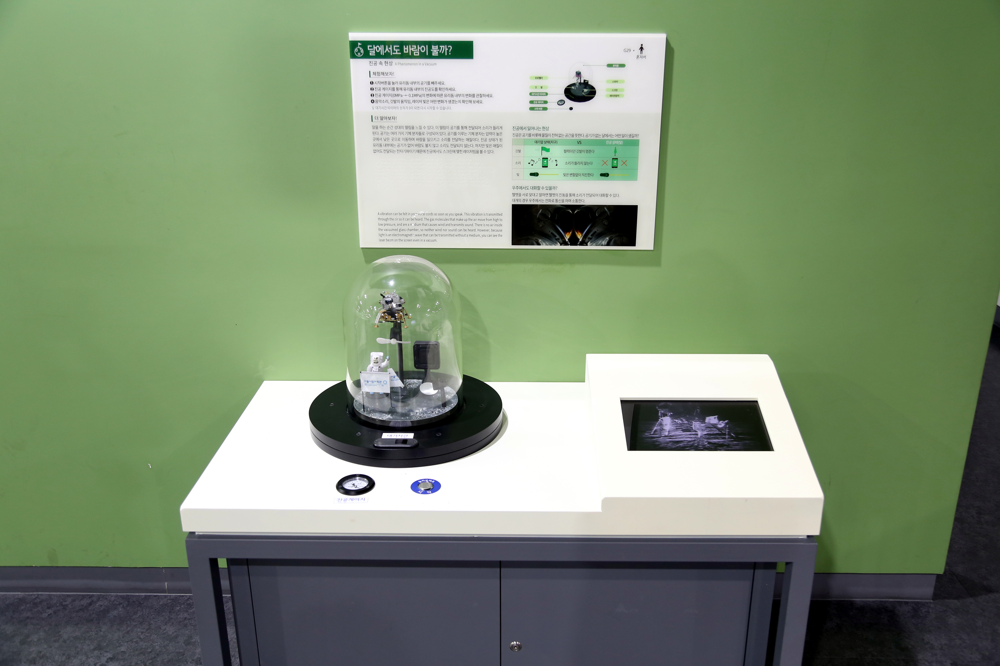

---
문서양식: 전시물
전시물 타입: 관람형, 패널
전시실: B전시실
---
#진공 #달 #아폴로11호

  <button class="nav-btn" onclick="goHome()">🏠 홈</button>
  <button class="nav-btn" onclick="goHall('blue')">🔵 Blue 전시실 개요</button>
  <button class="nav-btn" onclick="goBack()">⬅ 이전 페이지</button>

# 달에서도 바람이 불까?

## 1. 전시물 기본 내용
### 1.1 전시물 이미지

  
전시 목적

  

    진공 챔버의 공기를 빼면서 대기상태와 진공에서 소리와 빛이 전달되는지 확인하고 소리가 전달되려면 매질이 필요하다는 것을 이해한다.
    </ul>
  

### 1.2 학교 교육과정  
| 학년       | 단원  | 해당 교과 챕터 | 비고  |
| -------- | --- | -------- | --- |
| 초등 1~2학년 |     |          |     |
| 초등 3~4학년 |     |          |     |
| 초등 5~6학년 |     |          |     |
| 중학교      |     |          |     |
| 고등학교(공통) |     |          |     |
| 고등학교(선택) |     |          |     |

### 1.3 체험
##### 체험1. 진공 상태에서의 깃발의 움직임, 소리, 빛의 상태 관찰하기
1. 시작버튼을 눌러 유리돔 내부의 공기를 빼주세요.
2. 진공 게이지를 통해 유리돔 내부의 진공도를 확인하세요.
3. 진공 게이지(OMPa>-0.1MPa)의 변화에 따른 유리돔 내부의 변화를 관찰하세요
4. 백색광이 나오는 손전등을 이용하여 그림이나 사물의 실제 색을 확인한다.
5. 음악소리, 깃발의 움직임, 레이저 빛은 어떤 변화가 생겼는지 확인해 보세요.
<ul>※ 대기시간 타이머의 숫자가 0이 되면 다시 시작할 수 있습니다.</ul>

### 1.4 패널내용

  

    달에서도 바람이 불까?
  

  

    
  

## 2. 기본 과학 이론
### 2.1 핵심 과학이론
- 

### 2.2 연관 과학이론

## 3. 연관 전시물
- 

## 4. 기존 해설에서의 쓰임 예시
*아래는 해당 전시물 부분만 기재되어있습니다. 해설 전문은 '업무메신저 잔디>드라이브'내의 해설서들을 참고하세요!*
>[!note]+ (반짝해설) 우주
> 	위치
> 	잔디 드라이브 > 자료실 > 1.해설시나리오_모음zip > 반짝해설 > 반짝해설_최영진_우주.hwp
> 	작성자 : 최영진(2025년 7월 작성)
> > [!note]- 해설 내용
> > (전략)
> >  정답은 전시물을 통해 공개하겠습니다. (전시물 버튼) 자 지금은 이렇게 소리도 나오고 바람도 불어서 깃발이 휘날리고 있는데요, 진공 게이지가 진공 상태에 가까워지면서 소리가 점점 작아지더니 들리지 않네요. 또 바람에 불던 깃발도 결국 멈췄습니다.
> >  
> >  바람은 공기의 흐름으로 인해 발생하고, 소리는 공기를 매개로 소리의 파동이 전달됩니다. 그렇기 때문에 공기가 없는 달에서는 바람이 불지 않고, 소리도 들리지 않는 것이죠.
> >  
> >  그렇다면 달에는 왜 공기가 없을까요? 사실 아주 미량의 기체 분자들이 존재하긴 합니다. 하지만, 달은 지구보다 훨씬 작아서 중력이 지구의 약 6분의 1 수준밖에 되지 않아요. 기체 분자들은 끊임없이 움직이는데, 달의 약한 중력으로는 이 활발하게 움직이는 기체 분자들을 붙잡아 둘 힘이 부족합니다.
> >  
> >  따라서 달은 바람이 불지 않는 고요한 공간이랍니다. 그래서 달에 간 우주인들이 남긴 발자국이 수십 년이 지나도 그대로 남아있어요. 바람이 없으니 발자국을 지울 힘이 없는 거죠.
> >  
> >  이런 달에 가기 위해 우리는 커다란 로켓을 쏘아 올렸습니다. 사진을 함께 볼까요?
> >  (후략)

## 5. 확장 자료

### 심화 이론

### 최신 연구

## 변경기록
| 변경일        | 작성자 | 내용 및 사유 |
| ---------- | --- | ------- |
| 2026.01.22 | 박은선 | 최초 작성   |
|            |     |         |

  <button class="nav-btn" onclick="goHome()">🏠 홈</button>
  <button class="nav-btn" onclick="goHall('blue')">🔵 Blue 전시실 개요</button>
  <button class="nav-btn" onclick="goBack()">⬅ 이전 페이지</button>

