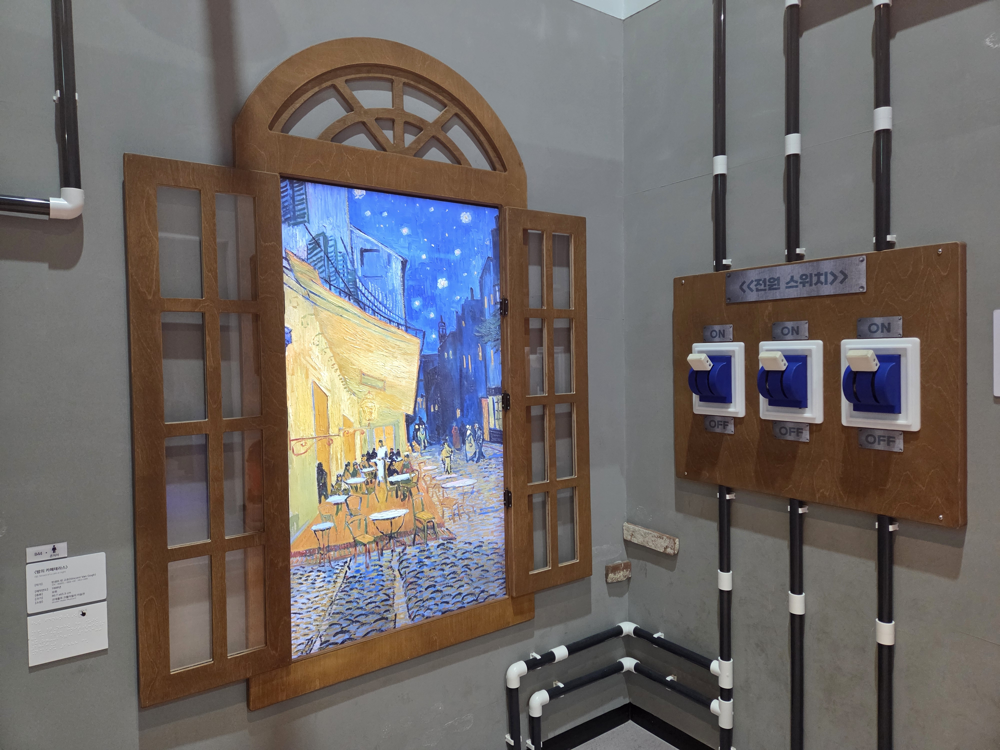

---
문서양식: 전시물
전시물 타입: 관람형, 패널
전시실: B전시실
---
#명화_속_과학 #빛공해

  <button class="nav-btn" onclick="goHome()">🏠 홈</button>
  <button class="nav-btn" onclick="goHall('blue')">🔵 Blue 전시실 개요</button>
  <button class="nav-btn" onclick="goBack()">⬅ 이전 페이지</button>

# 밤의 카페테라스

## 1. 전시물 기본 내용
### 1.1 전시물 이미지

  
전시 목적

  

    과학기술로 인해 화가보다 더 실제와 똑같은 모습을 저장하는 카메라가 생겨난 이후 예술계의 화풍에 큰 변화가 일어났다. 사실적인 그림을 그리기보다 순간순간의 인상을 그려낸 신인상주의 화가, 그리고 화가 자신의 감정을 표현한 표현주의 화가의 그림들이 들어있는 카메라 속에서 그림과 관련된 과학 원리를 탐색해본다.
    <ul><li>밤의 카페테라스 - 인공조명인 가스등이 나타난 당시 시대상을 나타낸 그림을 통해 인공조명이 줄어들 때의 밤하늘의 별빛 변화를 체험해보고, 도심의 빛공해에 대해 생각해본다.<li></ul>
    </ul>
  

### 1.2 학교 교육과정  
| 학년       | 단원  | 해당 교과 챕터 | 비고  |
| -------- | --- | -------- | --- |
| 초등 1~2학년 |     |          |     |
| 초등 3~4학년 |     |          |     |
| 초등 5~6학년 |     |          |     |
| 중학교      |     |          |     |
| 고등학교(공통) |     |          |     |
| 고등학교(선택) |     |          |     |

### 1.3 체험
##### 체험1) 인공광원이 사라진 후 하늘 관찰하기
1. 차단기를 하나씩 내려 그림 속 인공광원을 끈다.
2. 밤하늘의 별이 점점 더 잘 관측되는 것을 확인한다.
3. 차단기를 다시 올려준다.

### 1.4 패널내용
(패널 없는 전시물) 

## 2. 기본 과학 이론
### 2.1 핵심 과학이론
- 

### 2.2 연관 과학이론

## 3. 연관 전시물
- 

## 4. 기존 해설에서의 쓰임 예시
*아래는 해당 전시물 부분만 기재되어있습니다. 해설 전문은 '업무메신저 잔디>드라이브'내의 해설서들을 참고하세요!*

>[!note]+ (반짝해설) 우주
> 	위치
> 	잔디 드라이브 > 자료실 > 1.해설시나리오_모음zip > 반짝해설 > 반짝해설_최영진_우주.hwp
> 	작성자 : 최영진(2025년 7월 작성)
> > [!note]- 해설 내용
> > (전략)
> >  이 전시물을 한번 살펴볼까요? 여러분들이 잘 알고 있는 고흐의 작품, 밤의 카페테라스입니다. 이 작품에선 어떤 것들이 보이나요? 별도 보이고, 또 화려한 카페테라스도 보이네요.
> >  그런데, 이 별을 보다 더 잘 보려면 어떻게 해야 할까요? 전시물의 스위치를 하나씩 꺼보겠습니다. 건물들에서 나오는 반짝이는 빛도, 화려한 카페테라스의 조명도 끄고 나니 별만을 바라볼 수 있게 되었네요. <전시물 영상 시청>
> >  실제 현실에선 어떨까요? 이 전시물처럼 모든 인공 빛을 차단할 수 있을까요? 어렵겠죠. 또 우리 지구에는 인공 빛뿐만 아니라, 달빛, 태양 빛, 구름, 안개 등이 있는데요, 이는 천체관측에 방해 요소로 작용하고 있습니다. 
> >  이뿐만 아니라 지상에는 지구를 덮고 있는 대기권이 있습니다. 이 대기권이 특정 파장의 빛을 흡수하거나 산란시킵니다. 특히 자외선, X선, 감마선, 그리고 특정 적외선 파장이 차단되어 지상에선 이를 통한 관측이 불가능합니다. 
> >  
> >  따라서, 우주에서 이러한 모든 파장의 빛을 관측하는 것이 훨씬 더 다양한 우주의 모습을 파악할 수 있어 (지상에서 관측하는 것보다) 유리합니다. 보여주는 빛에 대해 알아보았습니다. 이제 우리는 밤하늘의 아름다운 빛을 만나러 가보겠습니다.
> >  
> >  그래서 망원경의 경통 부분만 떼서 우주로 보낸 우주망원경이 있습니다. (허블존) 이쪽으로 이동해볼게요. 여러분이 알고 있는 우주망원경이 있나요? (허블 이름에 손짓) 네 맞아요. 우주팽창설을 주장했던 허블의 위대한 업적을 기리고자 그의 이름 붙인 허블우주망원경이 있죠. _<허블우주망원경 사진>_ 이 망원경은 1990년 미국항공우주국(NASA)가 천체관측을 위해 쏘아 올린 후 2025년인 지금까지도 운용되고 있습니다. 
> >  
> >  그리고 _<제임스웹 우주망원경 사진>_ 2021년 아리안5 로켓에 실려 발사된 제임스웹 우주망원경도 있습니다. 굉장히 독특하게 생겼죠. 허블 우주 망원경처럼 원통형 구조물이 없이 이렇게 삼각형 판 위에 육각형의 거울이 바로 드러나 있습니다.
> >  이 제임스웹 망원경은 2022년 7월 11일에 첫 촬영 이미지를 공개하며 성공적인 임무 시작을 알렸습니다. _<제임스웹으로 찍은 사진 3장>_ 이것이 바로 제임스웹이 찍은 첫 사진들입니다. 매우 신비롭고 경의롭네요. _<남쪽고리성운>_ 이 사진을 볼까요? 이 사진은 남쪽고리성운입니다. 가운데 반짝반짝 빛나는 별 보이나요? 이 별은 죽어가고 있습니다. 별이 죽어가면서 가스와 먼지가 나오는 모습이지만, 이 모습이 우리 눈에는 우주가 만든 예술 작품처럼 보이네요. 같은 성운을 허블망원경도 2009년쯤 찍은 적이 있습니다. 어떤가요? 성능의 차이가 확연히 느껴집니다. 허블 망원경은 가시광선 영역을 관측하였고, 제임스웹 망원경은 적외선 영역을 관측하였습니다. 적외선은 가시광선보다 긴 파장을 가지고 있어 먼지구름을 더 잘 투과하기 때문에, 제임스웹이 찍은 사진에선 허블망원경이 볼 수 없었던 성운의 미세한 구조와 여러 겹의 동심원까지 더 자세하게 볼 수 있었습니다. 우주 관측 기술이 끊임없이 발전하고 있다는 것을 알 수 있었어요. 
> >  
> >  이렇게 망원경의 시초부터 우주망원경까지 알아봤는데, 우주에 망원경이 아닌 우리 인간이 간다면 어떻게 될까요? 둥둥 떠다니겠죠? 그러면 어떨 것 같아요? 재밌을 것 같지만 한편으론, 어지러울 수 있겠죠? 즉 우주멀미를 느끼게 될 거예요. 이쪽으로 이동해볼까요?
> >  (후략)

## 5. 확장 자료

### 심화 이론

### 최신 연구

## 변경기록
| 변경일        | 작성자 | 내용 및 사유 |
| ---------- | --- | ------- |
| 2026.01.22 | 박은선 | 최초 작성   |
|            |     |         |

  <button class="nav-btn" onclick="goHome()">🏠 홈</button>
  <button class="nav-btn" onclick="goHall('blue')">🔵 Blue 전시실 개요</button>
  <button class="nav-btn" onclick="goBack()">⬅ 이전 페이지</button>

