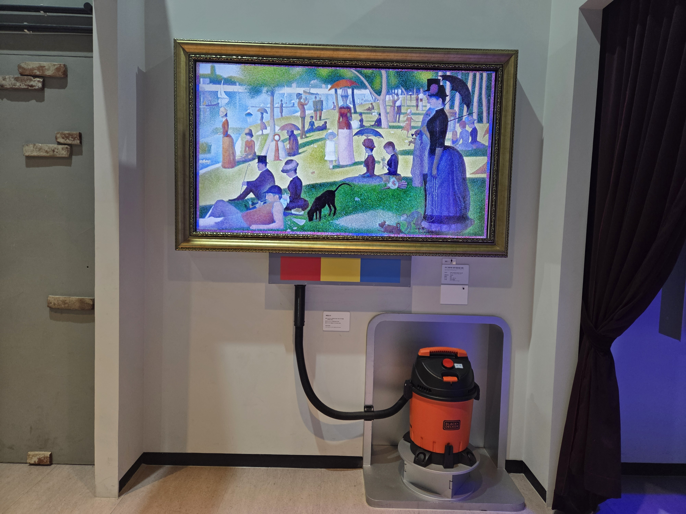

  <button class="nav-btn" onclick="goHome()">🏠 홈</button>
  <button class="nav-btn" onclick="goHall('blue')">🔵 Blue 전시실 개요</button>
  <button class="nav-btn" onclick="goBack()">⬅ 이전 페이지</button>

# B45 라그랑자트 섬의 일요일 오후

## 1. 전시물 기본 내용
### 1.1 전시물 이미지

  
전시 목적

  

    과학기술로 인해 화가보다 더 실제와 똑같은 모습을 저장하는 카메라가 생겨난 이후 예술계의 화풍에 큰 변화가 일어났다. 사실적인 그림을 그리기보다 순간순간의 인상을 그려낸 신인상주의 화가, 그리고 화가 자신의 감정을 표현한 표현주의 화가의 그림들이 들어있는 카메라 속에서 그림과 관련된 과학 원리를 탐색해본다.
    <ul><li>라 그랑자트 섬의 일요일 오후 - 점묘화법을 통해 묘사된 다양한 색채와 빛을 감상하고, 점(화소)으로 묘사되는 현대의 모니터 구조에 대해 생각해보며, 다양한 색을 만들어내는 삼원색의 원리를 알아본다.<li></ul>
    </ul>
  

  
전시 유형 : 체험형

  

    색의 3원색을 제거해볼 수 있는 청소기가 있는 전시물
  

### 1.2 학교 교육과정  
<!--
curriculum-table은 전시물과 연결된 학교 교육과정을 학년별로 비교하는 표이다.
내용체계 칸에는 정적 웹에 포함된 내부 교육과정 문서 링크를 넣는다.
챕터 및 단원명 칸에는 외부 교과서/교과 챕터 링크를 넣는다.
전시물과 연계성 칸에는 전시물에서 어떤 개념과 연결되는지 적는다.
비고 칸에는 학년별 수준 변화, 해설 시 유의점, 확인이 필요한 내용을 적는다.
-->

<table class="curriculum-table">
  <caption><b>학교 교육과정</b></caption>
  <thead>
    <tr>
      <th rowspan="2">교육과정 내용체계</th>
      <th colspan="2">해당 교과과정(교과서)</th>
      <th rowspan="2">전시물과 연계성</th>
      <th rowspan="2">비고</th>
    </tr>
    <tr>
      <th>학년 및 학기</th>
      <th>챕터 및 단원명</th>
    </tr>
  </thead>
  <tfoot>
    <tr>
      <td colspan="5">
        <ul>
          <li>교과챕터 및 단원명은 출판사의 교과서 pdf링크로 연결됩니다.</li>
          <li>고등2~3학년 과정은 선택교과입니다.</li>
        </ul>
      </td>
    </tr>
  </tfoot>
  <tbody>
    <tr>
          <td>
            <a class="curriculum-link-button" href="#/docs/school_curriculum/science/common/00_common_science_mid">
            중학교 1~3학년 &gt; 빛과 파동
            </a>
          </td>
          <td>중등2학년</td>
          <td><a class="curriculum-link-button external" href="https://ibook.vivasam.com/CBS_iBook/10777/contents/index.html?skin=basic01" target="_blank" rel="noopener">
              III-1-05 물체의 색과 빛의 합성 (22개정 비상교과서 중등2 pp 104-108)</a></td>
          <td>빛의 삼원색, 색의 삼원색, 색의 합성 등을 다룸.</td>
          <td>교과서 126에 라그랑자트 섬의 일요일 오후에 대한 예시가 있음</td>
        </tr>
<tr>
  <td>
    <a class="curriculum-link-button" href="#/docs/school_curriculum/science/15_history_and_culture_of_science">
    과학의 역사와 문화
    </a>
  </td>
  <td>고등2~3학년</td>
  <td><a class="curriculum-link-button external" href="https://ibook.vivasam.com/CBS_iBook/6657/contents/index.html?skin=basic01" target="_blank" rel="noopener">
      III-01 과학기술의 발전과 새로운 문화의 등장 (22개정 비상교과서 과학의 역사와 문화 pp 150-161)</a></td>
  <td>(카메라방 연관)사진의 개발과 발전에 대한 내용이 있음</td>
  <td></td>
</tr>
  </tbody>
</table>

### 1.3 체험
##### 체험1) 점묘화 그림 지우기
1. 청소기의 빨간 버튼을 눌러 전원을 켠다.
2. 청소기를 이용해 그림을 묘사한 점들의 색을 제거한다.
3. 나오는 설명을 듣는다.

### 1.4 패널내용
(패널 없는 전시물)

## 2. 기본 과학 이론
### 2.1 핵심 과학이론
- 

### 2.2 연관 과학이론

## 3. 연관 전시물
- 

## 4. 기존 해설에서의 쓰임 예시

## 5. 확장 자료

### 심화 이론

### 최신 연구

## 변경기록
| 변경일        | 작성자 | 내용 및 사유 |
| ---------- | --- | ------- |
| 2026.01.22 | 박은선 | 최초 작성   |
|            |     |         |

  <button class="nav-btn" onclick="goHome()">🏠 홈</button>
  <button class="nav-btn" onclick="goHall('blue')">🔵 Blue 전시실 개요</button>
  <button class="nav-btn" onclick="goBack()">⬅ 이전 페이지</button>

