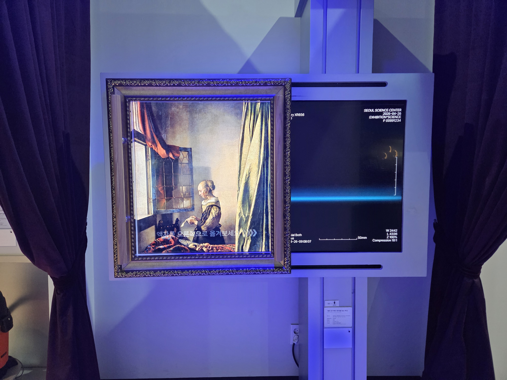

  <button class="nav-btn" onclick="goHome()">🏠 홈</button>
  <button class="nav-btn" onclick="goHall('blue')">🔵 Blue 전시실 개요</button>
  <button class="nav-btn" onclick="goBack()">⬅ 이전 페이지</button>

# B47 열린 창가에서 편지를 읽는 여인

## 1. 전시물 기본 내용
### 1.1 전시물 이미지

  
전시 목적

  

    과학기술로 인해 화가보다 더 실제와 똑같은 모습을 저장하는 카메라가 생겨난 이후 예술계의 화풍에 큰 변화가 일어났다. 사실적인 그림을 그리기보다 순간순간의 인상을 그려낸 신인상주의 화가, 그리고 화가 자신의 감정을 표현한 표현주의 화가의 그림들이 들어있는 카메라 속에서 그림과 관련된 과학 원리를 탐색해본다.
    <ul><li>열린 창가에서 편지를 읽는 여인 - 요하네스 베르메르의 '열린창가에서 편지를 읽는 여인' 그림에 숨겨진 비밀의 열쇠가 된 X선의 과학적 원리를 이해하고, 예술 복원과 생활속에 쓰이는 X선 활용 사례를 알아본다.<li></ul>
    </ul>
  

  
전시 유형 : 체험형

  

    X-레이로 인체와 그림을 투과해보는 듯한 체험이 가능한 전시물
  

### 1.2 학교 교육과정  
<!--
curriculum-table은 전시물과 연결된 학교 교육과정을 학년별로 비교하는 표이다.
내용체계 칸에는 정적 웹에 포함된 내부 교육과정 문서 링크를 넣는다.
챕터 및 단원명 칸에는 외부 교과서/교과 챕터 링크를 넣는다.
전시물과 연계성 칸에는 전시물에서 어떤 개념과 연결되는지 적는다.
비고 칸에는 학년별 수준 변화, 해설 시 유의점, 확인이 필요한 내용을 적는다.
-->

<table class="curriculum-table">
  <caption><b>학교 교육과정</b></caption>
  <thead>
    <tr>
      <th rowspan="2">교육과정 내용체계</th>
      <th colspan="2">해당 교과과정(교과서)</th>
      <th rowspan="2">전시물과 연계성</th>
      <th rowspan="2">비고</th>
    </tr>
    <tr>
      <th>학년 및 학기</th>
      <th>챕터 및 단원명</th>
    </tr>
  </thead>
  <tfoot>
    <tr>
      <td colspan="5">
        <ul>
          <li>교과챕터 및 단원명은 출판사의 교과서 pdf링크로 연결됩니다.</li>
          <li>고등2~3학년 과정은 선택교과입니다.</li>
        </ul>
      </td>
    </tr>
  </tfoot>
  <tbody>
    <tr>
      <td>
      </td>
      <td>1학년 1학기</td>
      <td>
        <a class="curriculum-link-button external" href="https://example.com" target="_blank" rel="noopener">
          교과 챕터 링크예시
        </a>
      </td>
      <td></td>
      <td>비고</td>
    </tr>
    <tr>
      <td>
        <a class="curriculum-link-button" href="#/docs/school_curriculum/science/03_physics">
        물리학 &gt; 빛과 물질
        </a>
      </td>
      <td></td>
      <td></td>
      <td>그림을 X-ray로 촬영 활동 과정에서 빛의 진행과 반사·굴절, 색과 영상이 나타나는 원리를 관찰하고 이해함</td>
      <td></td>
    </tr>
    <tr>
      <td>
        <a class="curriculum-link-button" href="#/docs/school_curriculum/science/15_history_and_culture_of_science">
        과학의 역사와 문화 &gt; 과학과 문명의 탄생과 통합
        </a>
      </td>
      <td></td>
      <td></td>
      <td>그림을 X-ray로 촬영 활동 과정에서 과학 지식과 탐구가 기술·사회·생활 및 진로에 미치는 영향을 이해함</td>
      <td></td>
    </tr>
    <tr>
      <td>
        <a class="curriculum-link-button" href="#/docs/school_curriculum/science/15_history_and_culture_of_science">
        과학의 역사와 문화 &gt; 변화하는 과학과 세계
        </a>
      </td>
      <td></td>
      <td></td>
      <td>그림을 X-ray로 촬영 활동 과정에서 과학 지식과 탐구가 기술·사회·생활 및 진로에 미치는 영향을 이해함</td>
      <td></td>
    </tr>
  </tbody>
</table>

### 1.3 체험
##### 체험1) 그림을 X-ray로 촬영해보기
1. 액자를 그림쪽으로 옮긴다.
2. 숨겨졌던 큐피트 그림을 찾아낸다.

##### 체험2) 내 몸을 X-ray로 촬영해보기
1. 액자를 그림의 오른쪽으로 옮긴다.
2. 내 몸 속 뼈의 모습을 살펴본다.

### 1.4 패널내용
(패널 없는 전시물)

## 2. 기본 과학 이론
### 2.1 핵심 과학이론
- 

### 2.2 연관 과학이론

## 3. 연관 전시물
- 

## 4. 기존 해설에서의 쓰임 예시

## 5. 확장 자료

### 심화 이론

### 최신 연구

## 변경기록
| 변경일        | 작성자 | 내용 및 사유 |
| ---------- | --- | ------- |
| 2026.01.22 | 박은선 | 최초 작성   |
|            |     |         |

  <button class="nav-btn" onclick="goHome()">🏠 홈</button>
  <button class="nav-btn" onclick="goHall('blue')">🔵 Blue 전시실 개요</button>
  <button class="nav-btn" onclick="goBack()">⬅ 이전 페이지</button>

