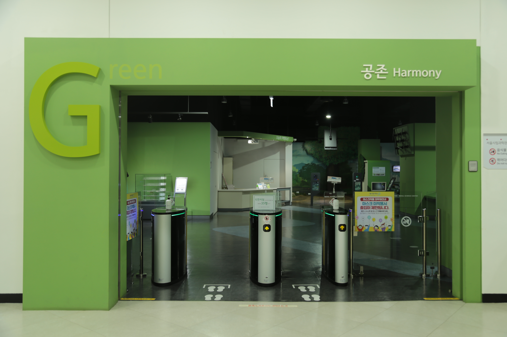

---
문서양식: 전시실 소개
전시실: G전시실
---

# 🏠 [홈](/)으로 가기
##
# G전시실(공존)

## 1. 전시실 소개
생태환경과 도시구조 속 과학원리에 대한 체험을 통해 자연과 도시, 사람과
인공물이 개별적 요소가 아닌 상호 유기적으로 연동되는 것을 깨닫고 자연과 도시가 조화를 이루며 상생하는 가치와 가능성에 대해 생각해 본다.

## 2. 전시물
### 2.1 전시물 배치도

  

  <a class="map-marker" style="left: 76.07%; top: 31.40%;" href="#/docs/halls/green/G01" aria-label="G01 전시물 안내">1</a>
  <a class="map-marker" style="left: 78.46%; top: 58.03%;" href="#/docs/halls/green/G02" aria-label="G02 전시물 안내">2</a>
  <a class="map-marker" style="left: 78.05%; top: 92.56%;" href="#/docs/halls/green/G03" aria-label="G03 전시물 안내">3</a>
  <a class="map-marker" style="left: 74.59%; top: 79.90%;" href="#/docs/halls/green/G04" aria-label="G04 전시물 안내">4</a>
  <a class="map-marker" style="left: 71.49%; top: 91.81%;" href="#/docs/halls/green/G05" aria-label="G05 전시물 안내">5</a>
  <a class="map-marker" style="left: 69.03%; top: 57.81%;" href="#/docs/halls/green/G06" aria-label="G06 전시물 안내">6</a>
  <a class="map-marker" style="left: 63.86%; top: 77.38%;" href="#/docs/halls/green/G07" aria-label="G07 전시물 안내">7</a>
  <a class="map-marker" style="left: 66.82%; top: 90.48%;" href="#/docs/halls/green/G08" aria-label="G08 전시물 안내">8</a>
  <a class="map-marker" style="left: 60.01%; top: 93.92%;" href="#/docs/halls/green/G09" aria-label="G09 전시물 안내">9</a>
  <a class="map-marker" style="left: 58.78%; top: 81.36%;" href="#/docs/halls/green/G10" aria-label="G10 전시물 안내">10</a>
  <a class="map-marker" style="left: 60.16%; top: 57.73%;" href="#/docs/halls/green/G11" aria-label="G11 전시물 안내">11</a>
  <a class="map-marker" style="left: 56.98%; top: 34.13%;" href="#/docs/halls/green/G12" aria-label="G12 전시물 안내">12</a>
  <a class="map-marker" style="left: 54.19%; top: 50.22%;" href="#/docs/halls/green/G13" aria-label="G13 전시물 안내">13</a>
  <a class="map-marker" style="left: 48.90%; top: 27.66%;" href="#/docs/halls/green/G14" aria-label="G14 전시물 안내">14</a>
  <a class="map-marker" style="left: 45.52%; top: 28.96%;" href="#/docs/halls/green/G15" aria-label="G15 전시물 안내">15</a>
  <a class="map-marker" style="left: 50.09%; top: 53.32%;" href="#/docs/halls/green/G16" aria-label="G16 전시물 안내">16</a>
  <a class="map-marker" style="left: 47.23%; top: 70.08%;" href="#/docs/halls/green/G17" aria-label="G17 전시물 안내">17</a>
  <a class="map-marker" style="left: 44.11%; top: 69.11%;" href="#/docs/halls/green/G18" aria-label="G18 전시물 안내">18</a>
  <a class="map-marker" style="left: 44.44%; top: 62.75%;" href="#/docs/halls/green/G19" aria-label="G19 전시물 안내">19</a>
  <a class="map-marker" style="left: 37.14%; top: 53.26%;" href="#/docs/halls/green/G20" aria-label="G20 전시물 안내">20</a>
  <a class="map-marker" style="left: 38.38%; top: 71.19%;" href="#/docs/halls/green/G21" aria-label="G21 전시물 안내">21</a>
  <a class="map-marker" style="left: 37.88%; top: 94.74%;" href="#/docs/halls/green/G22" aria-label="G22 전시물 안내">22</a>
  <a class="map-marker" style="left: 31.15%; top: 95.50%;" href="#/docs/halls/green/G23" aria-label="G23 전시물 안내">23</a>
  <a class="map-marker" style="left: 27.93%; top: 89.37%;" href="#/docs/halls/green/G24" aria-label="G24 전시물 안내">24</a>
  <a class="map-marker" style="left: 25.84%; top: 83.65%;" href="#/docs/halls/green/G25" aria-label="G25 전시물 안내">25</a>
  <a class="map-marker" style="left: 29.45%; top: 73.90%;" href="#/docs/halls/green/G26" aria-label="G26 전시물 안내">26</a>
  <a class="map-marker" style="left: 19.82%; top: 65.49%;" href="#/docs/halls/green/G27" aria-label="G27 전시물 안내">27</a>
  <a class="map-marker" style="left: 19.23%; top: 79.12%;" href="#/docs/halls/green/G28" aria-label="G28 전시물 안내">28</a>
  <a class="map-marker" style="left: 19.24%; top: 91.63%;" href="#/docs/halls/green/G29" aria-label="G29 전시물 안내">29</a>
  <a class="map-marker" style="left: 39.35%; top: 25.90%;" href="#/docs/halls/green/G30" aria-label="G30 전시물 안내">30</a>
  <a class="map-marker" style="left: 35.35%; top: 24.49%;" href="#/docs/halls/green/G31" aria-label="G31 전시물 안내">31</a>
  <a class="map-marker" style="left: 38.97%; top: 13.67%;" href="#/docs/halls/green/G32" aria-label="G32 전시물 안내">32</a>
  <a class="map-marker" style="left: 35.43%; top: 10.24%;" href="#/docs/halls/green/G33" aria-label="G33 전시물 안내">33</a>
  <a class="map-marker" style="left: 31.76%; top: 5.43%;" href="#/docs/halls/green/G34" aria-label="G34 전시물 안내">34</a>
  <a class="map-marker" style="left: 26.86%; top: 4.77%;" href="#/docs/halls/green/G35" aria-label="G35 전시물 안내">35</a>
  <a class="map-marker" style="left: 27.36%; top: 13.51%;" href="#/docs/halls/green/G36" aria-label="G36 전시물 안내">36</a>
  <a class="map-marker" style="left: 32.49%; top: 21.24%;" href="#/docs/halls/green/G37" aria-label="G37 전시물 안내">37</a>
  <a class="map-marker" style="left: 29.49%; top: 32.90%;" href="#/docs/halls/green/G38" aria-label="G38 전시물 안내">38</a>
  <a class="map-marker" style="left: 32.03%; top: 36.50%;" href="#/docs/halls/green/G39" aria-label="G39 전시물 안내">39</a>

### 2.2 전시물 리스트

  

    전시물 분류 기준
  

  

    <ul>관람형 : 전시 패널 및 영상물 등을 통해 정보를 제공하는 전시물</ul>
    <ul>체험형 : 버튼, 레버, 터치패널 및 아날로그 요소 등 인터렉션 요소가 있는 전시물</ul>
    <ul>실험탐구 : 전시물로 실험을 진행할 수 있으며, 이를 활용한 자발적 탐구를 권장하는 전시물</ul>
    <ul>게임형 : 게이밍적 체험요소가 있음</ul>
  

| 전시물 번호 | 전시물 명 | 분류 | 비고 |
| ------ | ------- | --- | --- |
| G01 | [한강에는 어떤 동식물이 살까?](/docs/halls/green/G01.md) | 관람형 |  |
| G02 | [허공에 떠 있는 나무와 물고기의 원리는?](/docs/halls/green/G02.md) | 관람형 |  |
| G03 | [북한산에 사는 동식물](/docs/halls/green/G03.md) | 관람형 |  |
| G04 | [개구리를 잡을 수 없는 이유는?](/docs/halls/green/G04.md) | 체험형 |  |
| G05 | [도시화로 인한 생태계의 위기](/docs/halls/green/G05.md) | 관람형 |  |
| G06 | [생태계의 보고 밤섬](/docs/halls/green/G06.md) | 체험형 |  |
| G07 | [생물을 분류하는 방법은?](/docs/halls/green/G07.md) | 체험형 |  |
| G08 | [도시로 내려온 야생동물](/docs/halls/green/G08.md) | 관람형 |  |
| G09 | [로드킬 현장 디오라마](/docs/halls/green/G09.md) | 관람형 |  |
| G10 | [길 위에서 사라져 가는 동물들](/docs/halls/green/G10.md) | 관람형 |  |
| G11 | [우리가 사는 땅은 어떻게 형성되었을까?](/docs/halls/green/G11.md) | 체험형 |  |
| G12 | [동물을 해부하지 않고 골격을 관찰할 수 있을까?](/docs/halls/green/G12.md) | 관람형 |  |
| G13 | [강물이 먹는 물로 정화되는 과정은?](/docs/halls/green/G13.md) | 관람형 |  |
| G14 | [태풍의 세기는 얼마나 강할까?](/docs/halls/green/G14.md) | 체험형 |  |
| G15 | [공기의 흐름을 어떻게 볼 수 있을까?](/docs/halls/green/G15.md) | 체험형/실험탐구 |  |
| G16 | [안전한 다리 구조에는 어떤 원리가 있을까?](/docs/halls/green/G16.md) | 체험형/실험탐구 |  |
| G17 | [건축에서 수학을 찾아보면?](/docs/halls/green/G17.md) | 체험형 |  |
| G18 | [도시의 기온이 더 높은 이유는 무엇일까?](/docs/halls/green/G18.md) | 체험형 |  |
| G19 | [우리 주변의 미세먼지 농도는?](/docs/halls/green/G19.md) | 관람형 |  |
| G20 | [공기대포는 어떤 모양으로 날아갈까?](/docs/halls/green/G20.md) | 관람형 |  |
| G21 | [지진의 이해](/docs/halls/green/G21.md) | 체험형 |  |
| G22 | [지진은 어떻게 기록될까?](/docs/halls/green/G22.md) | 관람형 |  |
| G23 | [실시간 지진 모니터링](/docs/halls/green/G23.md) | 관람형 |  |
| G24 | [지진의 발생 원인 및 현황](/docs/halls/green/G24.md) | 체험형 |  |
| G25 | [지진에 잘 견디는 구조는 어떻게 만들까? (1)](/docs/halls/green/G25.md) | 체험형 |  |
| G26 | [지진에 잘 견디는 구조는 어떻게 만들까? (2)](/docs/halls/green/G26.md) | 체험형 |  |
| G27 | [세계의 주요지진](/docs/halls/green/G27.md) | 관람형 |  |
| G28 | [지진이 발생되면 어떻게 할까요?](/docs/halls/green/G28.md) | 관람형 |  |
| G29 | [우리나라 원전이 지진에 안전한 이유는 무엇일까요?](/docs/halls/green/G29.md) | 관람형 |  |
| G30 | [3030년의 지질학자](/docs/halls/green/G30.md) | 관람형 |  |
| G31 | [인류세의 대표화석은?](/docs/halls/green/G31.md) | 체험형 |  |
| G32 | [인간이 없어진 지구](/docs/halls/green/G32.md) | 관람형 |  |
| G33 | [무슨 일이 일어났을까?](/docs/halls/green/G33.md) | 관람형 |  |
| G34 | [6번째 대멸종의 이유](/docs/halls/green/G34.md) | 체험형 |  |
| G35 | [지금, 지구를 살펴보다](/docs/halls/green/G35.md) | 관람형 |  |
| G36 | [학자들의 메시지](/docs/halls/green/G36.md) | 관람형 |  |
| G37 | [생태계의 닥친 위기](/docs/halls/green/G37.md) | 체험형 |  |
| G38 | [지속가능한 미래는?](/docs/halls/green/G38.md) | 관람형 |  |
| G39 | [희망을 위한 선택](/docs/halls/green/G39.md) | 체험형 |  |

## 3. 전시실내 공간

## 변경기록
| 변경일 | 작성자 | 내용 및 사유 |
| ------ | ------ | ------------ |
|        |        |              |

