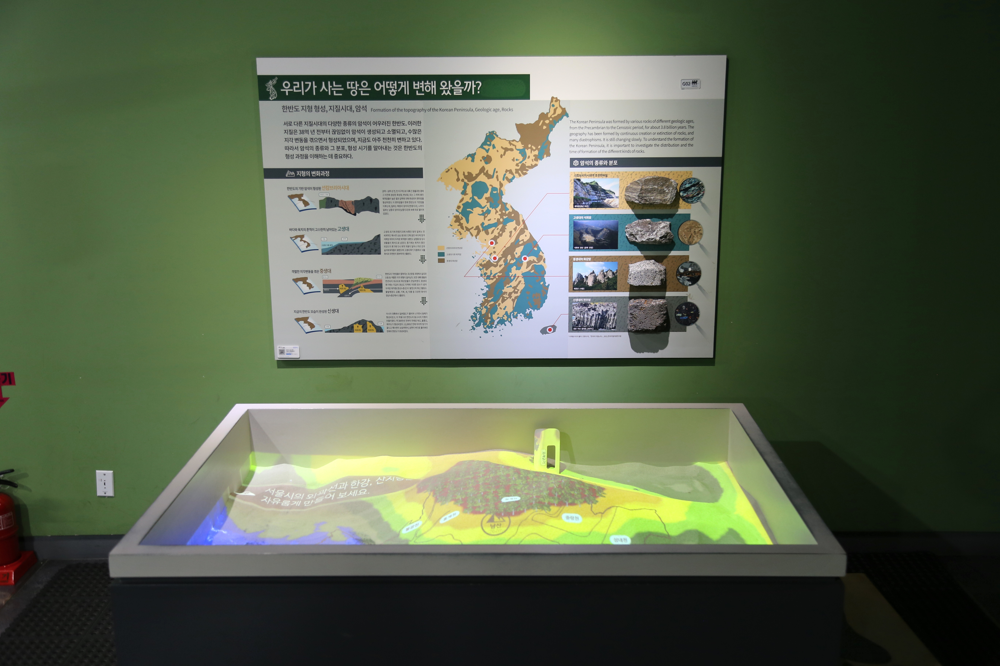

  <button class="nav-btn" onclick="goHome()">🏠 홈</button>
  <button class="nav-btn" onclick="goHall('green')">🟢 Green 전시실 개요</button>
  <button class="nav-btn" onclick="goBack()">⬅ 이전 페이지</button>

# G01 한강에는 어떤 동식물이 살까?

## 1. 전시물 기본 내용
### 1.1 전시물 이미지

  
전시 목적

  

    한강에 서식하는 대표 어류 종의 특징을 수족관 속 어류와 그래픽 패널을 통해 알아본다.
  

  
전시 유형 : 관람형

  

    살아있는 물고기의 수조, 그리고 그 상부를 볼 수 있는 카메라와 실사 크기의 라이트패널로 된 전시물
  

### 1.2 학교 교육과정  
<!--
curriculum-table은 전시물과 연결된 학교 교육과정을 학년별로 비교하는 표이다.
내용체계 칸에는 정적 웹에 포함된 내부 교육과정 문서 링크를 넣는다.
챕터 및 단원명 칸에는 외부 교과서/교과 챕터 링크를 넣는다.
전시물과 연계성 칸에는 전시물에서 어떤 개념과 연결되는지 적는다.
비고 칸에는 학년별 수준 변화, 해설 시 유의점, 확인이 필요한 내용을 적는다.

<table class="curriculum-table">
  <caption><b>학교 교육과정</b></caption>
  <thead>
    <tr>
      <th colspan="2">교육과정 내용체계</th>
      <th colspan="2">해당 교과과정(교과서)</th>
      <th rowspan="2">전시물과 연계성</th>
      <th rowspan="2">비고</th>
    </tr>
    <tr>
      <th>학년(학군)</th>
      <th>내용체계</th>
      <th>학년 및 학기</th>
      <th>챕터 및 단원명</th>
    </tr>
  </thead>
  <tfoot>
    <tr>
      <td colspan="6">교과 챕터는 외부 사이트 링크를 통해 해당 단원을 확인한다.</td>
    </tr>
  </tfoot>
  <tbody>
    <tr>
      <th>초등1~2학년(수학)</th>
      <td>
        <a class="curriculum-link-button" href="#/docs/school_curriculum/math/common/math_common_curriculum_knowledge_categories/common_curriculum_geometry_and_measurement">
          공통교육과정 &gt; 도형과 측정
        </a>
      </td>
      <td>1~2학년군</td>
      <td>
        <a class="curriculum-link-button external" href="https://example.com" target="_blank" rel="noopener">
          교과 챕터 링크
        </a>
      </td>
      <td>길이를 직접 재기보다 길이를 가늠하고 비교하는 경험과 연결된다.</td>
      <td>표준 단위보다 감각적 비교와 어림 중심으로 설명한다.</td>
    </tr>
    <tr>
      <th>초등3~4학년</th>
      <td>
        <a class="curriculum-link-button" href="#/docs/school_curriculum/science/common/00_common_science_elementry3-4">
          초등학교 3~4학년 &gt; 동물의 생활
        </a>
        <a class="curriculum-link-button" href="#/docs/school_curriculum/science/common/00_common_science_elementry3-4">
          초등학교 3~4학년 &gt; 식물의 생활
        </a>
        <a class="curriculum-link-button" href="#/docs/school_curriculum/science/common/00_common_science_elementry3-4">
          초등학교 3~4학년 &gt; 생물의 한살이
        </a>
        <a class="curriculum-link-button" href="#/docs/school_curriculum/science/common/00_common_science_elementry3-4">
          초등학교 3~4학년 &gt; 다양한 생물과 우리 생활
        </a>
        <a class="curriculum-link-button" href="#/docs/school_curriculum/science/common/00_common_science_elementry3-4">
          초등학교 3~4학년 &gt; 생물과 환경
        </a>
      </td>
      <td></td>
      <td></td>
      <td></td>
      <td></td>
    </tr>
    <tr>
      <th></th>
      <td>
      </td>
      <td></td>
      <td>
      </td>
      <td></td>
      <td></td>
    </tr>
    <tr>
      <th>초등5~6학년</th>
      <td>
        <a class="curriculum-link-button" href="#/docs/school_curriculum/science/common/00_common_science_elementry5-6">
          초등학교 5~6학년 &gt; 식물의 구조와 기능
        </a>
      </td>
      <td></td>
      <td></td>
      <td></td>
      <td></td>
    </tr>
    <tr>
      <th>중학교</th>
      <td>
        <a class="curriculum-link-button" href="#/docs/school_curriculum/science/common/00_common_science_mid">
          중학교 1~3학년 &gt; 생물의 구성과 다양성
        </a>
        <a class="curriculum-link-button" href="#/docs/school_curriculum/science/common/00_common_science_mid">
          중학교 1~3학년 &gt; 식물과 에너지
        </a>
      </td>
      <td></td>
      <td></td>
      <td></td>
      <td></td>
    </tr>
    <tr>
      <th>고등학교(공통)</th>
      <td>
        <a class="curriculum-link-button" href="#/docs/school_curriculum/science/01_integrated_science">
          통합과학2 &gt; 변화와 다양성
        </a>
        <a class="curriculum-link-button" href="#/docs/school_curriculum/science/01_integrated_science">
          통합과학2 &gt; 환경과 에너지
        </a>
        <a class="curriculum-link-button" href="#/docs/school_curriculum/science/02_science_inquiry_experiment">
          과학탐구실험2 &gt; 생활 속의 과학 탐구
        </a>
      </td>
      <td></td>
      <td></td>
      <td></td>
      <td></td>
    </tr>
    <tr>
      <th>고등학교(선택)</th>
      <td>
        <a class="curriculum-link-button" href="#/docs/school_curriculum/science/05_life_science">
          생명과학 &gt; 생명의 연속성과 다양성
        </a>
        <a class="curriculum-link-button" href="#/docs/school_curriculum/science/11_cells_and_metabolism">
          세포와 물질대사 &gt; 세포호흡과 광합성
        </a>
        <a class="curriculum-link-button" href="#/docs/school_curriculum/science/16_climate_change_and_environmental_ecology">
          기후변화와 환경생태 &gt; 기후와 환경생태의 특성
        </a>
        <a class="curriculum-link-button" href="#/docs/school_curriculum/science/16_climate_change_and_environmental_ecology">
          기후변화와 환경생태 &gt; 기후위기와 환경생태 변화
        </a>
      </td>
      <td></td>
      <td></td>
      <td></td>
      <td></td>
    </tr>
  </tbody>
</table>
-->

### 1.3 체험
##### 체험1) 한강의 어류 관찰하기
1. 어류 설명 패널에서 우점종, 고유종 등에 대해 알아본다
2. 한강에 서식하는 우점종과 한반도 고유종을 수족관의 살아 있는 생물로 관찰한다.
3. 관찰했던 어류의 특징을 네임태그의 내용과 비교해본다.
4. 수족관에서 찾아볼 수 없는 회유어, 외래종, 서울시 보호종 어류는 라이팅 패널로 알아본다.

### 1.4 패널내용

  

    한강에는 어떤 동식물이 살까?
  

  

    
  

  

    어항 배경
  

  

    
  

  

    보호종
  

  

    
    
  

  

    외래종
  

  

    
    
  

  

    고유종
  

  

    
    
  

  

    우점종
  

  

    
    
  

  

    회유어
  

  

    
    
  

## 2. 기본 과학 이론
### 2.1 핵심 과학이론

<!--
data-theories에는 연결할 이론 문서의 제목을 입력한다.
쉼표(,)로 여러 이론을 구분할 수 있으며, assets/js/theory-links.js에 등록된 제목과 일치하면 버튼형 링크로 표시된다.
등록되지 않은 제목은 비활성 표시로 나타난다.
-->

### 2.2 연관 과학이론

## 3. 연관 전시물

<!--
related-exhibit-link-list는 연관 전시물 문서로 이동하는 버튼 목록이다.
a 태그의 href에는 연결할 전시물 문서 경로를 입력한다.
버튼을 여러 개 넣으면 세로로 정렬된다.

  <a class="related-exhibit-link-button" href="#/docs/halls/blue/B01">B01 세상은 어떻게 연결되어 있을까?</a>

-->

## 4. 기존 해설에서의 쓰임 예시

## 5. 확장 자료

### 심화 이론

<!--
resource-link-list는 확장 자료 링크를 세로로 정렬하는 목록이다.
내부 문서는 href에 #/docs/... 형식의 정적 웹 문서 경로를 입력한다.
버튼을 여러 개 넣으면 세로로 정렬된다.

  <a class="resource-link-button" href="#/docs/theory/zzz_incomplete">이론 양식 문서 보기</a>

-->

### 최신 연구

<!--
resource-link-list는 확장 자료 링크를 세로로 정렬하는 목록이다.
외부 자료는 href에 전체 URL을 입력하고 target="_blank" rel="noopener"를 함께 사용한다.
버튼을 여러 개 넣으면 세로로 정렬된다.

  <a class="resource-link-button external" href="https://www.google.com" target="_blank" rel="noopener">외부 연구 자료 보기</a>

-->

## 변경기록
| 변경일        | 작성자 | 내용 및 사유 |
| ---------- | --- | ------- |
| 2026.01.22 | 박은선 | 최초 작성   |
|            |     |         |

  <button class="nav-btn" onclick="goHome()">🏠 홈</button>
  <button class="nav-btn" onclick="goHall('green')">🟢 Green 전시실 개요</button>
  <button class="nav-btn" onclick="goBack()">⬅ 이전 페이지</button>

