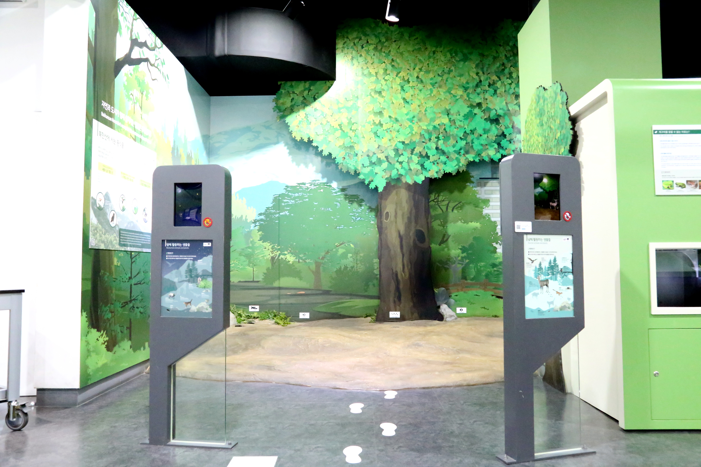

  <button class="nav-btn" onclick="goHome()">🏠 홈</button>
  <button class="nav-btn" onclick="goHall('green')">🟢 Green 전시실 개요</button>
  <button class="nav-btn" onclick="goBack()">⬅ 이전 페이지</button>

# G03 북한산에 사는 동식물

## 1. 전시물 기본 내용
### 1.1 전시물 이미지

  
전시 목적

  

    전 세계적으로 보기 드문 도시에 위치한 국립공원이자 서울에서 가장 많은 동식물이 서식하고 있는 북한산의 생태계 보존 가치 및 동식물 서식 현황을 알아보고 북한산 재현 환경을 AR영상으로 살펴보며, 인간의 발이 닿지 않은 자연 그대로의 환경 속에서 동식물이 조화를 이루며 살아가는 모습을 관찰한다.
  

  
전시 유형 : 관람형

  

    북한산 모형과 아날로그 패널, 북한산의 주행성, 야행성 동물을 AR을 통해 확인해보는 디지털 패널로 구성된 전시물
  

### 1.2 학교 교육과정  
<!--
curriculum-table은 전시물과 연결된 학교 교육과정을 학년별로 비교하는 표이다.
내용체계 칸에는 정적 웹에 포함된 내부 교육과정 문서 링크를 넣는다.
챕터 및 단원명 칸에는 외부 교과서/교과 챕터 링크를 넣는다.
전시물과 연계성 칸에는 전시물에서 어떤 개념과 연결되는지 적는다.
비고 칸에는 학년별 수준 변화, 해설 시 유의점, 확인이 필요한 내용을 적는다.
-->

<table class="curriculum-table">
  <caption><b>학교 교육과정</b></caption>
  <thead>
    <tr>
      <th rowspan="2">교육과정 내용체계</th>
      <th colspan="2">해당 교과과정(교과서)</th>
      <th rowspan="2">전시물과 연계성</th>
      <th rowspan="2">비고</th>
    </tr>
    <tr>
      <th>학년 및 학기</th>
      <th>챕터 및 단원명</th>
    </tr>
  </thead>
  <tfoot>
    <tr>
      <td colspan="5">
        <ul>
          <li>교과챕터 및 단원명은 출판사의 교과서 pdf링크로 연결됩니다.</li>
          <li>고등2~3학년 과정은 선택교과입니다.</li>
        </ul>
      </td>
    </tr>
  </tfoot>
  <tbody>
    <tr>
      <td>
      </td>
      <td>1학년 1학기</td>
      <td>
        <a class="curriculum-link-button external" href="https://example.com" target="_blank" rel="noopener">
          교과 챕터 링크예시
        </a>
      </td>
      <td></td>
      <td>비고</td>
    </tr>
    <tr>
      <td>
        <a class="curriculum-link-button" href="#/docs/school_curriculum/science/common/00_common_science_elementry3-4">
        초등학교 3~4학년 &gt; 동물의 생활
        </a>
      </td>
      <td>초등3-1</td>
      <td><a class="curriculum-link-button external" href="https://s3.ap-northeast-2.amazonaws.com/tsol.jihak.co.kr/tsol/22tp/e/sci/JIHAKSA_%EA%B3%BC%ED%95%99_%EC%B4%88_3-1_%EA%B5%90%EA%B3%BC%EC%84%9C.pdf" target="_blank" rel="noopener">
          2. 동물의 생활 (22개정 지학사 과학 3-1 pp 43~65)</a></td>
      <td>북한산 모습 관찰 및 동식물 활동 과정에서 생명체의 구조와 기능 및 생명 현상이 유지되는 원리를 이해함</td>
      <td></td>
    </tr>
    <tr>
      <td>
        <a class="curriculum-link-button" href="#/docs/school_curriculum/science/common/00_common_science_elementry3-4">
        초등학교 3~4학년 &gt; 식물의 생활
        </a>
      </td>
      <td>초등3-1</td>
      <td><a class="curriculum-link-button external" href="https://s3.ap-northeast-2.amazonaws.com/tsol.jihak.co.kr/tsol/22tp/e/sci/JIHAKSA_%EA%B3%BC%ED%95%99_%EC%B4%88_3-1_%EA%B5%90%EA%B3%BC%EC%84%9C.pdf" target="_blank" rel="noopener">
          3. 식물의 생활 (22개정 지학사 과학 3-1 pp 69~87)</a></td>
      <td>북한산 모습 관찰 및 동식물 활동 과정에서 생명체의 구조와 기능 및 생명 현상이 유지되는 원리를 이해함</td>
      <td></td>
    </tr>
    <tr>
      <td>
        <a class="curriculum-link-button" href="#/docs/school_curriculum/science/common/00_common_science_elementry3-4">
        초등학교 3~4학년 &gt; 생물과 환경
        </a>
      </td>
      <td>초등4-2</td>
      <td><a class="curriculum-link-button external" href="https://s3.ap-northeast-2.amazonaws.com/tsol.jihak.co.kr/tsol/22tp/e/sci/JIHAKSA_%EA%B3%BC%ED%95%99_%EC%B4%88_4-1_%EA%B5%90%EA%B3%BC%EC%84%9C.pdf" target="_blank" rel="noopener">
          2. 생물과 환경 (22개정 지학사 과학 4-2 pp 38-57)</a></td>
      <td>북한산 모습 관찰 및 동식물 활동 과정에서 인간 활동과 환경 변화의 관계를 살펴보고 지속가능한 해결 방법을 생각함</td>
      <td></td>
    </tr>
    <tr>
      <td>
        <a class="curriculum-link-button" href="#/docs/school_curriculum/science/common/00_common_science_mid">
        중학교 1~3학년 &gt; 생물의 구성과 다양성
        </a>
      </td>
      <td>중등1학년</td>
      <td><a class="curriculum-link-button external" href="https://s3.ap-northeast-2.amazonaws.com/tsol.jihak.co.kr/tsol/22tp/m/sci/JIHAKSA_%EA%B3%BC%ED%95%991_%EC%A4%91_%EA%B5%90%EA%B3%BC%EC%84%9C.pdf" target="_blank" rel="noopener">
          II-2-01 생물다양성의 이해 (22개정 지학사 중등1 pp 54-57)</a></td>
      <td>다양한 생물이 살아가는 상태계에 대해 알아봄</td>
      <td></td>
    </tr>
    <tr>
      <td>
        <a class="curriculum-link-button" href="#/docs/school_curriculum/science/01_integrated_science">
        통합과학2 &gt; 변화와 다양성
        </a>
      </td>
      <td>고등1학년</td>
      <td><a class="curriculum-link-button external" href="https://ibook.vivasam.com/CBS_iBook/3784/contents/index.html?skin=basic01" target="_blank" rel="noopener">
              I-1-02 진화와 생물다양성 (22개정 비상교과서 통합과학2 pp 22-)</a></td>
      <td>생물다양성이 유지되는 안정된 생태계에 대해 생각함</td>
      <td></td>
    </tr>
    <tr>
      <td>
        <a class="curriculum-link-button" href="#/docs/school_curriculum/science/02_science_inquiry_experiment">
        과학탐구실험2 &gt; 생활 속의 과학 탐구
        </a>
      </td>
      <td></td>
      <td></td>
      <td>북한산 모습 관찰 및 동식물 활동 과정에서 관찰·측정·분류와 증거를 활용하는 과학 탐구 과정을 이해함</td>
      <td></td>
    </tr>
    <tr>
      <td>
        <a class="curriculum-link-button" href="#/docs/school_curriculum/science/05_life_science">
        생명과학 &gt; 생명의 연속성과 다양성
        </a>
      </td>
      <td></td>
      <td></td>
      <td>북한산 모습 관찰 및 동식물 활동 과정에서 생명체의 구조와 기능 및 생명 현상이 유지되는 원리를 이해함</td>
      <td></td>
    </tr>
    <tr>
      <td>
        <a class="curriculum-link-button" href="#/docs/school_curriculum/science/11_cells_and_metabolism">
        세포와 물질대사 &gt; 세포호흡과 광합성
        </a>
      </td>
      <td></td>
      <td></td>
      <td>북한산 모습 관찰 및 동식물 활동 과정에서 생명체의 구조와 기능 및 생명 현상이 유지되는 원리를 이해함</td>
      <td></td>
    </tr>
    <tr>
      <td>
        <a class="curriculum-link-button" href="#/docs/school_curriculum/science/16_climate_change_and_environmental_ecology">
        기후변화와 환경생태 &gt; 기후와 환경생태의 특성
        </a>
      </td>
      <td></td>
      <td></td>
      <td>북한산 모습 관찰 및 동식물 활동 과정에서 인간 활동과 환경 변화의 관계를 살펴보고 지속가능한 해결 방법을 생각함</td>
      <td></td>
    </tr>
    <tr>
      <td>
        <a class="curriculum-link-button" href="#/docs/school_curriculum/science/16_climate_change_and_environmental_ecology">
        기후변화와 환경생태 &gt; 기후위기와 환경생태 변화
        </a>
      </td>
      <td></td>
      <td></td>
      <td>북한산 모습 관찰 및 동식물 활동 과정에서 인간 활동과 환경 변화의 관계를 살펴보고 지속가능한 해결 방법을 생각함</td>
      <td></td>
    </tr>
  </tbody>
</table>

### 1.3 체험
##### 체험1) 북한산 모습 관찰 및 동식물 살펴보기
1. 북한산 앞의 AR영상 패널을 통해 주행성동물과 야행성동물을 살펴본다.
2. 북한산 위에 올라가 발자국, 배변 등의 야생동물의 흔적을 살펴본다.
3. 패널을 통해 북한산의 동식물을 알아본다.

### 1.4 패널내용

  

    북한산에 사는 동식물
  

  

    
  

  

    낮에 활동하는 생물들
  

  

    
  

  

    밤에 활동하는 생물들
  

  

    
  

  

    동물의 흔적 네임태그
  

  

    
  

## 2. 기본 과학 이론
### 2.1 핵심 과학이론

<!--
data-theories에는 연결할 이론 문서의 제목을 입력한다.
쉼표(,)로 여러 이론을 구분할 수 있으며, assets/js/theory-links.js에 등록된 제목과 일치하면 버튼형 링크로 표시된다.
등록되지 않은 제목은 비활성 표시로 나타난다.
-->

### 2.2 연관 과학이론

## 3. 연관 전시물

<!--
related-exhibit-link-list는 연관 전시물 문서로 이동하는 버튼 목록이다.
a 태그의 href에는 연결할 전시물 문서 경로를 입력한다.
버튼을 여러 개 넣으면 세로로 정렬된다.

  <a class="related-exhibit-link-button" href="#/docs/halls/blue/B01">B01 세상은 어떻게 연결되어 있을까?</a>

-->

## 4. 기존 해설에서의 쓰임 예시

## 5. 확장 자료

### 심화 이론

<!--
resource-link-list는 확장 자료 링크를 세로로 정렬하는 목록이다.
내부 문서는 href에 #/docs/... 형식의 정적 웹 문서 경로를 입력한다.
버튼을 여러 개 넣으면 세로로 정렬된다.

  <a class="resource-link-button" href="#/docs/theory/zzz_incomplete">이론 양식 문서 보기</a>

-->

### 최신 연구

<!--
resource-link-list는 확장 자료 링크를 세로로 정렬하는 목록이다.
외부 자료는 href에 전체 URL을 입력하고 target="_blank" rel="noopener"를 함께 사용한다.
버튼을 여러 개 넣으면 세로로 정렬된다.

  <a class="resource-link-button external" href="https://www.google.com" target="_blank" rel="noopener">외부 연구 자료 보기</a>

-->

<!--
doc-tags는 문서에 해시태그를 표시하는 영역이다.
data-tags에 쉼표로 구분한 태그 이름을 입력한다.
태그 이름에는 #을 직접 붙이지 않는다.
-->

## 변경기록
| 변경일        | 작성자 | 내용 및 사유 |
| ---------- | --- | ------- |
| 2026.01.22 | 박은선 | 최초 작성   |
|            |     |         |

  <button class="nav-btn" onclick="goHome()">🏠 홈</button>
  <button class="nav-btn" onclick="goHall('green')">🟢 Green 전시실 개요</button>
  <button class="nav-btn" onclick="goBack()">⬅ 이전 페이지</button>

